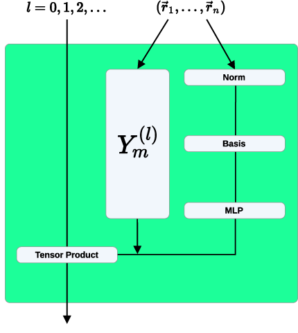

# 1.1. Equivariant neural networks: e3nn formalism

`e3nn`은 3차원 rotation과 inversion에 대해 정해진 방식으로 변환하는 feature를 구성하고 결합하기 위한 라이브러리이다. 핵심은 “좌표를 회전해도 출력이 변하지 않는다”는 invariance만이 아니라, scalar·vector·higher-order tensor가 각자의 representation에 따라 함께 변환한다는 equivariance이다.[1–3]

이 글은 `e3nn`의 특정 버전별 API보다 그 아래의 안정적인 수학 구조를 설명한다. Group action과 equivariance부터 $O(3)$ irreducible representation, spherical harmonics, Clebsch–Gordan tensor product, 원자계 message passing, nonlinearity와 물리적 출력, 수치 검증의 순서로 다룬다.[1–3]

## 1. $E(3)$ 작용과 equivariance

### (1) Euclidean Transformation

3차원 Euclidean group $E(3)$의 원소를 $g=(R,\mathbf t)$로 쓰면 좌표에 대한 작용은

$$
\mathbf r_i
\longmapsto
g\mathbf r_i
=R\mathbf r_i+\mathbf t,
\qquad R\in O(3)
$$

이다. $O(3)$에는 $\det R=+1$인 proper rotation과 $\det R=-1$인 reflection·inversion이 함께 들어간다. 군 구조는

$$
E(3)\cong \mathbb R^3\rtimes O(3)
$$

로 나타낸다.[1,3]

입력 feature 공간의 표현을 $D_{\mathrm{in}}(g)$, 출력 표현을 $D_{\mathrm{out}}(g)$라 할 때 모형 $F$가

$$
F\!\left(D_{\mathrm{in}}(g)x\right)
=D_{\mathrm{out}}(g)F(x)
$$

를 모든 $g$에 대해 만족하면 equivariant라고 한다.[1–3] 출력 표현이 항등 표현이면

$$
F\!\left(D_{\mathrm{in}}(g)x\right)=F(x)
$$

가 되어 invariant가 된다. 에너지는 대표적인 invariant이고, 위치에 대한 에너지 기울기에서 얻은 힘은 회전·반전에 따라 극성 벡터로 변환한다.[1,4]

### (2) Translational Symmetry

원자계 그래프에서는 절대 좌표 대신 상대 벡터

$$
\mathbf r_{ij}=\mathbf r_j-\mathbf r_i
$$

를 사용하면 전역 병진이 소거된다. 주기계에서는 lattice vector $\mathbf a_{ij}$를 포함해

$$
\mathbf r_{ij}
=\mathbf r_j-\mathbf r_i+\mathbf a_{ij}
$$

로 이웃 image의 실제 변위를 정한다.[2,4] 이 벡터는 회전하면 $R\mathbf r_{ij}$가 되므로 이후 $O(3)$ 표현론으로 방향 의존성을 처리할 수 있다.

## 2. $O(3)$ irreducible representation

### (1) $l$, $m$과 parity

$O(3)$의 실수 irreducible representation (irrep)은 angular momentum degree $l=0,1,2,\ldots$와 inversion parity $p\in\{+1,-1\}$로 표시한다. `e3nn` 표기에서는 $p=+1$을 `e`, $p=-1$을 `o`로 쓴다. 한 irrep의 차원은

$$
\dim(l,p)=2l+1
$$

이다.[1,2] $m=-l,\ldots,l$은 한 irrep 안의 $2l+1$개 성분을 구분한다. 이 성분들은 서로 독립된 channel이 아니라, rotation을 적용하면 함께 섞이는 하나의 feature이다.

$P=-I$를 공간 inversion이라 하고 $g=P^kR$를 $R\in SO(3)$와 $k\in\{0,1\}$로 분해하면 $(l,p)$ feature의 변환은

$$
D^{(l,p)}(g)
=p^kD^{(l)}(R)
$$

로 쓸 수 있다. 따라서 `e` feature는 inversion에서 부호가 유지되고, `o` feature는 부호가 바뀐다. $D^{(l)}(R)$은 선택한 실수 기저의 Wigner $D$ matrix이며, 같은 물리적 feature도 기저에 따라 각 성분의 배열은 달라질 수 있다.[1,2]

Atomic orbital과의 연결은 angular part에서 가장 직접적으로 보인다. Central potential의 orbital을

$$
\psi_{nlm}(\mathbf r)
=R_{nl}(r)Y_l^m(\hat{\mathbf r})
$$

로 쓰면 radial function $R_{nl}(r)$은 inversion에서 변하지 않고,

$$
Y_l^m(-\hat{\mathbf r})
=(-1)^lY_l^m(\hat{\mathbf r})
$$

이므로 orbital의 spatial parity는 $(-1)^l$이다. 이에 따라 $s$, $p$, $d$, $f$ orbital의 angular part는 각각 `0e`, `1o`, `2e`, `3o`와 같은 $O(3)$ 변환 법칙을 가진다.[1,5–8]

| `e3nn` 표기 | $l$ | 차원 | inversion | atomic orbital 또는 물리적 예 |
| --- | ---: | ---: | --- | --- |
| `0e` | 0 | 1 | 부호 유지 | $s$ orbital의 angular part, 에너지와 같은 scalar |
| `1o` | 1 | 3 | 부호 반전 | $p_x,p_y,p_z$ orbital의 angular part, 위치·힘과 같은 polar vector |
| `2e` | 2 | 5 | 부호 유지 | 다섯 $d$ orbital의 angular part, symmetric traceless rank-2 tensor |
| `3o` | 3 | 7 | 부호 반전 | 일곱 $f$ orbital의 angular part |
| `1e` | 1 | 3 | 부호 유지 | angular momentum·magnetic field·두 polar vector의 cross product와 같은 axial vector |
| `0o` | 0 | 1 | 부호 반전 | 세 polar vector의 scalar triple product와 같은 pseudoscalar |

여기서 `1o` feature를 사용한다는 말은 그 feature가 실제 $p$ electron이라는 뜻이 아니다. Atomic orbital의 angular part와 **같은 변환 법칙**을 따른다는 뜻이다. `1o`는 principal quantum number, radial function, electron occupation과 spin을 지정하지 않는다. 이러한 정보는 channel 설계나 별도 입력으로 표현해야 한다.[1,2,6,8] 반대로 `1e`와 `0o`는 하나의 위치 방향에서 만든 $Y_l^m$에는 나타나지 않지만, 여러 vector를 결합하면 자연스럽게 생길 수 있다.[1,2]

일반 Cartesian tensor 하나는 여러 irrep로 분해될 수 있다. 예를 들어 symmetric rank-2 tensor는 trace인 `0e`와 traceless component인 `2e`의 direct sum이다. 따라서 배열의 축 개수만 보고 하나의 irrep를 지정할 수 없다.[1–3]

### (2) Direct Sum과 Multiplicity

신경망의 한 층은 여러 종류와 여러 사본의 irrep를 함께 가진다.

$$
\mathcal V
=\bigoplus_{a}
m_a\,\mathcal V^{(l_a,p_a)}
$$

여기서 $m_a$는 같은 irrep의 channel 수인 multiplicity이다. 예를 들어 `16x0e + 8x1o`는 scalar 16개와 polar vector 8개를 가지며 전체 성분 수는 $16+8\times3=40$이다.

| 표기 요소 | 의미 | `8x1o`에서의 값 |
| --- | --- | --- |
| `8x` | multiplicity, 즉 같은 irrep의 사본 수 | polar-vector feature 8개 |
| `1` | angular momentum degree $l$ | 각 사본마다 성분 3개 |
| `o` | inversion parity $p=-1$ | inversion에서 각 사본의 부호 반전 |

`+`는 서로 다른 feature space의 direct sum을 뜻한다. Multiplicity가 1이면 `1x`를 생략할 수 있으므로 `2x0e + 1o + 2e`의 전체 성분 수는 $2+3+5=10$이다.[2]

`16x0e + 8x1o`에서 rotation은 각 `1o` 사본의 세 $m$ 성분을 같은 $D^{(1)}(R)$로 섞지만, 8개 사본 자체는 같은 방식으로 변환한다. 따라서 equivariant linear map은 `1o`의 세 성분에 임의의 서로 다른 가중치를 주는 대신, multiplicity 축에서 8개 사본을 학습 가능한 scalar matrix로 섞을 수 있다. $l$과 $p$가 다른 feature 사이의 변환에는 다음 절의 tensor product처럼 변환 법칙을 보존하는 별도 연산이 필요하다.[1–3]

## 3. 방향 기저와 tensor product

### (1) Spherical Harmonics

단위 상대 방향 $\hat{\mathbf r}=\mathbf r/\|\mathbf r\|$의 spherical harmonics를 실수 벡터

$$
\mathbf Y^{(l)}(\hat{\mathbf r})
=
\left(
Y_{-l}^{(l)},\ldots,Y_l^{(l)}
\right)
$$

로 모으면

$$
\mathbf Y^{(l)}(R\hat{\mathbf r})
=D^{(l)}(R)
\mathbf Y^{(l)}(\hat{\mathbf r})
$$

가 성립한다.[1–3] 또한 $\mathbf Y^{(l)}(-\hat{\mathbf r})=(-1)^l\mathbf Y^{(l)}(\hat{\mathbf r})$이므로 polar vector인 위치 방향에서 만든 spherical harmonics의 natural parity는 짝수 $l$에서 `e`, 홀수 $l$에서 `o`이다.[1,2,5,7] 따라서 $Y^{(0)}$, $Y^{(1)}$, $Y^{(2)}$는 각각 `0e`, `1o`, `2e` 방향 feature가 된다. 이 대응은 앞 절의 $s$, $p$, $d$ orbital과 동일한 spherical harmonics를 사용한다는 데서 나온다.

거리 $r=\|\mathbf r\|$는 rotation과 inversion에 invariant이므로 radial basis $B_k(r)$와 그 값을 입력받는 multilayer perceptron (MLP)은 scalar weight를 만들 수 있다. 방향은 $\mathbf Y^{(l)}$, 거리는 radial network로 분리하면 변환 법칙을 보존하면서 각도와 거리 의존성을 모두 표현한다.[1,2,4]

### (2) Clebsch–Gordan Coefficient와 Equivariant Tensor Product

두 irrep feature $\mathbf x^{(l_1,p_1)}$와 $\mathbf y^{(l_2,p_2)}$의 모든 성분 곱을 모은 raw tensor product는 차원이 $(2l_1+1)(2l_2+1)$인 reducible representation이다. Clebsch–Gordan coefficient는 이 공간의 기저를 바꾸어, 서로 독립적으로 변환하는 출력 irrep block으로 분해한다. 출력 $(l_3,p_3)$에 대한 projection은

$$
z_{m_3}^{(l_3,p_3)}
=
\sum_{m_1,m_2}
C_{l_1m_1,l_2m_2}^{l_3m_3}
x_{m_1}^{(l_1,p_1)}
y_{m_2}^{(l_2,p_2)}
$$

로 쓴다.[1–3] 허용되는 coupling path는

$$
|l_1-l_2|
\le l_3
\le l_1+l_2,
\qquad
p_3=p_1p_2
$$

를 만족한다. 첫 조건은 angular momentum coupling의 triangle rule이고 둘째는 inversion parity 보존이다.[1–3]

Clebsch–Gordan coefficient가 rotation equivariance를 보장하는 핵심은 다음 intertwiner identity이다.

$$
\sum_{m_1,m_2}
C_{l_1m_1,l_2m_2}^{l_3m_3}
D_{m_1n_1}^{(l_1)}(R)
D_{m_2n_2}^{(l_2)}(R)
=
\sum_{n_3}
D_{m_3n_3}^{(l_3)}(R)
C_{l_1n_1,l_2n_2}^{l_3n_3}.
$$

입력에 먼저 rotation을 적용한 뒤 coupling하면

$$
\begin{aligned}
z_{m_3}' &=
\sum_{m_1,m_2}
C_{l_1m_1,l_2m_2}^{l_3m_3}
x_{m_1}'y_{m_2}' \\
&=
\sum_{n_3}
D_{m_3n_3}^{(l_3)}(R)
z_{n_3}
\end{aligned}
$$

가 된다. 즉 “두 입력에 각각 rotation을 적용한 뒤 결합”한 결과와 “먼저 결합한 출력에 $l_3$ representation의 rotation을 적용”한 결과가 같다. 이것이 tensor product layer가 만족하는 rotation equivariance이다.[1–3]

Inversion에서는 두 입력이 각각 $p_1$, $p_2$만큼 부호를 얻으므로 출력은 $p_1p_2$만큼 변한다. 출력 경로를 $p_3=p_1p_2$로 제한하면 inversion에 대해서도 같은 교환 관계가 성립한다. Rotation에 대한 intertwiner identity와 이 parity rule을 함께 적용하면 tensor product는 $O(3)$-equivariant가 된다.[1–3]

Clebsch–Gordan coefficient 자체는 학습되는 parameter가 아니다. 선택한 irrep basis와 normalization convention이 정해지면 고정되는 수이며, 서로 다른 library의 coefficient를 비교할 때는 basis, component order와 phase convention을 함께 확인해야 한다. `e3nn`은 이 고정된 coupling tensor 위에 multiplicity별 학습 가중치를 배치한다.[1,2]

가장 중요한 예는 두 polar vector의 결합이다.

$$
\mathtt{1o}\otimes\mathtt{1o}
=
\mathtt{0e}\oplus\mathtt{1e}\oplus\mathtt{2e}.
$$

| 출력 경로 | Cartesian 관점 | 해석 |
| --- | --- | --- |
| `0e` | $\mathbf a\cdot\mathbf b$ | rotation과 inversion에 invariant인 scalar |
| `1e` | $\mathbf a\times\mathbf b$ | inversion에서 부호가 유지되는 axial vector |
| `2e` | $\frac12(\mathbf a\mathbf b^\mathsf T+\mathbf b\mathbf a^\mathsf T)-\frac13(\mathbf a\cdot\mathbf b)I$ | symmetric traceless rank-2 feature |

세 출력 차원의 합은 $1+3+5=9$로 raw tensor product의 $3\times3$ 성분과 일치한다. 동일한 vector를 두 번 넣은 $\mathbf a\otimes\mathbf a$에서는 antisymmetric `1e` 경로가 0이지만, 서로 다른 vector를 결합하면 `1e`도 남는다.[1,2] 이 예는 orbital 표기와 feature 표기를 연결해 준다. `1o` 두 개를 결합해도 결과가 다시 $p$-like feature만 되는 것이 아니라, 선택한 coupling path에 따라 scalar, axial-vector, $d$-like angular feature로 나뉜다.

## 4. 원자계 equivariant convolution

원자 $i$의 입력 feature를 $\mathbf x_i$라 하면 이웃 $j$가 보내는 메시지는 개념적으로

$$
\mathbf m_{ij}^{(l_{\mathrm{out}},p_{\mathrm{out}})}
=
\sum_{\text{allowed paths}}
w_{\mathrm{path}}(r_{ij})
\left[
\mathbf x_j^{(l_{\mathrm{in}},p_{\mathrm{in}})}
\otimes
\mathbf Y^{(l_f,p_f)}(\hat{\mathbf r}_{ij})
\right]^{(l_{\mathrm{out}},p_{\mathrm{out}})}
$$

로 쓸 수 있다.[1–3] $w_{\mathrm{path}}(r_{ij})$는 거리의 radial basis를 입력받아 계산한 invariant 스칼라이고, 대괄호는 허용된 출력 irrep로 사영한 tensor product이다. 이웃 합

$$
\mathbf x_i'
=
\frac{1}{\sqrt{z}}
\sum_{j\in\mathcal N(i)}
\mathbf m_{ij}
$$

도 같은 종류의 irrep끼리 더하므로 equivariant이다. $z$는 평균 이웃 수에 따른 크기 변화를 조절하는 정규화 상수이며, 정확한 정규화 규약은 모형마다 다를 수 있다.[2,4]

구체적인 feature 흐름은 다음과 같이 읽을 수 있다.

1. 이웃의 scalar feature `0e`와 결합 방향 $Y^{(1)}(\hat{\mathbf r}_{ij})$인 `1o`를 tensor product하면 `1o` vector message가 된다.
2. 이웃의 `1o` feature와 같은 `1o` 방향을 결합하면 `0e`, `1e`, `2e` message를 만들 수 있다.
3. 각 경로의 radial weight $w_{\mathrm{path}}(r_{ij})$는 `0e` scalar이므로 출력 irrep의 변환 법칙을 바꾸지 않는다.
4. 같은 출력 irrep끼리 이웃 합을 취하면 원자 $i$의 updated feature도 같은 방식으로 변환한다.[1–4]

따라서 spherical harmonics가 상대 방향을 정해진 irrep로 변환하고, Clebsch–Gordan coefficient가 입력 feature와 방향 feature를 허용된 출력 irrep로 결합하며, radial network는 그 경로의 세기만 학습한다. Rotation equivariance는 학습 결과에 우연히 나타나는 성질이 아니라 각 연산에 내장된 구조이다.[1–4]

<figure markdown="span">
  
  <figcaption markdown="1">
    그림 1. NequIP equivariant convolution에서 이웃 방향의 spherical harmonics와 거리 기반 radial MLP가 tensor product 가중치로 결합되는 구조.
    출처: S. Batzner et al., “E(3)-equivariant graph neural networks for data-efficient and accurate interatomic potentials,” Figure 1d (2022),
    <a href="https://doi.org/10.1038/s41467-022-29939-5">DOI</a>,
    <a href="https://creativecommons.org/licenses/by/4.0/">CC BY 4.0</a>.
    원본 Figure 1에서 panel d만 잘랐으며 내용은 수정하지 않았다.[4]
  </figcaption>
</figure>

이 연산에서 학습되는 것은 방향의 변환 법칙 자체가 아니다. Clebsch–Gordan coefficient와 spherical harmonics가 허용되는 angular coupling을 고정하고, network는 multiplicity 사이의 혼합과 거리별 가중치를 학습한다.[1–4]

## 5. Nonlinearity와 물리적 출력

### (1) Scalar Activation과 Gate

스칼라 `0e`에는 보통의 원소별 비선형 함수를 적용할 수 있다. 그러나 $l>0$ irrep의 각 성분에 독립적으로 ReLU를 적용하면 회전 뒤 성분 혼합과 양립하지 않아 equivariance가 깨진다.[1–3]

대표적인 해결책은 invariant scalar gate $g$로 전체 irrep를 곱하는 것이다.

$$
\mathbf x^{(l,p)}
\longmapsto
\sigma(g)\,\mathbf x^{(l,p)}
$$

$\sigma(g)$는 invariant이므로 출력은 원래 $\mathbf x^{(l,p)}$와 같은 변환 법칙을 유지한다. Norm activation은 $\|\mathbf x^{(l,p)}\|$ 같은 invariant 크기에서 스케일을 계산해 같은 목적을 달성한다.[1–3]

Parity가 `0o`인 gate에 일반 함수를 적용하면 출력 parity가 달라질 수 있으므로 활성 함수의 짝·홀 성질까지 추적해야 한다. `O(3)` equivariance를 원하면 rotation만 검사하는 것으로 충분하지 않다.

### (2) Energy와 Force

원자별 최종 scalar를 합해

$$
E(\{\mathbf r_i\})
=\sum_i \varepsilon_i^{(0e)}
$$

로 에너지를 만들면 원자 순열과 $E(3)$ 변환에 invariant가 된다. 힘은

$$
\mathbf F_i
=-\frac{\partial E}{\partial\mathbf r_i}
$$

로 계산한다.[1,4] invariant scalar의 좌표 기울기는 `1o` 극성 벡터로 변환하며, 동시에 하나의 미분 가능한 에너지에서 유도되므로 에너지–힘 일관성을 가진다.

다만 자동 미분으로 힘을 만들었다는 사실만으로 학습된 potential이 정확하거나 장거리 물리를 포함한다는 뜻은 아니다. cutoff, 이웃 목록, 원자 종류 embedding과 학습 자료가 물리적 적용 범위를 정한다.[2,4]

## 6. 구현 검증

### (1) Numerical Equivariance Test

임의의 군 원소 $g$와 입력 $x$에 대해 성분별 최대 오차를

$$
\epsilon_{\mathrm{eq}}(g,x)
=
\max_k
\left|
\left[
F(D_{\mathrm{in}}(g)x)
-D_{\mathrm{out}}(g)F(x)
\right]_k
\right|
$$

로 계산한다. Proper rotation, inversion, translation과 이들의 조합을 각각 검사해야 한다.[1–3] 허용 오차는 dtype, feature 크기와 연산 깊이에 따라 달라진다. 따라서 모든 모형에 고정된 $10^{-5}$를 적용하지 말고, 같은 dtype에서 나타나는 수치 오차의 크기와 공식 검사 도구의 기준을 사용한다.[2]

0에 가까운 출력을 상대 오차로 나누면 지표가 발산할 수 있으므로 절대 오차와

$$
\epsilon_{\mathrm{rel}}
=
\frac{
\|F(D_{\mathrm{in}}x)-D_{\mathrm{out}}F(x)\|_2
}{
\max(\|D_{\mathrm{out}}F(x)\|_2,\epsilon_0)
}
$$

를 함께 확인한다. $\epsilon_0$는 0 나눗셈을 피하는 작은 기준값이다.

### (2) 원자계 점검

Equivariance unit test와 별도로 다음 물리 검사를 수행한다.

- 원자 순서를 바꿔도 총에너지가 같은가
- 전체 구조를 병진·회전·반전했을 때 에너지와 힘이 올바르게 변하는가
- 주기 image shift를 바꿔 같은 실제 이웃을 표현해도 결과가 같은가
- 유한 차분 에너지 기울기와 자동 미분 힘이 일치하는가
- cutoff와 최대 각운동량 $l_{\max}$를 바꿨을 때 목표 관측량이 수렴하는가

Equivariance 검사는 구현한 변환 법칙을 확인하지만, 자료 누출, 학습 범위 밖 조성·온도·압력과 전자구조 기준값의 오차는 검출하지 못한다.

## 7. 근사와 적용 범위

!!! warning "[Interpretation Caveat]"
    - **각운동량 절단:** 유한한 $l_{\max}$는 angular resolution과 계산량의 절충이다. 필요한 $l_{\max}$는 물성과 자료에 따라 검증해야 하며 보편적인 값은 없다.[1,4]
    - **국소 cutoff:** 유한 이웃 반경의 message passing은 전하 이동, 장거리 정전기와 분산 상호작용을 자동으로 재현하지 않는다. 별도 장거리 항이나 전역 상호작용이 필요할 수 있다.[2,4]
    - **Parity 선택:** 반전 대칭을 강제한 모형은 실제 외부장, 표면 법선이나 chiral 환경이 제공하는 symmetry-breaking 입력을 명시적으로 받아야 한다.
    - **이웃 목록 불연속:** hard cutoff에서 이웃이 출입하면 에너지나 고차 미분이 매끄럽지 않을 수 있으므로 radial envelope의 연속성을 확인해야 한다.

`e3nn`은 equivariant 연산의 구성 규칙을 제공하지만, 특정 architecture와 물리 Hamiltonian을 자동으로 선택하지는 않는다. 출력의 irrep, parity, cutoff와 보존 법칙은 풀려는 문제에서 먼저 정해야 한다.

## 8. 요약

1. Equivariance는 입력과 출력이 각자의 군 표현에 따라 변환하면서 모형 연산과 군 작용이 교환한다는 조건이다.
2. `e3nn` feature는 차수 $l$, parity $p$와 multiplicity로 구성된 $O(3)$ irrep의 direct sum이다. `1o`와 $p$ orbital처럼 표기가 대응하는 경우에도 이는 orbital 자체가 아니라 같은 공간 변환 법칙을 뜻한다.
3. Spherical harmonics는 이웃 방향을 irrep로 바꾸고, Clebsch–Gordan coefficient는 tensor product를 허용된 출력 irrep로 분해한다. 이 coefficient의 intertwiner identity가 rotation equivariance를 보장한다.
4. 거리 기반 스칼라 가중치, tensor product와 같은 irrep의 이웃 합으로 equivariant convolution을 만든다.
5. 스칼라 gate는 고차 feature에 비선형성을 주며, invariant 에너지의 기울기는 equivariant 힘을 만든다.
6. 회전뿐 아니라 반전·병진·주기 경계, 에너지–힘 일관성과 절단 수렴을 함께 검증해야 한다.

## 9. 참고문헌

1. M. Geiger and T. Smidt, "e3nn: Euclidean neural networks," *arXiv:2207.09453* (2022). [DOI](https://doi.org/10.48550/arXiv.2207.09453).
2. e3nn developers, "e3nn Documentation," official documentation. [Irreducible Representations](https://docs.e3nn.org/en/stable/api/o3/o3_irreps.html), [Tensor Product](https://docs.e3nn.org/en/stable/api/o3/o3_tp.html), [Spherical Harmonics](https://docs.e3nn.org/en/stable/api/o3/o3_sh.html).
3. N. Thomas, T. Smidt, S. Kearnes, L. Yang, L. Li, K. Kohlhoff, and P. Riley, "Tensor field networks: Rotation- and translation-equivariant neural networks for 3D point clouds," *arXiv:1802.08219* (2018). [DOI](https://doi.org/10.48550/arXiv.1802.08219).
4. S. Batzner, A. Musaelian, L. Sun, M. Geiger, J. P. Mailoa, M. Kornbluth, N. Molinari, T. Smidt, and B. Kozinsky, "E(3)-equivariant graph neural networks for data-efficient and accurate interatomic potentials," *Nature Communications* **13**, 2453 (2022). [DOI](https://doi.org/10.1038/s41467-022-29939-5).
5. NIST Digital Library of Mathematical Functions, "§14.30 Spherical and Spheroidal Harmonics," Eq. 14.30.7. [DLMF](https://dlmf.nist.gov/14.30.E7).
6. B. Zwiebach, "Quantum Physics III, Chapter 2: Fine Structure," MIT OpenCourseWare 8.06 (2018). [Lecture notes](https://ocw.mit.edu/courses/8-06-quantum-physics-iii-spring-2018/439fc15f7ed10dd76c69dc3f7fea600e_MIT8_06S18ch2.pdf).
7. MIT OpenCourseWare, "Quantum Theory I, Lecture 22," 8.321 (2017). [Lecture notes](https://ocw.mit.edu/courses/8-321-quantum-theory-i-fall-2017/3337bf0213bddf89f26edb73178da0f5_MIT8_321F17_lec22.pdf).
8. NIST, "Atomic States, Shells, and Configurations," *Atomic Spectroscopy Compendium*. [Technical reference](https://physics.nist.gov/Pubs/AtSpec/node03.html).
