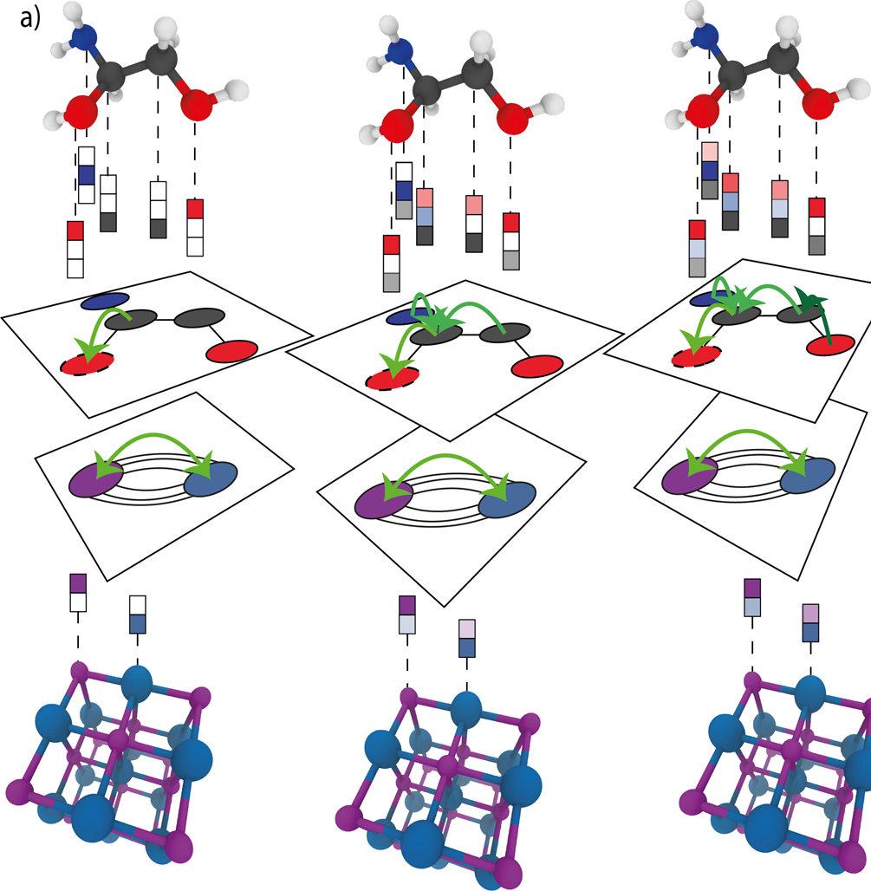

# 1.1. Geometric deep learning: Graph neural networks

Graph neural network (GNN)는 그래프의 연결 구조를 따라 정보를 전달하고, node·edge 또는 전체 그래프의 표현을 학습하는 신경망이다. 원자를 node로, 결합이나 공간적 이웃 관계를 edge로 나타내면 분자와 결정처럼 원자 수와 연결 구조가 달라지는 계를 같은 계산 규칙으로 처리할 수 있다.[1–3]

이 글은 그래프와 feature의 정의, message passing neural network (MPNN), 일반 graph network block, graph convolutional network (GCN), 주기 결정 그래프와 표현력 한계의 순서로 GNN formalism을 전개한다. 재료계의 구체적인 gated architecture는 후속 문서인 [Crystal graph convolutional neural networks](crystal-graph-convolutional-neural-networks.md)에서 다룬다.

## 1. 그래프와 학습 대상

### (1) 그래프, node, edge와 전역 상태

유한 그래프를

$$
G=(V,E)
$$

로 쓴다. $V=\{1,\ldots,N\}$는 node 집합이고, $E$는 방향이 있는 edge의 **중복을 허용하는 집합**이다. Edge $k$의 sender를 $s_k$, receiver를 $r_k$라 두면

$$
k=(s_k\rightarrow r_k)
$$

이다. 무방향 연결은 반대 방향의 두 edge로 바꿔 표현할 수 있다. 중복 edge를 허용하면 동일한 두 node 사이에 서로 다른 관계가 있거나, 주기 결정에서 서로 다른 lattice image가 같은 원자쌍을 연결하는 경우를 보존할 수 있다.[2,5,6]

각 node $i$의 입력 feature를 $\mathbf x_i\in\mathbb R^{d_v}$, edge $k$의 입력 feature를 $\mathbf e_k\in\mathbb R^{d_e}$, 계 전체의 상태를 $\mathbf u\in\mathbb R^{d_u}$로 쓴다. 신경망 내부의 $t$번째 층에서 node hidden state는 $\mathbf h_i^{(t)}$이고, 보통

$$
\mathbf h_i^{(0)}=\operatorname{Encoder}_v(\mathbf x_i)
$$

로 초기화한다. Edge와 전역 상태에도 별도 encoder와 hidden state를 둘 수 있다. 이 표기에서 topology는 $(s_k,r_k)$가, 원자 종류·결합 종류·거리·온도 같은 속성은 feature가 담당한다. 예를 들어 같은 두 원자 index 사이에 서로 다른 주기 image가 연결되면 sender와 receiver는 같아도 edge 변위와 거리 feature는 달라질 수 있다.[1–3,6]

| 구성 요소 | 수학적 대상 | 재료계의 대표 예 |
| --- | --- | --- |
| node | $i\in V$, $\mathbf x_i$ | 원자, 원소 종류와 원자별 속성 |
| edge | $k=(s_k\to r_k)$, $\mathbf e_k$ | 결합, 이웃 관계, 원자 사이 거리 |
| 전역 상태 | $\mathbf u$ | 온도, 압력, 전하 상태와 계산 조건 |
| topology | $E$ 또는 adjacency | 어떤 원자 사이에서 message를 교환하는가 |

Adjacency matrix $A\in\mathbb R^{N\times N}$를 사용할 때에는 $A_{ij}\ne0$이 $j\to i$ edge를 뜻하도록 정한다. 단순 그래프에서는 $A$가 topology를 모두 담지만, 중복 edge나 서로 다른 edge feature가 있으면 edge list $(s_k,r_k,\mathbf e_k)$가 정보를 더 직접적으로 보존한다.

### (2) GNN 출력 수준

GNN의 출력 수준은 목표량에 맞춰 정한다. Node-level 출력은 각 원자의 site label이나 원자별 값을, edge-level 출력은 결합이나 원자쌍의 값을, graph-level 출력은 분자 또는 결정 전체의 물성을 예측한다. 재료 물성 예측은 graph-level 회귀가 흔하지만, 같은 message passing backbone 위에 서로 다른 decoder를 둘 수 있다.[2,3]

Node-level decoder는

$$
\widehat{\mathbf y}_i
=D_v\!\left(\mathbf h_i^{(T)}\right)
$$

로 쓸 수 있다. Graph-level 출력에는 node 순서와 무관한 readout이 필요하며,

$$
\mathbf h_G
=R\!\left(\left\{\mathbf h_i^{(T)}:i\in V\right\}\right),
\qquad
\widehat{\mathbf y}_G=D_G(\mathbf h_G)
$$

로 나타낸다. $R$은 node state의 **집합**을 입력받으므로 node의 나열 순서를 바꾸어도 결과가 같아야 한다.[1–3]

## 2. Message passing formalism

### (1) Message, aggregation과 update

MPNN의 한 층은 message 생성, 이웃 집계, node 갱신의 세 연산으로 분해할 수 있다. $j\to i$ edge $k$가 보내는 message를

$$
\mathbf m_k^{(t+1)}
=M_t\!\left(
\mathbf h_{r_k}^{(t)},
\mathbf h_{s_k}^{(t)},
\mathbf e_k
\right)
$$

로 정의한다. Receiver $i$에 들어오는 edge 집합을

$$
\mathcal E_i^{\mathrm{in}}
=\{k\in E:r_k=i\}
$$

라 하면 집계된 message는

$$
\overline{\mathbf m}_i^{(t+1)}
=\rho_t^{e\to v}
\left(
\left\{\mathbf m_k^{(t+1)}
:k\in\mathcal E_i^{\mathrm{in}}\right\}
\right)
$$

이고, node state는

$$
\mathbf h_i^{(t+1)}
=U_t\!\left(
\mathbf h_i^{(t)},
\overline{\mathbf m}_i^{(t+1)}
\right)
$$

로 갱신된다.[1–3] $M_t$와 $U_t$는 multilayer perceptron (MLP), gated recurrent unit (GRU) 또는 문제에 맞춘 미분 가능한 함수가 될 수 있다. $\rho^{e\to v}$에는 합, 평균, 최댓값처럼 입력 순서에 무관한 연산을 사용한다.

Gilmer 등의 MPNN 표기는 node $i$의 모든 이웃 $j$에 대해 직접 합을 취한다.

$$
\overline{\mathbf m}_i^{(t+1)}
=
\sum_{j\in\mathcal N(i)}
M_t\!\left(
\mathbf h_i^{(t)},
\mathbf h_j^{(t)},
\mathbf e_{ij}
\right),
\qquad
\mathbf h_i^{(t+1)}
=U_t\!\left(
\mathbf h_i^{(t)},
\overline{\mathbf m}_i^{(t+1)}
\right).
$$

Edge-list 표기는 중복 edge를 별개의 $k$로 합한다는 점만 더 명시적이며 두 식의 계산 원리는 같다.[1,3]

<figure markdown="span">
  
  <figcaption markdown="1">
    그림 1. 분자와 주기 결정에서 이웃 node의 message를 집계하여 중앙 node의 feature를 갱신하는 반복 과정. 세 열은 연속된 message passing 단계의 예를 나타내며, 초록색 화살표는 edge를 따른 정보 전달을 나타낸다.
    출처: P. Reiser et al., “Graph neural networks for materials science and chemistry,” Figure 1a (2022),
    <a href="https://doi.org/10.1038/s43246-022-00315-6">DOI</a>,
    <a href="https://creativecommons.org/licenses/by/4.0/">CC BY 4.0</a>.
    원본 Figure 1에서 panel a만 잘랐으며 도식 내용은 수정하지 않았다.[3]
  </figcaption>
</figure>

### (2) PyTorch로 구현한 핵심 message-passing layer

다음 예제는 별도 graph library 없이 edge list에서 sender와 receiver feature를 모으고, edge별 message를 만든 뒤 `index_add_`로 receiver에 합산한다. 이는 위의 $M_t$, 합 aggregation과 $U_t$를 코드의 `message_mlp`, `aggregated`, `update_mlp`에 각각 대응시킨 최소 구현이다. PyTorch Geometric의 `MessagePassing`도 같은 순서를 `message()`, `aggregate()`, `update()`로 추상화한다.[1,11,12]

```python
import torch
from torch import nn


class MessagePassingLayer(nn.Module):
    def __init__(self, node_channels: int, edge_channels: int):
        super().__init__()
        self.message_mlp = nn.Sequential(
            nn.Linear(2 * node_channels + edge_channels, node_channels),
            nn.SiLU(),
            nn.Linear(node_channels, node_channels),
        )
        self.update_mlp = nn.Sequential(
            nn.Linear(2 * node_channels, node_channels),
            nn.SiLU(),
        )

    def forward(
        self,
        node_features: torch.Tensor,
        edge_index: torch.Tensor,
        edge_features: torch.Tensor,
    ) -> torch.Tensor:
        senders, receivers = edge_index
        message_input = torch.cat(
            [
                node_features[receivers],
                node_features[senders],
                edge_features,
            ],
            dim=-1,
        )
        messages = self.message_mlp(message_input)

        aggregated = node_features.new_zeros(node_features.shape)
        aggregated.index_add_(0, receivers, messages)

        update_input = torch.cat([node_features, aggregated], dim=-1)
        return self.update_mlp(update_input)


node_features = torch.randn(4, 16)
edge_index = torch.tensor(
    [[0, 1, 2, 2, 3], [1, 0, 1, 3, 2]],
    dtype=torch.long,
)
edge_features = torch.randn(edge_index.shape[1], 8)

layer = MessagePassingLayer(node_channels=16, edge_channels=8)
updated_features = layer(node_features, edge_index, edge_features)

assert updated_features.shape == node_features.shape
```

`edge_index[0]`과 `edge_index[1]`은 각각 $s_k$와 $r_k$이며, `messages`의 shape은 `[E, d_v]`이다. `index_add_`는 같은 receiver index를 가진 행을 더해 `aggregated[i]`에 $\sum_{k:r_k=i}\mathbf m_k$를 만든다. 이 구현은 합 aggregation의 계산 구조를 드러내기 위한 예제이며, 실제 학습에서는 batch별 graph 식별자, self-loop, degree normalization, isolated node와 중복 edge 처리 규약을 입력 계약에 포함해야 한다.[1,2,11,12]

한 층에서는 $\mathbf h_i^{(t+1)}$가 $i$와 1-hop 이웃의 이전 state에 의존한다. 따라서 $T$개 층을 합성하면 $\mathbf h_i^{(T)}$의 receptive field는 최대 $T$-hop 이웃으로 확장된다. 이는 message가 한 층마다 edge 하나를 건넌다는 계산 그래프에서 바로 따른다.[1,3,4]

### (3) 순열 equivariance와 invariant readout

Node 번호는 물리적 자유도가 아니라 자료 구조의 index이다. 같은 그래프의 node를 permutation $\pi$로 다시 번호 매기면 feature와 edge endpoint도 함께 바뀌어야 한다. Permutation matrix $P$를 사용하면

$$
H' = PH,
\qquad
A'=PAP^\mathsf T
$$

로 쓸 수 있다. 여기서 $H$의 $i$번째 행은 $\mathbf h_i^\mathsf T$이다.

Message function의 parameter를 모든 edge에서 공유하고, $\rho^{e\to v}$가 순열 불변이면 재번호화된 node $\pi(i)$에 들어오는 message multiset은 원래 $i$에 들어오던 multiset의 나열 순서만 바뀐다. 따라서

$$
\overline{\mathbf m}_{\pi(i)}'
=\overline{\mathbf m}_i,
\qquad
\mathbf h_{\pi(i)}^{\prime(t+1)}
=\mathbf h_i^{(t+1)}
$$

가 성립한다. 이를 층마다 적용하면 node-level GNN $F$는

$$
F(PH,PAP^\mathsf T)=P\,F(H,A)
$$

를 만족한다. 즉 node 출력은 입력 node와 함께 재배열되는 **permutation equivariance**를 가진다.[1–4]

Graph-level readout $R$이 합이나 평균처럼 순열 불변이면

$$
R(PH)=R(H)
$$

이므로 전체 출력은 **permutation invariance**를 가진다. 이 성질은 “원자 번호를 바꾸어도 물성 예측이 바뀌지 않아야 한다”는 요구를 구현하지만, 실제 원자 좌표를 회전시키는 것과는 다른 대칭성이다.

### (4) 합, 평균과 attention aggregation

Aggregation은 이웃 multiset에서 하나의 고정 길이 벡터를 만드는 연산이다.

$$
\rho_{\mathrm{sum}}(\{\mathbf m_k\})
=\sum_k\mathbf m_k,
\qquad
\rho_{\mathrm{mean}}(\{\mathbf m_k\})
=\frac{1}{|\mathcal E_i^{\mathrm{in}}|}
\sum_k\mathbf m_k.
$$

합은 이웃 수의 변화를 보존하지만 feature 크기도 node degree와 함께 변할 수 있다. 평균은 이웃 수에 따른 scale 변화를 줄이지만 동일한 message가 몇 번 나타났는지를 지울 수 있다. 최댓값은 각 feature channel의 가장 큰 신호를 남기지만 multiplicity를 보존하지 않는다. 따라서 어느 집계가 항상 우월한 것이 아니라, 목표가 이웃의 총 기여와 평균 환경 가운데 무엇에 가까운지에 따라 선택해야 한다.[1,3,7,8]

Attention을 사용하면

$$
\alpha_{ij}
=
\frac{\exp a(\mathbf h_i,\mathbf h_j,\mathbf e_{ij})}
{\sum_{k\in\mathcal N(i)}
\exp a(\mathbf h_i,\mathbf h_k,\mathbf e_{ik})},
\qquad
\overline{\mathbf m}_i
=\sum_{j\in\mathcal N(i)}
\alpha_{ij}\mathbf m_{ij}
$$

처럼 이웃별 가중치를 학습할 수 있다.[2,3] 분모도 같은 이웃 multiset 위에서 계산해야 node 나열 순서에 대한 성질을 유지한다. 가중치가 학습되었다는 사실만으로 그것이 물리적 결합 세기나 인과적 중요도를 뜻하지는 않는다.

## 3. 일반 graph network와 GCN

### (1) Edge–node–global graph network block

MPNN은 보통 고정된 edge feature로 node state를 갱신한다. 더 일반적인 graph network block은 edge, node, 전역 상태를 차례로 갱신한다. 한 block을 다음과 같이 쓸 수 있다.[2,6]

$$
\mathbf e_k'
=\phi^e\!\left(
\mathbf e_k,
\mathbf h_{s_k},
\mathbf h_{r_k},
\mathbf u
\right),
$$

$$
\overline{\mathbf e}_i'
=\rho^{e\to v}
\left(
\{\mathbf e_k':r_k=i\}
\right),
\qquad
\mathbf h_i'
=\phi^v\!\left(
\mathbf h_i,
\overline{\mathbf e}_i',
\mathbf u
\right),
$$

$$
\overline{\mathbf e}'
=\rho^{e\to u}\!\left(\{\mathbf e_k'\}\right),
\qquad
\overline{\mathbf h}'
=\rho^{v\to u}\!\left(\{\mathbf h_i'\}\right),
$$

$$
\mathbf u'
=\phi^u\!\left(
\mathbf u,
\overline{\mathbf e}',
\overline{\mathbf h}'
\right).
$$

$\phi^e$, $\phi^v$, $\phi^u$는 각각 edge, node, 전역 update이고, 모든 $\rho$는 해당 집합의 순서에 무관한 aggregation이다. 이 block은 $G=(E,V,\mathbf u)$를 같은 topology를 가진 새 그래프 $G'=(E',V',\mathbf u')$로 보낸다. MatErials Graph Network (MEGNet)는 이 형식을 분자와 결정에 적용하고, 온도·압력 같은 상태 변수를 $\mathbf u$로 입력할 수 있음을 보였다.[2,6]

### (2) GCN의 message-passing 해석

무방향 그래프의 대칭 adjacency $A$에 self-loop를 더해 $\widetilde A=A+I$로 두고, 그 degree matrix를

$$
\widetilde D_{ii}
=\sum_j\widetilde A_{ij}
$$

라 하자. Kipf–Welling GCN의 한 층은

$$
H^{(t+1)}
=
\sigma\!\left(
\widetilde D^{-1/2}
\widetilde A
\widetilde D^{-1/2}
H^{(t)}(W^{(t)})^\mathsf T
\right)
$$

이다.[3,4] 여기서는 $\mathbf h_i$를 열벡터로 쓰고, $H$의 각 행에는 $\mathbf h_i^\mathsf T$를 놓았으므로 원 논문의 row-vector weight를 전치하여 표시했다. Node $i$의 식으로 펼치면

$$
\mathbf h_i^{(t+1)}
=
\sigma\!\left[
\sum_{j\in\mathcal N(i)\cup\{i\}}
\frac{\widetilde A_{ij}}
{\sqrt{\widetilde d_i\widetilde d_j}}
W^{(t)}\mathbf h_j^{(t)}
\right].
$$

따라서 GCN도

$$
\mathbf m_{j\to i}^{(t+1)}
=
\frac{\widetilde A_{ij}}
{\sqrt{\widetilde d_i\widetilde d_j}}
W^{(t)}\mathbf h_j^{(t)}
$$

를 합한 뒤 비선형 함수를 적용하는 MPNN의 한 특수한 경우로 볼 수 있다. GCN의 정규화는 node degree가 다른 그래프에서 단순 합의 scale을 조절한다. 반면 일반 MPNN은 receiver state와 edge feature까지 message function에 넣을 수 있어 재료계의 원자 종류와 거리 의존성을 더 직접적으로 표현한다.[1,3,4]

### (3) Readout과 크기 의존성

Graph-level readout의 대표 형태는

$$
\mathbf h_G^{\mathrm{sum}}
=\sum_{i=1}^{N}\mathbf h_i^{(T)},
\qquad
\mathbf h_G^{\mathrm{mean}}
=\frac{1}{N}\sum_{i=1}^{N}\mathbf h_i^{(T)}
$$

이다. 동일한 국소 환경을 복제하면 합 readout은 복제 수에 비례하고 평균 readout은 유지된다. 그러므로 총에너지처럼 계 크기에 따라 더해지는 목표와 원자당 에너지처럼 정규화된 목표는 같은 readout 규약으로 혼동해서는 안 된다. 실제 모형에서는 목표량의 단위, 원자 수 정규화와 pooling을 함께 기록해야 한다.[3,5,6]

Readout 뒤의 decoder를 $D_G$라 하면 지도 학습 회귀는 예를 들어

$$
\mathcal L_{\mathrm{MSE}}
=
\frac{1}{B}
\sum_{b=1}^{B}
\left\|
D_G(\mathbf h_{G_b})-\mathbf y_b
\right\|_2^2
$$

를 최소화한다. $B$는 batch의 그래프 수이다. 이 식에서 GNN은 입력 그래프를 $\mathbf h_G$로 바꾸는 representation learner이고, decoder와 손실 함수는 그 표현을 특정 목표에 맞춘다.

## 4. 재료의 graph representation

### (1) 분자 그래프와 결정 그래프

분자에서는 공유 결합 정보로 edge를 정의할 수 있다. 결정에서는 결합의 유일한 정의가 없는 경우가 많으므로 거리 cutoff, 고정된 최근접 이웃 수 또는 별도의 이웃 판정법으로 그래프를 만든다. 따라서 결정 그래프는 원자 구조 그 자체가 아니라 **선택한 이웃 규칙으로 구조에서 추출한 계산 표현**이다.[3,5,6]

Lattice vector를 열로 갖는 행렬을

$$
L=
\begin{bmatrix}
\mathbf a_1 & \mathbf a_2 & \mathbf a_3
\end{bmatrix}
$$

라 하고, 기준 cell의 fractional coordinate를 $\mathbf f_i$라 하면 Cartesian 좌표는 $\mathbf r_i=L\mathbf f_i$이다. 정수 lattice shift $\mathbf n\in\mathbb Z^3$에 있는 원자 $j$의 image와 원자 $i$ 사이의 변위는

$$
\mathbf d_{ij\mathbf n}
=
\mathbf r_j+L\mathbf n-\mathbf r_i,
\qquad
r_{ij\mathbf n}
=\|\mathbf d_{ij\mathbf n}\|_2
$$

이다. Cutoff $r_c$를 쓰는 directed edge는

$$
E
=
\left\{
(j,\mathbf n)\to i:
0<r_{ij\mathbf n}\le r_c
\right\}
$$

로 정의할 수 있다. 같은 기준 cell의 $i$와 $j$라도 서로 다른 $\mathbf n$이 cutoff 안에 들어오면 여러 edge가 생긴다. 이것이 주기 결정 그래프를 multigraph로 쓰는 이유이다.[3,5,6]

!!! warning "[Interpretation Caveat]"
    Cutoff, 최대 이웃 수와 동률 거리 처리법을 바꾸면 $E$가 달라진다. 특히 구조 왜곡으로 원자가 cutoff를 통과하면 edge가 불연속적으로 생기거나 사라질 수 있다. 모형을 비교할 때에는 architecture뿐 아니라 이웃 목록 생성 규약도 함께 고정하고 보고해야 한다.[3,5,6]

### (2) 원자와 거리 feature

초기 node feature는 원소별 one-hot vector, 물리·화학 속성표 또는 학습 가능한 element embedding으로 구성할 수 있다. 거리만 edge feature로 사용할 때에는 연속값 $r_{ij\mathbf n}$을 radial basis로 펼치는 방식이 흔하다.[3,6]

$$
e_{ij\mathbf n,q}
=
\exp\!\left[
-\gamma
\left(
r_{ij\mathbf n}-\mu_q
\right)^2
\right],
\qquad
q=1,\ldots,Q.
$$

$\mu_q$는 basis center이고 $\gamma$는 폭을 정하는 계수이다. 이 feature는 전역 병진과 회전에서 변하지 않는 거리만 사용한다. 반면 서로 다른 edge 사이의 각도나 방향은 명시적으로 담지 않는다. 필요한 기하 정보가 거리, 결합각, dihedral angle 또는 방향 tensor 가운데 무엇인지에 따라 edge와 higher-order feature 설계를 달리해야 한다.[3,5]

## 5. 표현력과 물리적 한계

### (1) Locality, over-smoothing과 over-squashing

유한한 $T$의 message passing은 최대 $T$-hop 이웃만 node state에 직접 반영한다. 층을 깊게 쌓으면 receptive field는 넓어지지만, 반복 aggregation으로 인접 node 표현이 서로 비슷해지는 over-smoothing과 많은 원거리 정보를 고정 길이 state에 압축하는 over-squashing이 생길 수 있다.[3,9,10]

!!! warning "[Interpretation Caveat]"
    층 수를 늘리는 것만으로 장거리 물리가 자동으로 해결되지는 않는다. 전하 이동, 장거리 정전기·분산 상호작용이나 전역 조성 정보가 목표에 중요하면 global state, long-range edge, 계층적 pooling 또는 별도 물리 항이 필요한지 검증해야 한다.[3,6,9]

### (2) 1-WL 수준의 구별 한계

이웃 multiset을 반복 집계하는 표준 message-passing GNN의 그래프 구별 능력은 one-dimensional Weisfeiler–Leman (1-WL) graph isomorphism test와 밀접하게 연결된다. Injective aggregation과 update를 사용하면 이 계열에서 1-WL에 대응하는 표현력을 얻을 수 있지만, 1-WL이 구별하지 못하는 비동형 그래프를 모든 표준 MPNN이 구별할 수 있는 것은 아니다.[7,8]

이는 “GNN이 충분히 크면 모든 구조 차이를 자동으로 학습한다”는 가정이 성립하지 않음을 뜻한다. 재료계에서는 edge에 연속 거리와 원자 종류가 들어가므로 무표지 단순 그래프보다 많은 정보를 가지지만, 입력 표현에서 이미 같아진 두 환경은 이후 message passing만으로 복구할 수 없다.

## 6. 요약

1. GNN은 node, edge와 선택적인 전역 상태로 그래프를 표현하고, 공유된 message·aggregation·update 함수로 국소 정보를 전달한다.
2. 순열 불변 aggregation은 node-level permutation equivariance를 만들고, 순열 불변 readout은 graph-level invariance를 만든다.
3. GCN은 정규화된 adjacency로 이웃 state를 합하는 MPNN의 특수한 경우이며, 일반 graph network는 edge·node·전역 상태를 모두 갱신한다.
4. 주기 결정은 edge를 $(i,j,\mathbf n)$으로 구분하는 multigraph로 나타낼 수 있다. Cutoff와 periodic image 규약은 모형 바깥의 중요한 가정이다.
5. 유한 receptive field, over-smoothing, over-squashing과 1-WL 표현력 한계를 고려해야 한다. 결정 물성용 gated architecture와 구현은 [Crystal graph convolutional neural networks](crystal-graph-convolutional-neural-networks.md)에서 이어서 설명한다.

## 7. 참고문헌

1. J. Gilmer, S. S. Schoenholz, P. F. Riley, O. Vinyals, and G. E. Dahl, "Neural Message Passing for Quantum Chemistry," *Proceedings of Machine Learning Research* **70**, 1263–1272 (2017). [PMLR](https://proceedings.mlr.press/v70/gilmer17a.html).
2. P. W. Battaglia et al., "Relational inductive biases, deep learning, and graph networks," *arXiv:1806.01261* (2018). [DOI](https://doi.org/10.48550/arXiv.1806.01261).
3. P. Reiser, M. Neubert, A. Eberhard, L. Torresi, C. Zhou, C. Shao, H. Metni, C. van Hoesel, H. Schopmans, T. Sommer, and P. Friederich, "Graph neural networks for materials science and chemistry," *Communications Materials* **3**, 93 (2022). [DOI](https://doi.org/10.1038/s43246-022-00315-6).
4. T. N. Kipf and M. Welling, "Semi-Supervised Classification with Graph Convolutional Networks," *International Conference on Learning Representations* (2017). [arXiv](https://arxiv.org/abs/1609.02907).
5. T. Xie and J. C. Grossman, "Crystal Graph Convolutional Neural Networks for an Accurate and Interpretable Prediction of Material Properties," *Physical Review Letters* **120**, 145301 (2018). [DOI](https://doi.org/10.1103/PhysRevLett.120.145301).
6. C. Chen, W. Ye, Y. Zuo, C. Zheng, and S. P. Ong, "Graph Networks as a Universal Machine Learning Framework for Molecules and Crystals," *Chemistry of Materials* **31**, 3564–3572 (2019). [DOI](https://doi.org/10.1021/acs.chemmater.9b01294).
7. K. Xu, W. Hu, J. Leskovec, and S. Jegelka, "How Powerful are Graph Neural Networks?" *International Conference on Learning Representations* (2019). [arXiv](https://arxiv.org/abs/1810.00826).
8. C. Morris, M. Ritzert, M. Fey, W. L. Hamilton, J. E. Lenssen, G. Rattan, and M. Grohe, "Weisfeiler and Leman Go Neural: Higher-Order Graph Neural Networks," *Proceedings of the AAAI Conference on Artificial Intelligence* **33**, 4602–4609 (2019). [DOI](https://doi.org/10.1609/aaai.v33i01.33014602).
9. U. Alon and E. Yahav, "On the Bottleneck of Graph Neural Networks and its Practical Implications," *International Conference on Learning Representations* (2021). [arXiv](https://arxiv.org/abs/2006.05205).
10. K. Oono and T. Suzuki, "Optimization and Generalization Analysis of Transduction through Gradient Boosting and Application to Multi-scale Graph Neural Networks," *Advances in Neural Information Processing Systems* **33**, 18917–18930 (2020). [Proceedings](https://papers.nips.cc/paper/2020/hash/dab49080d80c724aad5ebf158d63df41-Abstract.html).
11. PyTorch Geometric developers, "Creating Message Passing Networks," official documentation (2026년 확인). [Documentation](https://pytorch-geometric.readthedocs.io/en/latest/tutorial/create_gnn.html).
12. M. Fey and J. E. Lenssen, "Fast Graph Representation Learning with PyTorch Geometric," *ICLR Workshop on Representation Learning on Graphs and Manifolds* (2019). [arXiv](https://arxiv.org/abs/1903.02428).
