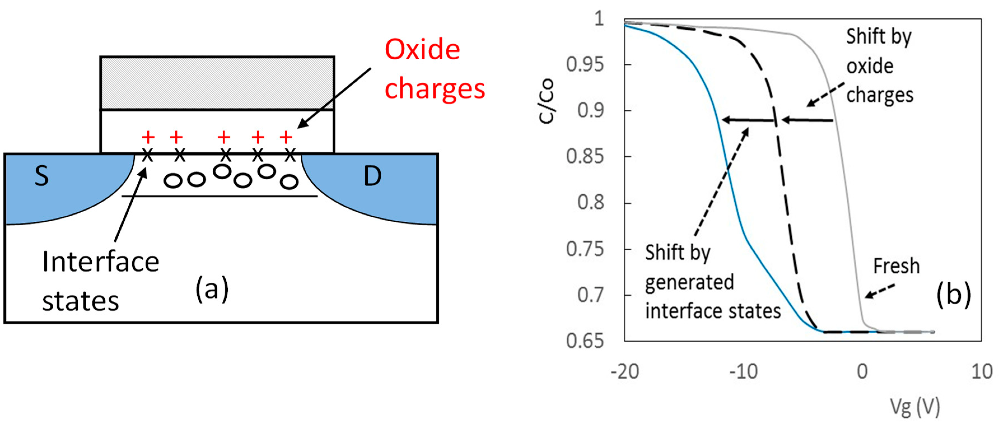

# 4.2. Device reliability: Bias temperature instability

Bias temperature instability (BTI)는 metal-oxide-semiconductor field-effect transistor (MOSFET)에 게이트 바이어스와 온도를 장시간 인가할 때 문턱전압 $V_T$와 구동 특성이 시간에 따라 변하는 현상이다. Negative BTI (NBTI)는 전통적으로 음의 게이트 바이어스를 받는 pMOS에서, positive BTI (PBTI)는 양의 게이트 바이어스를 받는 nMOS에서 구분해 왔다. 실제 열화량은 절연막 재료, 공정, 반전 운반자와 바이어스 이력에 따라 달라진다.[1–4]

## 1. 전기적 기원

### (1) Oxide charge와 interface state

BTI의 $\Delta V_T$에는 게이트 절연막 내부 트랩의 전하 상태 변화와 반도체–절연막 계면 상태의 생성·점유가 함께 기여할 수 있다. 전자는 평탄대 전압과 문턱전압을 이동시키고, 후자는 표면 전위에 따라 전하 상태가 달라져 subthreshold swing (SS)과 transconductance에도 영향을 줄 수 있다.[1–4]

<figure markdown="span">
  
  <figcaption markdown="1">
    그림 1. MOS 구조의 oxide charge와 interface state, 그리고 두 결함군이 capacitance–voltage 곡선에 주는 대표적인 차이. 이 그림의 전압 값은 개념을 보이는 예시이며 현대 소자의 정량 기준으로 사용하지 않는다.
    출처: J. F. Zhang et al., “Bias Temperature Instability of MOSFETs: Physical Processes, Models, and Prediction,” Figure 3 (2022),
    <a href="https://doi.org/10.3390/electronics11091420">DOI</a>,
    <a href="https://creativecommons.org/licenses/by/4.0/">CC BY 4.0</a>, 수정 없음.[1]
  </figcaption>
</figure>

단순한 전하 시트 근사에서는 유효 산화막 전하 변화 $\Delta Q_\mathrm{ox}$가 만드는 문턱전압 이동을

$$
\Delta V_T\approx-\frac{\Delta Q_\mathrm{ox}}{C_\mathrm{ox}}
$$

로 쓸 수 있다. $C_\mathrm{ox}$는 단위면적당 유효 게이트 절연막 capacitance이다. 실제 BTI에서는 트랩의 에너지·깊이, 계면 상태의 점유, 채널 전하와 양자·전기정적 결합 때문에 이 식만으로 결함 밀도를 유일하게 역산할 수 없다.[1–4]

### (2) Stress와 recovery

스트레스 중에 포획되거나 생성된 결함의 일부는 게이트 바이어스를 낮추거나 제거한 뒤 탈포획되어 $\Delta V_T$가 감소한다. 빠른 회복 성분부터 긴 시간 동안 남는 성분까지 넓은 시간 척도가 공존하므로, 스트레스 종료와 첫 판독 사이의 지연이 측정값을 바꾼다.[1–4]

BTI의 미시적 설명에는 reaction–diffusion, dispersive transport, switching oxide trap, defect generation을 강조하는 여러 모형이 제안되었다. 서로 다른 소자와 시간 창에서 같은 거듭제곱 시간 의존성이 나타날 수 있어, 곡선 적합만으로 하나의 미시 모형을 확정할 수 없다.[1–4]

## 2. 바이어스와 온도 의존성

BTI는 일반적으로 게이트 overdrive와 온도가 커질수록 빨라지지만, 정확한 전압·온도 함수는 결함군과 측정 시간 창에 의존한다. 제한된 범위의 경험식은

$$
|\Delta V_T(t)|
=A|V_\mathrm{ov}|^m t^n
\exp\left(-\frac{E_a}{kT}\right)
$$

처럼 쓸 수 있다. $V_\mathrm{ov}=V_G-V_T$의 크기는 게이트 overdrive, $m$과 $n$은 적합 지수, $E_a$는 유효 활성화 에너지이다. 이 식의 매개변수는 스트레스·판독 절차와 적합 구간에 종속되며 보편적인 재료 상수가 아니다. 열화가 진행되는 동안 $V_T$가 변하므로, 시험 설계에서는 초기 $V_{T0}$를 쓸지 순간 $V_T(t)$를 쓸지도 명시한다.[1–4]

고유전율 절연막과 금속 게이트를 사용하는 nMOS에서는 PBTI가 중요한 제한이 될 수 있고, pMOS에서는 NBTI가 대표적으로 논의된다. 그러나 극성만으로 결함 종류를 정할 수 없으며, 같은 기술에서도 절연막 조성·계면 처리와 온도에 따라 지배 성분이 달라질 수 있다.[1,2,4]

## 3. 전기적 영향

$V_T$ 이동은 고정된 게이트 전압에서 overdrive를 바꾸므로 선형·포화 드레인 전류와 transconductance를 변화시킨다. Interface state의 증가는 SS를 악화시킬 수도 있다. 회로에서는 pMOS와 nMOS의 비대칭 열화가 inverter 지연, 잡음 여유와 static random-access memory (SRAM) 안정성에 영향을 줄 수 있다.[1,2,5]

| 관측량 | 주된 민감도 | 해석할 때 함께 볼 양 |
| --- | --- | --- |
| $\Delta V_T$ | 유효 절연막 전하와 계면 상태 | 추출법, 판독 지연, body bias |
| $\Delta I_{D,\mathrm{lin}}$ | 저전계 채널 전도 | $\Delta V_T$, mobility, 직렬저항 |
| $\Delta g_m$ | mobility와 계면 산란 | $V_G$ 추출점, $\Delta V_T$ 보정 |
| $\Delta SS$ | 계면 상태와 전기정적 결합 | 누설 바닥, 온도, sweep 방향 |

이 관측량들은 결함군에 일대일로 대응하지 않는다. 예를 들어 고정된 $V_G$에서의 $I_D$ 변화에는 $V_T$ 이동과 mobility 변화가 동시에 들어가므로, 여러 판독량을 같은 시점에 측정해 분리해야 한다.[1–4]

## 4. Stress–measure 절차

!!! info "[Measurement]"
    초기 transfer 특성에서 같은 추출법으로 $V_{T0}$를 구한다. 정해진 $(V_{G,\mathrm{str}},V_{D,\mathrm{str}},V_{B,\mathrm{str}},T)$에서 시간 $t_s$ 동안 스트레스한 뒤, 낮은 교란의 판독 바이어스로 빠르게 전환하여 $V_T(t_s,t_\mathrm{delay})$를 측정한다. 각 단계에서

    $$
    \Delta V_T(t_s,t_\mathrm{delay})
    =V_T(t_s,t_\mathrm{delay})-V_{T0}
    $$

    를 계산하고 stress–recovery 파형, ramp·전환 시간, 첫 판독 지연과 $V_T$ 추출법을 함께 기록한다. 여러 $V_G$와 $T$ 셀에서 같은 절차를 반복한다.[1–4]

On-the-fly 측정은 스트레스를 유지한 채 제한된 바이어스 구간을 읽어 빠른 회복을 줄일 수 있지만, 판독 전압 자체가 열화 상태를 바꾸고 완전한 transfer 곡선을 얻기 어렵다. Measure–stress–measure 방식은 풍부한 전기적 정보를 주지만 전환 지연 동안의 회복을 포함한다.[1–4]

!!! note "[Metric]"
    수명 기준을 $|\Delta V_T|=\Delta V_{T,\mathrm{crit}}$로 정했다면 기준값과 함께 $\Delta I_D/I_{D0}$, 판독 바이어스와 지연을 보고한다. 적합 지수 $n$은 시간 구간을 명시하고, 회복이 포함된 자료와 스트레스 중 자료를 같은 $n$으로 직접 비교하지 않는다.[1–4]

## 5. 모델과 해석의 한계

초기 reaction–diffusion 모형은 NBTI의 장시간 거듭제곱 거동과 회복을 설명하는 중요한 틀을 제공했다. 이후의 빠른 시간 분해 측정에서는 개별 트랩의 포획·방출과 넓은 시정수 분포가 관측되었고, diffusion-limited 해석만으로 설명하기 어려운 결과가 제시되었다.[1–4]

!!! warning "[Interpretation Caveat]"
    한 시간 구간에서 $t^n$ 직선을 얻었다는 사실만으로 결함 생성, 수소 확산 또는 trap switching 중 하나를 증명할 수 없다. 측정 대역 밖의 빠른 회복과 매우 느린 성분, 소자 면적에 따른 변동, 온도·바이어스 의존성을 함께 검증한다.[1–4]

BTI와 HCD는 실제 동작 바이어스에서 동시에 나타날 수 있다. 높은 $|V_G|$에서의 열화를 모두 BTI로, 높은 $V_D$에서의 열화를 모두 HCD로 배정하지 말고, [hot-carrier degradation](hot-carrier-degradation.md)의 바이어스 지도와 판독량을 함께 사용한다.[2,5]

## 6. 요약

- BTI는 게이트 바이어스와 온도 아래에서 절연막·계면 결함의 전하 상태와 밀도가 변해 나타나는 시간 의존적 열화이다.
- $\Delta V_T$에는 oxide charge와 interface state가 함께 기여할 수 있으며 단일 전기량으로 결함군을 유일하게 분리할 수 없다.
- Stress 종료 직후부터 회복이 시작되므로 판독 지연과 파형은 정량 지표의 일부이다.
- 거듭제곱 시간식과 Arrhenius 항은 측정 범위가 붙은 경험 모형으로 사용하고, 미시 메커니즘의 증거와 구분한다.

## 7. 참고문헌

1. J. F. Zhang, R. Gao, M. Duan, Z. Ji, W. Zhang, and J. Marsland, “Bias Temperature Instability of MOSFETs: Physical Processes, Models, and Prediction,” *Electronics* **11**, 1420 (2022). [DOI](https://doi.org/10.3390/electronics11091420)
2. J. H. Stathis and S. Zafar, “The Negative Bias Temperature Instability in MOS Devices: A Review,” *Microelectronics Reliability* **46**, 270–286 (2006). [DOI](https://doi.org/10.1016/j.microrel.2005.08.001)
3. T. Grasser, H. Reisinger, P.-J. Wagner, F. Schanovsky, W. Gös, and B. Kaczer, “The Paradigm Shift in Understanding the Bias Temperature Instability: From Reaction–Diffusion to Switching Oxide Traps,” *IEEE Transactions on Electron Devices* **58**, 3652–3666 (2011). [DOI](https://doi.org/10.1109/TED.2011.2164543)
4. T. Grasser et al., “NBTI in Nanoscale MOSFETs—The Ultimate Modeling Benchmark,” *IEEE Transactions on Electron Devices* **61**, 3586–3593 (2014). [DOI](https://doi.org/10.1109/TED.2014.2353578)
5. H. Zhou, “An Overview of Hot Carrier Degradation on Gate-All-Around Nanosheet Transistors,” *Micromachines* **16**, 311 (2025). [DOI](https://doi.org/10.3390/mi16030311)
