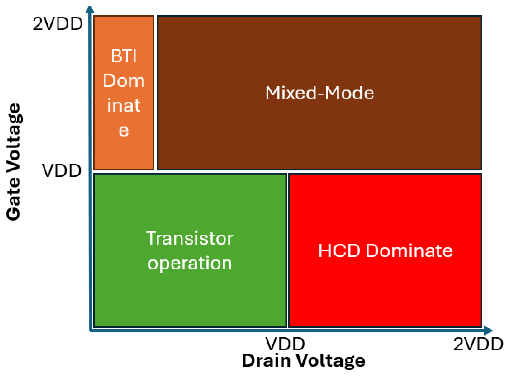

# 5.3. Device reliability: Hot-carrier degradation

Hot-carrier degradation (HCD)은 metal-oxide-semiconductor field-effect transistor (MOSFET)의 채널에서 에너지를 얻은 비평형 운반자가 반도체–절연막 계면과 절연막의 결함을 생성하거나 점유 상태를 바꾸어 소자 특성을 열화시키는 현상이다. Hot-carrier injection (HCI)은 운반자가 계면 장벽을 넘어 절연막으로 주입되는 과정을 가리키는 더 좁은 표현이며, HCD에는 절연막 주입뿐 아니라 계면 결합 파괴와 그에 따른 전기적 열화도 포함된다.[1–4]

HCD의 구동력을 하나의 최대 전기장이나 유효 운반자 온도로만 나타내기는 어렵다. 결함 생성률은 운반자 에너지 분포의 높은 에너지 꼬리, 운반자 수, 계면 결합의 반응 단면적과 공간적 중첩에 의해 결정된다. 따라서 장채널 nMOS의 고전적 기판 전류 기준을 짧은 채널, pMOS, FinFET 또는 gate-all-around (GAA) nanosheet에 그대로 적용하지 않는다.[1–4,6]

## 1. 비평형 운반자와 에너지 획득

### (1) 드레인 고전계와 impact ionization

큰 드레인 전압 $V_D$가 인가되면 채널 전위가 드레인 쪽에서 급격히 변하고 큰 수평 전기장이 형성된다. 채널 운반자는 전기장에서 에너지를 얻는 동시에 phonon, 불순물과 다른 운반자와 충돌하여 에너지를 잃는다. 이 경쟁 때문에 에너지 분포 함수 $f(E,x)$는 평형 Maxwell–Boltzmann 분포가 아니며, 특히 드레인 부근의 높은 에너지 꼬리가 결함 반응을 지배할 수 있다.[1–4]

충분히 에너지가 큰 전자는 impact ionization으로 전자–정공 쌍을 만든다. Bulk nMOS에서 생성된 정공의 일부가 body 단자로 흘러 기판 전류 $I_B$를 만들므로, $I_B$는 고전적으로 채널의 고전계 상태를 나타내는 대리량으로 사용되었다. 그러나 $I_B$는 impact ionization의 적분 신호이지 계면에 입사하는 모든 운반자의 에너지 분포나 결함 생성률을 직접 측정한 값은 아니다.[1,3,4]

### (2) 에너지 분포와 결함 반응률

운반자 종류 $c$가 결함 생성 과정 $j$를 일으키는 국소 반응률은 개념적으로 다음과 같이 나타낼 수 있다.[2–4]

$$
R_{j}^{(c)}(x)
=N_{\mathrm{p}}(x)
\int_{E_{\mathrm{th},j}}^{\infty}
f_c(E,x)g_c(E) v_c(E)\sigma_j^{(c)}(E)\,dE
$$

$N_{\mathrm{p}}$는 반응 가능한 전구체 밀도, $g_c$는 density of states, $v_c$는 군속도, $\sigma_j^{(c)}$는 에너지 의존 반응 단면적, $E_{\mathrm{th},j}$는 해당 반응의 문턱 에너지이다. 이 식은 같은 국소 전기장에서도 $f_c(E,x)$의 모양과 운반자 입사율이 다르면 손상률이 달라짐을 보여 준다. 또한 전기장이 반응 장벽을 낮추거나 산란이 높은 에너지 꼬리를 바꾸는 효과는 별도로 고려해야 한다.[2–4]

!!! warning "[Interpretation Caveat]"
    $I_B$, 게이트 전류 또는 최대 수평 전기장은 특정 구조와 바이어스 범위에서 유용한 대리량이다. 이 가운데 하나와 수명의 상관관계가 관측되었다고 해서 그 양이 모든 구조에서 결함 생성의 유일한 원인이라는 뜻은 아니다.[1,3,4]

## 2. 결함 생성 과정

### (1) 결합 파괴의 single-carrier와 multiple-carrier 과정

Si 계면의 수소 종결 결합을 예로 들면, single-carrier (SC) 과정에서는 한 개의 고에너지 운반자가 결합 전자를 antibonding 상태로 여기하여 결합 파괴를 유도한다. Multiple-carrier (MC) 과정에서는 개별 에너지가 더 낮은 여러 운반자가 결합의 진동 준위를 단계적으로 여기하고, 충분히 높아진 진동 상태에서 결합이 끊어진다. 두 과정은 완전히 분리된 두 현상이라기보다 같은 결합 해리 반응으로 가는 경쟁·결합 경로로 취급할 수 있다.[1–4]

| 과정 | 필요한 운반자 분포 | 결합에 전달되는 에너지 | 상대적으로 중요해지는 조건 | 단순화의 한계 |
| --- | --- | --- | --- | --- |
| SC 과정 | 희박한 높은 에너지 꼬리 | 한 번의 충돌과 전자 여기 | 높은 $V_D$, 고에너지 운반자 공급 | 채널 길이만으로 우세 여부를 정할 수 없음 |
| MC 과정 | 비교적 많은 중간 에너지 운반자 | 반복 충돌에 의한 진동 여기 | 큰 채널 전류, 낮아진 공급 전압의 scaled 소자 | 독립 충돌의 누적과 진동 완화 시간을 함께 봐야 함 |
| 결합 경로 | 두 분포의 중첩 | 진동 예열 뒤 고에너지 충돌 | 넓은 실제 바이어스 영역 | SC와 MC의 단순 합으로 환원되지 않을 수 있음 |

SC·MC의 상대 기여는 채널 길이 하나가 아니라 소자 구조, $V_G$, $V_D$, 온도와 산란 과정의 조합으로 정해진다. 예를 들어 짧은 소자에서도 큰 $V_D$가 높은 에너지 꼬리를 충분히 만들면 SC 과정이 중요할 수 있고, 비교적 긴 소자에서도 운반자 수가 크면 MC 과정이 무시되지 않을 수 있다.[2–4]

### (2) 계면·절연막 결함과 공간 분포

Si–H 결합이 끊어지면 passivation을 잃은 Si dangling bond가 interface trap으로 작용할 수 있다. 절연막 내부에서는 기존 trap의 전하 포획과 구조 전환, 새로운 oxide trap 생성도 전기적 열화에 기여할 수 있다. Interface trap은 문턱전압뿐 아니라 subthreshold swing (SS), carrier mobility와 transconductance $g_m$을 바꾸며, oxide trap은 위치·에너지·점유 상태에 따라 유효 전하와 산란을 변화시킨다.[1,3,4,6]

주 운반자에 의한 손상은 대체로 드레인 쪽 고전계 영역에 국소화되지만, 이것이 유일한 공간 형태는 아니다. 넓은 바이어스 범위를 다룬 nMOS 연구에서는 impact ionization으로 생긴 secondary hole이 낮은 $V_G/V_D$ 영역에서 추가 손상에 기여하고, 그에 따른 interface trap 최대점이 주 전자에 의한 드레인 쪽 최대점과 다른 위치에 나타날 수 있음이 보고되었다. 따라서 하나의 판독 바이어스에서 얻은 전체 전류 변화만으로 결함 위치를 유일하게 역산하지 않는다.[3,4,6]

## 3. 바이어스 지도와 소자 구조

### (1) 장채널과 짧은 채널의 조건

장채널 bulk nMOS에서는 고정한 $V_D$에서 $I_B$가 최대가 되는 중간 $V_G$ 부근을 worst-case 스트레스로 사용하는 고전적 방법이 확립되었다. 이 조건에서는 큰 수평 전기장과 충분한 채널 전류의 곱이 중요하다. 반면 짧은 채널 소자에서는 높은 $V_G\approx V_D$ 조건에서 큰 열화가 나타날 수 있고, 낮은 $V_G$에서는 secondary carrier 또는 서로 다른 trap 조합이 지배할 수 있다.[1–4,6]

<figure markdown="span">
  
  <figcaption markdown="1">
    그림 1. $V_{GS}$–$V_{DS}$ 바이어스 공간에서 BTI 우세, HCD 우세와 혼합 영역을 구분한 개념도. 경계는 구조, 온도, 스트레스 시간과 판정 지표에 따라 달라지므로 보편적인 정량 경계로 사용하지 않는다.
    출처: H. Zhou, “An Overview of Hot Carrier Degradation on Gate-All-Around Nanosheet Transistors,” Figure 4 (2025),
    <a href="https://doi.org/10.3390/mi16030311">DOI</a>,
    <a href="https://creativecommons.org/licenses/by/4.0/">CC BY 4.0</a>, 수정 없음.[6]
  </figcaption>
</figure>

높은 $V_G$와 낮은 $V_D$에서는 [bias temperature instability (BTI)](bias-temperature-instability.md)의 전하 포획 성분이 커질 수 있고, 높은 $V_D$에서는 HCD가 강해진다. 중간 영역에서는 두 메커니즘이 동시에 관측량에 들어간다. 그러므로 하나의 “HCD 전압” 대신 실제 동작 범위를 덮는 $V_G$–$V_D$ 행렬과 BTI 대조 스트레스를 사용한다.[3,4,6]

### (2) 3차원 구조의 형상 의존성

3차원 구조에서는 채널 면의 결정 방향, fin 또는 sheet의 폭·두께, 모서리 곡률, 접합과 inner spacer가 전기장·전류 밀도·trap 민감도를 바꾼다. GAA nanosheet의 여러 sheet와 모서리는 서로 같은 온도와 전기장을 갖는다고 가정할 수 없으며, 선형 전류·포화 전류·문턱전압이 서로 다른 손상 위치에 민감할 수 있다.[4,6]

| 구조 | 손상 지도를 바꾸는 요소 | 시험에서 추가로 기록할 항목 |
| --- | --- | --- |
| Planar bulk MOSFET | 드레인 접합, lightly doped drain, body 전류 경로 | $I_B$, 채널 길이, 소스/드레인 방향 |
| FinFET | 상부·측벽 면 방향, fin 수, 국소 자가 발열 | fin 수와 폭, 면 방향, 실제 온도 |
| GAA nanosheet | sheet 폭·두께, 적층 수, 모서리, inner spacer | 각 형상, 적층 순서, 열 경계 조건 |

## 4. 전기적 열화와 결함 위치

HCD 뒤의 대표 관측량은 $\Delta V_T$, $\Delta SS$, $\Delta g_m$, 선형 영역의 $\Delta I_{D,\mathrm{lin}}$와 포화 영역의 $\Delta I_{D,\mathrm{sat}}$이다. 본 문서에서는 nMOS와 pMOS의 전류 부호 차이를 피하기 위해 전류 열화량을 다음 양의 크기로 정의한다.[1,4–6]

$$
D_{I,\alpha}(t)
=-\frac{I_{D,\alpha}(t)-I_{D,\alpha,0}}
{|I_{D,\alpha,0}|},
\qquad \alpha\in\{\mathrm{lin},\mathrm{sat}\}
$$

$D_{I,\alpha}>0$이면 초기값보다 드레인 전류의 크기가 감소했음을 뜻한다. 모든 비교에는 같은 판독 온도, $V_G$, $V_D$, body bias와 소스/드레인 방향을 사용한다.

| 관측량 | 주된 민감도 | 함께 측정할 양 | 단독 해석의 한계 |
| --- | --- | --- | --- |
| $\Delta V_T$ | 유효 trap 전하 | $\Delta SS$, $\Delta g_m$ | BTI도 같은 이동을 만들 수 있음 |
| $\Delta SS$ | interface trap과 전기정적 결합 | 누설 바닥, 온도 | 짧은 채널 누설과 추출 구간에 민감 |
| $\Delta g_m$ | mobility, 계면 산란, 직렬저항 | $\Delta V_T$, 추출 $V_G$ | $V_T$ 이동만으로도 값이 바뀜 |
| $D_{I,\mathrm{lin}}$ | 채널 전체의 저전계 전도 | 소스/드레인 역방향 판독 | 국소 결함의 위치를 직접 주지 않음 |
| $D_{I,\mathrm{sat}}$ | 고전계 동작 성능 | 자가 발열, 직렬저항 | 판독 자체의 고전계가 추가 교란 가능 |
| $I_B$ | impact ionization | 게이트 전류, 바이어스 지도 | 총 결함 생성률과 일대일 대응하지 않음 |

스트레스 뒤 source와 drain을 바꾸어 판독하면 국소 손상에 대한 민감도가 달라져 결함 위치의 정성적 단서를 얻을 수 있다. Charge pumping은 특정 에너지 창의 interface trap 변화를 보완하지만, oxide trap과 짧은 채널의 기생 전류를 완전히 제거하지는 못한다. 어느 방법도 단독으로 결함의 원자 구조를 확정하지 못하므로 여러 관측량과 물리적 대조 조건을 결합한다.[1,4–6]

## 5. 스트레스 측정과 수명 추출

### (1) 스트레스–판독 절차

!!! info "[Measurement]"
    1. 스트레스 전 소자에서 낮은 $V_D$의 $I_D$–$V_G$, 여러 $V_D$의 $I_D$–$V_G$, $g_m$, $SS$와 가능한 경우 $I_B$를 측정한다. $V_T$ 추출법과 판독 바이어스를 고정한다.
    2. 실제 동작 영역과 가속 영역을 포함하는 여러 $(V_{G,\mathrm{str}},V_{D,\mathrm{str}},V_{B,\mathrm{str}},T)$ 셀을 정한다. Gate-only BTI 대조군과 스트레스하지 않은 대조 소자를 포함한다.
    3. 로그 간격의 스트레스 시간마다 바이어스를 중단하고 같은 낮은 교란 조건에서 $V_T$, $SS$, $g_m$, $I_{D,\mathrm{lin}}$와 $I_{D,\mathrm{sat}}$를 판독한다. 전환 지연과 전체 판독 시간을 기록한다.
    4. 각 스트레스 셀에 여러 소자를 사용하고 개별 궤적과 평균·분산을 함께 보존한다. 나노 소자의 개별 trap 점유 변화가 만드는 within-device fluctuation을 평활화하여 실제 생성 추세와 혼동하지 않는다.
    5. 선택한 관측량 $X$의 정규화 열화 $D_X(t)$가 사전에 정한 $D_{\mathrm{crit}}$에 처음 도달한 시간을 수명 $t_f$로 정의한다.[3–6]

전체 $I_D$–$V_G$ 전압 주사는 여러 양을 한 번에 추출할 수 있지만 시간이 오래 걸리고 판독 중 trap 점유를 바꿀 수 있다. 빠른 단일점 또는 좁은 구간 판독은 시간 분해능이 좋지만 $V_T$, mobility와 직렬저항 성분을 덜 분리한다. 따라서 판독 방식과 스트레스–판독 전환 지연은 결과의 부속 정보가 아니라 측정 정의의 일부이다.[3–6]

### (2) 거듭제곱 적합과 외삽

제한된 스트레스·시간 구간에서는 열화를 다음 경험식으로 적합할 수 있다.[1,3–6]

$$
D_X(t;V_G,V_D,T)=A(V_G,V_D,T)t^n
$$

$A$는 해당 구조·관측량·바이어스·온도에서의 속도 계수이고 $n$은 시간 지수이다. $D_X(t_f)=D_{\mathrm{crit}}$로 정의하면 같은 적합 구간 안에서

$$
t_f=\left(\frac{D_{\mathrm{crit}}}{A}\right)^{1/n}
$$

을 얻는다. 이 식은 $A$와 $n$이 사용 조건까지 유지된다는 가정 아래의 외삽이다. 강한 스트레스에서 전구체가 먼저 고갈되거나 손상 영역이 채널 안쪽으로 이동하면 $n$이 달라질 수 있으므로, 하나의 직선 적합을 모든 시간 범위에 강제하지 않는다.[2–5]

!!! abstract "[Metric]"
    수명에는 관측량 $X$, $D_{\mathrm{crit}}$, 스트레스/판독 바이어스, 판독 지연, chuck 온도와 추정 접합 온도, 소자 형상, 표본 수, 적합 구간, $A$, $n$과 신뢰구간을 함께 보고한다. $D_{I,\mathrm{lin}}=10\%$와 $D_{I,\mathrm{sat}}=10\%$는 공간 민감도와 회로 영향이 다르므로 같은 고장 기준으로 취급하지 않는다.[3–6]

나노 소자에서는 소자 간 trap 수와 위치의 변동뿐 아니라 한 소자 안의 포획·방출 fluctuation도 시간 지수와 수명 분포를 흔들 수 있다. 평균 곡선만 제시하면 이 불확실성이 사라지므로 개별 소자 자료, censored 시편과 통계적 구간을 보존한다. 수명 분포와 가속 모형의 일반 절차는 [Reliability modeling](reliability-modeling.md)을 따른다.[4,5]

## 6. 온도·자가 발열과 동적 동작

장채널의 고전적 channel hot-carrier 조건에서는 온도가 오르면 phonon 산란이 증가하여 높은 에너지 운반자 수가 줄고 열화가 완화되는 겉보기 거동이 나타날 수 있다. 반대로 scaled 소자에서는 결합의 다중 진동 여기, BTI 혼합 성분과 자가 발열이 함께 작용하여 온도가 높을수록 총 열화가 커질 수도 있다. 그러므로 HCD의 온도 의존성을 보편적인 한 개의 Arrhenius 활성화 에너지로 정의하지 않는다.[3,4,6]

GAA nanosheet와 같은 적층 3차원 구조에서는 채널의 열 제거 경로가 제한되어 스트레스 중 접합 온도가 chuck 온도보다 높다. 고전압 셀이 더 크게 가열되면 전압 가속과 열 가속이 함께 변하므로, self-heating 보정 없이 얻은 전압 가속 계수와 활성화 에너지는 물리적 HCD 계수로 해석하기 어렵다.[4,6]

| 관측된 온도 거동 | 가능한 지배 요인 | 함께 확인할 자료 |
| --- | --- | --- |
| 온도 증가 때 열화 감소 | phonon 산란에 따른 높은 에너지 꼬리 감소 | 기판 전류와 운반자 수송 계산 |
| 온도 증가 때 열화 증가 | 다중 진동 여기, BTI 혼합 또는 열 활성화 반응 | BTI 대조군과 결함 지표 |
| 고전압 셀에서만 겉보기 가속 증가 | 자가 발열과 전압 효과의 혼합 | 실제 접합 온도와 소모 전력 |

이 표의 각 행은 단독 판정 기준이 아니다. 같은 온도 추세가 서로 다른 과정의 합으로 나타날 수 있으므로 바이어스 지도와 결함 민감 관측량을 함께 비교한다.[3,4,6]

$$
T_j(t)=T_{\mathrm{chuck}}+Z_{\mathrm{th}}(t)P(t)
$$

$T_j$는 유효 접합 온도, $Z_{\mathrm{th}}(t)$는 시간 의존 열 임피던스, $P(t)$는 순간 소모 전력이다. 이 집중 매개변수 식은 온도 보정의 최소 표현이며, sheet별 온도 구배가 크면 분포 열 모형이 필요하다.[4,6]

교류 회로에서는 전압의 진폭뿐 아니라 duty cycle, 주파수, 상승·하강 시간과 열 시정수가 운반자 분포와 $T_j(t)$를 바꾼다. 비스트레스 구간에 일부 trap이 회복될 수도 있으므로, 직류 열화량을 단순히 duty cycle로 곱해 교류 수명으로 바꾸지 않는다. 대표 동작 파형 또는 파형을 고려한 검증 모형으로 확인한다.[1,4]

## 7. 요약

- HCD는 비평형 운반자의 에너지 분포와 입사율이 계면·절연막 결함 반응을 일으켜 전기적 특성을 바꾸는 열화이다.
- SC와 MC 과정의 상대 기여는 채널 길이 하나가 아니라 구조, 바이어스, 온도와 산란의 조합으로 정해진다.
- 기판 전류 최대점은 장채널 nMOS의 유용한 고전적 기준이지만, 현대 소자에는 전체 $V_G$–$V_D$ 지도와 BTI 대조군이 필요하다.
- 수명은 관측량·판독 조건·임계 열화·적합 구간·실제 접합 온도와 통계적 불확실성을 포함하여 정의한다.
- 3차원 적층 구조에서는 형상별 손상 위치와 자가 발열을 보정한 뒤 기존 수명 모형의 이전 가능성을 판단한다.

## 8. 참고문헌

1. C. Hu, S. C. Tam, F.-C. Hsu, P.-K. Ko, T.-Y. Chan, and K. W. Terrill, “Hot-Electron-Induced MOSFET Degradation—Model, Monitor, and Improvement,” *IEEE Transactions on Electron Devices* **32**, 375–385 (1985). [DOI](https://doi.org/10.1109/T-ED.1985.21952)
2. M. Bina, S. Tyaginov, J. Franco, K. Rupp, Y. Wimmer, D. Osintsev, B. Kaczer, and T. Grasser, “Predictive Hot-Carrier Modeling of n-Channel MOSFETs,” *IEEE Transactions on Electron Devices* **61**, 3103–3110 (2014). [DOI](https://doi.org/10.1109/TED.2014.2340575)
3. S. Tyaginov et al., “Compact Physics Hot-Carrier Degradation Model Valid over a Wide Bias Range,” *Micromachines* **14**, 2018 (2023). [DOI](https://doi.org/10.3390/mi14112018)
4. Y. Wang, Y. Li, Y. Yang, and W. Chen, “Hot Carrier Injection Reliability in Nanoscale Field Effect Transistors: Modeling and Simulation Methods,” *Electronics* **11**, 3601 (2022). [DOI](https://doi.org/10.3390/electronics11213601)
5. M. Duan, J. F. Zhang, Z. Ji, W. D. Zhang, B. Kaczer, and A. Asenov, “Key Issues and Solutions for Characterizing Hot Carrier Aging of Nanometer Scale nMOSFETs,” *IEEE Transactions on Electron Devices* **64**, 2478–2484 (2017). [DOI](https://doi.org/10.1109/TED.2017.2691008)
6. H. Zhou, “An Overview of Hot Carrier Degradation on Gate-All-Around Nanosheet Transistors,” *Micromachines* **16**, 311 (2025). [DOI](https://doi.org/10.3390/mi16030311)
