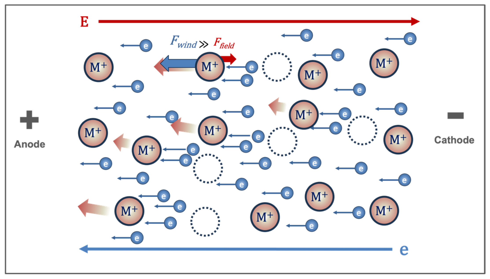

# 5.5. Device reliability: Interconnect reliability

Interconnect reliability는 금속 배선과 via가 사용 기간 동안 요구 전류를 전달하는 능력을 다룬다. 이 문서의 중심은 높은 전류 밀도에서 전자와 금속 원자 사이의 운동량 전달로 물질이 재분포하는 electromigration (EM)이다. EM은 원자 flux의 발산 위치에서 void 또는 hillock을 만들며, 각각 저항 증가·open과 인접선 short로 이어질 수 있다.[1–6,8]

공통 mission profile, censored data와 가속 수명 적합 규약은 [Device reliability: Overview](overview.md)와 [Device reliability: Reliability modeling](reliability-modeling.md)을 따른다. 이 글에서는 **구동력 → 원자 flux → back stress → void nucleation·growth → 전기적 고장**의 연결과 Cu dual-damascene 배선에 적용할 때의 경계를 다룬다.

## 1. Electromigration의 구동력

전기장 속 금속 이온에는 직접 electrostatic force와 전자가 전달하는 electron-wind force가 작용한다. 일반적인 금속 배선에서는 유효 전하수 $Z^*$로 두 효과를 합쳐 원자당 전기적 구동력을

$$
F_\mathrm{EM}=Z^*e\rho J
$$

로 나타낼 수 있다. $e$는 기본전하, $\rho$는 비저항, $J$는 conventional current density이다. $Z^*$의 부호와 좌표 규약에 따라 flux 식의 부호가 달라지므로, 실험에서는 전자 흐름과 conventional current 방향을 함께 표시한다.[1–6,8]

<figure markdown="span">
  
  <figcaption markdown="1">
    그림 1. 금속 배선에서 전기장, 전자 흐름과 electron-wind force에 의한 금속 이온 이동의 개념도. 그림의 방향은 conventional current와 전자 흐름을 구분해 읽어야 한다.
    출처: P. Cheng et al., “Electromigration Failures in Integrated Circuits: A Review of Physics-Based Models and Analytical Methods,” Figure 2 (2025),
    <a href="https://doi.org/10.3390/electronics14153151">DOI</a>,
    <a href="https://creativecommons.org/licenses/by/4.0/">CC BY 4.0</a>, 수정 없음.[6]
  </figcaption>
</figure>

EM은 전자가 원자를 한 번 충돌해 밀어내는 단일 사건이 아니라, 열적으로 활성화된 확산에 전기적 편향이 더해진 순 물질 이동이다. 따라서 같은 $J$에서도 원자가 이동하는 계면·grain boundary·표면의 확산계수와 온도가 다르면 flux가 달라진다. Cu 배선에서는 Cu/cap 계면이 지배적인 빠른 경로가 될 수 있지만, 결정립 구조와 liner·cap 재료가 바뀌면 우세 경로도 달라진다.[2,5,6,8]

| 물리 단계 | 주 구동량 | 대표 관측 | 수명 해석에서의 역할 |
| --- | --- | --- | --- |
| 원자 이동 | $Z^*e\rho J$, $D(T)$ | 직접 관측이 어려움 | 물질 재분포 속도를 결정 |
| 응력 축적 | $\partial\sigma/\partial x$ | 응력 측정·모형 | EM flux를 막는 back stress 형성 |
| Void nucleation | 임계 인장응력·기존 약점 | 초기에는 저항 변화가 작을 수 있음 | incubation time을 결정 |
| Void growth·migration | 유입 vacancy flux와 국소 전류 집중 | $R(t)$ 증가·fluctuation | 전기적 고장 기준까지의 시간을 결정 |
| Hillock·extrusion | 압축응력과 물질 축적 | 표면 돌출·인접선 누설 | short 또는 절연막 손상 가능 |

## 2. 원자 flux와 응력

등온 1차원 근사에서 $+x$를 conventional current 방향으로 두면 원자 flux $J_a$는 전기적 구동력과 hydrostatic stress $\sigma$의 기울기를 포함하여

$$
J_a
=-\frac{DC}{kT}
\left(
Z^*e\rho J-\Omega\frac{\partial\sigma}{\partial x}
\right)
$$

처럼 쓸 수 있다. $D$는 유효 확산계수, $C$는 이동 가능한 원자 농도, $\Omega$는 원자 부피이다. 첫 항은 EM을 구동하고, 둘째 항은 물질 축적·고갈로 생긴 back stress가 flux에 대항하는 효과를 나타낸다. 이 부호는 선택한 $Z^*$와 응력 규약에 종속되며, 물리적으로 중요한 조건은 두 구동력이 서로 상쇄될 수 있다는 점이다.[2–6,8]

국소적인 원자 수 변화는 flux divergence에 의해 정해진다.

$$
\frac{\partial C}{\partial t}=-\nabla\cdot J_a
$$

Flux가 공간적으로 일정하면 원자가 이동하더라도 그 구간에 즉시 void가 생기지 않는다. 재료 경계, via, 배선 폭 변화, grain boundary와 온도 구배처럼 flux가 불연속적으로 변하는 위치가 void nucleation과 물질 축적의 취약점이 된다.[2–6,8]

구속된 균일 배선에서 $D$, $\rho$, $J$와 유효 탄성계수 $B$를 위치에 무관한 값으로 근사하면 Korhonen equation은

$$
\frac{\partial\sigma}{\partial t}
=
\frac{\partial}{\partial x}
\left[
\frac{DB\Omega}{kT}
\left(
\frac{\partial\sigma}{\partial x}
-\frac{Z^*e\rho J}{\Omega}
\right)
\right]
$$

으로 쓸 수 있다. Blocking boundary에서는 원자 flux가 0이므로 시간이 충분히 지나면 $\partial\sigma/\partial x=Z^*e\rho J/\Omega$인 정상 응력 기울기가 EM 구동력을 상쇄한다. 실제 배선망에서는 재료 경계와 junction마다 $D$, $B$, 단면적과 flux 연속 조건이 달라지므로, 이 1차원 식의 단일 선분 해를 그대로 전체 전력망에 적용하지 않는다.[3–6,8]

### (1) 확산 경로와 형상

유효 확산계수는 lattice, grain boundary, 계면과 표면 경로의 기여를 포함하며 보통 제한된 온도 범위에서 $D=D_0\exp(-E_D/kT)$로 나타낸다. 어느 경로가 지배하는지는 금속 재료, 결정립 크기, liner·cap 계면과 온도에 따라 달라진다. 따라서 적합한 $E_D$ 또는 Black 모형의 $E_a$는 해당 구조에서 우세한 경로를 반영하는 유효값이며, 다른 배선 적층이나 선폭에 그대로 적용할 수 없다.[2,5,6,8]

Current crowding은 via 모서리와 폭이 급변하는 구간에서 국소 $J$를 평균값보다 크게 만든다. Joule heating은 동시에 국소 온도를 높여 확산을 빠르게 하므로, 설계 전류를 단면적으로 나눈 값과 chuck 온도만으로 수명을 계산하면 위험 지점을 놓칠 수 있다.[2,5–9]

!!! warning "[Interpretation Caveat]"
    위 flux와 Korhonen 식은 등온 단일상 금속의 1차원 근사이다. 큰 온도 구배가 있으면 thermomigration 항이, 농도·조성 구배가 있으면 화학퍼텐셜 항이 추가된다. 측정된 물질 이동을 모두 $Z^*e\rho J$ 하나로 적합하면 EM과 다른 구동력을 잘못 합칠 수 있다.[2,5,6,8]

## 3. Black 모형과 Blech criterion

Black’s equation은 일정한 전류 밀도와 온도에서 평균 또는 characteristic failure time을

$$
t_f=AJ^{-n}\exp\left(\frac{E_a}{kT}\right)
$$

로 나타내는 경험 모형이다. $A$는 재료·형상·고장 기준을 포함한 계수, $n$은 current exponent, $E_a$는 유효 활성화 에너지이다. 로그를 취하면

$$
\ln t_f
=
\ln A-n\ln J+\frac{E_a}{kT}
$$

이므로 여러 $J$와 $T$ 셀을 함께 적합할 수 있다. 그러나 이 식은 시험 범위의 축약적 상관관계이며 void nucleation 위치, 응력 경계와 짧은 배선 효과를 명시적으로 풀지 않는다. $n>1$을 Joule heating 하나로만 해석할 수도 없으므로 실제 금속 온도와 고장 단계를 확인한다.[1,2,5,6,8,9]

EM 고장 시간은 개념적으로

$$
t_f=t_\mathrm{nuc}+t_\mathrm{grow}
$$

로 나눌 수 있다. $t_\mathrm{nuc}$는 임계 인장응력 또는 기존 약점에서 void가 형성될 때까지의 시간이고, $t_\mathrm{grow}$는 그 void가 저항 임계값이나 open에 도달할 때까지의 시간이다. 두 성분의 상대 크기와 $J$, $T$ 의존성이 다를 수 있으므로, 하나의 Black 계수는 시험 구조와 고장 기준이 바뀌면 달라질 수 있다.[2,5,6,8,9]

짧고 기계적으로 구속된 배선에서는 원자 이동이 만든 back stress가 EM 구동력과 균형을 이룰 수 있다. 이상화한 Blech criterion은

$$
|J|L\le (JL)_\mathrm{crit}
\approx\frac{\Omega\,\Delta\sigma_\mathrm{crit}}
{|Z^*|e\rho}
$$

처럼 나타낸다. $L$은 유효 배선 길이, $\Delta\sigma_\mathrm{crit}$는 void nucleation 또는 재료 항복 전에 허용되는 응력 차이다. 임계 $JL$ 아래에서 “완전한 면역”이라고 단정하려면 blocking boundary, 초기 응력, 균일 단면과 단일 확산 경로라는 가정을 확인해야 한다.[3–6,8]

Korhonen 모형은 구속된 배선의 응력 진화를 확산 방정식으로 풀어 시간과 위치에 따른 $\sigma(x,t)$를 예측한다. 이 접근은 Black 모형이 숨긴 길이, 경계 조건과 back-stress 형성을 명시하지만, 재료 매개변수와 void nucleation 기준이 필요하다.[4–6,8]

| 모형 | 직접 나타내는 양 | 필요한 입력 | 주요 한계 |
| --- | --- | --- | --- |
| Black’s equation | 경험적 $t_f(J,T)$ | $A$, $n$, $E_a$, 고장 기준 | 형상·응력·고장 단계를 계수 안에 포함 |
| Blech criterion | 정상상태의 임계 $JL$ | $Z^*$, $\rho$, $\Omega$, 허용 응력 | Blocking된 균일 짧은 선분 가정 |
| Korhonen equation | $\sigma(x,t)$의 과도 응답 | $D$, $B$, $\Omega$, 경계·초기 조건 | Void 생성·성장에는 별도 기준 필요 |
| Nucleation–growth 모형 | $t_\mathrm{nuc}$와 $t_\mathrm{grow}$ | 임계 응력, void 형상·flux | 고장 위치와 성장 기하를 먼저 정해야 함 |

## 4. 시험과 고장 판정

!!! info "[Measurement]"
    1. 배선 폭·두께·길이, via 수와 위치, 금속·liner·cap·절연막 적층, 전자 흐름과 conventional current 방향을 기록한다. Upstream·downstream 같은 구조 명칭만 쓰지 말고 전류 방향을 도면과 함께 정의한다.
    2. Kelvin 또는 four-terminal 구조에서 목표 온도의 초기 저항 $R_0$를 측정한다. 낮은 판독 전류로 저항의 온도계수 또는 독립 열 모형을 보정한다.
    3. 여러 $(J,T)$ 셀에서 정해진 직류 또는 펄스 파형을 인가하고 $R(t)$를 주기적으로 판독한다. 실제 전류, sampling interval, compliance와 시험 중단 조건을 저장한다.
    4. 저항 임계값에 의한 고장 시간을

    $$
    t_f=\inf\left\{t:\frac{R(t)-R_0}{R_0}\ge\delta R_\mathrm{crit}\right\}
    $$

    로 구한다. $\delta R_\mathrm{crit}$와 완전 open을 서로 다른 고장 기준으로 보존한다.
    5. 시험 뒤 focused ion beam (FIB), scanning electron microscopy (SEM) 또는 적절한 단면 분석으로 void·hillock 위치, via open과 고장 경로를 확인한다.[1,2,5–9]

정상상태의 집중 열 근사에서는 금속 온도를

$$
T_\mathrm{line}
\approx
T_\mathrm{ambient}+R_\mathrm{th}I^2R
$$

로 나타낼 수 있다. $R_\mathrm{th}$는 시험 구조에서 방열 경로를 모은 열저항이다. 이 식은 온도 보정의 최소 모형이며, via 모서리의 국소 hot spot이나 과도 열응답을 직접 주지 않는다. 여러 $J$와 $T_\mathrm{line}$ 셀에서 얻은 $t_f$ 분포로 $n$과 $E_a$를 적합하고, 보정 전후 계수도 비교한다.[2,5–9]

!!! note "[Metric]"
    저항 임계값 수명과 완전 open 수명은 같은 분포가 아닐 수 있다. 평균 time to failure만 보고하지 말고 표본 수, censored 수, 선택한 Weibull 또는 lognormal 분포와 매개변수, $t_{50}$ 같은 분위수와 신뢰구간을 제시한다. 배선 폭·두께·길이, via 수, 전류 방향, $J$, $T_\mathrm{line}$, $\delta R_\mathrm{crit}$와 물리적 고장 위치도 함께 보고한다.[1,2,5–9]

저항은 void의 존재보다 전류 경로가 얼마나 좁아졌는지에 민감하다. 작은 void는 전기적으로 거의 보이지 않을 수 있고, void가 via 단면이나 배선 폭을 막기 시작하면 current crowding과 Joule heating이 함께 증가해 $R(t)$가 급격히 변할 수 있다. 따라서 $R(t)$의 첫 변화 시각을 항상 $t_\mathrm{nuc}$로, 저항 변화량을 void 부피로 직접 대응시키지 않는다.[2,5,6,8]

| 시험 자료 | 추출량 | 반드시 고정하거나 기록할 조건 | 해석상의 주의점 |
| --- | --- | --- | --- |
| $R(t)$ | $t_f$, 저항 증가율 | 판독 전류·간격, 온도, 임계값 | Void 형상과 위치에 따라 민감도가 다름 |
| 여러 $J$ 셀 | current exponent $n$ | 실제 $T_\mathrm{line}$, 동일 고장 모드 | Joule heating과 모드 전환이 $n$을 바꿀 수 있음 |
| 여러 $T$ 셀 | 유효 $E_a$ | 동일 $J$, 온도 보정, 적합 구간 | 우세 확산 경로가 바뀌면 단일 Arrhenius가 깨짐 |
| 길이·폭 소자군 | $(JL)_\mathrm{crit}$, 형상 효과 | 단면·경계·via 구조 | 단순 면적 scaling으로 환원되지 않음 |
| 사후 단면 분석 | nucleation·고장 위치 | 전류 방향과 구조 좌표 | 전기적 분포와 물리적 모드를 연결해야 함 |

## 5. 실제 배선에서의 해석

### (1) Via와 배선망의 형상

Cu dual-damascene 구조에서는 via가 원자 이동을 막는 경계가 되는 동시에, 전류가 수직·수평 방향으로 꺾이는 current-crowding 위치가 된다. Cu/cap 계면의 빠른 확산 경로, via 아래의 liner와 기존 계면 결함이 결합하면 같은 평균 $J$에서도 전자 흐름 방향과 via-above·via-below 배치에 따라 void 위치와 저항 파형이 달라질 수 있다.[2,6–8]

분기된 배선망에서는 각 선분의 flux가 junction에서 보존되어야 한다. 한 선분의 $JL$만 임계값 아래라고 해서 연결된 tree 전체가 안전한 것은 아니며, 서로 다른 단면·확산계수·전류 방향을 갖는 선분이 junction의 응력 축적과 reservoir 효과를 함께 결정한다.[4–6,8]

### (2) 동적 전류와 통계적 혼합

직류 가속 시험의 $J$를 회로의 평균 전류로 단순 대체하면 양방향 전류, duty cycle과 열 시정수를 놓칠 수 있다. 원자 이동의 방향성과 $T_\mathrm{line}(t)$를 포함한 파형으로 등가 스트레스를 계산해야 하며, 완전한 전류 반전이 언제나 손상을 상쇄하거나 idle 구간이 언제나 응력을 회복시킨다고 가정하지 않는다.[2,6–8]

한 Cu dual-damascene 시험 구조에서는 alternating current (AC) 선행 스트레스와 열·직류 cycling 뒤의 순 직류 고장 시간이 연속 직류 대조군과 통계적으로 비슷했고, 수명에는 순 직류 스트레스 시간이 지배적으로 반영되었다. 이는 해당 구조와 시험 범위에서 직류 가속 시험의 유효성을 지지하지만, 다른 주파수·비대칭 파형·재료·배선망에 보편적인 recovery 법칙을 제공하지는 않는다.[6–8]

공정 약점에 의한 early mode와 구조 고유의 late mode가 함께 있으면 하나의 lognormal 또는 Weibull 직선으로 전체 분포를 강제하지 않는다. 저항 파형과 사후 고장 위치를 이용해 모집단을 물리적으로 분리한 뒤 각 모드의 $n$, $E_a$와 분위수를 적합한다.[2,5,6,8]

!!! warning "[Interpretation Caveat]"
    저항 증가는 EM void 외에도 contact 열화, 계면 반응과 측정 온도 변화에서 생길 수 있다. 반대로 국소 void가 병렬 전류 경로 때문에 초기 저항에 작게 나타날 수도 있다. 전기적 수명 분포와 물리적 고장 위치를 연결한다.[2,5–8]

EM은 배선 신뢰성의 전부가 아니다. Stress migration, thermomigration, time-dependent dielectric breakdown (TDDB) of low-$k$ dielectrics와 package-induced mechanical stress도 배선층 고장을 만들 수 있다. 이 문서의 Black·Blech 식은 그 현상들을 자동으로 포함하지 않는다.[2,5–8]

| 메커니즘 | 주 구동력 | EM과 구분할 대조 조건 | 대표 고장 |
| --- | --- | --- | --- |
| Electromigration | 방향성을 가진 큰 전류 밀도 | 전류 방향 반전·무전류 열 대조 | void, hillock, open·short |
| Stress migration | 열·공정 잔류응력의 완화 | 같은 온도의 무전류 보관 | via·line 부근 void |
| Thermomigration | 온도 구배 | 같은 평균 온도에서 구배 변화 | 고온·저온 방향의 물질 이동 |
| Low-$k$ TDDB | 배선 사이 전기장과 절연막 결함 | 금속 전류 없이 배선 간 전압 인가 | 누설 증가·절연 파괴 |

## 6. 요약

- EM은 전류가 구동하는 원자 이동이며, 고장은 원자 flux 자체보다 flux divergence가 큰 위치에서 시작한다.
- Back stress는 EM flux에 대항하며, 구속된 짧은 배선에서 Blech의 임계 $JL$ 거동과 Korhonen 응력 진화를 만든다.
- 수명은 $t_\mathrm{nuc}$와 $t_\mathrm{grow}$의 합이며, Black’s equation의 $n$과 $E_a$는 고장 모드·구조·판정 기준에 종속된다.
- 수명 시험에는 국소 전류 집중, 실제 금속 온도, 저항 임계값, 분포 모형과 물리적 고장 위치를 함께 포함한다.
- Via와 분기 배선에서는 단일 선분의 평균 $J$나 $JL$만으로 전체 배선망 수명을 판단하지 않는다.

## 7. 참고문헌

1. J. R. Black, “Electromigration—A Brief Survey and Some Recent Results,” *IEEE Transactions on Electron Devices* **16**, 338–347 (1969). [DOI](https://doi.org/10.1109/T-ED.1969.16754)
2. J. R. Lloyd, “Electromigration in Integrated Circuit Conductors,” *Journal of Physics D: Applied Physics* **32**, R109–R118 (1999). [DOI](https://doi.org/10.1088/0022-3727/32/17/201)
3. I. A. Blech, “Electromigration in Thin Aluminum Films on Titanium Nitride,” *Journal of Applied Physics* **47**, 1203–1208 (1976). [DOI](https://doi.org/10.1063/1.322842)
4. M. A. Korhonen, P. Borgesen, K. N. Tu, and C. Y. Li, “Stress Evolution Due to Electromigration in Confined Metal Lines,” *Journal of Applied Physics* **73**, 3790–3799 (1993). [DOI](https://doi.org/10.1063/1.354073)
5. M. White and J. B. Bernstein, *Microelectronics Reliability: Physics-of-Failure Based Modeling and Lifetime Evaluation*, JPL Publication 08-5, Jet Propulsion Laboratory (2008). [PDF](https://nepp.nasa.gov/files/16365/08_102_4_%20JPL_White.pdf)
6. P. Cheng, L.-F. Mao, W.-H. Shen, and Y.-L. Yan, “Electromigration Failures in Integrated Circuits: A Review of Physics-Based Models and Analytical Methods,” *Electronics* **14**, 3151 (2025). [DOI](https://doi.org/10.3390/electronics14153151)
7. R. R. Keller, D. T. Read, R. Shaviv, G. Harm, and S. Kumari, “Electromigration of Cu Interconnects Under AC, Pulsed-DC and DC Test Conditions—Ramifications on Accelerated Testing,” *2011 IEEE International Reliability Physics Symposium*, EM.3.1–EM.3.6 (2011). [NIST PDF](https://tsapps.nist.gov/publication/get_pdf.cfm?pub_id=907877)
8. C. S. Hau-Riege, “An Introduction to Cu Electromigration,” *Microelectronics Reliability* **44**, 195–205 (2004). [DOI](https://doi.org/10.1016/j.microrel.2003.10.020)
9. A. S. Budiman et al., “Electromigration-Induced Plastic Deformation in Cu Interconnects: Effects on Current Density Exponent, n, and Implications for EM Reliability Assessment,” *Journal of Electronic Materials* **39**, 2483–2488 (2010). [DOI](https://doi.org/10.1007/s11664-010-1356-4)
