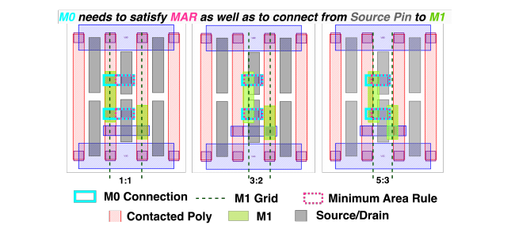

# Logic technology: Logic DTCO

Design–technology co-optimization (DTCO)은 공정과 소자를 먼저 확정한 뒤 회로를 구현하는 일방향 전달이 아니라, **공정 규칙·소자 구조·standard-cell architecture·block 구현 결과를 반복적으로 연결하여 기술 선택을 평가하는 방법**이다. Logic DTCO의 핵심 질문은 단일 transistor의 $I_\mathrm{ON}$이나 최소 pitch가 얼마나 개선되었는지가 아니라, 그 변화가 검증 가능한 cell library와 routed block의 power–performance–area (PPA) 및 배선 가능성으로 얼마나 보존되는가이다.[1–4]

이 글은 [Standard-cell architecture](standard-cell-architecture.md)에서 정의한 cell height, routing track, diffusion sharing과 pin access를 입력으로 삼는다. 여기서는 contacted gate pitch (CPP), metal pitch와 cell height의 결합, FinFET·gate-all-around (GAA) nanosheet·complementary FET (CFET)가 layout에 주는 제약, design rule을 포함한 PPA 평가 및 process–device–cell–block 계층의 반복 최적화를 다룬다. 개별 공정의 양산 recipe, 아날로그 회로, 메모리 bit cell과 package-level system technology co-optimization (STCO)은 범위에서 제외한다.

기술 선택 변수를 벡터 $\boldsymbol{\theta}$, 평가할 논리 block과 동작 조건을 각각 $\mathcal{B}$와 $\mathcal{C}$로 쓰면 DTCO의 전달 관계를

$$
\mathbf{y}
=
\mathcal{F}
\left(
\boldsymbol{\theta};
\mathcal{B},\mathcal{C}
\right),
\qquad
\mathbf{y}
=
\left(
P,\ t_\mathrm{crit},\ A_\mathrm{core},\
N_\mathrm{DRV},\ V_\mathrm{IR},\ldots
\right)
$$

로 나타낼 수 있다. $\mathcal{F}$는 compact model 생성, cell layout·characterization, 합성, 배치와 배선을 포함한 평가 flow이고, $P$, $t_\mathrm{crit}$, $A_\mathrm{core}$, $N_\mathrm{DRV}$와 $V_\mathrm{IR}$은 각각 전력, 임계 경로 지연, core 면적, detailed-routing violation 수와 IR drop이다. 이 식은 닫힌 해가 아니라 **입력 기술 가정이 최종 설계 지표로 변환되는 계산 사슬**을 뜻한다.[2–5]

## 1. DTCO의 범위와 계층

### (1) 순차 전달과 closed loop

전통적인 순차 흐름에서는 process design kit (PDK)가 고정된 뒤 device model, library와 block 구현이 차례로 만들어진다. 이 방식은 하위 계층에서 발견된 문제를 상위 계층의 변수로 되돌리기 어렵다. DTCO에서는 후보 공정마다 design rule과 기생 성분을 만들고, representative cell과 block을 구현한 결과를 다시 device·process 선택에 반영한다. 따라서 “최소 치수를 만족하는가”와 “목표 block이 합법적으로 배치·배선되는가”가 같은 반복 안에서 평가된다.[2–4,6]

| 계층 | 대표 입력 변수 | 생성하거나 측정하는 결과 | 다음 반복으로 되돌리는 실패 신호 |
| --- | --- | --- | --- |
| Process | CPP, fin·sheet pitch, contact·via·metal rule, BEOL stack | PDK, 저항·정전용량과 변동 가정 | 공정성 저하, 지나친 via enclosure, 불가능한 cut·spacing |
| Device | $L_G$, EOT, fin·sheet 수와 폭, contact 구조 | $I$–$V$, $C$–$V$, compact model, 변동·열 특성 | 구동 전류 부족, 큰 기생 성분, 변동성과 self-heating |
| Cell | height, track, transistor ordering, pin·rail topology | DRC/LVS-clean layout, timing·power library | cell width 증가, pin access 부족, library coverage 부족 |
| Block | RTL, clock, utilization, floorplan, routing stack | routed PPA, violation, IR drop와 congestion | route closure 실패, buffer·wire 증가, 면적 이득 소실 |

DTCO가 모든 설계 자유도를 한 번에 최적화한다는 뜻은 아니다. 탐색 공간은 target product와 성숙한 공정 모듈에 따라 제한된다. 예를 들어 CPP와 lower-metal pitch를 바꾸면서 transistor 재료, microarchitecture와 package까지 동시에 바꾸면 어떤 변수가 결과를 만들었는지 분리하기 어렵고 평가 비용도 급격히 증가한다. 따라서 한 번의 study에서는 baseline, 변경 변수, 고정 조건과 허용 규칙을 명시해야 한다.[1–4]

### (2) Logic DTCO와 STCO의 경계

Logic DTCO는 주로 process–device–cell–block의 연결을 다룬다. STCO는 여기에 chiplet, 3D integration, memory hierarchy, architecture와 workload mapping 같은 시스템 변수를 더한다. 두 용어의 경계는 문헌과 조직에 따라 달라질 수 있으므로, 이 글에서는 **하나의 logic process와 standard-cell 기반 block 내부까지**를 DTCO 범위로 정한다. CFET처럼 수직 적층 소자를 다루더라도 package나 die stacking을 최적화하지 않으면 이 글의 DTCO 범위에 남는다.[5–7]

## 2. Pitch 결합과 cell geometry

### (1) CPP, metal pitch와 cell height

CPP는 인접 contacted gate column 사이의 반복 거리이고, lower-metal pitch는 인접 배선 track 사이의 반복 거리이다. 단순화된 gridded layout에서 cell width와 height는

$$
W_\mathrm{cell}
\simeq
N_\mathrm{CPP}p_\mathrm{CPP},
\qquad
H_\mathrm{cell}
\simeq
N_\mathrm{trk}p_\mathrm{trk}
$$

로 쓸 수 있다. $N_\mathrm{CPP}$는 cell이 차지하는 gate-pitch column 수, $N_\mathrm{trk}$는 기준 수평 배선 track 수이다. 실제 cell에는 boundary, diffusion break, gate cut와 power rail이 들어가므로 이 식은 면적 양자화의 기준일 뿐 완성 layout의 치수식은 아니다.[1–4]

CPP 축소는 같은 $N_\mathrm{CPP}$에서 cell width를 줄일 수 있지만 source/drain contact, gate-to-contact spacing, 기생 저항과 공정 변동이 허용해야 한다. Metal pitch 축소는 단위 폭당 배선 자원을 늘릴 수 있지만 line·via 저항, minimum area, enclosure와 tip-to-tip rule을 만족해야 한다. Cell height를 낮추면 면적은 줄어도 transistor 구동 폭과 pin-access 후보가 함께 감소할 수 있다. 이 때문에 세 pitch를 동일 비율로 줄이는 geometric shrink가 최적이라는 보장은 없다.[1–4,8]

### (2) Gear ratio와 grid phase

이 글에서는 contacted gate와 가장 낮은 수직 신호 metal의 pitch 비를

$$
G
=
\frac{p_\mathrm{CPP}}{p_\mathrm{M1}}
$$

로 정의한다. 문헌에는 $p_\mathrm{M1}:p_\mathrm{CPP}$ 순서로 같은 비를 표기하는 경우도 있으므로 숫자만 비교하지 말고 정의를 확인해야 한다. $G>1$이면 gate column 하나당 M1 track이 더 조밀할 수 있지만, local cell grid와 global row grid의 phase가 항상 맞는 것은 아니다.[1,2]

<figure markdown="span">
  
  <figcaption markdown="1">
    그림 1. $G=1{:}1$, $3{:}2$, $5{:}3$에서 INV_X2의 contacted poly와 M1 grid 비교. M1 track이 조밀해지면 후보 배선 위치는 늘지만, source pin을 M1에 연결하는 M0 형상은 minimum-area rule을 만족하도록 달라진다. 원 논문의 Figure 1에서 발췌했다.
    출처: C.-K. Cheng et al., “Gear-Ratio-Aware Standard Cell Layout Framework for DTCO Exploration,” Figure 1 (2023),
    <a href="https://doi.org/10.1145/3632409.3640475">DOI</a>,
    <a href="https://creativecommons.org/licenses/by/4.0/">CC BY 4.0</a>, Figure 1 영역만 crop.[2]
  </figcaption>
</figure>

Cell $i$가 허용된 global column에 놓일 수 있는 비율을 placement legality의 한 지표로

$$
f_{\mathrm{legal},i}
=
\frac{N_{\mathrm{legal\ columns},i}}
{N_{\mathrm{candidate\ columns},i}}
$$

로 정의할 수 있다. Non-unity gear ratio에서는 cell 폭의 parity, M1 offset과 mirror variant에 따라 $f_{\mathrm{legal},i}<1$이 될 수 있다. M1 track 수가 늘어도 legality가 낮아져 cell이 이동하거나 wire가 우회하면 block의 capacitance, delay와 area가 악화될 수 있다. 따라서 gear ratio는 pitch 비뿐 아니라 **offset variant, abutment와 placement grid**를 포함해 평가해야 한다.[1,2]

### (3) Design rule과 유효 pitch

Nominal pitch가 같아도 minimum area, end-of-line spacing, via enclosure, parallel-run-length rule과 cut mask가 다르면 실제 사용할 수 있는 track 수가 달라진다. Pin 위에 via를 놓을 수 없는 track은 routing resource로 세기 어렵고, 작은 metal 형상을 minimum area까지 늘리면 인접 pin을 막을 수 있다. 따라서 유효 배선 자원은

$$
N_\mathrm{eff}
\le
N_\mathrm{geometric}
$$

이며 등호는 모든 기하 track이 target cell과 이웃 조건에서 합법적인 access를 가질 때에만 성립한다. Figure 1에서 gear ratio에 따라 M0 형상이 달라지는 이유도 pitch만이 아니라 minimum-area와 via 연결 조건이 함께 작동하기 때문이다.[1–4]

## 3. 소자 구조와 standard cell의 연결

### (1) FinFET

FinFET의 구동 폭은 fin 수의 정수 단위로 변한다. Cell height를 낮추어 한 transistor의 fin 수를 2개에서 1개로 줄이면 cell area는 작아질 수 있지만 구동력, p/n 균형과 process variation 민감도가 불연속적으로 바뀐다. Fin pitch와 fin height는 단일 소자의 $I_\mathrm{ON}$뿐 아니라 source/drain contact 수, diffusion 공유와 rail 사이에 남는 routing track을 결정한다.[3,4,8]

따라서 FinFET DTCO에서는 $N_\mathrm{fin}$만 바꾸지 않고 cell height와 drive-strength family를 함께 다시 구성해야 한다. Fin 수를 줄여 낮아진 cell delay를 보상하려고 더 많은 buffer 또는 큰 cell을 사용하면 library-level area 이득이 block에서 사라질 수 있다.[3,4,8]

### (2) GAA nanosheet

GAA nanosheet는 sheet 수가 정수로 양자화되지만 sheet width를 조절하여 FinFET보다 구동 폭의 선택 범위를 넓힐 수 있다. 그러나 넓은 sheet 또는 많은 적층 수는 gate·junction capacitance, source/drain access resistance와 self-heating을 함께 바꾼다. Sheet stack의 수직 높이와 contact 구조는 cell height, MOL 배선과 power rail의 위치에도 제약을 준다.[5,8,9]

소자 수준에서는 같은 $I_\mathrm{OFF}$에서 $I_\mathrm{ON}$과 $C_{gg}$를 비교하고, cell 수준에서는 실제 fin·sheet 조합으로 inverter와 stacked gate를 layout하여 extracted $R$·$C$를 포함한 delay와 energy를 비교해야 한다. Sheet width의 연속성만 보고 planar MOSFET처럼 자유로운 sizing을 가정하면 contact와 cell grid의 양자화를 놓친다.[3–5,8,9]

### (3) CFET

CFET는 nFET과 pFET을 수직으로 쌓아 lateral p/n separation을 줄인다. 이 구조는 pull-up network와 pull-down network의 source/drain을 수직 local interconnect로 연결하여 cell 내부 M1 사용과 footprint를 줄일 가능성이 있다. 반면 위·아래 source/drain access, 공통 또는 분리 gate, pin opening, power rail과 열 경로가 새로운 제약이 된다.[5–7]

특히 공통 gate를 사용하는 monolithic CFET에서는 transmission gate처럼 nFET과 pFET의 gate를 서로 다른 신호로 구동해야 하는 cell이 불리할 수 있다. Dummy gate나 추가 CPP가 필요하면 단순 inverter에서 얻은 track-height 축소율이 sequential cell 전체에 동일하게 적용되지 않는다. 낮은-track CFET library의 pin density와 wirelength가 증가하면 BEOL stack을 함께 조정해야 cell-level 면적 이득을 block에서 회수할 수 있다.[5–7]

| 구조 | Cell 수준의 직접 이점 | 새로 강해지는 제약 | Block에서 확인할 결과 |
| --- | --- | --- | --- |
| FinFET | 수직 fin 둘레와 성숙한 row architecture | fin 수 양자화, 낮은 height에서 구동력 감소 | 큰 drive cell·buffer 비율, timing과 pin congestion |
| GAA nanosheet | sheet width와 적층 수에 의한 구동력 조절 | contact·inner spacer, 기생 성분과 열, sheet 수 양자화 | cell mix, extracted delay·power와 rail 접근 |
| CFET | p/n 수직 적층과 lateral separation 제거 | 두 층의 pin·contact, common-gate 제약, 열과 BEOL 자원 | sequential-cell penalty, utilization, wirelength와 upper-metal 사용 |

!!! warning "[Interpretation Caveat]"
    “FinFET → GAA → CFET” 순서를 자동적인 PPA 우열로 해석하지 않는다. 서로 다른 구조의 결과가 다른 CPP, metal stack, cell height, library richness 또는 target clock에서 얻어졌다면 소자 효과와 설계 조건이 섞여 있다. 같은 ground rule과 동일한 benchmark를 사용한 비교만 구조 변화의 직접 효과에 가깝다.[3–7]

## 4. Design rule과 library 생성

### (1) PDK의 두 역할

PDK는 합법·불법 geometry를 판정하는 design rule만 제공하지 않는다. 소자 compact model, layout-dependent effect, contact·interconnect resistance와 capacitance, extraction deck, reliability limit도 함께 제공한다. 같은 layout이 DRC-clean이어도 model과 extraction이 바뀌면 timing과 power가 달라질 수 있으므로 DTCO candidate는 **geometry와 electrical model이 일치하는 하나의 PDK snapshot**으로 관리해야 한다.[3,4,10]

Design rule은 hard constraint와 탐색 변수로 구분한다. Lithography 또는 reliability 때문에 반드시 지켜야 하는 rule을 임의로 완화하여 PPA를 얻으면 제조 가능한 candidate가 아니다. 반대로 아직 확정되지 않은 exploratory pitch와 enclosure는 허용 범위 안에서 parameter화하고, cell generator가 같은 논리 기능을 다시 합성하도록 해야 한다.[2–4]

### (2) Representative library와 coverage

Inverter와 NAND2만으로는 DTCO candidate의 실제 난도를 드러내기 어렵다. 최소 representative set에는 inverter·buffer, NAND/NOR, AOI/OAI, multiplexer, scan flip-flop, clock cell과 high-fanout variant가 포함되어야 한다. 복잡한 sequential cell은 transistor 수, internal pin과 clock topology가 많아 pin access와 gear-ratio phase 문제를 더 강하게 드러낸다.[2–4,6]

Library candidate $k$의 논리 coverage를 target 합성 결과에서

$$
C_{\mathrm{use},k}
=
\frac{\sum_{j\in\mathcal{L}_k}N_j}
{\sum_jN_j}
$$

로 정의할 수 있다. $\mathcal{L}_k$는 candidate에서 실제 사용할 수 있는 cell type 집합이고 $N_j$는 합성된 type $j$의 instance 수이다. $C_{\mathrm{use},k}$가 낮으면 합성기가 많은 논리를 inverter·NAND 조합으로 분해하므로 cell 하나의 작은 면적이 logic depth와 wire 증가로 상쇄될 수 있다. 그러므로 비교 후보는 기능과 drive-strength coverage를 가능한 한 맞춰야 한다.[2–4]

| 검증 단계 | 필수 검사 | 조기 탈락 조건의 예 |
| --- | --- | --- |
| Device model | $I$–$V$, $C$–$V$, PVT·변동·열 검증 | 목표 bias에서 model 불연속 또는 검증 범위 이탈 |
| Cell layout | DRC, LVS, extraction, abutment와 pin access | 핵심 cell 미생성, 반복적인 access failure |
| Characterization | timing arc, slew·load table, internal·leakage power | table 범위 부족, 비단조 arc 또는 극단적 p/n 비대칭 |
| Library integration | 합성 mapping, legal placement와 filler/tap/end-cap | coverage 부족, offset variant 누락 |
| Block implementation | route DRC, timing, power, IR drop와 density sweep | 목표 clock 또는 합법적인 route closure 실패 |

## 5. PPA와 routability 평가

### (1) Cell-level 지표

Cell 수준에서는 동일한 PVT, input slew와 output load에서 area, delay, transition, input capacitance, leakage와 switching energy를 비교한다. Extracted cell delay의 1차 관계는

$$
t_\mathrm{cell}
\sim
\left(
R_\mathrm{dev}+R_\mathrm{contact}+R_\mathrm{local}
\right)
\left(
C_\mathrm{int}+C_\mathrm{pin}+C_\mathrm{load}
\right)
$$

로 쓸 수 있다. 새 소자가 $R_\mathrm{dev}$를 줄여도 contact와 local interconnect 저항 또는 pin capacitance가 커지면 전체 delay 이득은 작아진다. 이 식은 분포 RC와 비선형 전류를 lumped element로 축약한 경향식이므로 최종 timing은 extracted netlist characterization으로 얻어야 한다.[3–5,8]

Cell 면적 최소화, delay 최소화와 pin-access 최대화는 서로 다른 목적이다. 따라서 candidate 하나를 고르는 문제는 일반적으로

$$
\min_{\boldsymbol{\theta}}
\left[
P(\boldsymbol{\theta}),
\ t_\mathrm{crit}(\boldsymbol{\theta}),
\ A_\mathrm{core}(\boldsymbol{\theta}),
\ N_\mathrm{DRV}(\boldsymbol{\theta})
\right]
$$

와 같은 multi-objective problem이다. 한 candidate가 모든 목적에서 다른 candidate보다 나쁘지 않고 하나 이상에서 더 좋을 때 Pareto-dominant라고 할 수 있다. 가중합을 사용한다면 가중치는 target product와 constraint에 의존하므로 함께 보고해야 한다.[2–5]

### (2) Block-level closure

Cell-level 결과는 같은 RTL, synthesis constraint, floorplan, routing layer, clock target와 analysis corner를 사용한 block 구현으로 전달해야 한다. Core area는 cell 면적 합만이 아니라 배치 가능한 utilization $U$에 의해

$$
A_\mathrm{core}
\gtrsim
\frac{\sum_jN_jA_j}{U}
$$

로 제한된다. 낮은 cell height가 pin density를 높여 route closure 가능한 $U$를 낮추면, $\sum_jN_jA_j$가 줄어도 최종 $A_\mathrm{core}$ 이득은 작아질 수 있다.[1–6]

Wirelength는 core 크기와 함께 변하므로 서로 다른 면적의 block을 비교할 때

$$
L_\mathrm{norm}
=
\frac{L_\mathrm{wire}}
{\sqrt{A_\mathrm{core}}}
$$

처럼 선형 크기로 정규화한 보조 지표를 사용할 수 있다. 그러나 net 수와 topology가 바뀌면 이 값도 완전한 배선 난도 지표가 아니다. Routed wirelength, layer별 사용량, via 수, global·detailed-routing congestion, $N_\mathrm{DRV}$와 detour를 함께 확인해야 한다.[2,5]

!!! info "[Measurement]"
    각 candidate에 대해 같은 benchmark RTL과 기능 constraint를 사용하여 합성한다. 같은 clock target, die aspect ratio, allowed routing layer와 PVT에서 utilization을 단계적으로 높이며 placement와 detailed routing을 수행한다. 각 sweep에서 합법적인 design만 남기고 $A_\mathrm{core}$, total cell area, worst negative slack, total negative slack, 동적·누설 전력, wirelength, via 수, layer별 사용량, $N_\mathrm{DRV}$와 최대 IR drop을 기록한다.

    동일 성능 비교에서는 timing constraint를 만족하는 design끼리 area와 power를 비교하고, 동일 면적 비교에서는 같은 core boundary에서 achievable clock과 power를 비교한다. Seed와 tool version에 민감한 결과는 여러 seed의 중앙값과 범위를 보고한다. Candidate가 다른 operating voltage를 요구하면 iso-frequency 또는 iso-power 조건을 별도로 만들고 $V_{DD}$ 차이를 숨기지 않는다.[1–5]

!!! warning "[Interpretation Caveat]"
    Ring oscillator, FO4, 단일 cell area 또는 transistor density 하나로 DTCO 결과를 결론 내리지 않는다. 이 지표들은 빠른 screening에는 유용하지만 library coverage, logic mapping, placement legality, 배선 RC, clock tree와 power delivery를 포함하지 않는다. 특히 작은 cell이 block에서 더 작은 core를 보장하지 않는다는 결과가 gear-ratio와 CFET 연구에서 모두 관찰되었다.[1,2,5]

## 6. Process–device–cell–block closed loop

### (1) 반복 탐색 절차

Logic DTCO의 실용적인 loop는 다음 순서를 따른다.[2–6]

1. Baseline PDK와 target block, PPA constraint를 고정한다.
2. CPP, metal pitch, cell height, 소자 구조와 rail·pin topology의 제한된 candidate set을 만든다.
3. 각 candidate에 일관된 device model, parasitic deck과 design rule을 생성한다.
4. Representative cell을 layout하고 DRC/LVS, extraction과 characterization을 수행한다.
5. 기능·drive coverage가 맞는 library로 같은 RTL을 합성하고 utilization sweep을 포함한 place-and-route를 수행한다.
6. Pareto frontier와 실패 원인을 비교하여 상위 계층 변수로 feedback한다.
7. Pin access failure이면 pin·gear ratio·offset을, timing이면 device/contact·cell sizing을, IR drop이면 rail·PDN·BEOL을 우선 수정한 뒤 반복한다.

| Block에서 관찰한 문제 | 직접 관찰량 | 먼저 되돌릴 계층 | 후보 수정 |
| --- | --- | --- | --- |
| Pin-access violation | 실패 pin, via rule, 이웃 cell과 metal layer | Cell·design rule | pin shape·offset variant, cell ordering, enclosure 또는 track |
| Congestion·detour | overflow, layer 사용량, wirelength·via | Cell·BEOL | height, pin density, adjacent orthogonal metal pitch |
| Timing failure | cell/net delay 분해, slew와 buffer | Device·cell·interconnect | $I_\mathrm{eff}/C$, contact $R$, drive mix, local RC |
| Dynamic power 증가 | switched capacitance, clock·buffer 비중 | Cell·block | pin capacitance, wirelength, mapping과 clock tree |
| IR drop·EM | rail current density, droop map | Rail·BEOL·cell | rail 위치·폭, via, backside/buried power와 tap spacing |

### (2) 두 대표적인 feedback

Gear-ratio study에서는 M1 pitch를 줄여 배선 후보를 늘려도 local–global grid alignment가 나빠지면 placement legality와 block PPA가 악화될 수 있었다. 반대로 offset variant와 design rule을 함께 조정하면 access와 배선 효율을 회복할 수 있다. 이는 metal pitch 축소에서 density 개선으로 가는 관계가 단방향이 아니라 pitch에서 cell grid, placement, wire와 PPA로 이어지는 loop임을 보여 준다.[1,2]

CFET study에서는 4-track cell의 library-level area 감소가 최소 routed core에서 그대로 보존되지 않았고, 더 조밀한 cell이 요구하는 wirelength와 upper-metal 자원이 원인이 되었다. 인접한 두 방향의 BEOL 자원을 함께 조정했을 때 일부 area 이득이 회복되었다. 이는 소자 수직 적층에서 cell height 감소로 끝나지 않고 pin density, routing stack과 achievable utilization을 함께 되돌려야 함을 보여 준다.[5–7]

이 두 사례에서 공통적인 물리량은 **usable routing resource**이다. 기하학적 track 수가 많아도 via가 놓이지 않거나 grid가 맞지 않으면 사용할 수 없고, cell 내부 M1이 비어도 높은 pin density가 upper metal의 우회를 늘릴 수 있다. 따라서 DTCO는 minimum pitch보다 legal access, placement와 routed resource를 우선적인 판정 기준으로 사용한다.[1,2,5–7]

## 7. 요약

- Logic DTCO는 process–device–cell–block을 순차 전달하는 방법이 아니라 routed PPA와 실패 원인을 상위 계층의 pitch·소자·design rule로 되돌리는 closed loop이다.
- CPP는 cell width, metal pitch와 track 수는 cell height 및 pin access를 제한하지만 세 치수를 동일 비율로 줄이는 것이 항상 최적은 아니다.
- Gear ratio는 routing track 수뿐 아니라 M1 offset, local–global grid phase, cell variant와 placement legality를 함께 결정한다.
- FinFET은 fin 수, GAA는 sheet 수·폭, CFET는 p/n 수직 적층과 contact·gate topology를 통해 standard-cell layout에 서로 다른 양자화와 배선 제약을 준다.
- Cell-level area와 delay 이득은 library coverage, achievable utilization, wirelength, violation와 IR drop을 포함한 block-level 평가를 통과해야 기술 이득으로 인정할 수 있다.
- DTCO candidate는 하나의 PDK snapshot 아래에서 DRC/LVS, extraction, characterization, synthesis와 place-and-route를 일관되게 수행하고 Pareto frontier로 비교해야 한다.

## 8. 참고문헌

1. Y. Ban, X. Zhu, J. Petykiewicz, and J. Zeng, “Improving Performance, Power, and Area by Optimizing Gear Ratio of Gate-Metal Pitches in Sub-10nm Node CMOS Designs,” *2018 IEEE Symposium on VLSI Technology*, 137–138 (2018). [DOI: 10.1109/VLSIT.2018.8510670](https://doi.org/10.1109/VLSIT.2018.8510670).
2. C.-K. Cheng, A. B. Kahng, B. Lin, Y. Wang, and D. Yoon, “Gear-Ratio-Aware Standard Cell Layout Framework for DTCO Exploration,” *2023 ACM International Workshop on System-Level Interconnect Pathfinding*, 1–10 (2023). [DOI: 10.1145/3632409.3640475](https://doi.org/10.1145/3632409.3640475).
3. V. Vashishtha, M. Vangala, and L. T. Clark, “ASAP7 Predictive Design Kit Development and Cell Design Technology Co-Optimization,” *2017 IEEE/ACM International Conference on Computer-Aided Design*, 992–998 (2017). [DOI: 10.1109/ICCAD.2017.8203889](https://doi.org/10.1109/ICCAD.2017.8203889).
4. X. Xu, N. Shah, A. Evans, S. Sinha, B. Cline, and G. Yeric, “Standard Cell Library Design and Optimization Methodology for ASAP7 PDK,” *2017 IEEE/ACM International Conference on Computer-Aided Design*, 999–1004 (2017). [DOI: 10.1109/ICCAD.2017.8203890](https://doi.org/10.1109/ICCAD.2017.8203890).
5. O. Zografos, B. Chehab, P. Schuddinck, G. Mirabelli, N. Kakarla, Y. Xiang, P. Weckx, and J. Ryckaert, “Design Enablement of CFET Devices for Sub-2nm CMOS Nodes,” *2022 Design, Automation & Test in Europe Conference & Exhibition*, 29–33 (2022). [DOI: 10.23919/DATE54114.2022.9774720](https://doi.org/10.23919/DATE54114.2022.9774720).
6. C.-K. Cheng, C.-T. Ho, D. Lee, and D. Park, “A Routability-Driven Complimentary-FET (CFET) Standard Cell Synthesis Framework Using SMT,” *2020 IEEE/ACM International Conference on Computer Aided Design*, 158:1–158:8 (2020). [DOI: 10.1145/3400302.3415611](https://doi.org/10.1145/3400302.3415611).
7. J. Wang et al., “Challenges and Opportunities for Stacked Transistor: DTCO and Device,” *2021 IEEE Symposium on VLSI Technology*, T15-4 (2021). [IBM Research record](https://research.ibm.com/publications/challenges-and-opportunities-for-stacked-transistor-dtco-and-device).
8. L. T. Clark et al., “ASAP7: A 7-nm FinFET Predictive Process Design Kit,” *Microelectronics Journal* **53**, 105–115 (2016). [DOI: 10.1016/j.mejo.2016.04.006](https://doi.org/10.1016/j.mejo.2016.04.006).
9. Y.-M. Lee et al., “Accurate Performance Evaluation for the Horizontal Nanosheet Standard-Cell Design Space Beyond 7nm Technology,” *2017 IEEE International Electron Devices Meeting*, 29.3.1–29.3.4 (2017). [DOI: 10.1109/IEDM.2017.8268474](https://doi.org/10.1109/IEDM.2017.8268474).
10. OpenROAD Project, “OpenROAD-flow-scripts.” [공식 문서](https://openroad-flow-scripts.readthedocs.io/).
