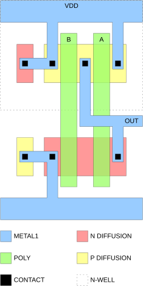

# Logic technology: Standard-cell architecture

Standard cell은 논리 또는 순차 기능을 transistor-level 회로와 물리 layout으로 미리 구현하고 검증한 반복 배치 단위이다. 같은 library의 셀은 공통 높이와 배치 격자를 사용하고, 폭은 논리 기능과 구동력에 따라 달라진다. 고정된 경계와 전원선 덕분에 셀을 행 단위로 맞대어 배치할 수 있지만, 가장 작은 셀을 그리는 것만으로는 충분하지 않다. 내부 transistor를 넣을 공간, 외부 배선기가 pin에 접근할 공간과 인접 셀의 design rule을 함께 만족해야 한다.[1–3]

이 글은 [Logic technology: CMOS](cmos.md)의 static CMOS network가 standard-cell layout으로 변환되는 과정을 다룬다. 범위는 cell height와 routing track, transistor folding과 fin·sheet 수, diffusion sharing, power rail과 signal pin, NAND·NOR·AOI·OAI layout, drive-strength variant 및 area–delay–power–routability 상충관계이다. 논리합성, 전체 배치·배선 알고리즘과 timing-library characterization은 범위에서 제외한다.

셀 높이와 폭은 각각 $H_\mathrm{cell}$과 $W_\mathrm{cell}$, 기준 배선층의 track pitch는 $p_\mathrm{trk}$, 수평 배치 site pitch는 $p_\mathrm{site}$로 쓴다. Track 수 $N_\mathrm{trk}$는 기준 metal layer가 명시될 때만 의미가 있으며 transistor의 fin·sheet 수나 실제 신호 배선에 사용 가능한 track 수와 같지 않다.[2–4]

## 1. Cell height와 routing track

Standard-cell row에서는 셀 높이가 공통이고 폭이 가변적이다. Cell height는 면적뿐 아니라 pMOS·nMOS에 배정할 수 있는 구동 폭, 전원선, 내부 배선과 외부 signal pin의 접근 공간을 동시에 제한한다. 따라서 track 수는 단순한 library 이름이 아니라 소자 pitch와 배선 pitch를 연결하는 architecture 변수이다.[1–4]

### (1) 높이와 폭의 격자

기준 배선층의 pitch로 높이를 정의하면

$$
H_\mathrm{cell}=N_\mathrm{trk}p_\mathrm{trk}
$$

로 쓸 수 있다. $N_\mathrm{trk}$는 6, 7.5, 9처럼 정수 또는 반정수일 수 있다. 반정수는 power rail 중심과 signal track의 상대 offset을 포함한 library convention이며 “절반짜리 배선”을 뜻하지 않는다. 위·아래 power rail과 금지 간격도 높이를 점유하므로 signal routing에 남는 track 수는 일반적으로 $N_\mathrm{trk}$보다 작다.[2–4]

수평 폭이 배치 site의 정수배로 양자화되면

$$
W_\mathrm{cell}=N_\mathrm{site}p_\mathrm{site},
\qquad
A_\mathrm{cell}=H_\mathrm{cell}W_\mathrm{cell}
$$

이다. Advanced-node library에서 $p_\mathrm{site}$는 contacted gate pitch (CPP) 또는 그 정수배와 연결될 수 있지만 모든 공정에서 같은 값은 아니다. Dummy gate, diffusion break와 boundary rule이 추가 폭을 요구하므로 논리 transistor 수만으로 $N_\mathrm{site}$를 결정할 수 없다.[2–4]

### (2) Track 수의 상충관계

높은-track library는 transistor row와 내부 배선 공간이 넓어 큰 구동력과 복잡한 gate를 구현하기 쉽다. 그러나 같은 width site 수에서 $A_\mathrm{cell}$이 증가한다. 낮은-track library는 높이를 줄이지만 fin·sheet 수, internal routing과 pin access 후보가 감소할 수 있다. ASAP7의 9-track과 7.5-track 비교는 이 상충관계의 한 사례이며, 특정 track 수를 다른 공정에 그대로 적용할 수는 없다.[2–4]

| Cell height 변화 | 유리한 영향 | 불리한 영향 | 반드시 함께 확인할 양 |
| --- | --- | --- | --- |
| 높이 증가 | 더 많은 fin·sheet, 내부 배선과 pin access 공간 | 셀 면적과 배선 거리 증가 | 최대 drive strength, cell area, block density |
| 높이 감소 | 행당 면적과 transistor–rail 거리 감소 가능 | 구동 폭·track·pin 후보 감소 | route DRC, padding, buffer 수, 실제 core area |

## 2. Transistor folding과 fins/sheets 수

Static CMOS cell은 위쪽 pMOS row와 아래쪽 nMOS row에 transistor를 배치한다. Planar MOSFET에서는 유효 폭을 비교적 연속적으로 정할 수 있지만 FinFET과 GAA nanosheet에서는 fin 수와 sheet 수가 정수로 양자화된다. Cell height는 한 transistor에 허용되는 최대 fin·sheet 수를 제한하므로 소자 architecture와 cell architecture가 이 지점에서 직접 만난다.[2–5]

### (1) Folding의 기하

한 transistor의 요구 유효 폭을 한 줄에 넣을 수 없으면 여러 finger 또는 병렬 leg로 나누는 folding을 사용한다. 이상적인 병렬 분할에서는

$$
W_\mathrm{eff}\approx N_\mathrm{finger}W_\mathrm{finger}
$$

로 볼 수 있지만, 실제 source/drain contact와 gate 연결 때문에 저항과 capacitance가 단순히 이 식에 비례하지 않는다. Finger 수가 늘면 gate resistance와 aspect ratio를 조절할 수 있는 반면 diffusion edge, contact와 내부 배선이 늘어날 수 있다.[1,3]

FinFET에서는 총 fin 수를 개념적으로

$$
N_{\mathrm{fin,tot}}
=
N_\mathrm{finger}N_\mathrm{fin/finger}
$$

로 분해할 수 있다. GAA에서도 sheet 수와 parallel device 수를 구분해야 한다. 그러나 같은 총 fin·sheet 수라도 contact 배치, source/drain 공유와 self-heating 경로가 다르면 동일한 저항·capacitance·delay를 보장하지 않는다.[3–5]

### (2) pMOS와 nMOS의 배분

Inverter의 rise/fall delay를 맞추기 위해 pMOS와 nMOS 구동력을 조절하지만, cell height 안의 공간은 두 row가 나누어 사용한다. Planar CMOS에서 pMOS 폭을 연속적으로 늘리던 직관은 fin·sheet 기반 소자에서 정수 조합 문제로 바뀐다. 예를 들어 한 finger당 2 fins에서 3 fins로 바꾸는 변화는 작은 연속 보정이 아니라 50%의 기하 변화이다.[2–4]

Library는 같은 논리 기능에 여러 가능한 p/n fin·sheet 조합을 시험할 수 있다. 선택 기준은 단일 transistor의 $I_\mathrm{ON}$이 아니라 rise/fall delay, input capacitance, 내부 node capacitance, cell width와 pin access를 함께 포함해야 한다.[2,3]

## 3. Diffusion sharing과 transistor ordering

같은 전기적 net에 연결된 인접 transistor의 source/drain diffusion을 공유하면 contact와 diffusion break를 줄일 수 있다. 그 결과 cell width와 junction capacitance를 낮출 수 있지만, transistor 순서가 signal pin의 위치와 내부 배선 경로까지 바꾼다.[1,3,6]

### (1) Euler ordering

PUN과 PDN을 graph로 나타낼 때 transistor는 입력으로 label된 edge, source/drain net은 vertex로 대응시킬 수 있다. 두 network에서 호환되는 Euler path를 찾으면 pMOS와 nMOS row에서 같은 gate 순서를 유지하면서 연속 diffusion을 만들 가능성이 커진다. 단순 NAND·NOR와 일부 compound gate에서는 이 방법이 diffusion break를 줄이는 compact layout을 제공한다.[1,3]

예를 들어 NAND2의 nMOS PDN은 $V_{SS}\xrightarrow{A}X\xrightarrow{B}Y$인 직렬 경로로 읽을 수 있다. pMOS PUN의 두 병렬 edge도 $V_{DD}\xrightarrow{A}Y\xrightarrow{B}V_{DD}$처럼 한 번씩 지나면 두 row에서 공통 gate 순서 $A\rightarrow B$를 얻는다. Layout에서는 두 gate 사이의 nMOS 내부 node $X$와 pMOS 출력 node $Y$가 각각 연속 diffusion에 놓이므로, $A$와 $B$ 사이에 별도 diffusion break를 두지 않는 그림 1의 기본 배치로 이어진다. 즉 Euler ordering은 graph의 edge 방문 순서를 실제 poly gate의 좌우 순서로 옮기는 단계이다.[1,3]

하지만 최소 diffusion break가 항상 최적 standard cell은 아니다. Pin이 다른 gate·metal에 가려질 수 있고, 긴 공유 diffusion이 내부 capacitance를 늘릴 수 있다. 복잡한 AOI/OAI 또는 pass-transistor가 포함된 회로에서는 PUN과 PDN에 공통 Euler path가 존재하지 않을 수도 있다. 이 경우 diffusion break나 dummy gate를 허용하고 pin accessibility와 wirelength를 함께 최적화해야 한다.[3,6]

### (2) Shared diffusion의 한계

인접 source/drain이 같은 schematic net이라는 사실만으로 모든 공정에서 diffusion을 자유롭게 공유할 수 있는 것은 아니다. Fin cut, gate cut, single 또는 double diffusion break와 implant·well rule이 허용하는 topology가 달라진다. Layout에서 공유된 diffusion은 electrical net, fin continuity와 cut mask를 모두 만족해야 한다.[2–4]

| Layout 선택 | 폭·기생 성분에 대한 영향 | 배선 가능성에 대한 영향 | 우선 확인할 규칙 |
| --- | --- | --- | --- |
| 연속 diffusion 유지 | contact와 junction edge를 줄일 수 있음 | gate 순서와 pin 위치가 고정될 수 있음 | 동일 net, fin 연속성, contact enclosure |
| Single diffusion break 삽입 | 최소 한계보다 cell width가 증가할 수 있음 | transistor ordering과 pin access의 자유도 증가 | diffusion-break와 gate-cut spacing |
| Double diffusion break 삽입 | 경계 폭과 기생 성분 비용이 더 큼 | cell 경계 분리와 abutment가 단순해질 수 있음 | boundary, dummy gate와 implant 연속성 |
| 내부 metal로 net 재연결 | diffusion 공유 이점이 감소할 수 있음 | Euler path가 없는 topology를 구현 가능 | via enclosure, metal spacing과 pin blockage |

!!! warning "[Interpretation Caveat]"
    Euler path는 transistor ordering을 찾는 graph 방법이지 완성된 physical layout을 보장하는 정리식이 아니다. Contact enclosure, cut mask, local interconnect, pin access와 cell boundary가 추가되면 같은 Euler ordering에서도 서로 다른 폭과 routability가 나온다.[3,6]

## 4. NAND·NOR·AOI·OAI layout

Static CMOS layout은 PDN이 출력 0의 조건을 구현하고 PUN이 그 dual을 구현한다. Layout 설계에서는 logic function, series stack, transistor ordering과 출력 node의 diffusion 위치를 함께 보아야 한다.[1,3]

<figure markdown="span">
  
  <figcaption markdown="1">
    그림 1. 2-input CMOS NAND의 개념적 physical layout. 수직 poly $A$, $B$가 위쪽 p-diffusion과 아래쪽 n-diffusion을 가로질러 네 transistor를 만들고, metal1이 $V_{DD}$·$V_{SS}$·출력과 body tap을 연결한다. 점선은 n-well 경계이다. 이 그림은 평면형 CMOS의 교육용 layout이며 FinFET/GAA의 실제 layer stack이나 track-based pin rule을 나타내지 않는다.
    출처: Jamesm76, “CMOS NAND Layout,” Wikimedia Commons (2006),
    <a href="https://commons.wikimedia.org/wiki/File:CMOS_NAND_Layout.svg">public domain</a>, 수정 없음.[8]
  </figcaption>
</figure>

### (1) NAND와 NOR

$m$-input NAND는 $m$개의 직렬 nMOS PDN과 병렬 pMOS PUN을 가지며, NOR는 병렬 nMOS PDN과 직렬 pMOS PUN을 가진다. 1차 저항 근사에서 동일 크기 transistor $k$개가 직렬이면

$$
R_\mathrm{stack}\sim kR_\mathrm{on}
$$

이므로 직렬 stack의 각 transistor를 넓히거나 fin·sheet 수를 늘려 보상한다. 실제 저항은 body effect, 내부 node 전압과 velocity saturation 때문에 정확히 $k$배가 아니다.[1,3]

NOR의 직렬 pMOS stack은 낮은 pMOS 구동력과 겹쳐 큰 fan-in에서 cell height·width를 빠르게 소모할 수 있다. NAND의 직렬 nMOS도 내부 diffusion node와 입력 순서에 따라 delay가 달라진다. 따라서 Boolean transistor 수가 같은 NAND와 NOR라도 같은 area와 delay를 갖지 않는다.[1,3]

### (2) AOI와 OAI

AND-OR-invert (AOI)와 OR-AND-invert (OAI)는 여러 logic level을 한 static CMOS network로 합쳐 intermediate inverter와 배선을 줄일 수 있다. 예를 들어

$$
Y_\mathrm{AOI21}=\overline{AB+C},
\qquad
Y_\mathrm{OAI21}=\overline{(A+B)C}
$$

이다. AOI21의 PDN은 $A$–$B$ 직렬 branch와 $C$ branch의 병렬이고 PUN은 그 dual이다. OAI21은 반대로 $A$–$B$ 병렬 group과 $C$를 직렬로 연결한 PDN을 가진다.[1,3]

| Cell | 출력 함수 | PDN의 지배 stack | 대표 layout 고려사항 |
| --- | --- | --- | --- |
| NAND2 | $\overline{AB}$ | nMOS 2개 직렬 | n-row 공유 diffusion과 출력 위치 |
| NOR2 | $\overline{A+B}$ | pMOS 2개 직렬 | p-row 구동 폭과 cell width |
| AOI21 | $\overline{AB+C}$ | $A$–$B$ 직렬 branch | branch node, 공통 Euler ordering과 pin 배치 |
| OAI21 | $\overline{(A+B)C}$ | $C$와 병렬 group의 직렬 | p/n row의 비대칭 topology |
| AOI22 | $\overline{AB+CD}$ | 두 직렬 branch의 병렬 | 네 입력 pin과 출력 diffusion 접근성 |
| OAI22 | $\overline{(A+B)(C+D)}$ | 두 병렬 group의 직렬 | 내부 node와 pMOS ordering |

AOI/OAI가 transistor 수와 논리 깊이를 줄여도 pin 수와 내부 topology가 복잡해져 배선 가능성이 나빠질 수 있다. Compound cell의 채택 여부는 단일 cell delay뿐 아니라 synthesis mapping 이후의 pin density와 배선 결과로 판단해야 한다.[3,6]

## 5. Power rail과 signal pin

전통적인 row-based cell은 위쪽에 $V_{DD}$, 아래쪽에 $V_{SS}$ 또는 GND rail을 두고 pMOS를 위쪽 well, nMOS를 아래쪽에 배치한다. Cell boundary는 단순한 그림 상자가 아니라 인접 셀과 맞댈 때 rail, well, implant, gate cut와 metal spacing rule이 성립하도록 정의한 interface이다.[1–3]

### (1) Power rail과 cell boundary

같은 방향의 셀을 수평으로 abut하면 power rail과 well이 이어진다. 인접 row를 뒤집어 공통 rail을 공유하는 방식도 사용할 수 있다. Rail 폭을 늘리면 저항과 electromigration margin에 유리하지만 signal track과 transistor 공간을 줄인다. Backside power delivery나 buried power rail을 사용하는 architecture에서는 이 전통적 경계조건이 바뀔 수 있으므로 rail 위치를 library의 보편 속성으로 간주하면 안 된다.[2–4]

Filler cell은 빈 site에서 rail·well·implant 연속성을 유지하고 tap cell은 well과 substrate를 안정된 전위에 연결한다. End-cap cell은 row 끝의 boundary rule을 닫는다. 이 보조 셀들은 Boolean 기능이 없어도 standard-cell row의 물리적 완결성에 필요하다.[1,7]

### (2) Signal pin accessibility

Signal pin은 metal 면적 자체가 아니라 router가 합법적인 via와 wire를 놓을 수 있는 access 후보를 제공해야 한다. Cell 내부에서 DRC-clean인 pin도 인접 pin, 이웃 셀과 이미 배선된 net 때문에 block에서 접근 불가능할 수 있다. 단방향 metal, line-end spacing, via enclosure와 coloring rule은 이러한 이웃 의존성을 강화한다.[3,6]

Pin을 넓히거나 여러 track에 노출하면 access 후보가 늘지만 pin capacitance, metal spacing과 다른 pin의 공간을 악화시킬 수 있다. 낮은 metal layer를 내부 연결에 많이 사용하면 compact layout에 유리하지만 외부 router의 자원을 소비한다. 따라서 pin area나 access-point 수 하나만으로 routability를 판정할 수 없다.[3,6]

## 6. Drive-strength variant

같은 logic function을 X1, X2, X4처럼 여러 drive-strength variant로 제공하면 합성·최적화 도구가 경로 부하에 맞는 cell을 선택할 수 있다. 그러나 X2라는 이름은 X1의 모든 transistor 폭, 출력 전류, input capacitance와 area가 정확히 두 배라는 물리 법칙이 아니다.[2,3]

### (1) 구동력과 기생 성분

출력 전환의 1차 근사는

$$
t_\mathrm{pd}
\sim
R_\mathrm{eq}
\left(
C_\mathrm{int}+C_\mathrm{wire}+C_\mathrm{load}
\right)
$$

로 쓸 수 있다. Transistor를 키우면 $R_\mathrm{eq}$은 감소하지만 input·diffusion capacitance와 cell width가 증가한다. Folding과 fin·sheet quantization 때문에 $R_\mathrm{eq}$과 $C_\mathrm{int}$의 변화도 연속적이지 않을 수 있다.[1–4]

큰 drive cell은 현재 단계의 delay를 줄이는 대신 앞 단계의 부하와 전체 switched capacitance를 늘린다. 따라서 모든 cell을 가장 큰 variant로 바꾸면 경로가 항상 빨라지는 것이 아니라 앞 단계와 배선에서 새로운 delay·power 비용을 만든다.[1,3]

### (2) Variant 구성

Variant family는 transistor 수가 같은 단순 scaling뿐 아니라 p/n ratio, finger 수, fin·sheet 조합과 pin topology가 달라질 수 있다. 큰 variant를 여러 개의 작은 셀을 병렬 배치한 것처럼 단순화하면 diffusion sharing, rail connection과 pin 위치의 차이를 놓친다.[2,3]

| Variant 변화 | 주된 목적 | 함께 증가할 수 있는 비용 |
| --- | --- | --- |
| fin·sheet 또는 finger 증가 | 작은 $R_\mathrm{eq}$, 큰 load 구동 | input·diffusion capacitance, width, leakage |
| pMOS 비중 증가 | rise delay 개선 | p-row 면적과 input capacitance |
| 더 많은 contact·via | access resistance 감소 | 면적, 기생 capacitance와 design-rule 제약 |
| pin shape 확장 | 외부 접근 후보 증가 | pin capacitance와 이웃 pin 간섭 |

## 7. Area–delay–power–routability

Standard-cell architecture의 목적함수는 하나가 아니다. Cell area를 줄이면 동일 core에 더 많은 cell을 넣을 수 있지만 pin density와 배선 congestion이 증가할 수 있다. Delay를 줄이기 위한 큰 transistor는 capacitance와 power를 늘리고, pin access를 위한 넓은 metal은 cell width 또는 내부 배선을 바꿀 수 있다.[2,3,6]

### (1) Cell-level 지표

Cell-level에서는 $A_\mathrm{cell}$, input capacitance, rise/fall delay, output transition, leakage와 전환 에너지를 같은 load·slew·PVT 조건에서 비교한다. 이상적인 완전한 $0\rightarrow1\rightarrow0$ 충·방전의 1차 에너지는

$$
E_\mathrm{sw}\sim C_\mathrm{sw}V_{DD}^2
$$

이므로 drive-strength 증가로 $C_\mathrm{sw}$가 커지면 delay 이득과 동적 에너지 비용이 함께 나타난다. Internal node와 short-circuit energy가 있으므로 이 식만으로 실제 cell power를 결정할 수는 없다.[1,3]

Cell width 최소, FO4 delay 최소와 pin-access 후보 최대는 서로 다른 목적이다. 여러 지표를 하나의 가중합으로 묶을 수 있지만 가중치는 target block과 제품 조건에 의존하므로 보편적인 단일 “최적 standard cell”은 없다.[2,3,6]

### (2) Block-level routability

Cell-level layout이 DRC와 LVS를 통과해도 실제 block에서 route closure가 보장되지는 않는다. 같은 RTL과 floorplan에서 library를 바꾸어 합성–배치–배선을 수행하고 route DRC, wirelength, via 수, buffer 수, timing과 power를 확인해야 한다. Cell height 감소가 padding·우회 배선·낮은 utilization을 요구하면 최종 core area가 오히려 증가할 수 있다.[3,6,7]

!!! info "[Measurement]"
    Cell-level 비교에서는 같은 PVT, input slew와 output load에서 rise/fall delay, transition, input capacitance, leakage, switching energy와 $A_\mathrm{cell}$을 추출한다. Layout은 DRC, layout versus schematic (LVS)와 대표 abutment 조합을 통과시킨다.

    Block-level 비교에서는 같은 RTL, clock constraint, floorplan, allowed routing layer와 tool setting을 사용한다. 배치 utilization은

    $$
    U_\mathrm{cell}
    =
    \frac{\sum_j N_jA_j}{A_\mathrm{core}}
    $$

    로 정의한다. $N_j$와 $A_j$는 type $j$의 배치된 cell 수와 면적이고 $A_\mathrm{core}$는 배치 가능한 core 면적이다. Routed wirelength, via 수, detailed-routing DRC, worst negative slack, total cell area, 동적·누설 전력과 runtime을 함께 보고한다. Routability 비교에서는 router version, seed와 congestion·DRC 판정 조건도 고정해야 한다.[3,6,7]

!!! warning "[Interpretation Caveat]"
    한 개의 inverter chain이나 isolated cell에서 얻은 area·delay는 유용한 1차 지표이지만 pin density, logic mapping과 배선 RC를 포함하지 않는다. Standard-cell architecture의 우열은 여러 대표 block과 목표 주파수에서 결과가 반복되는지 확인해야 한다.[2,3,6]

## 8. 요약

- Standard cell은 공통 높이와 배치 격자를 사용하며, 가변 폭 안에 transistor·전원선·내부 배선과 signal pin을 함께 배치한다.
- Cell height와 track 수를 줄이면 면적은 감소하지만 fin·sheet 수, 내부 routing과 pin access 후보도 감소할 수 있다.
- Folding은 transistor를 여러 finger·leg로 나누지만 같은 총 폭 또는 fin 수가 같은 저항·capacitance를 보장하지 않는다.
- Diffusion sharing과 Euler ordering은 compact layout에 유리하지만 pin accessibility와 공정 cut rule까지 포함해야 한다.
- NAND·NOR·AOI·OAI는 series stack과 branch topology가 달라 같은 transistor 수에서도 cell width와 delay가 달라질 수 있다.
- Power rail과 signal pin은 cell boundary와 이웃 셀 조건을 함께 만족해야 하며, 단일 셀 DRC만으로 routability를 판정할 수 없다.
- Drive-strength variant와 cell height는 area–delay–power–routability의 상충관계를 cell과 block 수준에서 함께 검증해야 한다.

## 9. 참고문헌

1. N. H. E. Weste and D. M. Harris, *CMOS VLSI Design: A Circuits and Systems Perspective*, 4th ed., Addison-Wesley (2011). [저자 제공 강의 자료](https://pages.hmc.edu/harris/cmosvlsi/4e/lect/lect1.pdf).
2. L. T. Clark et al., “ASAP7: A 7-nm FinFET Predictive Process Design Kit,” *Microelectronics Journal* **53**, 105–115 (2016). [DOI: 10.1016/j.mejo.2016.04.006](https://doi.org/10.1016/j.mejo.2016.04.006).
3. X. Xu, N. Shah, A. Evans, S. Sinha, B. Cline, and G. Yeric, “Standard Cell Library Design and Optimization Methodology for ASAP7 PDK,” *2017 IEEE/ACM International Conference on Computer-Aided Design*, 999–1004 (2017). [DOI: 10.1109/ICCAD.2017.8203890](https://doi.org/10.1109/ICCAD.2017.8203890).
4. Q. Xie, X. Lin, Y. Wang, S. Chen, M. J. Dousti, and M. Pedram, “Performance Comparisons Between 7-nm FinFET and Conventional Bulk CMOS Standard Cell Libraries,” *IEEE Transactions on Circuits and Systems II: Express Briefs* **62**, 761–765 (2015). [DOI: 10.1109/TCSII.2015.2391632](https://doi.org/10.1109/TCSII.2015.2391632).
5. Y.-M. Lee et al., “Accurate Performance Evaluation for the Horizontal Nanosheet Standard-Cell Design Space Beyond 7nm Technology,” *2017 IEEE International Electron Devices Meeting*, 29.3.1–29.3.4 (2017). [DOI: 10.1109/IEDM.2017.8268474](https://doi.org/10.1109/IEDM.2017.8268474).
6. X. Xu, B. Cline, G. Yeric, and D. Z. Pan, “Standard Cell Pin Access and Physical Design in Advanced Lithography,” *Proceedings of SPIE* **9780**, 97800P (2016). [DOI: 10.1117/12.2222289](https://doi.org/10.1117/12.2222289).
7. OpenROAD Project, “Detailed Placement.” [공식 문서](https://openroad.readthedocs.io/en/latest/main/src/dpl/README.html).
8. Jamesm76, “CMOS NAND Layout,” Wikimedia Commons (2006), public domain. [파일 설명과 라이선스](https://commons.wikimedia.org/wiki/File:CMOS_NAND_Layout.svg).
