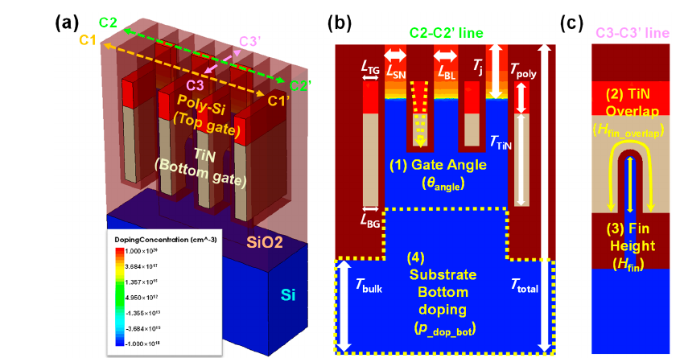
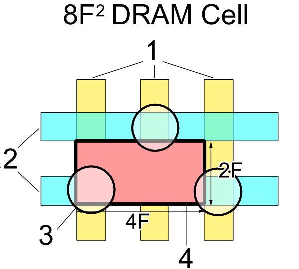
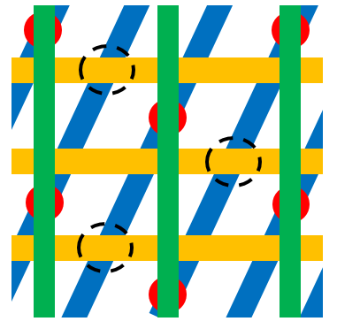
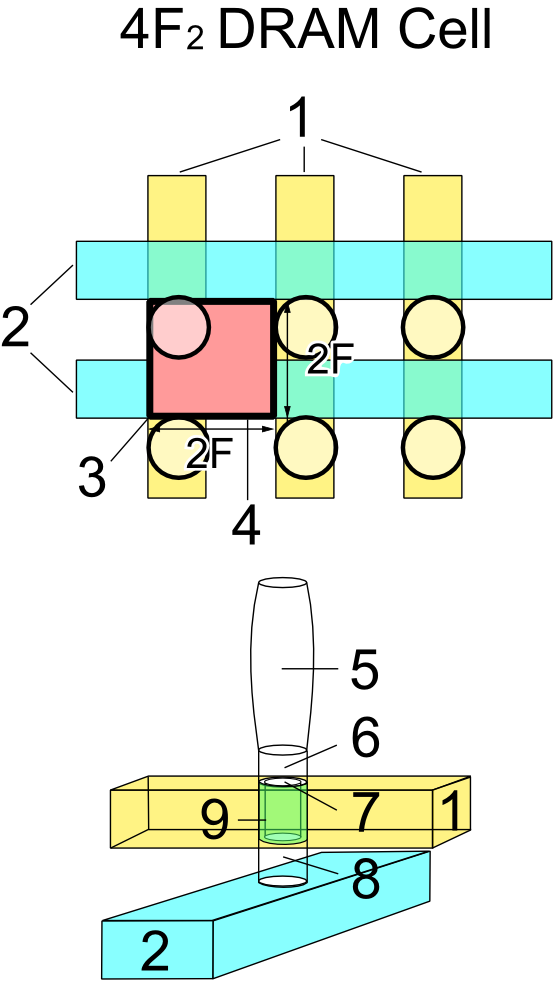
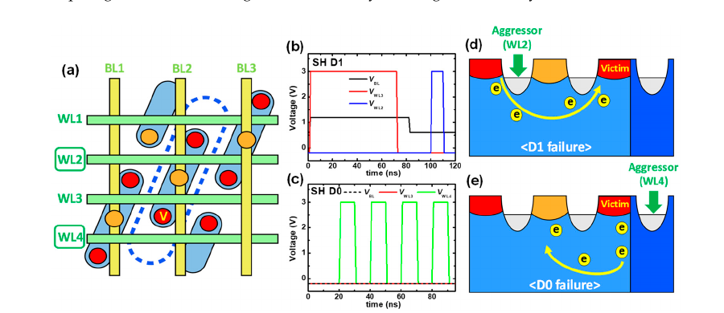

# 2.5. Memory device: DRAM advance

[Memory Device: DRAM Basic](dram.md)에서는 1T1C cell의 write, charge sharing, sense amplifier, restore·refresh와 기본 array hierarchy를 설명했다. 이 글에서는 그 동작을 실제 대규모 DRAM으로 확장할 때 왜 scaling이 어려워지는지, 그리고 **8F²·6F²·4F² cell, PCAT, RCAT, BCAT, VCT와 3D integration**이 어떤 문제에 대한 해법으로 등장했는지를 연결한다.

초보자에게 DRAM scaling은 “transistor와 선폭을 작게 만들면 더 많은 bit를 넣을 수 있다”는 문제처럼 보일 수 있다. 실제로는 다음 세 조건을 동시에 만족해야 한다.

1. 한 bit를 차지하는 면적은 작아야 한다.
2. storage capacitor에는 읽을 수 있을 만큼의 전하가 남아 있어야 한다.
3. access transistor와 bit-line은 전하가 너무 빨리 새지 않으면서 빠르게 읽고 쓸 수 있어야 한다.

이 세 조건은 서로 긴장 관계에 있다. cell을 작게 만들면 capacitor와 sensing signal이 줄어들고, transistor를 강하게 만들면 leakage가 증가할 수 있으며, 긴 bit-line을 여러 cell이 공유하면 작은 signal을 읽는 일이 어려워진다. 따라서 DRAM의 발전은 단일 소자의 축소보다 **cell 구조, capacitor, transistor, array 배선, sense amplifier, 공정과 interface를 함께 최적화하는 과정**으로 이해해야 한다.[1–6]

## 1. DRAM scaling의 물리적 병목

### (1) Capacitor와 cell signal

DRAM의 read signal은 cell capacitor와 bit-line capacitance의 비율에 크게 의존한다. [Memory Device: DRAM Basic](dram.md)의 charge-sharing 식을 다시 쓰면

$$
\Delta V_\mathrm{BL}
\approx
\frac{C_\mathrm{cell}}{C_\mathrm{BL}+C_\mathrm{cell}}
\left(V_\mathrm{cell}-V_\mathrm{pre}\right)
$$

이다. 보통 $C_\mathrm{BL}\gg C_\mathrm{cell}$이므로, $C_\mathrm{cell}$이 작아지면 $\Delta V_\mathrm{BL}$도 작아진다. sense amplifier는 이 작은 차이를 offset과 noise를 이겨내며 증폭해야 한다.[1–5]

cell 면적을 줄이면서 $C_\mathrm{cell}$을 유지하려면 capacitor를 평면으로 넓히는 대신 수직으로 세워야 한다. 대표적으로 cylinder 또는 pillar 형태의 electrode를 만들고, high-k dielectric을 사용해 작은 footprint 안에 큰 유효 면적을 확보한다. 이 선택은 다음의 부담을 만든다.

- capacitor hole의 종횡비가 커져 etch가 어려워진다.
- 깊은 구조의 바닥까지 dielectric과 electrode를 균일하게 증착해야 한다.
- 구조가 가늘고 높아져 pattern collapse와 mechanical instability가 생길 수 있다.
- dielectric 결함 하나가 leakage와 retention tail을 만들 수 있다.

따라서 $C_\mathrm{cell}$을 유지하는 일은 단순한 재료 선택이 아니라 lithography, etch, deposition, cleaning, electrode와 dielectric reliability를 모두 포함하는 공정 문제이다.[5,9,10]

### (2) Access transistor의 전류–누설 trade-off

access transistor에는 서로 반대되는 요구가 있다. write와 read에서는 큰 on-current $I_\mathrm{ON}$이 필요하고, WL이 꺼진 뒤에는 작은 off-current $I_\mathrm{OFF}$가 필요하다.

$$
\text{빠른 access}
\Rightarrow I_\mathrm{ON}\ \text{증가}
$$

$$
\text{긴 retention}
\Rightarrow I_\mathrm{OFF}\ \text{감소}
$$

channel을 짧게 하거나 gate control을 약하게 만들면 on-current가 증가할 수 있지만, short-channel effect, drain-induced barrier lowering (DIBL), subthreshold leakage, junction leakage가 커질 수 있다. 반대로 leakage를 줄이기 위해 channel을 길게 만들면 cell pitch 안에서 transistor를 배치하기 어렵고 access time이 늘어난다.[4,8]

DRAM access transistor에서는 일반 logic transistor보다 높은 word-line voltage, 긴 storage retention, 작은 junction area와 낮은 parasitic capacitance가 동시에 중요하다. 따라서 “logic 공정에서 가장 빠른 transistor”가 “DRAM cell에 가장 좋은 transistor”와 같지 않다.[2,4,8]

### (3) Bit-line capacitance와 sensing margin

앞의 charge-sharing 관계에서 $C_\mathrm{cell}$을 유지하더라도 $C_\mathrm{BL}$이 커지면 $|\Delta V_\mathrm{BL}|$은 작아진다. $C_\mathrm{BL}$에는 공유 cell뿐 아니라 긴 배선과 접합의 기생 정전용량도 포함되므로, bit-line 분할과 sense-amplifier 배치는 cell capacitor와 별도로 sensing margin을 제한한다.[1–4]

개념적으로 sensing이 성공하려면

$$
|\Delta V_\mathrm{BL}|
>
|V_\mathrm{OS}|
+
V_\mathrm{noise}
+
V_\mathrm{margin}
$$

이어야 한다. 여기서 $V_\mathrm{OS}$는 sense amplifier offset, $V_\mathrm{noise}$는 동작 중 유입되는 noise, $V_\mathrm{margin}$은 원하는 failure probability를 확보하기 위한 여유 전압이다. bit-line을 줄이면 sensing에는 유리하지만, sense amplifier를 더 많이 배치해야 하므로 면적과 전력이 늘어난다. 반대로 긴 bit-line은 cell density에는 유리할 수 있지만 sensing, delay와 energy에 불리하다.[1–4]

## 2. DRAM access transistor의 구조 발전

DRAM access transistor의 발전은 **planar channel array transistor (PCAT) → recessed-channel array transistor (RCAT) → buried-channel array transistor (BCAT) → vertical channel transistor (VCT)**의 순서로 읽을 수 있다. 각 전환은 이전 구조를 단순히 더 깊게 만든 결과가 아니라, cell 면적을 줄일 때 나타난 channel 길이, 누설 전류와 WL·BL 배치의 한계를 해결하기 위한 구조 변경이다. 이 절에서는 transistor의 발전 원인을 설명하고, 다음 절에서는 같은 변화를 8F²·6F²·4F² cell 면적 관점에서 다시 정리한다.[23,28]

| 구조 | 이전 단계에서 커진 문제 | 핵심 변경 | 다음 단계가 필요해진 이유 |
| --- | --- | --- | --- |
| PCAT | 기준 구조 | silicon 표면의 수평 channel과 표면 WL | pitch 축소가 channel 길이를 직접 줄여 short-channel effect가 증가 |
| RCAT | 짧아진 평면 channel | silicon을 파서 굽은 channel 경로를 형성 | 깊은 recess의 공정 변동과 6F² 배선·기생 성분 문제 |
| BCAT | RCAT의 배선·집적 한계 | gate와 WL을 매립하고 fin-like channel을 사용 | GIDL, WL 저항과 6F²의 평면 면적 한계 |
| VCT | 6F²의 수평 배치 한계 | channel을 수직으로 세우고 buried BL과 결합 | 수직 profile·접촉·저항·공정 변동의 제어 |

### (1) Planar channel array transistor (PCAT)

PCAT에서는 source와 drain 사이의 channel과 WL gate가 silicon 표면을 따라 놓인다. 구조와 공정이 비교적 단순하고 8F² cell에 적용하기 쉬웠지만, cell pitch를 줄이면 source–drain의 평면 거리와 channel 길이도 함께 짧아진다. 그 결과 drain-induced barrier lowering (DIBL), subthreshold leakage와 punch-through가 증가하여 WL을 꺼도 storage capacitor의 전하가 빨리 손실될 수 있다.[23,28]

PCAT의 한계는 **평면 면적을 줄이는 일이 곧 channel 길이를 줄이는 일**이라는 데 있다. 특히 8F²에서 6F²로 이동하려면 access transistor를 더 공격적으로 축소해야 하므로, lithography만 개선해서는 retention과 refresh 조건을 유지하기 어렵다. 이 결합을 끊기 위해 전류 경로를 silicon 내부로 접은 RCAT가 도입되었다.[23,28]

### (2) Recessed-channel array transistor (RCAT)

RCAT는 silicon을 파서 만든 recess의 sidewall과 바닥을 따라 gate가 channel을 제어한다. 따라서 같은 평면 source–drain 거리에서도 전류가 굽은 경로를 지나므로 유효 channel 길이를 늘릴 수 있다. 이 변화는 footprint를 크게 늘리지 않고 short-channel effect와 off-state leakage를 낮추어, 축소된 cell에서 retention을 확보하기 위한 해법이었다.[8,23,28]

그러나 recess를 깊게 만드는 것만으로 계속 축소할 수는 없다. recess의 깊이·폭·모서리 형상, sidewall 손상, gate dielectric 두께와 body doping의 변동이 $V_\mathrm{th}$와 $I_\mathrm{OFF}$ 분포를 넓힐 수 있다. 또한 6F² cell에서는 WL과 BL의 교차, contact 배치와 두 배선 사이의 기생 정전용량까지 함께 줄여야 한다. 즉, RCAT가 channel 길이 문제를 완화한 뒤에는 **gate와 WL 자체를 어디에 둘 것인가**가 다음 병목이 되었다.[9,10,23]

### (3) Buried-channel array transistor (BCAT)

BCAT는 gate와 WL을 silicon 내부에 매립하고, recess 주변의 fin-like silicon channel을 여러 면에서 제어하는 구조이다. 문헌에서는 buried cell array transistor라는 이름도 사용한다. 매립 WL은 표면의 contact·BL과 gate를 수직으로 분리하므로 WL–BL 기생 정전용량과 배치 간섭을 줄일 수 있고, 6F² cell 안에서 충분한 유효 channel 길이와 gate control을 확보할 수 있다.[9–11,23]

BCAT은 DIBL과 punch-through를 억제하지만, **gate-induced drain leakage (GIDL)를 자동으로 없애지는 않는다**. off-state에서 storage-node 쪽 drain과 gate가 겹치는 영역에 큰 전기장이 걸리면 band-to-band tunneling (BTBT)이 발생하고, 이 전류가 storage charge를 줄여 retention을 악화시킨다. BCAT가 축소될수록 gate–drain overlap의 전기장과 gate dielectric profile을 함께 제어해야 하는 이유이다.[33,34]

후속 구조인 **multi-gate BCAT**은 상·하부 gate에 서로 다른 off-state 전압을 가하고, **dual work-function BCAT (DWF-BCAT)**은 상부와 하부 gate에 서로 다른 일함수의 재료를 사용한다. 두 방법의 공통 목적은 drain에 가까운 상부 gate가 만드는 최대 전기장을 낮춰 BTBT와 GIDL을 줄이는 것이다. 다만 gate와 구동 전압을 나누거나 W gate 일부를 다른 재료로 바꾸면 select-WL driver가 복잡해지고 WL 저항과 write time이 증가할 수 있다. 따라서 BCAT의 발전은 channel 길이뿐 아니라 **GIDL–retention과 WL 저항–속도의 균형**을 조절하는 과정이다.[33,34]

그림 1은 BCAT 구조에서 gate angle, TiN overlap, fin height와 bottom doping처럼 형상과 doping이 전기적 특성에 영향을 주는 예를 보여준다. fin height는 유효 channel 면적과 gate control을 바꾸고, gate overlap과 bottom doping은 threshold voltage와 leakage 경로를 바꿀 수 있다. 이처럼 BCAT에서는 하나의 channel 길이보다 3차원 구조 변수의 분포를 함께 평가해야 한다.[9,10]

<figure markdown="span">
  
  <figcaption markdown="1">
    그림 1. BCAT 구조와 주요 구조 변수의 개념. 위쪽은 3차원 cell 형상이고 아래쪽은 gate angle, TiN overlap, fin height, bottom doping에 따른 단면의 위치를 나타낸다. 출처: J. Im, H. Kim, H. Kim, S. Y. Woo, “Design Strategies for BCAT Structures: Enhancing DRAM Reliability and Mitigating Row Hammer Effect,” <i>Electronics</i> 14(3), 499, Figure 1, 2025, CC BY 4.0.[10] 원본 PDF에서 Figure 1 영역만 추출·크롭했으며 원본 label과 색상은 변경하지 않았다.
  </figcaption>
</figure>

BCAT의 3차원 구조는 공정 변동도 3차원으로 만든다. fin height가 cell마다 다르면 유효 channel 면적이 달라지고, sidewall roughness와 gate overlap의 변동은 $V_\mathrm{th}$와 $I_\mathrm{OFF}$ 분포를 넓힐 수 있다. 매립 WL을 깊고 좁은 공간에 채우는 공정은 도체 저항, gate dielectric의 균일도와 contact 연결도 제한한다. 이 때문에 평균 특성이 같아도 분포 끝의 cell에서 retention 또는 sensing failure가 먼저 나타날 수 있다.[9,10,33]

### (4) Vertical channel transistor (VCT)

VCT는 source와 drain을 위아래로 배치하고 channel을 수직 pillar 방향으로 세운 구조이다. 문헌에 따라 vertical-channel array transistor (VCAT)라고도 부른다. BCAT 기반 6F² cell에서는 channel과 contact가 여전히 평면 pitch를 공유하지만, VCT는 channel 길이를 pillar 높이로 정하므로 수평 pitch와 channel 길이의 결합을 더 약하게 만들 수 있다. buried BL, 수직 channel과 상부 storage node를 WL–BL 교차점에 쌓으면 $2F\times2F$의 4F² cell을 구성할 수 있다는 점이 VCT로 이동하는 핵심 이유이다.[23,35]

VCT는 6F²에서 4F²로 면적을 줄일 경로를 제공하지만, 문제를 제거하기보다 수직 방향으로 옮긴다. pillar의 높이·직경과 doping profile, gate dielectric의 균일도, buried BL 저항, BL–WL 누설과 storage-node contact 정렬이 새로운 제약이 된다. 실제 VCT 연구에서도 buried BL 형성, 수직 pillar 공정과 channel doping을 핵심 통합 과제로 다룬다. 따라서 VCT는 PCAT→RCAT→BCAT에서 이어진 channel 제어의 다음 단계이면서, 아직 공정 변동과 수율을 함께 검증해야 하는 4F² 후보 구조이다.[23,35]

## 3. Cell 면적의 발전: 8F², 6F²와 4F²

8F²→6F²→4F²는 같은 평면 도형을 비례 축소한 순서가 아니다. 같은 $F$를 가정하더라도 cell 경계의 종횡비, active area의 방향, word line (WL)·bit line (BL)의 교차 방식과 access transistor의 channel 방향이 함께 바뀐다. 따라서 면적 숫자는 결과이고, 핵심은 더 작은 반복 단위 안에 1T1C와 두 배선을 다시 배치한 구조적 변화이다.[23,28,29]

### (1) 8F²: 평면 배치와 folded bit line

전통적인 8F² cell은 대표적으로 $4F\times2F$의 직사각형 반복 단위를 사용한다. 이 구조는 planar channel array transistor (PCAT)와 folded bit-line array에 적용되어 안정적인 차동 sensing과 비교적 여유 있는 contact 배치를 제공했지만, 같은 $F$에서 한 bit가 차지하는 평면 면적이 크다.[23,29]

<figure markdown="span">
  
  <figcaption markdown="1">
    그림 2. 8F² DRAM cell의 대표적인 평면 배치. 붉은 사각형은 $4F\times2F$의 cell 경계를 나타내며, 서로 직교하는 반복 배선과 contact가 이 경계 안팎에서 공유된다. 이 그림은 정량적인 공정 단면이 아니라 면적과 반복 관계를 보여주는 개념도이다. 출처: Tosaka, “DRAM Cell Structure (8F2),” Wikimedia Commons, 2008, <a href="https://creativecommons.org/licenses/by/3.0/">CC BY 3.0</a>, 수정 없음.[30]
  </figcaption>
</figure>

8F²에서 6F²로 가려면 cell의 한 방향을 $4F$에서 $3F$로 줄여야 한다. 이 변화는 contact와 active area의 배치 여유를 줄이고 access transistor의 평면 channel을 더 공격적으로 축소한다. 그러므로 이 전환은 단순한 mask 축소가 아니라 RCAT 같은 3차원 channel과 array 배선 구조의 변경을 함께 요구했다.[23,28,29]

### (2) 6F²: 기울어진 active area와 매립 구조

6F² cell은 대표적으로 $3F\times2F$의 반복 단위를 사용하므로, 같은 $F$의 8F² cell보다 cell core 면적이 25% 작다. 그림 3에서는 파란 active area가 기울어져 반복되고, 수평 WL과 수직 BL이 서로 직교하며, BL contact가 인접 cell과 규칙적으로 공유된다.[29,31]

<figure markdown="span">
  
  <figcaption markdown="1">
    그림 3. 6F² DRAM array의 대표적인 평면 layout. 파란색은 active area, 노란색 수평선은 WL, 초록색 수직선은 BL, 붉은 원은 BL contact, 점선 원은 cut 영역을 나타낸다. cell은 $3F\times2F$의 반복 단위로 읽는다. 출처: Guiding light, “6F2 20 nm DRAM layout,” Wikimedia Commons, 2017, <a href="https://creativecommons.org/licenses/by-sa/4.0/">CC BY-SA 4.0</a>, 수정 없음.[31]
  </figcaption>
</figure>

이 밀도 이득에는 두 가지 대가가 따른다. 첫째, active area와 contact를 더 촘촘히 배치하므로 channel 길이, overlay와 parasitic capacitance의 허용 범위가 줄어든다. 둘째, 6F²에 흔히 연결되는 open bit-line array는 folded bit-line보다 외부 잡음에 취약할 수 있다. RCAT·BCAT는 작은 평면 치수에서 유효 channel 길이와 gate control을 확보하고, BWL은 WL을 silicon 내부에 배치하여 contact·BL과의 간섭을 관리하는 해법으로 이어졌다.[7,23,28,29]

### (3) 4F²: cross-point 배치와 vertical channel

4F² cell은 $2F\times2F$의 최소 cross-point 반복 단위를 목표로 한다. 같은 $F$에서 6F²보다 33%, 8F²보다 50% 작은 cell core 면적이다. WL과 BL의 각 교차점에 하나의 cell을 두려면 transistor와 capacitor를 평면에서 나란히 놓기 어렵기 때문에, VCT를 buried BL 위와 storage node 아래에 수직으로 배치하는 방향이 필요하다.[23,29,35]

<figure markdown="span">
  
  <figcaption markdown="1">
    그림 4. 4F² DRAM cell의 평면 배치와 수직 구조 개념. 위쪽 붉은 사각형은 $2F\times2F$의 cell 경계를, 아래쪽은 BL과 WL의 교차점에 수직 storage node·channel·contact를 쌓는 관계를 나타낸다. 이 그림은 특정 양산 공정의 치수나 재료 적층을 나타내지 않는다. 출처: Tosaka, “DRAM Cell Structure (4F2),” Wikimedia Commons, 2008, <a href="https://creativecommons.org/licenses/by/3.0/">CC BY 3.0</a>, 수정 없음.[32]
  </figcaption>
</figure>

수직 배치는 평면 channel 길이를 cell pitch에서 분리할 수 있지만, vertical channel의 높이·직경·doping, gate 형성, storage-node contact와 buried BL의 정렬을 새로 제어해야 한다. 또한 isolated vertical body의 floating-body effect, 가는 pillar의 구조적 취약성, buried BL 저항과 cell 간 variation이 retention·sensing·수율의 한계가 될 수 있다. 따라서 4F²는 6F²보다 면적은 작지만 자동으로 더 빠르거나 더 신뢰성 높은 cell을 뜻하지 않는다.[23,25,29]

| cell 구조 | 대표 평면 경계 | 같은 $F$에서의 면적 변화 | 핵심 구조 변화 | 새로 강조되는 부담 |
| --- | --- | --- | --- | --- |
| 8F² | $4F\times2F$ | 기준 | planar channel, folded bit line | 큰 cell core 면적 |
| 6F² | $3F\times2F$ | 8F² 대비 25% 감소 | 기울어진 active area, RCAT·BCAT와 BWL | channel·contact 여유, array noise와 parasitic |
| 4F² | $2F\times2F$ | 6F² 대비 33% 감소 | cross-point cell, buried BL과 VCT | vertical profile, floating body, 저항·정렬·수율 |

### (4) Cell 면적 지표의 해석

!!! quote "[Reading guide] 8F²·6F²·4F²"
    DRAM 문헌의 $F$는 최소 feature 또는 half-pitch를 기준으로 layout을 정규화하는 길이이다. 문헌과 세대에 따라 구체적인 정의가 다를 수 있으므로, 서로 다른 자료를 비교할 때에는 각 자료가 사용한 $F$를 먼저 확인한다.[4,23,29]

    $kF²$의 숫자 $k$는 transistor나 capacitor의 개수가 아니라 **한 cell의 정규화된 평면 footprint**를 뜻한다.

    $$
    A_\mathrm{cell}\approx kF^2,
    \qquad
    \rho_\mathrm{cell}\propto\frac{1}{kF^2}
    $$

    같은 $F$에서 $k$가 8→6→4로 줄면 이상적인 cell core density는 증가한다. 그러나 이 표기는 capacitor 높이, dielectric 두께, vertical channel, sense amplifier, decoder, spare row·column과 I/O의 면적을 포함하지 않는다. 따라서 $4F²$라는 사실만으로 실제 chip density, 속도, 전력 또는 수율의 개선 폭을 결정할 수 없다.[2–5,23,29]

    실제 macro와 비교할 때에는 정규화된 cell 면적과 주변회로를 포함한 array efficiency를 분리한다.

    $$
    k_\mathrm{cell}
    =
    \frac{A_\mathrm{cell}}{F^2},
    \qquad
    \eta_\mathrm{array}
    =
    \frac{N_\mathrm{cell}A_\mathrm{cell}}{A_\mathrm{macro}}
    $$

    서로 다른 논문의 숫자를 읽을 때에는 ① $F$의 정의, ② cell core인지 macro인지, ③ WL·BL pitch와 bit-line architecture, ④ capacitor·transistor의 수직 구조를 함께 확인한다. 숫자는 구조를 요약하는 표지이며 구조 자체를 대신하지 않는다.[2,7,23,29]

## 4. Scaling 공정의 leakage·신뢰성 trade-off

### (1) Capacitor의 high aspect ratio

cell footprint가 줄어들수록 capacitor의 저장 면적을 평면에서 확보하기 어렵다. 그래서 capacitor를 더 높게 쌓거나 더 깊게 파서 3차원 면적을 확보한다. 원통형 capacitor의 유효 capacitance를 단순화하면

$$
C
\approx
\frac{\varepsilon_0\varepsilon_\mathrm{r}A}{t_\mathrm{ox}}
$$

로 쓸 수 있다. 여기서 $A$는 electrode가 마주 보는 유효 면적, $t_\mathrm{ox}$는 dielectric 두께, $\varepsilon_\mathrm{r}$은 상대 유전율이다. high-k dielectric은 같은 $t_\mathrm{ox}$에서 capacitance를 높일 수 있지만, 실제 device의 leakage와 breakdown strength가 식 하나로 결정되는 것은 아니다.[5,9]

aspect ratio가 커지면 다음의 공정 문제가 생긴다.

1. 좁고 깊은 hole의 아래쪽까지 etch profile을 유지해야 한다.
2. dielectric과 electrode가 top·sidewall·bottom에 균일하게 증착되어야 한다.
3. 작은 seam, void, pinhole이 leakage path가 될 수 있다.
4. 높고 가는 구조가 다음 공정의 mechanical stress와 pattern collapse에 취약해질 수 있다.

따라서 high-k 도입은 “유전율이 높으므로 capacitance가 증가한다”는 장점만으로 평가할 수 없다. dielectric defect density, interface trap, oxygen vacancy, electrode work function, time-dependent dielectric breakdown (TDDB)와 retention distribution을 함께 평가해야 한다.[5,9]

### (2) Access transistor의 주요 leakage 경로

DRAM cell의 retention은 capacitor에 저장된 전하가 얼마나 빨리 줄어드는지로 결정된다. 간단한 일정 leakage current 근사에서는

$$
t_\mathrm{ret}
\approx
\frac{C_\mathrm{cell}\Delta V_\mathrm{allow}}{I_\mathrm{leak}}
$$

로 쓸 수 있다. 여기서 $\Delta V_\mathrm{allow}$는 sense margin을 유지하면서 허용되는 storage-node 전압 변화이다. 실제 leakage는 전압·온도·history에 따라 변하므로 이 식은 방향성을 이해하기 위한 근사이다.[1–5,12]

| leakage 또는 손실 경로 | 물리적 출발점 | DRAM에서 보이는 결과 |
| --- | --- | --- |
| Subthreshold leakage | WL이 꺼져도 barrier를 넘는 전류 | access transistor를 통해 storage charge가 감소 |
| Junction leakage | source·drain junction의 depletion region과 defect | cell 전하가 substrate 방향으로 손실 |
| Gate-induced drain leakage (GIDL) | 큰 gate·drain 전기장에서의 band-to-band tunneling | off-state에서 추가 전하 손실 |
| Gate dielectric leakage | 얇은 dielectric을 통한 tunneling 또는 defect-assisted transport | WL 또는 storage node의 전하 감소 |
| Capacitor dielectric leakage | dielectric trap, pinhole, field-assisted process | retention failure와 VRT |
| Inter-cell coupling | 인접 WL·BL·storage node 전압 변화 | data-dependent retention과 disturb |

여기에 access transistor의 drain-induced barrier lowering (DIBL)이 커지면 drain 전압 변화가 source-side barrier를 낮추어 off-state current를 증가시킬 수 있다. 온도가 상승하면 여러 leakage 경로가 증가하고, refresh 전력도 커지는 경향이 있다. 하지만 실제 temperature coefficient와 dominant mechanism은 구조·재료·bias 조건에 따라 달라지므로, 모든 DRAM leakage를 하나의 Arrhenius slope로 설명해서는 안 된다.[4,8,12]

### (3) 구조 변경과 결합된 trade-off

| 설계 변경 | 얻고 싶은 효과 | 동시에 생길 수 있는 비용 |
| --- | --- | --- |
| RCAT·BCAT로 channel 길이 증가 | off-state leakage와 short-channel effect 억제 | 깊은 recess, surface damage, 구조 variation |
| access transistor의 on-current 증가 | read·write와 row activation 속도 개선 | junction 또는 subthreshold leakage 증가 |
| cell capacitor 면적 증가 | sensing signal과 retention 개선 | aspect ratio와 patterning 부담 |
| high-k dielectric 적용 | 작은 footprint에서 $C_\mathrm{cell}$ 확보 | defect, leakage, breakdown와 process window |
| bit-line 길이 감소 | $\Delta V_\mathrm{BL}$과 delay 개선 | sense amplifier 복제에 따른 area·power |
| cell pitch 축소 | bit density 증가 | contact, parasitic, overlay와 yield |
| WL boost 증가 | write margin 개선 | oxide stress, power와 half-select disturb |

이 표에서 한 줄의 개선이 다른 줄의 악화를 유발할 수 있다는 점이 핵심이다. 예를 들어 access transistor를 강하게 만들면 write 시간이 줄어들 수 있지만, WL이 꺼진 뒤에도 전하가 더 빨리 빠져 retention이 나빠질 수 있다. DRAM의 최적점은 하나의 metric을 최대로 만드는 지점이 아니라, density·latency·power·yield·reliability를 함께 만족하는 지점이다.[2,4,8–10]

!!! info "[Measurement]"
    구조 변경의 효과를 분리하려면 다음 항목을 같은 $V_\mathrm{DD}$와 온도에서 비교한다.

    - capacitor: $C_\mathrm{cell}$, initial stored charge $Q_\mathrm{cell}$
    - read: charge-sharing 뒤 $\Delta V_\mathrm{BL}$, sense-amplifier decision time
    - access transistor: $I_\mathrm{ON}$, $I_\mathrm{OFF}$, subthreshold slope와 DIBL
    - retention: 지정된 read margin을 유지하는 $t_\mathrm{ret}$
    - array: bit-line RC, word-line RC와 worst-case coupling

    하나의 test chip에서 geometry와 doping을 동시에 바꾸면 어느 구조 요소가 개선을 만들었는지 분리하기 어렵다. 가능하면 split lot 또는 simulation에서 한 변수만 바꾼 비교를 사용하고, 평균값과 함께 1st·99th percentile 같은 분포 tail을 보고한다.[9,10,12]

## 5. DRAM 불량과 신뢰성

### (1) 동작 단계별 failure mode

DRAM failure는 “bit가 틀렸다”는 같은 결과로 보이지만, 어느 동작 단계에서 실패했는지에 따라 원인이 다르다.

| Failure mode | 주로 문제가 드러나는 단계 | 가능한 물리 원인 |
| --- | --- | --- |
| Retention failure | refresh 사이에 read | capacitor·junction·access transistor leakage, 낮은 $C_\mathrm{cell}$ |
| Read 또는 sensing failure | ACTIVATE와 sense | 작은 $\Delta V_\mathrm{BL}$, bit-line imbalance, sense offset, noise |
| Write failure | WRITE pulse 뒤 read-back | 부족한 access current, threshold loss, WL boost 부족, contact resistance |
| Access-time failure | 정해진 timing에서 read/write | WL·BL RC, sense enable timing, slow tail cell |
| Hold failure | 모든 line이 idle인 상태 | standby leakage, disturb 또는 data retention |
| Coupling·disturb failure | 인접 row·column 동작 뒤 read | capacitive coupling, word-line field, shared substrate 경로 |
| Open·short failure | 전압과 주소를 바꾼 검사 | contact·metal open, BL·WL short, stuck-at state |
| Capacitor breakdown | stress 또는 long retention | dielectric defect와 TDDB |
| Soft error | 외부 radiation event 뒤 read | particle이 만든 charge가 sensing state를 뒤집음 |
| Variable retention time (VRT) | 시간·history에 따른 반복 test | trap 상태 변화로 leakage가 일시적으로 변함 |

이 분류는 서로 배타적이지 않다. 예를 들어 contact resistance가 증가하면 write failure뿐 아니라 read signal과 access time도 함께 나빠질 수 있다. 반대로 retention이 짧은 cell도 매우 빠른 refresh 조건에서는 기능하는 것처럼 보일 수 있다. 따라서 failure 이름만 기록하지 말고 test sequence와 bias condition을 함께 저장해야 한다.[2–5,12]

### (2) Read·write·retention failure 검사

**Read failure**를 확인하려면 먼저 알려진 data pattern을 write하고, row를 activate한 뒤 sense amplifier가 결정한 값을 read-back한다. precharge imbalance와 sense timing을 바꾸었을 때 failure가 민감하게 변하면 sensing margin 문제가 의심된다.

**Write failure**는 write pulse width, WL voltage, bit-line driver strength와 temperature를 바꾸면서 같은 cell에 0·1을 교대로 기록한다. write 뒤 즉시 read하면 access current와 threshold loss의 영향을 보기 좋고, 일정 시간을 둔 뒤 read하면 write가 만든 초기 charge 부족과 retention이 섞일 수 있다.

**Retention failure**는 write와 read 사이의 대기 시간을 sweep하여 failure time을 얻는다. 이때 refresh를 완전히 끄는지, 다른 row의 background activity를 허용하는지, test 온도와 data pattern이 무엇인지 명시해야 한다.

!!! info "[Measurement]"
    단일 cell 또는 array의 failure probability는 다음처럼 정의할 수 있다.

    $$
    P_\mathrm{fail}
    =
    \frac{N_\mathrm{failed\ cells}}{N_\mathrm{tested\ cells}}
    $$

    retention test에서는 각 cell의 failure time $t_{\mathrm{fail},i}$를 얻어 평균만 보고하지 말고 분포를 그린다. array에서 적어도 하나의 cell이 실패할 확률은 cell failure가 독립이라고 가정할 때

    $$
    P_\mathrm{array\ fail}
    =
    1-\left(1-P_\mathrm{cell\ fail}\right)^{N_\mathrm{cell}}
    $$

    로 근사할 수 있다. 실제 DRAM cell은 같은 WL·BL·subarray를 공유하므로 완전한 독립 가정은 성립하지 않을 수 있다. 그래도 대규모 array에서 tail cell이 왜 중요한지 설명하는 첫 번째 근사로 유용하다.[2,3,12]

### (3) Soft error와 critical charge

**Soft error**는 transistor나 capacitor가 영구적으로 망가진 것이 아니라, 외부 입자가 순간적으로 만든 전하 때문에 저장 상태가 잘못 판정되는 오류이다. alpha particle이나 cosmic-ray neutron이 silicon에 에너지를 전달하면 electron–hole pair가 만들어지고, 그중 일부가 storage node 또는 sensing node로 수집될 수 있다.[16,17]

이때 중요한 양이 **critical charge** $Q_\mathrm{crit}$이다. 수집된 전하 $Q_\mathrm{collected}$가 회로가 허용할 수 있는 임계량보다 크면 저장 상태가 뒤집히거나 sense amplifier의 결정을 바꿀 수 있다.

$$
Q_\mathrm{collected}>Q_\mathrm{crit}
\quad\Rightarrow\quad
\text{soft upset 가능성 증가}
$$

$Q_\mathrm{crit}$은 cell capacitor의 전하만으로 정해지지 않는다. storage node의 capacitance, inverter 또는 sense amplifier의 noise margin, 전하 수집 경로, pulse timing, substrate와 well 구조가 함께 영향을 준다. 따라서 cell capacitance를 줄이면 density는 좋아질 수 있지만 soft-error margin은 나빠질 가능성이 있다.[16,17]

### (4) ECC, redundancy와 repair

DRAM은 physical cell의 모든 failure를 없애는 대신, 여러 계층에서 오류를 검출·수정·대체한다.

| 방법 | 보호하는 대상 | 원리 | 한계 |
| --- | --- | --- | --- |
| ECC | 전송 또는 저장 data의 일부 bit error | parity와 code word로 오류 검출·수정 | correction 가능한 수와 latency·energy에 제한 |
| Spare row·column | 제조 중 발견된 불량 cell | 불량 주소를 여분 row·column으로 remap | spare 수와 repair granularity 제한 |
| Post-package repair | package 이후 발견된 일부 불량 | laser·electrical fuse 또는 내부 remap 사용 | package와 test 단계의 지원 필요 |
| Refresh·disturb mitigation | 시간·동작에 따른 오류 | 주기적 재충전 또는 위험 row 주변 refresh | power·performance overhead, 모든 mechanism을 제거하지 못함 |

ECC는 capacitor leakage나 dielectric defect를 물리적으로 고치는 방법이 아니다. correction 범위 안의 오류를 시스템에 보이지 않게 만들 뿐이며, 오류가 code word의 보호 능력을 넘으면 uncorrectable error가 된다. redundancy와 ECC를 함께 사용하면 제조 수율과 field reliability를 높일 수 있지만, spare 회로와 parity 저장 공간, controller 동작의 비용이 추가된다.[2,3,18]

## 6. RowHammer와 DRAM disturbance

### (1) RowHammer의 기본 동작

DRAM은 한 row를 activate하여 word line을 올리고, 사용이 끝나면 precharge로 bit-line을 초기화한다. **RowHammer**는 공격자가 특정 row를 반복해서 ACTIVATE–PRECHARGE하여, 직접 읽거나 쓰지 않은 인접 row의 data가 바뀌는 현상이다.[13,14]

반복해서 접근되는 row를 **aggressor row**, 영향을 받는 인접 row를 **victim row**라고 부른다. 한쪽 victim만 있는 경우를 single-sided pattern, victim 양쪽의 두 aggressor를 번갈아 활성화하는 경우를 double-sided pattern이라고 부른다. double-sided pattern은 두 인접 row에서 disturbance를 누적시키므로 대표적인 평가 조건으로 사용되어 왔다.[13]

### (2) 관측 현상과 미시적 원인

RowHammer의 실험적 관찰은 “반복적인 row activation 뒤 인접 row에서 bit flip이 증가한다”는 것이다. 가능한 미시적 경로에는 인접 word line의 전기장 coupling, storage node·bit-line·substrate를 통한 전하 손실, 반복적인 activate·restore 과정의 stress, 공정 variation으로 취약해진 cell이 포함된다.[13,14]

그러나 모든 DRAM 세대와 모든 cell 구조에서 하나의 원인이 같은 비율로 작동한다고 말할 수는 없다. 실제 dominant path는 cell geometry, layer stack, isolation, refresh policy, sense timing과 defect 상태에 따라 달라질 수 있다. 따라서 “RowHammer는 오직 capacitor leakage 때문이다” 또는 “오직 word-line coupling 때문이다”라고 단정하는 대신, 관찰된 bit-flip pattern과 구조·공정 변수를 함께 분석해야 한다.[14,15]

그림 5는 aggressor row와 victim row의 관계, SH D1·D0 동작과 반복 access 동안의 charge path를 설명하는 개념도이다. 실제 제품의 내부 pulse amplitude와 exact timing은 공개되지 않을 수 있으므로, 그림은 특정 DRAM의 회로도를 그대로 나타내기보다 disturbance를 이해하기 위한 구조적 모델로 읽어야 한다.[10,13,14]

<figure markdown="span">
  
  <figcaption markdown="1">
    그림 5. RowHammer에서 반복적으로 활성화되는 aggressor row와 인접 victim row, 그리고 SH D1·D0 상태에서의 전하 이동을 나타낸 개념도. 출처: J. Im, H. Kim, H. Kim, S. Y. Woo, “Design Strategies for BCAT Structures: Enhancing DRAM Reliability and Mitigating Row Hammer Effect,” <i>Electronics</i> 14(3), 499, Figure 2, 2025, CC BY 4.0.[10] 원본 PDF에서 Figure 2 영역만 추출·크롭했으며 원본 label과 색상은 변경하지 않았다.
  </figcaption>
</figure>

### (3) Cell 구조와 RowHammer 민감도

2절에서 설명한 BCAT의 형상과 doping 변수는 정상 동작의 gate control·leakage뿐 아니라 인접 cell coupling과 storage-node potential의 회복 속도에도 영향을 준다. 따라서 같은 횟수의 aggressor activation에서도 bit flip probability가 달라질 수 있다.[9,10]

이는 구조를 3차원으로 바꾸면 RowHammer가 자동으로 사라진다는 뜻이 아니다. 구조 변경은 한 종류의 coupling을 줄이는 동시에 다른 전기장 집중이나 process variation을 만들 수 있다. 따라서 구조 최적화는 다음 세 측정을 함께 필요로 한다.

- 정상 read·write·retention의 성능
- 반복 ACTIVATE–PRECHARGE에 따른 victim bit-flip threshold
- geometry와 process corner를 포함한 worst-case cell 분포

### (4) 완화 방법과 trade-off

| 완화 방법 | 아이디어 | 비용 또는 한계 |
| --- | --- | --- |
| Refresh rate 증가 | victim row가 임계 전하 손실에 도달하기 전에 다시 restore | refresh power와 available access time 감소 |
| Target Row Refresh (TRR) | 위험하게 많이 활성화된 row를 추적하고 주변 row를 refresh | counter 면적·전력, 추적 정책의 blind spot |
| ECC | 발생한 일부 bit flip을 correction | correction 범위를 넘는 multi-bit error에는 취약 |
| Controller 기반 관리 | 주소 패턴과 access count를 감시 | memory controller 복잡도와 정보 overhead |
| Row isolation·layout 개선 | coupling 경로와 인접 구조를 줄임 | cell density·공정 복잡도·layout 제약 |
| 적응형 temperature·refresh 정책 | 온도와 workload에 따라 refresh 조절 | sensing·control 회로와 검증 부담 |

TRR과 같은 방어가 도입되어도 공격 pattern이 보호 정책의 추적 방식보다 복잡하면 취약점이 남을 수 있다. 실제 연구에서는 여러 방향의 aggressor를 사용하는 pattern이 기존 완화 정책의 가정을 우회할 수 있음이 보고되었다. 그러므로 완화 방법은 “RowHammer를 완전히 제거한다”보다, 특정 threat model에서 bit-flip probability를 허용 수준 아래로 낮추는 방법으로 기술하는 편이 정확하다.[13–15]

!!! info "[Measurement]"
    RowHammer 실험은 다음처럼 반복 횟수와 victim failure를 연결한다.

    $$
    P_\mathrm{flip}(N_\mathrm{ACT})
    =
    \frac{N_\mathrm{flipped\ victims}}
    {N_\mathrm{tested\ victims}}
    $$

    $P_\mathrm{flip}$이 처음으로 정해진 기준을 넘는 ACTIVATE 횟수를 $N_\mathrm{crit}$으로 정의할 수 있다. 측정 시에는 aggressor 간격, ACTIVATE–PRECHARGE timing, refresh rate, temperature, data pattern, row address mapping과 ECC의 enable 여부를 기록한다. ECC가 켜진 상태에서 외부 data가 정상이라고 해서 내부 bit flip이 없었다고 결론내리지 않는다.[13–15]

!!! warning "[Interpretation Caveat]"
    RowHammer vulnerability와 일반 retention failure는 서로 관련될 수 있지만 같은 시험은 아니다. retention test는 보통 접근하지 않고 대기하는 조건을 보고, RowHammer test는 반복적인 word-line switching과 주변 row activity를 의도적으로 만든다. 두 결과를 비교하려면 동일한 온도·data pattern·readout 기준을 사용해야 한다.[12–15]

## 7. DRAM의 전력과 성능

### (1) Row activation 비용

DRAM에서는 외부 data bit를 한 번 전달하는 것보다, row를 열기 위해 긴 word line과 여러 bit line을 충·방전하는 과정이 큰 비용이 될 수 있다. row activation을 단순화하면

$$
E_\mathrm{access}
\approx
E_\mathrm{WL}
+
E_\mathrm{BL}
+
E_\mathrm{SA}
+
E_\mathrm{I/O}
$$

로 쓸 수 있다. 이는 회로 블록별 기여를 나눈 개념식이며, 각 항의 정확한 값은 전압 swing, capacitance, pulse width와 power network에 따라 달라진다.

동적 switching energy의 대표적인 근사는

$$
E_\mathrm{dyn}
\propto
\alpha C V^2
$$

이다. $\alpha$는 switching activity, $C$는 충·방전되는 유효 capacitance, $V$는 voltage swing이다. DRAM에서 $C$에는 cell capacitor만 들어가는 것이 아니라 word line·bit line·global line과 주변회로의 기생 capacitance가 포함된다. 그래서 bit-line 길이와 bank 구조가 energy와 latency를 함께 결정한다.[2,3,26]

### (2) DRAM 전력의 구성

| 전력 항목 | 발생하는 순간 | 주요 설계 변수 |
| --- | --- | --- |
| Activate·precharge power | row를 열고 닫을 때 | WL·BL capacitance, swing, row-buffer policy |
| Read·write I/O power | DQ로 data를 전송할 때 | I/O voltage, data rate, termination, burst |
| Sense-amplifier power | 작은 signal을 full swing으로 증폭할 때 | enable timing, offset, number of active sense amplifiers |
| Background current | standby 또는 bank가 열린 상태 | leakage, bias 회로, clock·DLL·PLL |
| Refresh power | 저장 전하를 다시 restore할 때 | refresh interval, temperature, bank parallelism |
| Power-down·self-refresh overhead | 저전력 mode로 진입·복귀할 때 | wake-up time, mode state와 control policy |

refresh는 cell을 유지하기 위한 필수 동작이지만, access가 없는 시간에도 energy를 사용한다. 온도가 높아져 retention이 짧아지면 refresh frequency를 높여야 할 수 있으므로, 온도 상승은 leakage와 refresh power를 동시에 악화시킬 수 있다.[2,3,12,26]

### (3) Row-buffer locality와 bank-level parallelism

한 row를 activate하면 그 row의 data가 sense amplifier와 row buffer에 열린다. 같은 row에서 다른 column을 선택하는 **row hit**는 이미 열린 row를 재사용하므로 activate·precharge를 반복하는 것보다 빠르고 energy가 작을 수 있다. 다른 row를 요청하는 **row conflict**는 기존 row를 precharge하고 새 row를 activate해야 하므로 latency와 energy가 증가한다.[2,3]

여러 bank를 독립적으로 나누면 한 bank가 precharge 또는 refresh 중일 때 다른 bank에서 access를 진행할 수 있다. 이를 **bank-level parallelism**이라 한다. 그러나 bank를 많이 활성화하면 주변회로와 global data path의 전력, scheduling 복잡도와 thermal density가 증가할 수 있다.

| 접근 상태 | 필요한 동작 | 상대적 특성 |
| --- | --- | --- |
| Row hit | 열린 row에서 column 선택 | latency와 activate energy가 작을 수 있음 |
| Row closed | 새 row ACTIVATE 후 column 선택 | activate 비용이 추가됨 |
| Row conflict | 기존 row PRECHARGE, 새 row ACTIVATE, column 선택 | timing과 energy가 가장 커지기 쉬움 |

!!! info "[Measurement]"
    전력은 단순히 공급 전류의 peak만으로 정의하지 않는다. 지정한 명령 구간 $[t_0,t_1]$에서

    $$
    E
    =
    \int_{t_0}^{t_1}
    V_\mathrm{DD}(t)I_\mathrm{DD}(t)\,dt
    $$

    로 energy를 계산하고, 동일한 voltage·frequency·termination·온도·bank state를 사용한다. activate energy와 read energy를 비교할 때에는 명령이 실제로 row hit인지 row conflict인지, refresh와 background current를 어떻게 제외했는지를 함께 보고한다.[2,3,26]

## 8. DRAM 세대와 interface의 물리적 의미

### (1) SDRAM, DDR와 prefetch

**Synchronous dynamic random-access memory (SDRAM)**은 외부 clock에 동기화하여 명령과 data transfer를 수행하는 DRAM이다. **Double data rate (DDR)** SDRAM은 clock의 rising edge와 falling edge에서 data를 전달하여 같은 clock 주파수에서 transfer event를 두 배로 만든다.

DRAM core 내부의 array와 외부 I/O 속도를 완전히 같게 만들기 어렵기 때문에, 한 번의 core access에서 여러 data를 미리 가져오는 **prefetch**를 사용한다. $n$-bit prefetch와 DDR transfer를 단순화하면 외부 data rate는

$$
R_\mathrm{data}
\approx
2nf_\mathrm{core}
$$

로 쓸 수 있다. 여기서 $f_\mathrm{core}$는 내부 core 동작 주파수, 2는 rising·falling edge, $n$은 한 core access가 준비하는 data 수를 나타낸다. 실제 interface에는 burst, DQS, command timing, training과 다양한 divider가 포함되므로 이 식은 물리적 관계를 설명하는 근사이다.[18,27]

| 세대 또는 방식 | 대표적인 prefetch 개념 | 핵심 의미 |
| --- | --- | --- |
| SDR SDRAM | 1n | clock edge당 한 번의 data transfer |
| DDR SDRAM | 2n | 두 clock edge 활용 |
| DDR2 SDRAM | 4n | core와 I/O 속도를 더 분리 |
| DDR3·DDR4 SDRAM | 8n | 내부 array frequency를 제한하면서 외부 transfer 증가 |
| DDR5 SDRAM | 16n | 더 높은 interface rate를 위해 prefetch와 bank 구조를 확장 |

이 표에서 세대가 바뀔수록 “cell이 그만큼 빨라졌다”고 해석하면 안 된다. external data rate가 증가하는 데에는 prefetch, burst length, bank parallelism, I/O circuit, clocking과 signal training이 함께 기여한다. 내부 core frequency와 외부 pin data rate를 분리하면 cell·array의 물리적 한계를 interface 차원에서 완화할 수 있지만, data queue와 buffer, package signal integrity의 부담이 커진다.[18,27]

### (2) DDR, LPDDR, GDDR와 HBM

| interface 계열 | 주된 목표 | 구조적 선택 | 주요 trade-off |
| --- | --- | --- | --- |
| DDR | 범용 system main memory | 비교적 넓은 capacity와 표준 DIMM interface | latency·bandwidth·전력의 균형 |
| LPDDR | mobile과 저전력 system | 낮은 I/O 전압, power-down과 self-refresh 최적화 | peak bandwidth와 wake-up·package 제약 |
| GDDR | graphics와 높은 연속 bandwidth | 높은 I/O rate와 넓은 data path | I/O power와 thermal·signal integrity |
| HBM | accelerator와 고대역폭 memory | 여러 DRAM die를 TSV와 interposer 주변의 wide interface로 연결 | package, thermal, yield와 용량 확장 |

**High bandwidth memory (HBM)**은 새로운 종류의 1T1C cell이라기보다, 여러 DRAM die를 수직 적층하고 매우 넓은 interface로 연결하는 package·system architecture이다. TSV는 die 사이의 수직 연결을 제공하고, wide I/O는 pin 하나의 data rate를 과도하게 높이지 않고 전체 bandwidth를 높일 수 있게 한다.[19]

HBM의 장점은 “각 cell이 더 빠르다”는 데 있지 않다. 같은 DRAM array의 여러 bank와 die를 병렬로 사용하고, package 안에서 memory controller와 물리적 거리를 줄여 bandwidth per watt를 개선할 여지가 있다는 데 있다. 대신 die stacking은 thermal path, TSV와 micro-bump yield, known-good-die test, package warpage, repair와 capacity scaling 문제를 만든다.[2,19]

### (3) Prefetch의 범위와 한계

Prefetch는 하나의 row activation으로 준비한 data를 여러 번의 외부 transfer로 내보내 interface bandwidth를 높인다. 하지만 다음 문제를 자동으로 해결하지는 않는다.

- row를 여는 데 걸리는 ACTIVATE latency
- row conflict에서 발생하는 PRECHARGE와 ACTIVATE 비용
- sense amplifier가 작은 charge-sharing signal을 판정하는 시간
- refresh와 background power
- long package trace의 reflection, crosstalk와 timing skew

따라서 실제 system 성능은 nominal data rate가 아니라 memory controller의 row-buffer scheduling, bank parallelism, queue depth, access pattern과 channel 수로 결정된다. sequential burst가 많은 workload는 높은 prefetch와 wide interface의 이점을 잘 사용하지만, 임의의 작은 read가 많은 workload에서는 core array latency와 row conflict가 병목으로 남을 수 있다.[2,3,18,19]

### (4) On-die ECC, training과 package의 역할

고속 interface에서는 내부 cell 오류와 package에서 발생하는 전송 오류를 구분해야 한다. **On-die ECC**는 DRAM die 내부의 일부 cell-level error를 die 밖으로 내보내기 전에 보정하는 기능이다. 이것은 system-level ECC DIMM과 같은 기능도 아니며, 모든 uncorrectable error나 RowHammer를 제거하는 장치도 아니다.[18]

data rate가 증가하면 DQS와 DQ의 timing alignment, impedance, termination, voltage noise, package·board의 reflection이 중요해진다. 그래서 initialization 과정에서 read·write leveling, timing calibration, training을 수행한다. 이 단계는 cell의 retention을 개선하는 공정이 아니라, array에서 나온 data가 package와 controller를 거쳐 정확한 시간에 sampling되도록 하는 interface 보정이다.[18,27]

## 9. 차세대 scaling 방향

### (1) EUV patterning의 역할과 한계

DRAM의 storage node, bit line, landing pad와 contact는 점점 더 작은 pitch와 높은 overlay 정밀도를 요구한다. extreme ultraviolet (EUV) lithography와 resolution enhancement technique는 일부 critical layer의 patterning window를 넓힐 가능성이 있다.[24]

그러나 EUV가 도입되어도 다음 문제는 남는다.

- 작은 pattern의 stochastic defect와 line-edge roughness
- 깊고 좁은 capacitor hole의 etch selectivity와 profile
- dielectric·electrode의 conformal deposition
- high aspect ratio 구조의 collapse와 residue
- storage node와 bit line contact의 overlay·resistance

즉, EUV는 평면 pattern을 정의하는 방법을 개선하지만, 그 pattern을 3차원으로 etch하고 채우며 전기적으로 신뢰성 있게 연결하는 모든 문제를 대신 해결하지 않는다. DRAM scaling의 병목은 lithography 하나가 아니라 patterning–etch–deposition–integration의 연쇄로 판단해야 한다.[4,24]

### (2) Capacitorless DRAM

**Capacitorless DRAM**은 discrete storage capacitor를 제거하고 transistor body, floating node 또는 내부 charge state의 변화를 저장 상태로 이용하려는 방향이다. capacitor 공정과 high aspect ratio 구조를 줄이면 logic 공정과의 통합, 3D stacking과 cell height 측면에서 이점이 생길 수 있다.[20,21]

하지만 1T1C에서 capacitor가 제공하던 비교적 명확한 저장 node가 사라지므로 다음 문제가 커진다.

- 저장 전하가 body나 floating node에서 얼마나 오래 유지되는가
- write한 상태가 다음 write와 이전 read history에 얼마나 의존하는가
- 작은 body-potential 변화를 어떻게 reproducibly sense하는가
- transistor leakage와 trap이 retention distribution을 어떻게 넓히는가
- 주변 cell과 substrate를 통한 disturb를 어떻게 줄이는가

capacitorless 구조의 논리값은 단순한 capacitor voltage가 아니라 body potential, threshold shift 또는 impact-ionization과 같은 transistor 상태로 나타날 수 있다. 따라서 conventional DRAM의 $Q_\mathrm{cell}=C_\mathrm{cell}V_\mathrm{cell}$ 식을 그대로 적용하지 않고, 구조에 맞는 state variable과 retention model을 정의해야 한다.[20–22]

### (3) Monolithic 3D와 vertical-channel DRAM

3D DRAM에는 서로 다른 두 가지 의미가 있다.

1. 기존 DRAM die를 package에서 쌓는 방식: HBM처럼 TSV와 micro-bump를 이용한다.
2. 한 wafer 또는 한 die 안에서 memory cell과 주변회로를 수직으로 통합하는 방식: monolithic 3D integration을 목표로 한다.

monolithic 3D의 기대 효과는 cell array 위 또는 아래에 peripheral logic을 배치하여 배선 길이와 footprint를 줄이고, vertical-channel device로 cell pitch를 확장하는 것이다. 하지만 하부 회로가 이미 만들어진 상태에서 상부 공정을 수행해야 하므로 thermal budget, alignment, defect transfer와 wafer yield가 중요한 제약이 된다. 상부 semiconductor의 mobility와 interface quality, contact resistance도 기존 planar process와 다를 수 있다.[22,23]

### (4) Oxide·2D material channel

oxide semiconductor와 two-dimensional (2D) transition-metal dichalcogenide (TMD) channel은 얇은 body와 우수한 gate control을 활용해 vertical 또는 3D DRAM transistor를 만들 수 있는 후보로 연구되고 있다. 특히 얇은 channel은 작은 footprint에서 electrostatic control을 확보할 가능성을 제공한다.[22,23]

현재 이 방향은 conventional commodity DRAM의 양산 대체 기술로 확정된 것이 아니라, 다음 조건을 검증해야 하는 연구 단계의 방향이다.

- large-area wafer에서 균일한 channel 형성
- 낮은 contact resistance와 높은 on-current
- 낮은 off-current와 안정적인 threshold voltage
- high-temperature process와 capacitor 공정의 호환성
- defect·trap·bias stress와 장기 retention
- wafer-level yield와 repair 가능성

| 발전 방향 | 해결하려는 기존 한계 | 남아 있는 핵심 검증 항목 |
| --- | --- | --- |
| RCAT·BCAT | 작은 평면 면적에서 channel control과 leakage 균형 | profile·doping variation, surface damage |
| BCAT·BWL | contact·word line 배치와 6F² density | buried WL의 resistance·coupling·공정 변동 |
| VCT·buried BL | 수평 channel과 배선의 4F² 배치 한계 | 수직 profile, resistance·overlay·수율 |
| High-k·3D capacitor | 작은 footprint에서 $C_\mathrm{cell}$ 유지 | leakage, TDDB, conformality와 aspect ratio |
| Capacitorless DRAM | capacitor 공정과 cell height 부담 | state retention, history dependence, sensing |
| Monolithic 3D | 주변회로와 array의 수직 통합 | thermal budget, alignment, yield |
| Oxide·2D channel | 얇은 body의 gate control과 vertical scaling | mobility, contact, defect와 manufacturing |

## 10. 요약

- 8F²→6F²→4F²는 대표 cell 경계를 $4F\times2F$→$3F\times2F$→$2F\times2F$로 줄이는 동시에 planar·recessed·vertical channel과 WL·BL 배치를 바꾸는 구조적 발전이다.
- $kF²$는 한 DRAM cell의 평면 layout을 공정 기준으로 정규화한 면적 지표이며, 실제 chip density·속도·수율과 같은 뜻은 아니다.
- cell 면적을 줄이면 capacitor footprint와 $\Delta V_\mathrm{BL}$이 작아지기 쉬워서, capacitor를 수직으로 만들고 high-k dielectric을 사용하는 방향이 필요하다.
- access transistor는 PCAT→RCAT→BCAT→VCT 순으로 발전했다. 각 전환은 평면 channel의 short-channel effect, 6F²의 배선·기생 성분과 GIDL, 4F²의 수평 배치 한계를 차례로 해결하려는 구조 변경이다.
- BCAT은 매립 WL로 6F² 집적을 가능하게 했고, VCT는 buried BL과 수직 channel로 4F²를 목표로 한다. 대신 각각 WL 저항·GIDL과 수직 profile·정렬·수율의 부담을 남긴다.
- DRAM의 대규모 수율은 평균 cell보다 retention, sensing, write와 RowHammer에서 발생하는 분포의 tail에 더 민감할 수 있다.
- ECC와 redundancy는 오류를 완화하지만 physical leakage, capacitor breakdown과 disturbance의 원인을 제거하지는 않는다.
- DDR의 높은 data rate는 cell 자체의 속도만으로 얻는 것이 아니라 prefetch, burst, bank parallelism과 I/O training으로 얻는다. HBM은 1T1C cell의 변형이 아니라 wide-I/O와 3D package architecture이다.
- EUV, capacitorless DRAM, monolithic 3D와 oxide·2D channel은 scaling 방향을 제공하지만, 각각 retention·leakage·thermal budget·yield·manufacturing이라는 검증 과제를 남긴다.

## 11. 참고문헌

1. B. Keeth and R. J. Baker, *DRAM Circuit Design: A Tutorial*, Wiley-IEEE Press (2001), ISBN 0-7803-6014-1. [Google Books](https://books.google.com/books?id=Y1VRAAAAMAAJ)
2. K. K. Chang, *Understanding and Improving the Latency of DRAM-Based Memory Systems*, Ph.D. dissertation, Carnegie Mellon University (2017). [Author manuscript](https://www.cs.cmu.edu/afs/cs.cmu.edu/academic/class/15740-f17/www/papers/chang-phd-thesis.pdf)
3. B. L. Jacob, S. W. Ng, and D. T. Wang, *Memory Systems: Cache, DRAM, Disk*, Morgan Kaufmann (2008). [Publisher record](https://www.elsevier.com/books/memory-systems/jacob/978-0-12-379751-3)
4. K. Itoh, Y. Nakagome, S. Kimura, and T. Watanabe, “Limitations and Challenges of Multigigabit DRAM Chip Design,” *IEEE Journal of Solid-State Circuits* 32(5), 624–634 (1997), [DOI: 10.1109/4.568008](https://doi.org/10.1109/4.568008).
5. W. Jeon, “High-k Dielectric Materials for Dynamic Random Access Memory Capacitors,” *Journal of Materials Research* 35(6), 653–664 (2020), [DOI: 10.1557/jmr.2019.335](https://doi.org/10.1557/jmr.2019.335).
6. M. Inoue, M. Sato, T. Yamada, and K. Itoh, “A 256K DRAM with an Open-Bit-Line Architecture,” *IEEE Journal of Solid-State Circuits* 23(5), 1104–1112 (1988), [DOI: 10.1109/4.5931](https://doi.org/10.1109/4.5931).
7. J.-S. Kim, Y.-S. Choi, H.-J. Yoo, and K.-S. Seo, “A Low-Noise Folded Bit-Line Sensing Architecture for Multigigabit DRAM with Ultrahigh-Density 6F² Cell,” *IEEE Journal of Solid-State Circuits* (1998). [IBM Research record](https://research.ibm.com/publications/a-low-noise-folded-bit-line-sensing-architecture-for-multigigabit-dram-with-ultrahigh-density-6flesssupgreater2lesssupgreater-cell)
8. I. G. Kim et al., “Overcoming DRAM Scaling Limitations by Employing Straight Recessed Channel Array Transistors with <100> Uni-Axial and {100} Uni-Plane Channels,” *IEDM Technical Digest* (2005), [DOI: 10.1109/IEDM.2005.1609339](https://doi.org/10.1109/IEDM.2005.1609339).
9. M. Sun, H. W. Baac, and C. Shin, “Simulation Study: Impact of Structural Variations on BCAT in DRAM,” *Micromachines* 13(9), 1476 (2022), [DOI: 10.3390/mi13091476](https://doi.org/10.3390/mi13091476).
10. J. Im, H. Kim, H. Kim, and S. Y. Woo, “Design Strategies for BCAT Structures: Enhancing DRAM Reliability and Mitigating Row Hammer Effect,” *Electronics* 14(3), 499 (2025), [DOI: 10.3390/electronics14030499](https://doi.org/10.3390/electronics14030499). CC BY 4.0.
11. T. Schloesser et al., “A 6F² Buried Wordline DRAM Cell for 40nm and Beyond,” *IEDM Technical Digest* (2008), [DOI: 10.1109/IEDM.2008.4796820](https://doi.org/10.1109/IEDM.2008.4796820).
12. C. Liu, C. T. Chao, and D. H. C. Du, “Characterizing and Modeling the Retention Time of DRAMs,” *ACM Transactions on Architecture and Code Optimization* 10(4), Article 32 (2013), [DOI: 10.1145/2485922.2485928](https://doi.org/10.1145/2485922.2485928).
13. Y. Kim et al., “Flipping Bits in Memory Without Accessing Them: An Experimental Study of DRAM Disturbance Errors,” *Proceedings of the 41st Annual International Symposium on Computer Architecture* (2014), [DOI: 10.1109/ISCA.2014.6853210](https://doi.org/10.1109/ISCA.2014.6853210).
14. K. P. Walker, Y. Lee, and D. Beery, “On DRAM RowHammer and the Physics of Insecurity,” *IEEE Transactions on Electron Devices* 68(4), 1400–1410 (2021), [DOI: 10.1109/TED.2021.3060362](https://doi.org/10.1109/TED.2021.3060362).
15. A. Gruss et al., “Another Flip in the Wall of RowHammer Defenses,” *2018 IEEE Symposium on Security and Privacy*, 245–261 (2018), [DOI: 10.1109/SP.2018.00031](https://doi.org/10.1109/SP.2018.00031).
16. R. C. Baumann, “Soft Errors in Advanced Semiconductor Devices—Part I: The Three Radiation Sources,” *IEEE Transactions on Device and Materials Reliability* 1(3), 17–22 (2001), [DOI: 10.1109/7298.962843](https://doi.org/10.1109/7298.962843).
17. J. F. Ziegler et al., “Cosmic Ray Soft Error Rates of 16-Mb DRAM Memory Chips,” *IEEE Journal of Solid-State Circuits* 33(2), 246–252 (1998), [DOI: 10.1109/4.658626](https://doi.org/10.1109/4.658626).
18. R. Rooney and N. Koyle, *Micron DDR5 SDRAM: New Features*, Micron technical white paper (2019). [White paper](https://www.micron.com/content/dam/micron/global/public/products/white-paper/ddr5-new-features-white-paper.pdf)
19. Micron Technology, *HBM2E Memory*, technical marketing brief. [Technical brief](https://www.micron.com/content/dam/micron/global/public/products/technical-marketing-brief/micron-hbm2e-memory-wp.pdf)
20. J.-W. Han et al., “A Capacitorless 1T-DRAM Cell,” *IEEE Electron Device Letters* 30(7), 742–744 (2009), [DOI: 10.1109/LED.2009.2022343](https://doi.org/10.1109/LED.2009.2022343).
21. C.-J. Kuo, H.-C. King, and C. Hu, “A Capacitorless DRAM Using Body Charge as Information Storage,” *IEEE Transactions on Electron Devices* 50(12), 2408–2416 (2003), [DOI: 10.1109/TED.2003.819257](https://doi.org/10.1109/TED.2003.819257).
22. S. H. Lee et al., “3-D Stacked Polycrystalline-Silicon-MOSFET-Based Capacitorless DRAM with Superior Immunity to Grain-Boundary’s Influence,” *Scientific Reports* 12, 14455 (2022), [DOI: 10.1038/s41598-022-18682-y](https://doi.org/10.1038/s41598-022-18682-y).
23. J. S. Hur et al., “Oxide and 2D TMD semiconductors for 3D DRAM cell transistors,” *Nanoscale Horizons* 9(6), 934–945 (2024), [DOI: 10.1039/D4NH00057A](https://doi.org/10.1039/D4NH00057A).
24. Y.-H. Lee et al., “Application of Resolution Enhancement Techniques at High NA EUV for Next Generation DRAM Patterning,” *Proceedings of SPIE* 12495, 124950A (2023), [DOI: 10.1117/12.2660413](https://doi.org/10.1117/12.2660413).
25. Lam Research, “Improving Parasitic Capacitance in Next-Generation DRAM Devices,” technical article (2024). [Article](https://newsroom.lamresearch.com/Improving-Parasitic-Capacitance-Next-Generation-Dram-Devices?blog=true)
26. K. K. Chang et al., “Improving DRAM Performance by Parallelizing Refreshes with Accesses,” *2014 IEEE 20th International Symposium on High Performance Computer Architecture*, 129–140 (2014), [DOI: 10.1109/HPCA.2014.6835946](https://doi.org/10.1109/HPCA.2014.6835946).
27. Micron Technology, *General DDR SDRAM Functionality*, Technical Note TN-46-05 (2001). [Technical note](https://www.micron.com/-/media/client/global/documents/products/technical-note/dram/tn4605.pdf)
28. W. Kwon, *Novel Technologies for Next Generation Memory*, Ph.D. dissertation, University of California, Berkeley (2012). [University manuscript](https://people.eecs.berkeley.edu/~tking/theses/whkwon.pdf)
29. S. K. Kim and M. Popovici, “Future of dynamic random-access memory as main memory,” *MRS Bulletin* 43(5), 334–339 (2018), [DOI: 10.1557/mrs.2018.95](https://doi.org/10.1557/mrs.2018.95).
30. Tosaka, “DRAM Cell Structure (8F2),” Wikimedia Commons (2008), CC BY 3.0. [파일 설명과 라이선스](https://commons.wikimedia.org/wiki/File:DRAM_Cell_Structure_(8F2).PNG).
31. Guiding light, “6F2 20 nm DRAM layout,” Wikimedia Commons (2017), CC BY-SA 4.0. [파일 설명과 라이선스](https://commons.wikimedia.org/wiki/File:6F2_20_nm_DRAM_layout.png).
32. Tosaka, “DRAM Cell Structure (4F2),” Wikimedia Commons (2008), CC BY 3.0. [파일 설명과 라이선스](https://commons.wikimedia.org/wiki/File:DRAM_Cell_Structure_(4F2).PNG).
33. D.-S. Park et al., “Novel Dual Work Function Buried Channel Array Transistor Process Design for Sub-17 nm DRAM,” *IEEE Access* 12, 63049–63065 (2024), [DOI: 10.1109/ACCESS.2024.3371508](https://doi.org/10.1109/ACCESS.2024.3371508).
34. C. Y. Lim and M.-W. Kwon, “Multi-gate BCAT Structure and Select Word-line Driver in DRAM for Reduction of GIDL,” *Journal of Semiconductor Technology and Science* 22(6), 452–458 (2022), [DOI: 10.5573/JSTS.2022.22.6.452](https://doi.org/10.5573/JSTS.2022.22.6.452).
35. D. Feng et al., “Vertical Channel Transistor (VCT) as Access Transistor for Future 4F² DRAM Architecture,” *2023 IEEE International Memory Workshop* (2023), [DOI: 10.1109/IMW56887.2023.10145977](https://doi.org/10.1109/IMW56887.2023.10145977).
