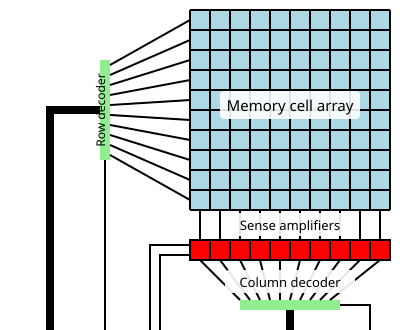

# 2.4. Memory device: DRAM basic

Dynamic random-access memory (DRAM)는 capacitor에 저장한 전하로 1 bit를 나타내는 휘발성 메모리이다. Conventional DRAM의 기본 셀은 access transistor 하나와 storage capacitor 하나로 이루어진 **1T1C cell**이다. 저장 전하는 시간이 지나면 줄어들기 때문에 주기적인 **refresh**가 필요하고, 읽을 때에는 bit line과 전하를 나누기 때문에 읽은 값의 **restore**가 필요하다.[1–3]

이 글은 [Memory device: Overview](basics.md)의 array·word line·bit line 개념을 바탕으로, conventional 1T1C cell과 differential sense amplifier의 기본 동작만 다룬다. 핵심 순서는 다음과 같다.

> **Precharge → Activate → Sense → Restore → Column access → Precharge**

여기서 `ACTIVATE`는 row를 열면서 내부적으로 **charge sharing, Sense, Restore**를 시작하는 명령이고, `READ`와 `WRITE`는 열린 row에서 column을 선택하는 명령이다. 이 두 층을 구분해야 DRAM의 동작 순서와 timing을 혼동하지 않는다.[1,2]

## 1. 1T1C cell과 array의 기준 모형

### (1) Cell: 전하로 1 bit 저장

1T1C cell에서 access transistor의 gate는 **word line (WL)**에, 한쪽 전류 단자는 **bit line (BL)**에, 다른 쪽 단자는 storage capacitor의 **storage node (SN)**에 연결된다. $WL$이 낮으면 transistor가 꺼져 cell이 $BL$에서 분리되고, $WL$이 높으면 transistor가 켜져 $SN$과 $BL$ 사이로 전하가 이동한다.[1,2]

| 구성 요소 | 역할 |
| --- | --- |
| Storage capacitor | $SN$의 전하로 한 bit를 저장한다. |
| Access transistor | $WL$에 따라 $SN$과 $BL$의 연결을 제어한다. |
| Word line | 같은 row의 access transistor들을 선택한다. |
| Bit line | 같은 column의 여러 cell이 공유하는 전하 이동 경로이다. |
| Sense amplifier | $BL$ 쌍의 작은 전압차를 판정·증폭하고 cell을 restore한다. |

Capacitor 양단 전압을 $V_\mathrm{cell}=V_\mathrm{SN}-V_\mathrm{plate}$로 정의하면, 선형 capacitor 근사에서 저장 전하는

$$
Q_\mathrm{cell}=C_\mathrm{cell}V_\mathrm{cell}
$$

이다. $C_\mathrm{cell}$은 cell capacitance, $V_\mathrm{plate}$는 capacitor의 반대쪽 plate 전위이다. 이 글에서는 높은 $V_\mathrm{cell}$을 논리 1, 낮은 $V_\mathrm{cell}$을 논리 0으로 부른다. 실제 제품에서는 내부 polarity와 data scrambling 때문에 외부 data bit와 물리적인 $SN$ 전압의 대응이 반대일 수 있다.[1,2]

### (2) Array: row를 먼저 열고 column을 나중에 고른다

같은 $WL$에 연결된 cell들은 한 **row**를 이루고, 각 cell은 서로 다른 $BL$을 통해 sense amplifier에 연결된다. Row decoder가 하나의 $WL$을 선택하면 그 row의 cell들이 각자의 $BL$과 동시에 전하를 공유한다. Sense amplifier 집합은 이 작은 신호를 판정해 row 전체를 보유하므로 **row buffer** 역할도 한다.[1,2]

<figure markdown="span">
  
  <figcaption markdown="1">
    그림 1. DRAM array의 기본 정보 흐름. Row decoder가 한 row를 열면 sense amplifier들이 그 row를 판정·보유하고, column decoder가 필요한 일부 column만 입출력 경로에 연결한다. 원본은 HandigeHarry, “DRAM,” Wikimedia Commons, public domain이며 array·decoder·sense-amplifier 관계를 설명하는 영역을 발췌해 사용했다. 특정 제품의 실제 layout을 나타내지 않는다.[4]
  </figcaption>
</figure>

큰 array는 긴 $WL$과 $BL$의 저항·정전용량 때문에 여러 **subarray**와 **bank**로 나뉜다. 기본 포함 관계는 `cell → row/column → subarray → bank → chip`이다. Basic 동작에서는 cell–bit line–sense amplifier의 관계가 핵심이며, 세부 배선과 cell 구조의 발전은 [Memory device: DRAM advance](dram-advance.md)에서 다룬다.[1,2]

## 2. 동작 과정

DRAM 접근은 명령과 내부 회로 동작을 다음처럼 대응시키면 가장 명확하다.[1,2]

| 세부 단계 | 명령 순서 | 내부 동작 순서 |
| --- | --- | --- |
| Read 단계 | `ACTIVATE → READ → PRECHARGE` | Precharge 상태 → Charge sharing → Sense → Restore와 data output → Close |
| Write 단계 | `ACTIVATE → WRITE → PRECHARGE` | Precharge 상태 → Charge sharing → Sense → Overwrite → Restore → Close |
| Refresh 단계 | `REFRESH` | 내부 row 선택 → Activate → Sense → Restore → Close |

### (1) Read 단계

**1. Precharge.** 접근 전에는 $BL$과 보수 bit line $\overline{BL}$을 같은 기준 전압 $V_\mathrm{pre}$로 맞추고 두 선의 잔류 차이를 제거한다. Conventional differential sensing에서는 보통 $V_\mathrm{pre}=V_\mathrm{DD}/2$를 사용한다. 이 상태에서 두 선은 논리 0과 1 어느 방향의 작은 변화도 받아들일 수 있다.[1,2]

**2. Activate.** `ACTIVATE`가 row address를 선택하면 $WL$이 올라가 access transistor가 켜진다. 선택된 cell의 $SN$과 $BL$이 연결되고 두 capacitance 사이에 **charge sharing**이 일어난다. $BL$이 기준 전압보다 어느 방향으로 움직이는지가 저장 bit를 나타낸다.[1,2]

Charge sharing 직전의 bit-line capacitance와 전압을 $C_\mathrm{BL}$, $V_\mathrm{pre}$로 두고, cell의 초기 전압을 $V_\mathrm{cell}$로 두자. Leakage, 배선 저항과 sense-amplifier loading을 무시하면 전하 보존으로

$$
V_\mathrm{BL}'
=
\frac{C_\mathrm{BL}V_\mathrm{pre}
+C_\mathrm{cell}V_\mathrm{cell}}
{C_\mathrm{BL}+C_\mathrm{cell}}
$$

이고, 기준 전압에서 벗어난 크기는

$$
\Delta V_\mathrm{BL}
=
V_\mathrm{BL}'-V_\mathrm{pre}
=
\frac{C_\mathrm{cell}}
{C_\mathrm{BL}+C_\mathrm{cell}}
\left(V_\mathrm{cell}-V_\mathrm{pre}\right)
$$

이다. 긴 $BL$에는 많은 cell과 배선의 기생 capacitance가 연결되므로 보통 $C_\mathrm{BL}$이 $C_\mathrm{cell}$보다 크다. 따라서 cell이 만드는 $\Delta V_\mathrm{BL}$은 full-swing 논리 전압보다 훨씬 작고, 직접 외부로 보낼 수 없다.[1,2]

**3. Sense.** 충분한 $\Delta V_\mathrm{BL}$이 형성되면 cross-coupled sense amplifier를 켠다. Positive feedback은 더 높은 쪽을 $V_\mathrm{DD}$로, 더 낮은 쪽을 0 V로 밀어 작은 차이를 full-swing 차동 신호로 증폭한다. Sense amplifier가 너무 일찍 켜지면 cell 신호보다 offset과 noise가 판정을 지배할 수 있고, 너무 늦게 켜지면 접근 시간이 길어진다.[1,2]

**4. Restore.** Charge sharing은 $SN$의 원래 전압을 바꾸므로 DRAM read는 **destructive read**이다. 그러나 $WL$이 계속 켜진 상태에서 sense amplifier가 $BL$을 full swing으로 구동하면 그 전압이 $SN$에도 전달되어 원래 bit가 다시 저장된다. 이것이 restore이며, sense amplifier는 판정·증폭뿐 아니라 cell의 재충전도 담당한다.[1,2]

**5. Column access.** Row의 신호가 충분히 판정되면 `READ`가 column address를 선택한다. Column multiplexer는 row buffer의 일부 bit만 global data line과 I/O circuit으로 전달한다. 따라서 `ACTIVATE`는 cell에서 row buffer로 row를 여는 과정이고, `READ`는 열린 row에서 필요한 column을 외부로 내보내는 과정이다.[1,2]

**6. Close.** 다른 row를 열려면 `PRECHARGE`로 현재 row를 닫는다. 먼저 $WL$을 내려 cell을 $BL$에서 분리하고 sense amplifier를 끈 뒤, $BL$과 $\overline{BL}$을 다시 $V_\mathrm{pre}$로 맞춘다. 이 마지막 Precharge가 다음 접근의 첫 Precharge 상태가 된다.[1,2]

!!! note "단계 사이의 겹침"
    위 여섯 이름은 인과관계를 보여주는 순서이다. 실제 파형에서는 Sense와 Restore가 연속적으로 진행되고, cell의 restore가 완전히 끝나기 전에 row buffer의 신호가 column access에 충분한 수준에 도달할 수 있다. 따라서 `Sense → Restore → Column access`를 서로 겹치지 않는 세 구간으로 해석하지 않는다.[1,2]

!!! info "[Measurement]"
    Read 파형에서는 $WL$, $BL$, $\overline{BL}$, sense-enable과 출력 신호를 함께 기록한다. Cell이 만든 차동 입력은

    $$
    \Delta V_\mathrm{BL}(t)
    =
    V_\mathrm{BL}(t)-V_{\overline{\mathrm{BL}}}(t)
    $$

    로 계산한다. $WL$ 상승 뒤 sense amplifier 출력이 판정 기준을 지나는 시간은

    $$
    t_\mathrm{sense}
    =
    t_{\mathrm{SA,out},50\%}-t_{\mathrm{WL},50\%}
    $$

    로 둘 수 있다. $C_\mathrm{BL}$, 초기 $V_\mathrm{cell}$, sense-enable 시점, offset, $V_\mathrm{DD}$와 온도를 함께 기록해야 charge-sharing 부족과 sense-amplifier 오판을 구분할 수 있다.[1,2]

### (2) Write 단계

Write도 닫힌 row의 cell을 곧바로 구동하지 않는다. 먼저 `ACTIVATE`로 대상 row를 row buffer에 연 뒤, `WRITE`로 선택한 column의 기존 상태를 새 data로 덮어쓴다.[1,2]

**1. Activate.** 대상 row를 열어 sense amplifier가 현재 값을 판정한다.

**2. Column select.** Column decoder가 바꿀 bit를 local sense amplifier와 write driver 사이에 연결한다.

**3. Overwrite.** Write driver가 선택한 $BL$ 쌍을 새 data polarity로 강하게 구동하여 sense amplifier의 기존 상태를 뒤집거나 유지한다.

**4. Restore.** $WL$이 켜져 있으므로 새 $BL$ 전압이 선택 cell의 $SN$을 충전하거나 방전한다. Write recovery가 끝나기 전에 row를 닫으면 cell에 충분한 전하가 저장되지 않을 수 있다.

**5. Close.** `PRECHARGE`가 $WL$을 내리고 $BL$ 쌍을 $V_\mathrm{pre}$로 되돌린다.

즉, read와 write는 row를 여는 앞부분을 공유한다. 차이는 read가 row buffer의 선택 data를 외부로 전달하는 반면, write는 외부 data로 row buffer와 cell의 선택 column을 덮어쓴다는 점이다.[1,2]

### (3) Refresh 단계

Refresh는 새로운 data를 입출력하지 않고 기존 row를 **Select → Activate → Sense → Restore → Close**하는 내부 접근이다. Row를 선택·활성화해 남아 있는 작은 전압차를 sense amplifier가 판정하고, full-swing 전압으로 cell을 다시 충전한 다음 row를 닫는다. 그러므로 refresh는 각 cell에 전원만 다시 공급하는 동작이 아니라, row 단위의 read-and-restore 과정이다.[2,3]

`Auto-refresh`에서는 memory controller가 refresh 명령을 보내고 DRAM 내부 counter가 대상 row를 정한다. `Self-refresh`에서는 저전력 상태에서 DRAM 내부 timing 회로가 refresh를 계속한다. 구체적인 command encoding과 한 번에 처리하는 bank·row 범위는 DRAM 세대와 제품 규격에 따라 달라진다.[2,3]

## 3. Retention과 refresh가 필요한 이유

### (1) Retention time

Access transistor가 꺼져 있어도 junction leakage, transistor의 off-state leakage와 capacitor dielectric leakage 등으로 $SN$의 전하가 변한다. **Retention time** $t_\mathrm{ret}$은 refresh 없이 cell을 두었을 때 저장 bit를 신뢰성 있게 읽을 수 있는 최대 시간이다. 전하가 완전히 0이 되는 시간이 아니라, 남은 cell 신호가 sense amplifier의 판정 조건을 더는 만족하지 못하는 시점이다.[2,3]

누설 전류의 크기를 일정한 $I_\mathrm{leak}$으로 근사하고 허용 가능한 cell 전압 변화를 $\Delta V_\mathrm{allow}$로 두면

$$
t_\mathrm{ret}
\approx
\frac{C_\mathrm{cell}\Delta V_\mathrm{allow}}
{I_\mathrm{leak}}
$$

이다. 이 식은 $C_\mathrm{cell}$이 크고 $I_\mathrm{leak}$이 작을수록 retention이 길어진다는 방향을 보여주는 1차 근사이다. 실제 $I_\mathrm{leak}$은 전압·온도·시간과 cell 상태에 의존하므로, 모든 cell의 retention을 하나의 상수 전류로 정확히 예측할 수는 없다.[2,3]

### (2) Cell 분포와 판정 기준

공정 편차 때문에 cell마다 capacitance와 leakage가 다르며, retention time도 분포를 이룬다. 주변 data pattern이 charge-sharing 조건에 영향을 줄 수 있고, 일부 cell은 시간에 따라 retention 상태가 달라지는 **variable retention time (VRT)**을 보인다. 따라서 평균 cell이 아니라 짧은 retention을 갖는 tail cell까지 정해진 조건에서 올바르게 읽히도록 refresh 조건을 정해야 한다.[2,3]

!!! info "[Measurement]"
    알려진 data pattern을 row에 쓴 뒤 refresh를 정해진 시간 $t_\mathrm{wait}$ 동안 막고 read한다. 오류가 처음 나타나는 대기 시간을 cell 또는 row별 retention time으로 기록한다.

    $$
    t_\mathrm{ret}
    =
    \max\left\{
    t_\mathrm{wait}:
    P_\mathrm{bit\ error}(t_\mathrm{wait})
    \le P_\mathrm{target}
    \right\}
    $$

    여기서 $P_\mathrm{target}$은 시험에서 허용한 bit-error probability이다. 온도, $V_\mathrm{DD}$, data pattern, 반복 횟수와 인접 row activity를 함께 기록하고, 평균뿐 아니라 하위 percentile과 최악 cell을 보고한다.[2,3]

!!! warning "[Interpretation Caveat]"
    Retention test의 read error만으로 특정 leakage 경로를 확정할 수 없다. 부족한 cell 전하, sense-amplifier offset, bit-line imbalance와 coupling이 같은 출력 오류를 만들 수 있기 때문이다. Leakage 원인을 분리하려면 cell test와 transistor·capacitor 구조의 전기적 측정을 함께 사용해야 한다.[2,3]

## 4. Command와 timing의 물리적 의미

### (1) Row를 여는 명령과 column을 고르는 명령

DRAM command는 기본 동작 순서를 외부 interface에서 제어한다.[1,2]

| Command | 핵심 동작 |
| --- | --- |
| `ACTIVATE` | Row를 선택하고 Charge sharing–Sense–Restore를 시작한다. |
| `READ` | 열린 row buffer에서 선택 column을 외부로 출력한다. |
| `WRITE` | 열린 row buffer와 선택 cell을 입력 data로 갱신한다. |
| `PRECHARGE` | Row를 닫고 bit-line 쌍을 다음 접근의 기준 전압으로 되돌린다. |
| `REFRESH` | 내부에서 row를 선택하여 Activate–Sense–Restore–Close를 수행한다. |

같은 bank에서 이미 열린 row의 다른 column을 읽으면 **row hit**이다. 다른 row가 열려 있으면 먼저 `PRECHARGE`하고 새 row를 `ACTIVATE`해야 하므로 **row conflict**가 된다. 이 때문에 DRAM의 접근 지연은 주소가 무작위라는 사실만으로 일정하지 않고, bank와 현재 열린 row 상태에 따라 달라진다.[1,2]

### (2) 기본 timing parameter

Timing parameter는 임의의 대기 시간이 아니라 앞 절의 전하 이동이 충분히 끝나도록 보장하는 최소 시간이다.[1,2]

| Parameter | 명령 사이의 구간 | 보장하는 내부 과정 |
| --- | --- | --- |
| $t_\mathrm{RCD}$ | `ACTIVATE` → `READ/WRITE` | Charge sharing과 Sense가 column access에 충분한 수준에 도달함 |
| $t_\mathrm{RAS}$ | `ACTIVATE` → `PRECHARGE` | Sense와 cell Restore가 완료될 최소 active 시간 |
| $t_\mathrm{RP}$ | `PRECHARGE` → 다음 `ACTIVATE` | $BL$ 쌍의 Precharge와 equalization 완료 |
| $t_\mathrm{RC}$ | 같은 bank의 `ACTIVATE` → 다음 `ACTIVATE` | 한 row cycle의 완료이며 기본적으로 $t_\mathrm{RAS}+t_\mathrm{RP}$ |
| $t_\mathrm{WR}$ | 마지막 write data → `PRECHARGE` | 새 data가 cell에 충분히 Restore되는 write recovery |

$t_\mathrm{RCD}$가 지났다는 것은 cell restore가 완전히 끝났다는 뜻이 아니라, 선택 column을 사용할 만큼 sense 결과가 형성되었다는 뜻이다. 반면 $t_\mathrm{RAS}$는 row를 닫기 전에 cell restore까지 확보해야 한다. 이 차이를 알면 `READ`가 Restore 뒤에만 시작된다는 잘못된 직렬 해석을 피할 수 있다.[1,2]

## 5. 기본 설계 관계

### (1) Cell signal의 세 변수

Charge-sharing 식에서 read signal을 직접 정하는 기본 변수는 $C_\mathrm{cell}$, $C_\mathrm{BL}$과 접근 직전의 $V_\mathrm{cell}$이다.

- 큰 $C_\mathrm{cell}$은 sensing signal과 retention에 유리하지만 작은 cell 면적에 구현하기 어렵다.
- 작은 $C_\mathrm{BL}$은 $\Delta V_\mathrm{BL}$과 속도에 유리하지만, bit line을 짧게 나누면 sense amplifier와 decoder의 면적 overhead가 늘어난다.
- 높은 access-transistor on-current는 charge sharing과 write를 빠르게 하지만, 낮은 off-state leakage도 동시에 필요하다.

따라서 DRAM basic의 핵심 설계 문제는 “capacitor를 크게 만들기” 하나가 아니라, 제한된 cell 면적에서 저장 전하·bit-line 부하·transistor leakage·sense-amplifier 판정 여유를 함께 맞추는 것이다.[1–3]

## 6. 요약

- 1T1C DRAM은 access transistor와 storage capacitor로 1 bit를 저장하며, cell은 $WL$로 선택되고 $BL$을 통해 sense amplifier에 연결된다.
- Read의 인과 순서는 **Precharge → Activate/Charge sharing → Sense → Restore → Column access → Precharge**이다.
- `ACTIVATE`는 row를 열어 내부 판정과 restore를 시작하고, `READ`와 `WRITE`는 열린 row의 column을 선택한다.
- Read는 charge sharing으로 cell 전압을 바꾸는 destructive read이므로 sense amplifier가 판정한 값을 반드시 restore해야 한다.
- Refresh는 외부 data transfer 없이 row를 **Select → Activate → Sense → Restore → Close**하는 내부 동작이다.
- $t_\mathrm{RCD}$, $t_\mathrm{RAS}$와 $t_\mathrm{RP}$는 각각 판정 가능한 신호 형성, cell restore와 bit-line 초기화에 필요한 시간을 나타낸다.

## 7. 참고문헌

1. D. Lee, *Reducing DRAM Latency at Low Cost by Exploiting Heterogeneity*, Ph.D. dissertation, Carnegie Mellon University (2016). [Author manuscript](https://research.ece.cmu.edu/safari/thesis/dlee_dissertation.pdf).
2. D. T. Wang, *Modern DRAM Memory Systems: Performance Analysis and a High Performance, Power-Constrained DRAM Scheduling Algorithm*, Ph.D. dissertation, University of Maryland, College Park (2005). [University record](https://drum.lib.umd.edu/items/b3a2340b-5fe3-4230-b8aa-7d4128baad62).
3. J. Liu, B. Jaiyen, Y. Kim, C. Wilkerson, and O. Mutlu, “An Experimental Study of Data Retention Behavior in Modern DRAM Devices: Implications for Retention Time Profiling Mechanisms,” *Proceedings of the 40th Annual International Symposium on Computer Architecture*, 60–71 (2013). [DOI: 10.1145/2485922.2485928](https://doi.org/10.1145/2485922.2485928).
4. HandigeHarry, “DRAM,” *Wikimedia Commons* (2006), public domain. [파일 설명과 라이선스](https://commons.wikimedia.org/wiki/File:DRAM.svg).
