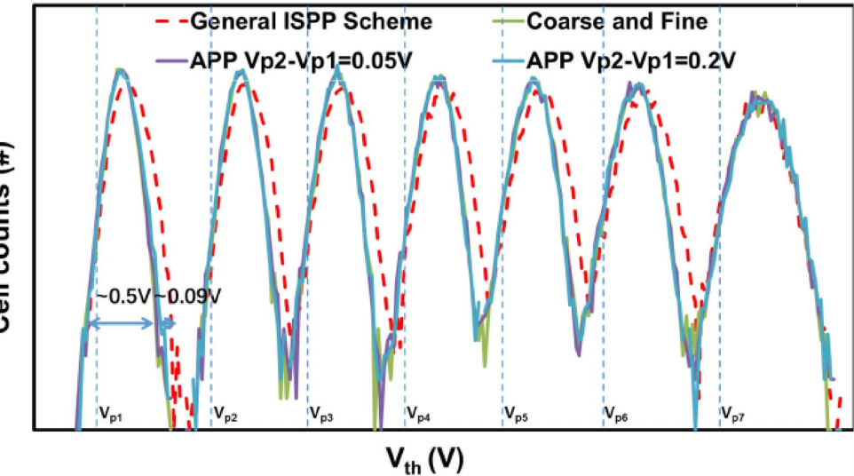
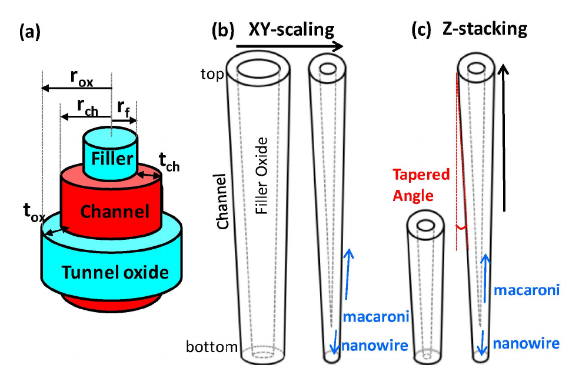

# 2.7. Memory device: NAND advance

[Memory device: NAND basic](nand.md)에서는 NAND string, floating gate·charge trap, program·read·erase의 기본 동작을 설명했다. 이 글은 그 동작을 고밀도 NAND로 확장할 때 생기는 두 가지 핵심 제약을 다룬다.

1. 한 셀에 더 많은 bit를 저장하면 같은 문턱전압 범위를 더 많은 상태가 나누어 써야 하므로 **판독 여유**가 감소한다.[1–4]
2. 한 string에 더 많은 three-dimensional (3D) cell을 쌓으면 긴 poly-Si channel과 공정 산포 때문에 **string on-current**를 확보하기 어려워진다.[5–7]

Multi-level cell (MLC)·triple-level cell (TLC), incremental step pulse programming (ISPP), 문턱전압 산포, macaroni channel과 on-current는 별개의 주제가 아니다. 좁은 상태 간격을 정확히 배치하려면 ISPP가 필요하고, 산포가 상태 간격을 침범하면 판독 오류가 발생하며, string 전류가 작거나 불균일하면 그 상태를 구별하는 감지 여유까지 줄어든다. 따라서 고급 NAND 설계는 **용량–program 시간–전압 여유–전류–신뢰성**의 결합 문제로 이해해야 한다.

## 1. MLC와 TLC 상태 부호화

### (1) 상태 수와 기준 전압

한 셀이 $b$개의 bit를 저장하려면 문턱전압 $V_T$를 $2^b$개의 상태로 구분해야 한다. 인접 상태를 나누는 판독 기준 전압은 이상적으로 $2^b-1$개가 필요하다. Single-level cell (SLC)은 그 기준이 되는 1 bit/cell 방식이다.[1–3]

$$
N_\mathrm{state}=2^b,
\qquad
N_\mathrm{ref}=2^b-1
$$

| 저장 방식 | 셀당 bit | 상태 수 | 기준 전압 수 | 이 글의 상태 표기 |
| --- | ---: | ---: | ---: | --- |
| SLC | 1 | 2 | 1 | E, P1 |
| MLC | 2 | 4 | 3 | E, P1–P3 |
| TLC | 3 | 8 | 7 | E, P1–P7 |

여기서 E는 erased state이고 P1, P2, …는 $V_T$가 증가하는 순서로 붙인 programmed state이다. 산업 용어에서 MLC는 넓게는 여러 bit를 저장하는 셀 전체를 뜻하기도 하지만, 이 글에서는 혼동을 피하기 위해 **MLC=2 bit/cell**, **TLC=3 bit/cell**로 사용한다. 각 상태와 실제 bit pattern의 대응은 제품의 page coding과 controller 설계에 따라 달라지므로, `E=111`과 같은 특정 mapping을 일반 규칙으로 가정하지 않는다.[1,2,7]

### (2) Page scheme과 판독 순서

MLC의 두 bit는 보통 lower·upper page, TLC의 세 bit는 lower·middle·upper page와 같은 논리 page로 나누어 다룬다. 같은 word line (WL)의 셀들이 여러 page를 공유하지만, 각 page 판독은 필요한 기준 전압의 일부만 사용하여 해당 bit를 판정한다. 예를 들어 TLC 셀 하나의 최종 상태를 완전히 식별하려면 최대 일곱 경계를 구분해야 하지만, 특정 논리 page를 읽을 때의 비교 순서와 횟수는 state-to-bit mapping에 따라 달라질 수 있다.[2,3,7]

중요한 점은 page 이름이 물리적으로 분리된 저장층을 뜻하지 않는다는 것이다. 세 page의 bit는 한 셀의 **하나의 $V_T$ 상태**에 함께 부호화된다. 따라서 한 page의 program이 같은 셀에 이미 기록한 다른 page의 상태를 바꿀 수 있으며, 실제 algorithm은 one-shot 또는 multi-step program과 page 순서를 이용해 이 변화를 관리한다.[2,3,7]

### (3) 밀도와 판독 여유의 상충관계

사용 가능한 전체 program window가 같다면 SLC에서 TLC로 갈수록 각 상태가 차지할 수 있는 폭과 인접 상태 사이 여유가 감소한다. 상태 $i$의 상한을 $V_{i,\mathrm{U}}$, 다음 상태의 하한을 $V_{i+1,\mathrm{L}}$, 그 사이 기준 전압을 $R_i$라 하면 국소 판독 여유는 다음처럼 정의할 수 있다.

$$
M_i=\min\left(R_i-V_{i,\mathrm{U}},\;V_{i+1,\mathrm{L}}-R_i\right)
$$

$V_{i,\mathrm{U}}$와 $V_{i+1,\mathrm{L}}$는 확률분포의 수학적 끝점이 아니라, 비교할 때 정한 분위수 경계 또는 제품 규격 경계이다. 예를 들어 전체 program window의 폭을 $W$라 하고 모든 상태를 같은 폭으로 나누는 이상화에서는 상태당 폭이 MLC에서 $W/4$, TLC에서 $W/8$이 된다. 실제 분포는 상태마다 폭과 간격이 다르므로 이 예는 상태 수 증가가 여유를 줄이는 경향만 보여준다.

$M_i$가 작아지면 작은 program overshoot, retention shift, random telegraph noise (RTN) 또는 판독 기준 전압 오차도 bit error로 이어질 수 있다. MLC·TLC의 고밀도 이득은 셀 수를 늘리지 않고 bit 수를 늘리는 대신, 더 정밀한 program·read와 더 강한 error-correcting code (ECC)를 요구하는 방식으로 얻어진다.[1,3,4,7]

## 2. ISPP와 상태 배치

### (1) Pulse–verify–inhibit loop

ISPP는 높은 program 전압을 한 번 인가하는 방식이 아니라 **program pulse → verify read → 통과한 셀 inhibit → 미달 셀에 다음 pulse**를 반복하는 폐루프 방식이다. $k$번째 program pulse는 $k=0,1,2,\ldots$에 대하여 단순화하면 다음처럼 쓸 수 있다.[3,8]

$$
V_\mathrm{PGM}(k)=V_\mathrm{start}+k\,\Delta V_\mathrm{ISPP}
$$

목표 verify level에 도달한 셀의 bit line (BL)은 inhibit하여 이후 pulse의 program 효과를 줄인다. 아직 목표에 도달하지 못한 셀만 다음 단계로 진행하므로, 셀별 program 속도가 달라도 최종 $V_T$를 같은 상태 구간 안에 모을 수 있다.[3,7,8]

예를 들어 이전 loop에서 verify level 바로 아래에 있던 빠른 셀은 다음 pulse에서 만든 $\Delta V_T$만큼 기준을 넘어 위쪽 분포 꼬리를 형성할 수 있다. 반대로 verify level에서 멀리 떨어진 느린 셀은 전체 loop 수와 program 시간을 결정한다. ISPP는 이 두 집단의 차이를 verify와 inhibit로 제한하지만, overshoot한 셀을 같은 page program 중에 낮은 상태로 되돌리기는 어렵다.[3,8]

### (2) Program step과 시간

한 pulse가 만드는 문턱전압 증분은 1차적으로

$$
\Delta V_T\approx\alpha\,\Delta V_\mathrm{ISPP}
$$

로 나타낼 수 있다. $\alpha$는 program coupling과 저장층·channel의 응답을 묶은 유효 계수이다. 작은 $\Delta V_\mathrm{ISPP}$는 verify level을 넘어가는 최대 overshoot를 줄여 분포를 좁히는 데 유리하지만, 같은 목표 상태에 도달하려면 pulse와 verify 횟수가 증가한다. 반대로 큰 step은 program 시간을 줄일 수 있으나 위쪽 분포 꼬리와 인접 상태 침범 위험을 키운다.[3,8]

그림 1은 TLC의 P1–P7 programmed state에서 일반 ISPP와 pulse를 적응적으로 조정한 방법을 비교한 실험 예이다. 각 peak의 위치뿐 아니라 valley와 분포 꼬리가 판독 여유를 결정한다는 점에 주목해야 한다.[3]

<figure markdown="span">
  
  <figcaption markdown="1">
    그림 1. TLC programmed state의 문턱전압 분포와 program scheme 비교. 점선은 일반 ISPP, 실선은 coarse-and-fine 또는 adaptive pulse programming 결과이며, 수직 점선은 각 verify 위치를 나타낸다. 그림의 $V_\mathrm{th}$는 이 글의 $V_T$와 같은 문턱전압이고, erased state는 이 패널에 포함되지 않는다. 출처: Z. Du et al., “Adaptive Pulse Programming Scheme for Improving the Vth Distribution and Program Performance in 3D NAND Flash Memory,” Figure 6, <i>IEEE Journal of the Electron Devices Society</i> <b>9</b>, 102–107 (2021), <a href="https://creativecommons.org/licenses/by/4.0/">CC BY 4.0</a>. 원본 PDF 4쪽에서 Figure 6의 그래프만 추출·크롭했으며 축, 범례와 색상은 수정하지 않았다.[3]
  </figcaption>
</figure>

### (3) Program 속도 산포

같은 WL에 같은 pulse를 인가해도 cell마다 $\Delta V_T$가 같지는 않다. Tunnel stack, trap density, channel profile과 WL RC delay의 차이 때문에 빠른 셀은 verify level을 크게 넘어갈 수 있고 느린 셀은 더 많은 loop를 요구한다. Adaptive pulse programming, coarse-and-fine programming과 multi-step programming은 이 program-speed variation을 분류하거나 단계별로 줄이는 방법이다.[2,3,7]

!!! info "[Measurement]"
    ISPP를 비교할 때에는 최종 분포 폭만 보고하지 않는다. 같은 target state와 온도에서 다음 항목을 함께 측정한다.

    - $V_\mathrm{start}$, $\Delta V_\mathrm{ISPP}$, pulse width와 verify level
    - 목표 상태까지의 program pulse 수와 verify 횟수
    - page program time $t_\mathrm{PROG}$
    - 각 상태의 평균 $\mu_i$, 표준편차 $\sigma_i$, 위·아래쪽 분포 꼬리
    - WL 위치, program/erase (P/E) cycle 수와 program data pattern

    단일 셀의 목표 상태 도달 loop 수는 다음 기준으로 정의할 수 있다.

    $$
    N_\mathrm{ISPP}=\min\{k\mid V_T(k)\ge V_\mathrm{vfy}\}
    $$

    Page program에서는 inhibit되지 않은 셀 중 가장 늦게 기준을 통과한 셀이 종료 시점을 정한다. 또한 상태 $i$의 꼬리를 포함한 분포 폭은 같은 분위수 $q$를 사용하여

    $$
    W_i(q)=Q_{1-q}(V_T\mid i)-Q_q(V_T\mid i)
    $$

    로 비교한다. 여기서 $Q_q$는 $q$ 분위수이며, 사용한 $q$, 표본 수와 제외 기준을 함께 보고한다. $\sigma_i$가 작아졌더라도 $N_\mathrm{ISPP}$나 $t_\mathrm{PROG}$이 크게 늘었다면 동일한 개선으로 볼 수 없다. Program scheme은 **분포 폭과 시간의 Pareto trade-off**로 평가한다.[3,8]

## 3. 문턱전압 산포와 판독 오류

### (1) 분포 겹침과 RBER

산포는 같은 상태로 program한 셀들의 $V_T$가 하나의 값이 아니라 확률분포를 이루는 현상이다. 인접 상태 $i$와 $i+1$의 확률밀도를 각각 $p_i(V)$와 $p_{i+1}(V)$, 기준 전압을 $R_i$라 하면 이 경계에서의 판독 오류 성분은 다음처럼 표현할 수 있다.[1,4]

$$
P_{e,i}(R_i)
=
\pi_i\int_{R_i}^{\infty}p_i(V)\,dV
+
\pi_{i+1}\int_{-\infty}^{R_i}p_{i+1}(V)\,dV
$$

$\pi_i$는 상태 $i$의 발생 비율이다. 두 분포 꼬리가 비대칭이면 최적 $R_i$는 두 peak의 단순 중간값과 다를 수 있다. Array에서는 실제로 잘못 판독한 bit의 비율인 raw bit error rate (RBER)를

$$
\mathrm{RBER}=\frac{N_\mathrm{error}}{N_\mathrm{read\ bits}}
$$

로 측정하고, read retry로 $R_i$를 이동시키며 valley와 최적 기준 전압을 찾는다.[1,4,7]

!!! info "[Measurement]"
    같은 data pattern을 program한 뒤 기준 전압 $R$을 주사하고 각 지점의 RBER를 계산한다. 경계 $i$의 실험적 최적 기준 전압은

    $$
    R_i^*=\underset{R}{\operatorname{arg\,min}}\;\mathrm{RBER}_i(R)
    $$

    로 정한다. 주사 간격, 판독 횟수, 표본 bit 수, 온도, P/E cycle과 retention age를 함께 고정·보고해야 서로 다른 조건의 $R_i^*$와 RBER를 비교할 수 있다.[1,4]

### (2) 산포 원인의 분류

산포 원인은 최종 histogram에서는 함께 보이지만, 발생 시점과 방향이 다르다. 같은 내용을 여러 reliability 항목에서 반복하지 않도록 **초기 산포–동작 중 간섭–시간·열화**의 세 묶음으로 구분하는 편이 유용하다.[1,4,6,7]

| 분류 | 대표 원인 | 분포에 나타나는 결과 | 구분을 위한 주사 조건 |
| --- | --- | --- | --- |
| 초기 산포 | channel-hole 직경·taper, tunnel stack, trap·grain 분포, program-speed variation | 평균·폭과 층별 상태 위치 차이 | WL 위치, 소자 형상, 첫 program 직후 |
| 동작 중 간섭 | 인접 WL program, pass voltage, read disturb, RTN | data-pattern 의존 shift, 순간 fluctuation, 분포 꼬리 증가 | 이웃 pattern, 판독 횟수, 시간 분해 측정 |
| 시간·열화 | retention loss, early retention loss, P/E cycling과 trap 생성 | 시간에 따른 상태 이동·확대, RBER 증가 | 보존 시간, 온도, P/E cycle 수 |

P/E cycling은 dielectric과 interface의 defect 상태를 바꾸어 분포를 이동·확대할 수 있다. 3D charge-trap NAND에서는 program 직후 수 시간에 변화가 빠른 early retention loss와 WL별 process variation도 보고되었다. 따라서 “3D이므로 planar보다 항상 신뢰성이 높다”거나 “TLC 오류는 모두 상태 수 증가 때문”이라고 단정할 수 없다.[1,4,6,7]

### (3) Gaussian 근사의 한계

분포를 평균과 표준편차로 요약하기 위해 Gaussian model을 사용할 수 있지만, 실제 histogram은 state, P/E age와 위치에 따라 비대칭 꼬리 또는 여러 기작이 섞인 형상을 보일 수 있다. Cai et al.의 실측 MLC 연구에서는 Gaussian이 계산에 편리한 근사였으나 non-parametric estimate가 peak를 더 잘 표현했다.[1] Du et al.의 TLC program 실험에서도 program scheme에 따라 분포 꼬리의 형상이 달라졌다.[3] 따라서 Gaussian은 분포를 요약하는 model이지 꼬리의 보편적 형태를 보장하는 법칙이 아니다.[1,3]

!!! warning "[Interpretation Caveat]"
    $\mu_i$와 $\sigma_i$만 같다고 두 NAND가 같은 RBER를 갖는 것은 아니다. 오류는 분포 중심보다 기준 전압 부근의 꼬리에 민감하고, read mapping·ECC·온도·보존 시간이 다르면 같은 histogram도 다른 system-level failure로 이어질 수 있다. Gaussian fitting을 사용할 때에는 fitting 범위, 꼬리 residual과 판독 기준 전압 조건을 함께 제시한다.[1,3,4]

## 4. 3D NAND와 macaroni channel

### (1) Vertical string과 gate-all-around cell

3D NAND는 평면에서 cell pitch를 계속 줄이는 대신, 여러 WL을 수직으로 쌓고 memory hole을 관통시켜 하나의 vertical string을 형성한다. 각 수평 WL은 원통형 channel을 둘러싸는 gate-all-around (GAA) cell이 되고, charge-trap·tunnel dielectric·blocking dielectric은 hole 측벽을 따라 연속적으로 형성된다. 이 구조는 적층 수로 density를 늘릴 수 있지만, 깊은 hole의 식각과 얇은 막의 균일도가 모든 층의 전기 특성에 직접 연결된다.[7,9–11]

### (2) Macaroni channel의 단면

Macaroni channel은 memory hole 전체를 poly-Si로 채우지 않고, 중앙을 oxide filler로 채운 뒤 그 바깥에 얇은 고리 모양 poly-Si channel을 둔 구조이다. 단면을 자르면 속이 찬 nanowire가 아니라 얇은 면이 둘러진 마카로니처럼 보이기 때문에 붙은 이름이다. Gate 쪽에서 안쪽으로 보면 대체로 **gate–blocking dielectric–charge-trap layer–tunnel dielectric–poly-Si channel–filler oxide** 순서이다.[5,7,10,11]

얇은 channel은 완전 공핍에 가까운 electrostatics를 만들고, 두꺼운 poly-Si core보다 전류 경로에 포함되는 grain 수를 줄여 subthreshold 특성과 cell-to-cell 전류 분포를 제어하는 데 유리하다. 그러나 channel이 poly-Si라는 사실과 channel·oxide 양쪽 interface trap은 남아 있으므로, macaroni 구조가 grain-boundary 문제를 제거하는 것은 아니다.[5,6,10,11]

<figure markdown="span">
  
  <figcaption markdown="1">
    그림 2. Macaroni channel의 단면과 channel-hole scaling. (a)는 중앙 filler, 얇은 channel과 tunnel oxide의 동심 구조를, (b)·(c)는 XY scaling과 적층 높이 증가 시 taper 때문에 하부가 nanowire에 가까워질 수 있음을 나타낸다. 출처: D. Lee and C. Shin, “Impact of Stacking-Up and Scaling-Down Bit Cells in 3D NAND on Their Threshold Voltages,” Figure 2, <i>Micromachines</i> <b>13</b>, 1139 (2022), <a href="https://creativecommons.org/licenses/by/4.0/">CC BY 4.0</a>. 원본 PDF 2쪽에서 Figure 2만 추출·크롭했으며 표기와 색상은 수정하지 않았다.[10]
  </figcaption>
</figure>

### (3) Channel-hole taper와 층간 산포

적층이 높아질수록 높은 aspect ratio의 hole을 완전히 수직으로 식각하기 어렵고, 하부 직경이 상부보다 작은 taper가 생길 수 있다. 그 결과 같은 string에서도 channel 반경, filler 반경, interface 면적과 electrostatic coupling이 WL 위치에 따라 달라진다. 축소가 심하면 하부 channel은 macaroni에서 속이 찬 nanowire에 가까운 형태로 바뀔 수 있다.[10–12]

Taper는 단순한 형상 오차가 아니다. 좁아진 하부 channel은 channel resistance와 $I_\mathrm{ON}$, $V_T$, subthreshold slope (SS) 및 program efficiency를 함께 바꿀 수 있다. 그러므로 WL별 $V_T$ 차이를 저장 전하의 차이로만 해석하지 말고, channel-hole profile과 층 위치를 함께 확인해야 한다.[4,10,12]

## 5. String on-current

### (1) Cell on-current와 string current

Cell on-current $I_\mathrm{ON}$은 선택 transistor 자체의 구동 능력이고, string current $I_\mathrm{string}$은 선택 cell, 수십·수백 개의 pass cell, select transistor와 contact를 모두 지난 전류이다. 판독 회로가 직접 감지하는 값은 후자이다. 선형 저항 근사에서는

$$
I_\mathrm{string}
\approx
\frac{V_\mathrm{BL}}
{R_\mathrm{selected}+\sum_j R_{\mathrm{pass},j}+R_\mathrm{select}+R_\mathrm{contact}}
$$

로 방향성을 이해할 수 있다. 실제 transistor는 비선형이고 각 cell potential이 서로 결합되므로 이 식은 정확한 compact model이 아니라, 직렬 저항이 누적된다는 사실을 보여주는 근사이다.[5,7,12]

### (2) Poly-Si grain boundary와 percolation

3D NAND channel은 증착한 amorphous Si를 결정화하여 형성하므로 여러 grain과 grain boundary를 포함한다. Grain boundary의 defect와 trapped charge는 국소 potential barrier를 만들고 carrier scattering을 증가시킨다. 전류는 균일한 원통 전체를 흐르기보다 barrier가 낮은 경로를 따라 percolation하며, grain 모양과 trap 위치가 달라지면 $I_\mathrm{ON}$과 $V_T$도 cell마다 달라진다.[5,6]

이 현상은 평균 전류 감소와 산포 증가를 동시에 만든다. 특히 저전류 분포 꼬리의 cell 하나가 긴 string의 감지 시간을 제한할 수 있으므로, 평균 $I_\mathrm{ON}$만 높이는 것으로는 충분하지 않다. Grain-boundary trap density가 증가할 때 simulated $I_\mathrm{ON}$ 분포가 낮아지고 넓어지는 결과도 보고되었다.[5,6]

### (3) 적층·pitch·taper의 전류 비용

적층 수가 증가하면 통과해야 하는 pass cell 수와 channel 길이가 증가한다. 동시에 전체 stack 높이를 제한하려고 vertical pitch를 줄이면 gate control과 neighbor coupling이 변하고, 깊은 hole의 taper는 하부 channel 저항을 높일 수 있다. 이 세 효과는 모두 $I_\mathrm{string}$을 낮추거나 WL별로 다르게 만들 수 있지만 원인은 다르므로 분리해서 측정해야 한다.[5,10–12]

전류를 높이기 위해 channel을 두껍게 하거나 pass voltage를 올리면 다른 비용이 생긴다. 두꺼운 poly-Si channel은 더 많은 grain boundary와 불완전 공핍의 영향을 받을 수 있고, 높은 $V_\mathrm{pass}$는 read disturb와 oxide stress를 증가시킬 수 있다. Vertical pitch와 gate coupling을 바꾸면 $V_T$, program voltage와 $I_\mathrm{ON}$이 함께 변한다. 따라서 on-current 개선은 **전류 하나의 최대화가 아니라 판독 여유·disturb·program 조건을 함께 맞추는 최적화**이다.[3,5,11,12]

!!! info "[Measurement]"
    Cell과 string의 전류 문제를 구분하려면 다음 조건을 고정하여 $I_\mathrm{BL}$–$V_\mathrm{read}$를 측정한다.

    - 선택 WL의 state와 $V_\mathrm{read}$
    - 비선택 WL의 $V_\mathrm{pass}$
    - $V_\mathrm{BL}$, source-line bias
    - string-select gate at drain side (SGD)와 source-select gate (SGS)의 bias
    - string의 WL 수와 선택 WL 위치
    - 온도, P/E cycle, retention age와 data pattern

    같은 bias와 표본 집합에서 전류 산포는

    $$
    \mathrm{CV}_I=\frac{\sigma(I_\mathrm{string})}{\mu(I_\mathrm{string})}
    $$

    로 정규화할 수 있고, 저전류 성능은 $I_{\mathrm{string},p}=Q_p(I_\mathrm{string})$로 보고할 수 있다. 여기서 $p$는 미리 정한 낮은 분위수이며, 비교할 때 같은 $p$, 표본 수와 제외 기준을 사용한다. 평균·중앙값·$\mathrm{CV}_I$·$I_{\mathrm{string},p}$를 함께 제시하고, 단일-cell test vehicle의 $I_\mathrm{ON}$과 전체 string의 $I_\mathrm{string}$을 같은 지표처럼 비교하지 않는다.[5,6,12]

!!! warning "[Interpretation Caveat]"
    낮은 판독 전류만으로 grain boundary를 원인으로 확정할 수 없다. Channel taper, contact resistance, pass cell의 $V_T$, select-gate 저항, trapped charge와 감지 bias도 같은 결과를 만들 수 있다. 온도 의존성, WL 위치, 소자 형상별 split과 단일-cell·전체 string 측정을 함께 사용해야 원인을 분리할 수 있다.[5,6,12]

## 6. 설계 변수의 결합

| 설계 변수 | 직접 얻는 이점 | 함께 증가할 수 있는 비용 | 우선 확인할 지표 |
| --- | --- | --- | --- |
| 셀당 bit 수 증가 | bit density 증가 | 상태 간격·판독 여유 감소 | 상태별 분포 꼬리, RBER, read retry |
| $\Delta V_\mathrm{ISPP}$ 감소 | program 분포 축소 | pulse·verify 횟수와 $t_\mathrm{PROG}$ 증가 | $\sigma_i$, loop 수, program 시간 |
| 적층 수 증가 | 평면 면적당 용량 증가 | hole aspect ratio, pass 경로와 층간 산포 증가 | WL별 $V_T$, $I_\mathrm{string}$, RBER |
| channel 두께 감소 | 완전 공핍과 electrostatic control 개선 | 단면 감소, interface 영향 증가 가능 | SS, $I_\mathrm{ON}$ 분포 꼬리, interface trap |
| $V_\mathrm{pass}$ 증가 | 비선택 cell 저항 감소 | read disturb와 dielectric stress 증가 | $I_\mathrm{string}$, disturb 횟수 |
| 판독 기준 전압 보정 | 분포 이동에 대한 판독 여유 회복 | retry latency와 controller 부담 | 최적 $R_i$, RBER, 판독 지연 시간 |

이 표의 핵심은 MLC/TLC, ISPP, 산포, 3D 구조와 on-current를 순서 없이 나열하지 않는 데 있다. 먼저 상태 수가 필요한 판독 여유를 정하고, ISPP가 초기 분포를 배치하며, 공정·시간·동작 스트레스가 그 분포를 이동시킨다. 3D channel 구조는 $V_T$와 전류의 층별 기반을 만들고, 최종적으로 sense amplifier와 controller가 $I_\mathrm{string}$과 기준 전압을 사용해 data를 판정한다.[1,3–7,10,12]

## 7. 요약

- MLC는 2 bit/cell의 네 상태, TLC는 3 bit/cell의 여덟 상태를 사용하며, 상태 수가 늘수록 같은 program window 안의 판독 여유는 감소한다.
- ISPP는 pulse–verify–inhibit loop로 상태를 배치한다. 작은 전압 step은 분포를 좁히지만 program·verify 횟수를 늘린다.
- 문턱전압 산포는 초기 공정·program variation, 동작 중 간섭, retention·P/E 열화로 나누어야 하며, 평균보다 기준 전압 부근의 분포 꼬리가 RBER를 결정한다.
- 3D NAND의 macaroni channel은 중앙 oxide filler 주위의 얇은 poly-Si channel이다. 완전 공핍과 전류 산포에 유리하지만 grain boundary와 interface trap을 제거하지는 않는다.
- 높은 적층 수, vertical pitch 축소와 channel-hole taper는 WL별 $V_T$와 string 전류를 변화시킨다.
- On-current는 cell $I_\mathrm{ON}$과 전체 string의 $I_\mathrm{string}$을 구분하고, 평균뿐 아니라 저전류 분포 꼬리와 판독 조건을 함께 평가해야 한다.

## 8. 참고문헌

1. Y. Cai, E. F. Haratsch, O. Mutlu, and K. Mai, “Threshold Voltage Distribution in MLC NAND Flash Memory: Characterization, Analysis, and Modeling,” *2013 Design, Automation & Test in Europe Conference & Exhibition (DATE)*, 1285–1290 (2013). [DOI: 10.7873/DATE.2013.266](https://doi.org/10.7873/DATE.2013.266).
2. T. Cho et al., “A 3.3 V 1 Gb Multi-Level NAND Flash Memory with Non-Uniform Threshold Voltage Distribution,” *2001 IEEE International Solid-State Circuits Conference (ISSCC)*, 30–31 (2001). [DOI: 10.1109/ISSCC.2001.912417](https://doi.org/10.1109/ISSCC.2001.912417).
3. Z. Du, S. Li, Y. Wang, X. Fu, F. Liu, Q. Wang, and Z. Huo, “Adaptive Pulse Programming Scheme for Improving the Vth Distribution and Program Performance in 3D NAND Flash Memory,” *IEEE Journal of the Electron Devices Society* **9**, 102–107 (2021). [DOI: 10.1109/JEDS.2020.3041088](https://doi.org/10.1109/JEDS.2020.3041088).
4. Y. Luo, S. Ghose, Y. Cai, E. F. Haratsch, and O. Mutlu, “Improving 3D NAND Flash Memory Lifetime by Tolerating Early Retention Loss and Process Variation,” *Proceedings of the ACM on Measurement and Analysis of Computing Systems* **2**(3), 1–48 (2018). [DOI: 10.1145/3224432](https://doi.org/10.1145/3224432).
5. D. Verreck et al., “3D TCAD Model for Poly-Si Channel Current and Variability in Vertical NAND Flash Memory,” *2019 International Conference on Simulation of Semiconductor Processes and Devices (SISPAD)*, 61–64 (2019). [DOI: 10.1109/SISPAD.2019.8870494](https://doi.org/10.1109/SISPAD.2019.8870494).
6. C.-W. Yang and P. Su, “Simulation and Investigation of Random Grain-Boundary-Induced Variabilities for Stackable NAND Flash Using 3-D Voronoi Grain Patterns,” *IEEE Transactions on Electron Devices* **61**, 1211–1214 (2014). [DOI: 10.1109/TED.2014.2308951](https://doi.org/10.1109/TED.2014.2308951).
7. A. Goda, “Recent Progress on 3D NAND Flash Technologies,” *Electronics* **10**, 3156 (2021). [DOI: 10.3390/electronics10243156](https://doi.org/10.3390/electronics10243156).
8. K.-D. Suh et al., “A 3.3 V 32 Mb NAND Flash Memory with Incremental Step Pulse Programming Scheme,” *IEEE Journal of Solid-State Circuits* **30**, 1149–1156 (1995). [DOI: 10.1109/4.475701](https://doi.org/10.1109/4.475701).
9. J. Jang et al., “Vertical Cell Array using TCAT (Terabit Cell Array Transistor) Technology for Ultra High Density NAND Flash Memory,” *2009 Symposium on VLSI Technology*, 192–193 (2009). [IEEE Xplore record](https://ieeexplore.ieee.org/document/5200595).
10. D. Lee and C. Shin, “Impact of Stacking-Up and Scaling-Down Bit Cells in 3D NAND on Their Threshold Voltages,” *Micromachines* **13**, 1139 (2022). [DOI: 10.3390/mi13071139](https://doi.org/10.3390/mi13071139).
11. A. S. Spinelli, C. Monzio Compagnoni, and A. L. Lacaita, “Reliability of NAND Flash Memories: Planar Cells and Emerging Issues in 3D Devices,” *Computers* **6**, 16 (2017). [DOI: 10.3390/computers6020016](https://doi.org/10.3390/computers6020016).
12. Y.-T. Oh, N. V. Toan, K. B. Kim, S. H. Shin, Y.-H. Song, H. Sim, and T. Ono, “Impact of Etch Angles on Cell Characteristics in 3D NAND Flash Memory,” *Microelectronics Journal* **79**, 1–6 (2018). [DOI: 10.1016/j.mejo.2018.06.009](https://doi.org/10.1016/j.mejo.2018.06.009).
