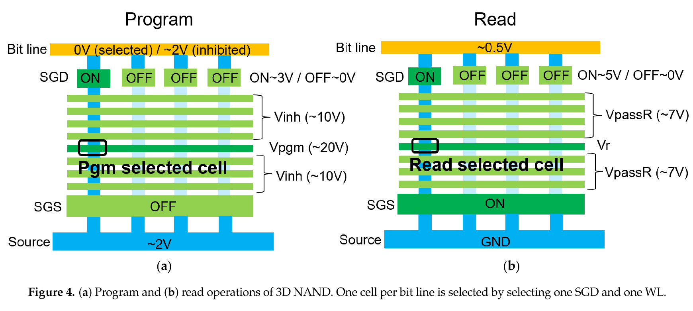
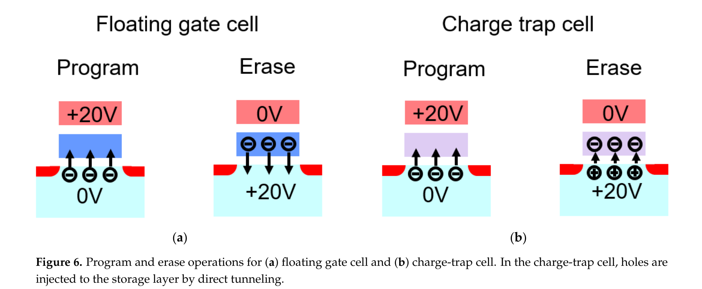

# Memory device: NAND basic

NAND flash memory는 전원이 없어도 저장 상태를 유지하는 비휘발성 메모리이다. 셀에 저장한 전하가 transistor의 문턱전압 $V_T$를 바꾸고, 판독 회로는 선택한 셀이 기준 전압에서 켜지는지를 감지하여 bit를 복원한다. NAND라는 이름은 여러 셀을 직렬로 연결한 **NAND string**에서 왔으며, 이 직렬 구조는 contact 수를 줄여 높은 집적도를 얻는 대신 선택하지 않은 셀도 통과시켜야 하는 고유한 바이어스 절차를 요구한다.[1–4,6]

이 글은 [Memory device: Overview](basics.md)의 cell–page–block 계층을 바탕으로 single-level cell (SLC)을 기준으로 설명한다. 먼저 planar NAND에서 대표적이었던 **floating gate (FG)**와 3D NAND에서 널리 쓰이는 **charge-trap flash (CTF)**의 전환 배경을 비교한다. 이어 두 구조에 공통인 string 선택 원리를 정리한 뒤, 각 구조마다 **동작 표 → program → read → erase** 순서로 세부 과정을 설명한다. Multi-level cell (MLC), triple-level cell (TLC), solid-state drive (SSD) controller와 error-correcting code (ECC)의 상세 구현은 범위에서 제외한다.[1–5]

## 1. NAND string과 저장 상태

### (1) Cell, string, page와 block

NAND array의 기본 연결 관계는 다음과 같다. Bit line (BL)은 여러 string 중 한 열을 판독 회로에 연결하고, word line (WL)은 서로 다른 string에서 같은 위치에 있는 셀의 control gate를 묶는다. String-select gate at drain side (SGD)는 선택한 string을 BL에, source-select gate (SGS)는 common source line에 연결한다. 문헌에 따라 SGD·SGS를 drain select line (DSL)·source select line (SSL)로 부르기도 한다.[1,3,4]

| 계층 | 물리적 구성 | 기본 동작 단위 | 핵심 역할 |
| --- | --- | --- | --- |
| cell | 전하 저장층을 가진 transistor 하나 | 하나 이상의 bit 상태 | 저장 전하를 $V_T$로 변환한다. |
| string | SGD와 SGS 사이에 직렬 연결한 여러 cell | BL에 연결되는 전류 경로 | 선택 셀을 읽을 때 나머지 셀을 pass transistor로 사용한다. |
| page | 같은 WL에 연결되고 병렬로 판독·program되는 cell 집합 | read·program | page buffer와 sense amplifier가 여러 BL을 함께 처리한다. |
| block | 여러 page와 string을 공유하는 array 구간 | erase | 공통 well·channel 바이어스 때문에 여러 page를 함께 지운다. |

직렬 연결의 결과로 한 셀만 켜져도 충분하지 않다. 예를 들어 선택한 셀이 read 전압에서 켜지더라도 같은 string의 비선택 셀 하나가 꺼져 있으면 BL–source line 전류가 흐르지 않는다. 따라서 read와 program에서는 비선택 WL에 저장 상태와 무관하게 channel을 열 수 있는 **pass voltage** $V_\mathrm{pass}$를 인가하고, 선택한 SGD와 SGS까지 켜서 string 전류 경로를 완성한다.[1,3,4]

### (2) 전하와 문턱전압

FG 셀에서 저장 전하와 문턱전압의 1차 정전용량 관계는 다음처럼 쓸 수 있다.[1,5]

$$
V_T=V_{T0}-\frac{Q_\mathrm{store}}{C_\mathrm{eff}}
$$

$V_{T0}$는 저장 전하가 없을 때의 중성 문턱전압, $Q_\mathrm{store}$는 전하의 부호를 포함한 저장 전하, $C_\mathrm{eff}$는 저장층과 control gate·channel의 결합을 나타내는 유효 정전용량이다. 전자를 저장하면 $Q_\mathrm{store}<0$이므로 $V_T$가 증가한다. CTF에서는 전하가 절연막 내부에 공간적으로 분포하므로 같은 식을 정성적인 유효 모형으로 사용하며, 실제 $V_T$ 변화는 trap 위치와 gate–channel 결합에도 의존한다.[1–3,5]

이 글의 SLC 규약에서는 낮은 $V_T$의 **erased state**를 논리 `1`, 전자를 저장하여 $V_T$가 높아진 **programmed state**를 논리 `0`으로 둔다. 두 분포 사이의 read reference voltage $V_\mathrm{ref}$에서 셀이 켜지면 erased state, 꺼지면 programmed state로 판정한다. 실제 제품의 내부 부호·논리 mapping과 bias 크기는 설계에 따라 달라질 수 있으므로, 물리 상태와 외부 bit 표기를 구분해야 한다.[1,4,5]

!!! info "[Measurement]"
    셀의 $V_T$는 작은 drain bias에서 $I_D$–$V_G$를 측정하고 정해진 기준 전류에 도달하는 $V_G$로 추출할 수 있다. SLC의 기본 memory window는

    $$
    W_\mathrm{SLC}=V_{T,\mathrm{P}}-V_{T,\mathrm{E}}
    $$

    로 정의한다. 여기서 $V_{T,\mathrm{P}}$와 $V_{T,\mathrm{E}}$는 각각 programmed·erased 분포에서 같은 기준으로 추출한 대표 문턱전압이다. Array에서는 평균만 보지 않고 두 분포의 폭과 $V_\mathrm{ref}$까지의 최소 여유를 함께 보고한다. 온도, program/erase (P/E) cycle 수, 보존 시간과 기준 전류가 달라지면 같은 셀의 분포도 달라질 수 있다.[1,4,5]

## 2. Floating gate에서 charge trap으로의 전환

### (1) 구조 전환의 배경

FG에서 CTF로의 변화는 단순히 저장 재료 하나를 바꾼 사건이 아니다. Planar NAND의 미세화 한계를 피하려고 셀을 수직 적층하면서, 깊은 memory hole의 측벽에 저장막과 channel을 연속 증착하기 쉬운 구조가 필요해졌다. 절연성 SiN trapping layer를 쓰는 CTF는 이 공정과 잘 맞았기 때문에 다수의 3D NAND 구조에서 채택되었다. 다만 3D FG도 구현되었으므로, “3D NAND는 모두 CTF”라고 일반화해서는 안 된다.[2,3,5]

| 비교 항목 | Floating gate | Charge trap | 전환에서 중요한 의미 |
| --- | --- | --- | --- |
| 저장층 | 절연막으로 둘러싼 도전성 poly-Si island | oxide–nitride–oxide 계열 절연막의 trap | 저장 전하가 도전체 전체에 퍼지는가, 국소 trap에 머무는가가 다르다. |
| 셀 사이 저장층 | cell마다 전기적으로 분리해야 함 | SiN 막을 string 방향으로 연속 형성할 수 있음 | CTF는 깊은 수직 hole 측벽에 conformal하게 적층하기 쉽다. |
| planar scaling 문제 | cell 간 정전용량 결합 증가, FG 분리와 정렬 여유 감소 | 국소 저장으로 일부 결합 경로를 줄일 수 있음 | 2D 미세화보다 3D 적층으로 density를 높이는 전환과 결합되었다. |
| 3D 공정 적합성 | 분리된 FG 형성 때문에 공정 통합이 복잡할 수 있음 | tunnel dielectric–trap layer–blocking dielectric을 연속 증착 가능 | replacement-gate와 punch-and-plug 공정에 유리하다. |
| 대표적인 약점 | tunnel oxide 결함, cell-to-cell coupling, 작은 FG의 적은 전자 수 | lateral migration, detrapping, short-term retention loss | CTF도 retention과 disturb 문제가 사라지는 구조는 아니다. |

이 표의 핵심은 CTF가 FG의 모든 전기적 한계를 해결했다는 뜻이 아니라, **수직 적층을 제조하는 방법과 저장층 구조가 더 잘 맞았다**는 점이다. FG는 분리된 conductor에 전하를 보관하므로 셀별 전기적 경계가 분명하지만, 작은 pitch에서는 인접 FG 사이의 정전용량 결합과 분리 공정이 어려워진다. CTF는 절연성 trap에 전하를 국소 저장하고 연속막 증착을 허용하지만, 연속된 trapping layer를 통한 전하 이동과 trap의 시간 의존성이 새로운 설계 변수가 된다.[1–3,5]

### (2) Floating-gate cell의 적층 구조

Planar FG 셀은 channel 위에 **tunnel oxide → floating gate → interpoly dielectric → control gate**를 쌓는다. Floating gate는 외부 전극과 직류로 연결되지 않은 poly-Si conductor이다. Program된 전자는 FG 전체에서 재분포하지만, tunnel oxide와 위쪽 dielectric이 충분한 에너지 장벽을 제공하므로 정상 보존 조건에서는 빠져나가기 어렵다.[1,2,5]

Control gate에 인가한 전압은 capacitive coupling으로 FG 전위를 바꾼다. Program·erase에서는 tunnel oxide에 큰 전기장을 형성하여 전자를 통과시키고, read에서는 tunneling이 거의 일어나지 않는 낮은 전압에서 바뀐 $V_T$만 감지한다. 따라서 같은 gate stack이 **전하 이동에는 높은 전기장**, **보존과 판독에는 낮은 누설**이라는 상충 조건을 만족해야 한다.[1,3,5]

### (3) Charge-trap cell의 적층 구조

대표적인 CTF stack은 channel 쪽부터 **tunnel dielectric → SiN charge-trap layer → blocking dielectric → metal 또는 poly-Si gate** 순서이다. 흔히 oxide–nitride–oxide (ONO) 계열로 설명하지만, 실제 3D NAND에서는 program·erase 효율과 retention을 맞추기 위해 band-engineered tunnel stack과 high-$k$/metal gate를 사용할 수 있다.[2–4]

SiN은 conductor가 아니라 다수의 국소 에너지 trap을 가진 dielectric이다. Program 전자는 선택 WL 부근의 trap에 저장되며, 그 국소 전하가 channel potential과 $V_T$를 바꾼다. 절연성 저장층은 한 결함이 저장층 전체를 도전 경로로 만드는 위험을 줄이지만, trapped charge의 lateral migration·vertical relaxation·detrapping은 별도의 retention 문제를 만든다.[2–5]

## 3. NAND array의 공통 동작 순서

Read와 program은 선택 WL이 공유하는 page를 대상으로 하고, erase는 block을 대상으로 한다. 다음 표는 저장층 종류와 무관하게 먼저 이해해야 하는 array 수준의 순서이다.[1,3–5]

| 동작 | 시작 조건 | 선택한 WL·string | 선택하지 않은 cell·string | 완료 조건 |
| --- | --- | --- | --- | --- |
| Program | erased block의 page data를 page buffer에 적재 | 선택 WL에 $V_\mathrm{pgm}$, program할 BL은 낮게 유지 | 비선택 WL에 $V_\mathrm{pass}$, inhibit BL은 channel self-boosting | program verify에서 목표 $V_T$ 도달 |
| Read | BL을 precharge하고 기준 전압 설정 | 선택 WL에 $V_\mathrm{ref}$, SGD·SGS를 켜 string 연결 | 비선택 WL에 $V_\mathrm{pass,R}$를 인가해 모두 통과 | BL 전류를 sense amplifier가 판정 |
| Erase | 대상 block 선택 | WL을 낮게 두고 channel·well 전위를 높여 저장 전하 감소 | 다른 block은 erase inhibit | erase verify에서 낮은 $V_T$ 분포 도달 |

<figure markdown="span">
  
  <figcaption markdown="1">
    그림 1. 3D NAND의 대표적인 program·read string 선택 개념. Program에서는 BL bias로 program string과 inhibit string을 구분하고, read에서는 한 SGD와 한 WL을 선택한 뒤 나머지 WL을 pass 상태로 만든다. 표시 전압은 동작 원리를 보여주는 예시이며 제품의 고정 규격이 아니다. 출처: A. Goda, “Recent Progress on 3D NAND Flash Technologies,” Figure 4, <i>Electronics</i> <b>10</b>, 3156 (2021), <a href="https://creativecommons.org/licenses/by/4.0/">CC BY 4.0</a>. 원본 PDF 3쪽에서 Figure 4와 설명 문장만 발췌·크롭했으며 그림 내부 표시는 수정하지 않았다.[3]
  </figcaption>
</figure>

## 4. Floating-gate NAND의 구조와 동작

FG NAND는 program에서 channel 전자를 FG에 넣어 $V_T$를 높이고, erase에서 FG 전자를 channel·well 쪽으로 빼내 $V_T$를 낮춘다. 두 전하 이동은 tunnel oxide의 높은 전기장에서 일어나는 Fowler–Nordheim (FN) tunneling을 기본 모형으로 설명한다.[1,3,5]

높은 oxide 전기장에서 장벽을 삼각형으로 근사하면 FN tunnel current density의 핵심 전기장 의존성은

$$
J_\mathrm{FN}\approx A E_\mathrm{ox}^{2}
\exp\!\left(-\frac{B}{E_\mathrm{ox}}\right)
$$

로 나타낼 수 있다. 여기서 $E_\mathrm{ox}$는 전하가 주입되는 계면의 oxide 전기장이고, $A$와 $B$는 유효 질량과 장벽 높이 등 재료·계면 특성을 묶은 계수이다. 이 관계는 program·erase 전압이 oxide 전기장을 조금만 바꾸어도 주입 전류와 $V_T$ 이동 속도가 크게 달라지는 이유를 보여준다. 다만 균일한 평면 계면과 고전기장 장벽을 가정한 1차 모형이므로, 국소 결함·전기장 집중, image-force barrier lowering과 CTF의 trap-assisted transport까지 정확히 나타내지는 않는다.[1,3,8]

전자 주입 방향의 $J_\mathrm{FN}$을 양의 크기로 두고 유효 주입 면적을 $A_\mathrm{inj}$라 하면, FG에 저장되는 부호 있는 전하와 문턱전압의 변화율은 앞 절의 정전용량 모형에서

$$
\frac{dQ_\mathrm{store}}{dt}\approx-A_\mathrm{inj}J_\mathrm{FN},
\qquad
\frac{dV_T}{dt}\approx\frac{A_\mathrm{inj}}{C_\mathrm{eff}}J_\mathrm{FN}
$$

으로 연결된다. 이는 전기장 증가가 program 속도를 높이는 방향을 보이지만, $E_\mathrm{ox}$와 주입 면적이 시간에 따라 일정하다는 뜻은 아니다. 저장 전하가 늘면 FG 전위와 oxide 전기장도 변하므로 실제 program은 pulse마다 verify해야 한다.[1,5,8]

!!! info "[Measurement]"
    균일한 고전기장 주입이 지배적이라면 FN 관계를 선형화한

    $$
    \ln\!\left(\frac{J}{E_\mathrm{ox}^{2}}\right)
    \approx \ln A-\frac{B}{E_\mathrm{ox}}
    $$

    에 따라 $\ln(J/E_\mathrm{ox}^{2})$–$1/E_\mathrm{ox}$ 구간이 직선에 가까워진다. 전압 주사에서 oxide에 실제로 걸리는 전압, 면적 정규화, 온도와 P/E cycle을 함께 기록한다. 직선성만으로 FN tunneling을 확정하지 말고, 저전기장의 direct·trap-assisted tunneling과 국소 전기장 집중이 지배하는 구간은 따로 분석한다.[8]

| 동작 | FG의 전하 변화 | 선택 셀의 핵심 바이어스 | 판정·종료 |
| --- | --- | --- | --- |
| Program | 전자가 channel에서 FG로 주입됨 | 높은 $V_\mathrm{pgm}$으로 tunnel oxide 전기장 형성 | $V_T$가 verify level을 넘으면 inhibit |
| Read | 저장 전하를 의도적으로 바꾸지 않음 | $V_\mathrm{ref}$에서 channel 형성 여부 평가 | string 전류 유무로 erased/programmed 판정 |
| Erase | 전자가 FG에서 channel·well 쪽으로 방출됨 | WL은 낮게, well·channel은 높은 양전위 | 모든 셀이 erase verify를 통과할 때 종료 |

### (1) Program: 전자 주입과 ISPP

먼저 page buffer가 각 BL을 program 또는 inhibit 상태로 준비한다. Program할 string의 BL을 낮게 두고 SGD를 켜면 선택 셀의 channel이 낮은 전위로 유지된다. 선택 WL에 높은 $V_\mathrm{pgm}$을 인가하면 tunnel oxide에 큰 전기장이 생겨 channel 전자가 FG로 FN tunneling한다. 음전하가 증가하면서 $V_T$가 높은 쪽으로 이동한다.[1,3–5]

같은 page의 모든 셀을 한 번에 같은 상태로 만들지는 않는다. Program하지 않을 BL은 높게 두고 string channel을 부유시킨다. 비선택 WL의 $V_\mathrm{pass}$가 capacitive coupling으로 이 channel 전위를 올리는 **self-boosting**을 만들면 선택 WL과 channel 사이 전압차가 줄어 FN tunneling이 억제된다. 이것이 program inhibit이다.[1,4,7]

실제 program은 보통 incremental step-pulse programming (ISPP)을 사용한다. 짧은 program pulse 뒤에 verify read를 수행하고, 목표 $V_T$에 못 미친 셀에만 조금 더 높은 다음 pulse를 인가한다. 목표에 도달한 BL은 inhibit 상태로 바꾼다. 이 반복은 한 번의 강한 pulse보다 $V_T$ 분포를 좁게 제어하지만, pulse step을 작게 하면 반복 횟수와 program 시간이 늘어난다.[1,4,5,7]

### (2) Read: 기준 전압과 직렬 전류

Read 전에 BL을 precharge하고 선택한 SGD와 SGS를 켠다. 선택 WL에는 SLC의 $V_\mathrm{ref}$를, 같은 string의 모든 비선택 WL에는 최대 저장 $V_T$보다 높은 $V_\mathrm{pass,R}$을 인가한다. 비선택 cell은 저장 상태와 무관하게 pass transistor가 되고, 선택 셀만 string 전류를 제한한다.[1,3–5]

선택 셀의 $V_T<V_\mathrm{ref}$이면 channel이 열려 BL 전류가 흐르므로 erased state로 판정한다. $V_T>V_\mathrm{ref}$이면 선택 셀이 꺼져 string 전류가 차단되므로 programmed state로 판정한다. Read는 FG 전하를 제거하지 않는 **nondestructive read**이지만, 비선택 WL에 반복해서 인가되는 $V_\mathrm{pass,R}$가 작은 전하 이동을 누적시켜 read disturb를 만들 수 있다.[1,4,5]

### (3) Erase: FG 전자 방출

Erase에서는 선택 block의 WL을 낮게 두고 p-well 또는 channel을 높은 양전위로 올린다. Program과 반대 방향의 tunnel-oxide 전기장이 FG 전자를 channel·well 쪽으로 FN tunneling시킨다. FG의 음전하가 줄면서 $V_T$가 낮은 erased distribution으로 이동한다.[1,3,5]

Block 안의 여러 WL이 공통 well·channel 조건을 공유하므로 page 하나만 독립적으로 erase하기 어렵다. Erase pulse 뒤에는 erase verify를 수행하고, 가장 느린 cell까지 기준을 통과하지 못하면 pulse를 반복한다. 이 때문에 NAND는 **page program, block erase**의 비대칭 동작 단위를 갖고, 이미 program된 page를 같은 자리에서 임의로 되쓰려면 먼저 유효 data를 옮기고 block을 erase해야 한다.[1,4,5]

## 5. Charge-trap NAND의 구조와 동작

CTF NAND도 저장 전하로 $V_T$를 조절하고 read reference로 상태를 판정한다. 차이는 전하가 도전성 FG가 아니라 절연성 SiN trap에 저장된다는 점과, 현대적인 band-engineered stack에서 erase가 주로 channel 쪽 hole injection으로 저장 전자를 중화한다는 점이다.[2–5]

| 동작 | Charge-trap layer의 변화 | 선택 셀의 핵심 바이어스 | FG 방식과의 차이 |
| --- | --- | --- | --- |
| Program | 전자가 선택 WL 부근 SiN trap에 포획됨 | 높은 $V_\mathrm{pgm}$으로 channel에서 전자 주입 | 전하가 conductor 전체가 아니라 국소 trap에 저장됨 |
| Read | trapped charge를 유지한 채 $V_T$ 감지 | $V_\mathrm{ref}$와 $V_\mathrm{pass,R}$ 사용 | array의 판독 논리는 FG와 거의 같음 |
| Erase | channel에서 hole을 주입해 trapped electron을 중화하거나 순 음전하를 감소 | WL은 낮게, channel은 높은 양전위 | band-engineered tunnel stack과 hole 공급 방식이 중요함 |

<figure markdown="span">
  
  <figcaption markdown="1">
    그림 2. FG와 CTF cell의 program·erase 전하 이동 비교. 두 구조 모두 program에서는 전자를 저장층에 넣지만, 이 그림의 CTF erase는 channel에서 hole을 직접 주입하여 trapped electron을 중화하는 방식을 나타낸다. $+20\,\mathrm{V}$와 $0\,\mathrm{V}$는 원문의 개념적 bias이며 제품별 실제 전압은 다를 수 있다. 출처: A. Goda, “Recent Progress on 3D NAND Flash Technologies,” Figure 6, <i>Electronics</i> <b>10</b>, 3156 (2021), <a href="https://creativecommons.org/licenses/by/4.0/">CC BY 4.0</a>. 원본 PDF 4쪽에서 Figure 6만 발췌·크롭했으며 그림 내부 표시와 색상은 수정하지 않았다.[3]
  </figcaption>
</figure>

### (1) Program: 국소 trap으로의 전자 주입

Array 수준의 준비는 FG와 같다. Page buffer가 program BL과 inhibit BL을 나누고, 선택 WL에는 $V_\mathrm{pgm}$을, 비선택 WL에는 $V_\mathrm{pass}$를 인가한다. 낮은 channel 전위를 가진 선택 cell에서는 전자가 tunnel dielectric을 지나 SiN trap에 포획되고, 국소 음전하가 $V_T$를 높인다. Inhibit string에서는 self-boosting이 gate–channel 전기장을 줄여 전자 주입을 억제한다.[2–5]

CTF도 ISPP와 verify를 사용한다. 다만 각 pulse가 만드는 $V_T$ 변화는 trap density, trap energy, channel grain boundary, WL 위치와 tunnel stack에 의존할 수 있다. 따라서 같은 pulse train을 모든 layer에 적용했을 때 layer-to-layer variation이 생길 수 있으며, 실제 3D NAND는 이를 program algorithm과 verify 조건으로 보정한다.[3–5]

### (2) Read: 같은 string 원리, 다른 저장 매질

CTF read의 string bias와 $V_T$ 판정 순서는 앞 절의 FG read와 같다. 차이는 판독 원리가 아니라 문턱전압을 바꾸는 전하가 도전성 FG 대신 SiN의 국소 trap에 저장된다는 점이다.[1,3–5]

CTF의 연속 SiN layer는 cell마다 동일한 전하 상태라는 뜻이 아니다. 높은 전기장은 선택 WL 부근의 국소 영역에 집중되므로 각 cell의 $V_T$를 따로 조절할 수 있다. 그러나 보존 시간 동안 전하가 인접 영역으로 이동하거나 trap에서 빠져나오면 선택 cell과 이웃 cell의 $V_T$가 함께 변할 수 있다.[2,3,5]

### (3) Erase: 정공 공급과 전하 중화

현대적인 CTF erase에서는 선택 block의 channel potential을 높이고 WL을 낮게 두어 channel의 hole이 tunnel stack을 지나 SiN storage layer로 들어가게 한다. 이 hole이 trapped electron을 중화하면 순 음전하가 감소하고 $V_T$가 erased state로 내려간다. Band-engineered tunnel dielectric은 erase 때 hole injection 장벽을 낮추면서 retention 때에는 두꺼운 전체 stack이 누설을 억제하도록 설계할 수 있다.[2–4]

3D string이 substrate에 직접 연결된 구조는 body bias로 hole을 공급할 수 있다. Substrate와 분리된 구조에서는 gate-induced drain leakage (GIDL)로 source·drain 부근에 electron–hole pair를 만들고, 생성된 hole로 channel potential을 올리는 erase 방식을 사용할 수 있다. 어느 경로가 지배적인지는 string·select-gate·tunnel-stack 구조에 따라 달라지므로, CTF erase를 모든 제품에서 하나의 고정 전압 조합으로 설명해서는 안 된다.[3,4]

## 6. 동작 검증과 한계

### (1) Program–verify와 erase–verify

NAND의 program과 erase는 “전압 한 번 인가”가 아니라 **pulse → verify → 미달 셀만 반복**하는 폐루프 동작이다. Program verify는 목표보다 낮은 $V_T$의 BL만 다음 pulse에 남기고, erase verify는 block에서 아직 $V_T$가 충분히 낮아지지 않은 셀이 있는지를 확인한다. 따라서 최종 분포는 tunnel physics뿐 아니라 pulse 폭, step 크기, verify level, inhibit 효율과 page·block 안의 느린 tail cell이 함께 결정한다.[1,4,5,7]

!!! info "[Measurement]"
    Program 특성은 각 pulse $k$ 뒤의 $V_T(k)$를 추출하고

    $$
    \Delta V_T(k)=V_T(k)-V_T(k-1)
    $$

    및 목표 verify level에 도달한 pulse 수 $N_\mathrm{ISPP}$를 기록한다. Erase도 각 pulse 뒤의 erased-state $V_T$와 verify 통과 cell 비율을 기록한다. $V_\mathrm{pgm}$ step, pulse width, $V_\mathrm{pass}$, inhibit BL, 온도, P/E cycle 수와 WL 위치를 함께 보고해야 FG·CTF 또는 서로 다른 layer의 결과를 비교할 수 있다.[1,4,7]

### (2) Disturb, retention과 endurance

세 동작은 서로 완전히 독립적이지 않다. Read의 $V_\mathrm{pass,R}$은 비선택 cell에 약한 program stress를 누적할 수 있고, program의 $V_\mathrm{pgm}$과 $V_\mathrm{pass}$는 같은 WL·string의 비선택 cell을 교란할 수 있다. 반복 P/E cycle은 tunnel dielectric에 trap과 leakage path를 만들어 memory window와 분포 폭을 악화시킬 수 있다.[1,4,5]

FG에서는 작은 저장 노드의 전자 수와 인접 FG coupling, tunnel oxide의 국소 결함이 중요한 한계이다. CTF에서는 trap-to-trap 이동, detrapping과 연속 SiN layer를 따른 lateral migration이 short-term retention과 인접 cell 간섭에 영향을 줄 수 있다. 따라서 CTF 전환은 reliability 문제를 제거한 것이 아니라, **주요 failure mechanism의 상대적 비중을 바꾼 것**으로 이해해야 한다.[1–5]

!!! warning "[Interpretation Caveat]"
    Read failure만 보고 저장층의 원인을 단정할 수 없다. 같은 오류는 $V_T$ charge loss, read-reference misalignment, pass disturb, program inhibit failure, layer variation 또는 sense-amplifier margin 부족으로 나타날 수 있다. 원인을 구분하려면 P/E cycle, 보존 시간, read 횟수, 온도, WL 위치와 전체 $V_T$ 분포를 함께 측정해야 한다.[1,4,5]

## 7. 요약

- NAND flash는 직렬 string의 셀 $V_T$에 정보를 저장하며, read·program은 page, erase는 block 단위로 수행한다.
- FG는 분리된 도전성 poly-Si에 전하를 저장하고, CTF는 절연성 SiN의 국소 trap에 전하를 저장한다.
- FG에서 CTF로의 전환은 planar 미세화 한계와 3D 수직 적층 공정의 요구가 결합된 결과이며, 3D FG도 존재하므로 절대적인 구분은 아니다.
- Program은 전자 주입과 ISPP–verify, read는 $V_\mathrm{ref}$와 $V_\mathrm{pass,R}$을 이용한 string 전류 판정, erase는 block의 순 음전하 감소와 verify 반복으로 이해한다.
- FG erase는 저장 전자의 FN 방출이 기본이고, 현대 CTF erase는 hole injection을 통한 trapped-electron 중화가 대표적이다.
- CTF는 3D 공정에 유리하지만 lateral migration·detrapping·short-term retention 같은 고유한 한계를 가진다.

## 8. 참고문헌

1. A. S. Spinelli, C. Monzio Compagnoni, and A. L. Lacaita, “Reliability of NAND Flash Memories: Planar Cells and Emerging Issues in 3D Devices,” *Computers* **6**, 16 (2017). [DOI: 10.3390/computers6020016](https://doi.org/10.3390/computers6020016).
2. A. Silvagni, “3D NAND Flash Based on Planar Cells,” *Computers* **6**, 28 (2017). [DOI: 10.3390/computers6040028](https://doi.org/10.3390/computers6040028).
3. A. Goda, “Recent Progress on 3D NAND Flash Technologies,” *Electronics* **10**, 3156 (2021). [DOI: 10.3390/electronics10243156](https://doi.org/10.3390/electronics10243156).
4. J. K. Park and S. E. Kim, “A Review of Cell Operation Algorithm for 3D NAND Flash Memory,” *Applied Sciences* **12**, 10697 (2022). [DOI: 10.3390/app122110697](https://doi.org/10.3390/app122110697).
5. Y. Cai, S. Ghose, E. F. Haratsch, Y. Luo, and O. Mutlu, “Reliability Issues in Flash-Memory-Based Solid-State Drives: Experimental Analysis, Mitigation, Recovery,” in *Inside Solid State Drives (SSDs)*, Springer Series in Advanced Microelectronics **37**, 233–341 (2018). [DOI: 10.1007/978-981-13-0599-3_9](https://doi.org/10.1007/978-981-13-0599-3_9); [author manuscript](https://arxiv.org/abs/1711.11427).
6. F. Masuoka, M. Momodomi, Y. Iwata, and R. Shirota, “New Ultra High Density EPROM and Flash EEPROM with NAND Structure Cell,” *Technical Digest—International Electron Devices Meeting*, 552–555 (1987). [DOI: 10.1109/IEDM.1987.191485](https://doi.org/10.1109/IEDM.1987.191485).
7. K.-D. Suh et al., “A 3.3 V 32 Mb NAND Flash Memory with Incremental Step Pulse Programming Scheme,” *IEEE Journal of Solid-State Circuits* **30**, 1149–1156 (1995). [DOI: 10.1109/4.475701](https://doi.org/10.1109/4.475701).
8. G. Groeseneken, H. E. Maes, J. Van Houdt, and J. S. Witters, “Basics of Nonvolatile Semiconductor Memory Devices,” in W. D. Brown and J. E. Brewer (eds.), *Nonvolatile Semiconductor Memory Technology*, IEEE Press (1997), pp. 1–88. [Publisher sample chapter](https://catalogimages.wiley.com/images/db/pdf/0780311736.excerpt.pdf).
