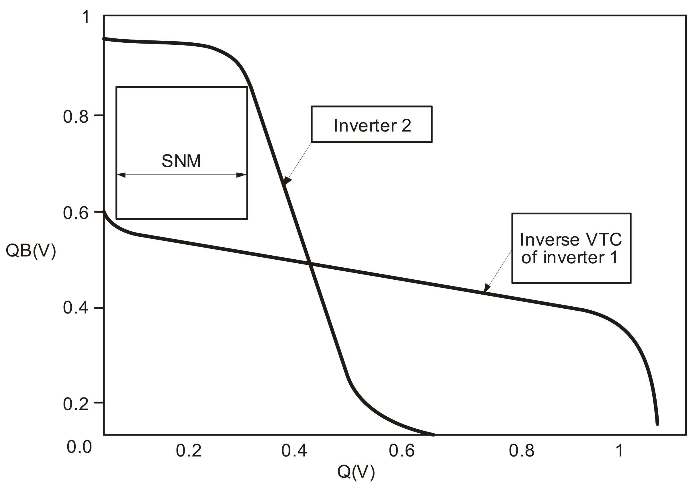
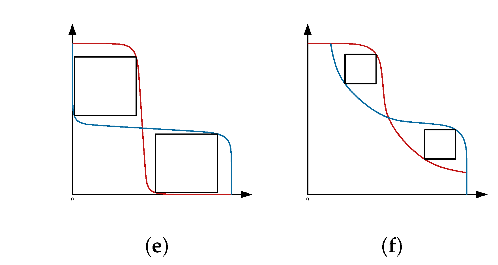

# 2.2. Memory device: SRAM basic

Static random-access memory (SRAM)는 두 개의 안정 상태를 갖는 회로에 1 bit를 저장하는 휘발성 메모리이다. 전원이 공급되는 동안에는 상태를 되살리기 위한 refresh가 필요하지 않지만, 전원이 제거되면 저장값을 잃는다. 가장 널리 쓰이는 기본 셀은 여섯 MOSFET으로 이루어진 6T bitcell이며, 두 개의 cross-coupled CMOS inverter와 두 개의 access transistor로 구성된다.[1,2]

이 글은 single-port 6T 셀을 기준으로 **저장 상태**, **읽기·쓰기 동작**, **안정성·writeability**, 그리고 실제 macro의 timing window와 검증 지표를 연결한다. 행·열 어레이, decoder, sense amplifier와 column mux의 공통 조직은 [Memory device: Overview](basics.md)를 따른다. 8T 이상 셀, multi-port register file, cache의 tag·replacement 정책은 6T 기준과의 차이만 다룬다.

처음 읽을 때에는 다음 대응만 먼저 잡으면 된다. **bitcell**은 1 bit를 보관하는 최소 반복 회로이고, **array**는 이 셀을 행과 열로 반복한 부분이며, **macro**는 array와 decoder, precharge, sense amplifier (SA), 입출력 회로까지 묶어 외부에서 하나의 메모리 블록으로 쓰는 단위이다. **Word line (WL)**은 한 행의 셀을 선택하는 선이고, **bit line (BL)**은 선택된 셀의 읽기·쓰기 신호가 오가는 열 방향 선이다. $V_\mathrm{DD}$는 논리 ‘1’ 쪽의 공급전압, $0$은 논리 ‘0’ 쪽의 기준전압이다. $Q$와 $\overline{Q}$는 셀 안의 두 저장 노드로, 정상적인 저장 상태에서는 한쪽이 높으면 다른 쪽은 낮다. 이후의 ‘안정성’은 이 관계가 외부 교란에도 유지되는가, ‘writeability’는 외부 회로가 의도적으로 이 관계를 새 상태로 바꿀 수 있는가를 묻는다.[1,2]

<figure markdown="span">
  
  <figcaption markdown="1">
    그림 1. 6T SRAM bitcell의 회로도. $M_1$·$M_3$은 pull-down nMOS, $M_2$·$M_4$는 pull-up pMOS, $M_5$·$M_6$는 access nMOS이다. 이 그림에서는 $\overline{BL}$이 $\overline{Q}$ 쪽, $BL$이 $Q$ 쪽에 연결된다. 모든 transistor의 bulk 접속은 생략되어 있으며, 일반적인 bulk CMOS 구현에서는 회로의 전원·접지 규약에 따라 별도로 연결한다.
    출처: Inductiveload, “SRAM Cell (6 Transistors),” Wikimedia Commons, public domain, 수정 없음.[8]
  </figcaption>
</figure>

## 1. 6T bitcell의 기준 모형

### (1) 두 안정 상태와 여섯 transistor의 역할

그림 1의 $Q$와 $\overline{Q}$는 보수 관계인 내부 저장 노드이다. 두 inverter의 출력을 서로의 입력으로 되먹임하면 $(Q,\overline{Q})\approx(V_\mathrm{DD},0)$과 $(0,V_\mathrm{DD})$가 각각 안정 상태가 된다. 이 **positive feedback**은 한쪽 노드가 조금 더 높아질 때 반대쪽을 더 낮추고, 그 결과 다시 처음 노드를 더 높이는 방향으로 작용한다. 따라서 작은 전압 교란은 inverter의 이득에 의해 원래 논리 상태 쪽으로 복원되며, 셀은 전원이 있는 동안 정적으로 값을 보존한다.[1,2]

| 구성 요소 | 일반적인 소자 | 역할 | 읽기·쓰기에서 중요한 점 |
| --- | --- | --- | --- |
| pull-up (PU) | pMOS 두 개 | 낮은 내부 노드를 $V_\mathrm{DD}$ 쪽으로 복원 | 너무 강하면 외부 write driver가 상태를 뒤집기 어렵다. |
| pull-down (PD) | nMOS 두 개 | 높은 내부 노드의 반대쪽을 접지 쪽으로 당김 | 읽을 때 ‘0’ 저장 노드가 흔들리지 않도록 access transistor보다 충분한 구동력이 필요하다. |
| access (AX) | nMOS 두 개 | $WL$이 높을 때 내부 노드를 $BL$, $\overline{BL}$에 연결 | 읽기와 쓰기의 통로이므로 PD·PU와 동시에 strength trade-off를 만든다. |

여기서 “static”은 데이터가 전원 공급 중 feedback으로 유지된다는 뜻이지, read와 write가 완전히 정적인 디지털 동작이라는 뜻은 아니다. access transistor가 켜진 동안 bit line의 큰 정전용량, 셀의 작은 transistor, sense amplifier의 입력 offset과 신호 timing이 함께 작용하므로 실제 접근은 아날로그 과도 현상이다.[1,6]

표의 ‘강하다’는 표현은 단순히 transistor의 폭이 크다는 뜻으로 한정하지 않는다. 같은 게이트·드레인 전압에서 더 큰 전류를 낼 수 있는 **유효 구동력**을 뜻한다. 폭·길이, 문턱전압, 이동도, 공급전압과 온도 모두가 이에 영향을 준다. 따라서 아래의 PU·PD·AX strength 비교는 회로의 방향을 이해하는 기준이지, 모든 공정에 통하는 하나의 폭 비율을 제시하는 규칙이 아니다.[3,5]

### (2) Cell, array와 macro의 계층

셀 하나는 1 bit의 논리 상태를 보관하지만, macro가 한 번에 동작시키는 단위는 보통 선택된 행과 그 행에 연결된 bit-line 쌍이다. Row decoder가 하나의 $WL$을 선택하고, 열 주변회로가 필요한 열을 감지하거나 구동한다. 긴 bit line의 정전용량과 비선택 셀의 접합 정전용량 때문에, 큰 macro는 bit line을 짧은 subarray로 나누고 local sense amplifier를 둘 수 있다.[1,6]

따라서 다음 세 층을 섞어 해석하면 안 된다.

| 층 | 물어야 할 질문 | 대표적인 실패 |
| --- | --- | --- |
| bitcell | 이 셀이 hold, read, write 조건에서 상태를 유지·전환하는가? | read disturb, write failure |
| column·subarray | 필요한 bit-line 차와 감지 시간이 확보되는가? | sense-amplifier offset을 이기지 못하는 read failure |
| macro·array | 모든 셀과 PVT 조건에서 목표 yield와 access time을 만족하는가? | tail cell, half-select, 배선·주변회로 timing failure |

여기서 **yield**는 제작하거나 시험한 macro 가운데 주어진 동작 조건을 통과하는 비율이다. 모든 셀이 평균적인 성질을 보인다면 셀 하나의 결과만으로도 충분할 수 있다. 그러나 실제 macro에는 매우 많은 셀이 있으므로, 드물게 약한 한 셀인 **tail cell**도 전체 macro의 실패를 만들 수 있다. 이 때문에 ‘셀 하나가 동작한다’와 ‘대용량 macro가 목표 수율로 동작한다’는 서로 다른 질문이다.[4,9]

## 2. 동작 과정

Hold, read, write의 차이는 결국 **bit line을 누가 구동하는가**, **WL을 언제 켜는가**, **내부 저장 노드가 바뀌어야 하는가**로 정리할 수 있다.[1,3]

| 동작 | 시작할 때 bit line | $WL$ | 셀에서 일어나야 하는 결과 |
| --- | --- | --- | --- |
| Hold 단계 | 동작에 관여하지 않음 | 0 | 기존 $Q$와 $\overline{Q}$를 유지한다. |
| Read 단계 | 두 선을 같은 높은 전압으로 준비한 뒤 부유시킴 | 0 → 1 → 0 | 한 bit line에만 작은 전압 강하를 만들고 저장값은 유지한다. |
| Write 단계 | 두 선을 새 데이터와 그 보수로 강하게 구동 | 0 → 1 → 0 | 기존 feedback을 이겨 $Q$와 $\overline{Q}$를 새 상태로 바꾼다. |

### (1) Hold 단계

Hold에서는 $WL=0$이므로 두 AX transistor가 꺼진다. 그러면 $Q$와 $\overline{Q}$는 $BL$과 $\overline{BL}$에서 분리되고, 두 inverter만 서로 연결된 상태가 된다. 예를 들어 $(Q,\overline{Q})=(1,0)$이면 $Q$가 반대 inverter를 통해 $\overline{Q}$를 낮게 유지하고, 낮은 $\overline{Q}$는 다시 $Q$를 높게 유지한다.[1,2]

작은 전압 교란이 생겨도 두 inverter의 positive feedback이 원래의 두 논리값으로 되돌린다. 따라서 6T SRAM은 정상적인 전원 공급 중에는 DRAM처럼 주기적 refresh를 요구하지 않는다. 다만 $V_\mathrm{DD}$가 너무 낮거나 누설과 소자 차이가 커지면 두 안정 상태가 충분히 분리되지 않아 hold도 실패할 수 있다.[2,5,7]

Data retention voltage (DRV)는 지정한 hold 조건에서 데이터를 보존하는 데 필요한 최저 공급전압이다. DRV는 read와 write까지 가능한 최저전압이 아니다. 실제 동작 최저전압은 hold, read stability, readability와 writeability를 모두 만족해야 한다.[5–7]

### (2) Read 단계

Read는 **준비 → 연결 → 작은 차이 생성 → 판정 → 종료**의 순서로 진행한다. 여기서는 그림 1처럼 $Q=0$, $\overline{Q}=1$이 저장되어 있다고 가정한다. 반대 데이터에서는 $BL$과 $\overline{BL}$의 역할만 서로 바뀐다.[1,3]

**1단계 — bit line 준비.**

먼저 $WL=0$인 상태에서 $BL$과 $\overline{BL}$을 $V_\mathrm{DD}$로 **precharge**한다. 이어 두 선을 잠시 연결해 시작 전압을 같게 만드는 **equalize**를 수행한다. 그 뒤 precharge 회로를 끄면 두 bit line은 같은 높은 전압에서 부유한 상태가 된다. 이 준비가 있어야 이후 두 선의 차이가 선택된 셀이 만든 신호임을 알 수 있다.[1,3]

**2단계 — 셀 연결과 방전.**

Row decoder가 선택된 행의 $WL$을 올리면 두 AX transistor가 켜진다. $Q=0$ 쪽에서는 다음 방전 경로가 열린다.

$$
BL \rightarrow AX \rightarrow Q \rightarrow PD \rightarrow GND
$$

따라서 $Q$에 연결된 $BL$은 조금 내려가고, $\overline{Q}=1$에 연결된 $\overline{BL}$은 높은 전압에 가깝게 남는다. 긴 bit line은 정전용량이 크므로 완전히 0 V가 될 때까지 기다리지 않는다. 셀이 만드는 것은 두 선 사이의 작은 차전압 $\Delta V_\mathrm{BL}$이다.[1,3]

이때 낮은 저장 노드 $Q$도 precharge된 $BL$과 연결되어 순간적으로 조금 올라간다. PD가 AX보다 충분히 강하지 않으면 이 상승이 inverter의 전환점을 넘어 저장값이 뒤집힐 수 있다. 이를 **read disturb**라고 한다. 즉 bit line을 빠르게 내리는 능력과 셀 내부의 0을 안전하게 지키는 능력을 함께 만족해야 한다.[2,3]

**3단계 — 판정과 종료.**

Sense amplifier는 $BL$과 $\overline{BL}$의 작은 전압차가 어느 방향인지 판정하고 이를 full-swing 디지털 출력으로 증폭한다. 판정이 끝나면 $WL$을 내려 셀을 bit line에서 다시 분리한다. 이어 bit line을 precharge·equalize하여 다음 접근을 준비한다. 정상적인 6T read에서는 내부 저장 상태 $(Q,\overline{Q})$가 읽기 전과 같아야 한다.[1,3]

| 순서 | 주변 신호와 회로 | 관찰할 변화 |
| --- | --- | --- |
| 1. 준비 | $WL=0$, 두 bit line precharge·equalize | $BL\approx\overline{BL}\approx V_\mathrm{DD}$ |
| 2. 행 선택 | precharge off, $WL=1$ | AX가 셀과 bit line을 연결 |
| 3. 신호 생성 | 셀의 PD가 한쪽 bit line 방전 | $\Delta V_\mathrm{BL}$ 형성 |
| 4. 판정 | sense amplifier 활성화 | 작은 차이를 논리 출력으로 변환 |
| 5. 종료 | $WL=0$, 다시 precharge | 셀 분리, 다음 read 준비 |

### (3) Write 단계

Write는 read와 달리 셀 내부 상태가 **반드시 바뀌어야** 한다. 여기서는 기존 $(Q,\overline{Q})=(1,0)$을 $(0,1)$로 바꾸는 경우를 설명한다.[1,3]

**1단계 — 새 데이터 준비.**

Write driver는 먼저 $BL=0$, $\overline{BL}=V_\mathrm{DD}$로 만든다. Read처럼 두 선을 부유시키지 않고, 쓰기가 끝날 때까지 목표 전압을 계속 구동한다. 낮게 구동된 $BL$은 $Q$를 0으로 만들 경로이고, 높게 구동된 $\overline{BL}$은 반대 노드가 1로 올라가는 것을 돕는다.[1,3]

**2단계 — 기존 상태 전환.**

$WL$을 올리면 AX가 켜지고, 낮은 $BL$이 기존에 높았던 $Q$를 아래로 끌어내린다. 처음에는 셀의 PU가 $Q$를 다시 높이려 하므로 두 회로가 서로 반대 방향으로 구동한다. Write driver와 AX가 이 저항을 이겨 $Q$를 inverter의 전환점 아래로 내리면 positive feedback의 방향이 바뀐다. 그러면 $\overline{Q}$가 올라가고, 올라간 $\overline{Q}$가 다시 $Q$를 더 낮추어 새 상태로 빠르게 수렴한다.[1,3]

**3단계 — 새 상태 보존.**

두 내부 노드가 새 논리값에 충분히 가까워진 뒤 $WL$을 내린다. AX가 꺼지면 write driver와 셀이 분리되고, cross-coupled inverter가 새 $(0,1)$ 상태를 스스로 유지한다. 이후 bit line은 다음 동작을 위해 해제하거나 precharge한다. 지정한 WL pulse 안에 내부 노드가 전환점을 넘지 못하면 write failure이다.[3,5,6]

| 순서 | 주변 신호와 회로 | 관찰할 변화 |
| --- | --- | --- |
| 1. 데이터 구동 | $BL=0$, $\overline{BL}=V_\mathrm{DD}$ | 새 값과 보수를 먼저 준비 |
| 2. 행 선택 | $WL=1$ | AX가 write driver와 저장 노드를 연결 |
| 3. 상태 전환 | $Q$가 전환점 아래로 하강 | feedback 방향이 바뀌어 $\overline{Q}$ 상승 |
| 4. 종료 | $WL=0$ | 새 상태를 셀 안에 보존 |

Read에서는 PD가 AX보다 강해야 낮은 저장 노드가 덜 흔들린다. Write에서는 AX와 write driver가 PU를 이겨야 상태를 쉽게 바꾼다. 이 상충관계 때문에 한 transistor를 무조건 크게 만드는 것으로 두 동작을 모두 개선할 수 없다.[3,5,6]

## 3. Stability, writeability와 동작 전압

### (1) Static noise margin과 butterfly curve

Static noise margin (SNM)은 지정한 정적 바이어스에서 셀의 상태를 바꾸지 않고 내부 노드에 견딜 수 있는 최대 direct-current (DC) noise voltage로 정의한다. 여기서 noise는 반드시 외부에서 실제로 들어온 잡음 파형만 뜻하지 않는다. ‘저장 노드 전압을 원래 값에서 어느 정도 밀어도 feedback이 원래 상태로 되돌리는가’를 나타내는 가상의 DC 교란이다.[2,3]

Inverter의 voltage-transfer characteristic (VTC)은 입력전압을 천천히 바꾸었을 때 출력전압이 어떻게 변하는지를 그린 곡선이다. 두 inverter가 맞물린 SRAM에서는 한 inverter의 출력이 다른 inverter의 입력이므로, 한 VTC를 대각선에 대해 반사해 다른 VTC와 겹치면 두 회로가 서로에게 요구하는 전압 관계를 한 그림에서 볼 수 있다. 이 모양이 butterfly curve이며, 두 ‘날개’에 들어가는 가장 큰 정사각형의 한 변 길이가 SNM이다. 정사각형이 클수록 상태를 뒤집으려면 더 큰 DC 교란이 필요하다.[2,3]

그림 2에서는 두 VTC 사이에 들어가는 최대 정사각형의 한 변을 따라 SNM을 읽을 수 있다. 두 날개 가운데 더 작은 정사각형이 들어가는 쪽이 셀 전체의 SNM을 제한한다.[2,3]

<figure markdown="span">
  
  <figcaption markdown="1">
    그림 2. Butterfly curve에서 SNM을 읽는 기하학적 방법. 한 inverter의 VTC와 다른 inverter의 반전된 VTC 사이에 들어가는 최대 정사각형의 한 변이 SNM이다.
    출처: Tripti Tripathi, Durg Singh Chauhan, and Sanjay Kumar Singh, “A Novel Approach to Design SRAM Cells for Low Leakage and Improved Stability,” Figure 3, *Journal of Low Power Electronics and Applications* **8**, 41 (2018), [DOI: 10.3390/jlpea8040041](https://doi.org/10.3390/jlpea8040041), CC BY 4.0, 수정 없음.[10]
  </figcaption>
</figure>

Hold SNM (HSNM)은 $WL=0$에서, read SNM (RSNM)은 read 바이어스에서 같은 절차로 구한다. Read 바이어스에서는 precharge된 bit line과 AX 때문에 inverter의 유효 VTC가 바뀌므로 RSNM이 HSNM보다 작을 수 있다. SNM은 유용한 DC 기준이지만 sense timing, bit-line 정전용량과 pulse shape를 포함하지 않으므로 동적 동작 성공을 단독으로 보증하지 않는다.[3,6]

그림 3의 왼쪽 HSNM과 오른쪽 RSNM을 비교하면, read 바이어스에서 한 VTC가 완만해지면서 두 날개 안에 들어가는 정사각형이 작아질 수 있음을 볼 수 있다. 이는 hold 결과를 read stability로 그대로 사용할 수 없는 이유를 시각적으로 보여준다.[3,11]

<figure markdown="span">
  
  <figcaption markdown="1">
    그림 3. Hold와 read 바이어스의 개념적 butterfly curve 비교. 왼쪽 (e)는 HSNM, 오른쪽 (f)는 RSNM이며, read 조건에서 바뀐 VTC가 안정성 여유를 줄일 수 있음을 나타낸다.
    출처: Yunfei Gu, Dengxue Yan, Vaibhav Verma, Pai Wang, Mircea R. Stan, and Xuan Zhang, “Exploiting Read/Write Asymmetry to Achieve Opportunistic SRAM Voltage Switching in Dual-Supply Near-Threshold Processors,” Figure 2(e,f), *Journal of Low Power Electronics and Applications* **8**, 28 (2018), [DOI: 10.3390/jlpea8030028](https://doi.org/10.3390/jlpea8030028), CC BY 4.0. 원 그림에서 (e)와 (f)만 잘라 배치했으며 곡선·색·표시는 수정하지 않았다.[11]
  </figcaption>
</figure>

!!! info "[Measurement]"
    HSNM은 $WL=0$의 hold 바이어스에서, RSNM은 두 bit line을 지정한 read precharge 전압에 두고 $WL$을 활성화한 상태에서 각각 구한다. 두 내부 node에 반대 극성의 DC 교란을 넣어 VTC를 얻고, butterfly curve의 최대 내접 정사각형 변으로

    $$
    \mathrm{SNM}
    =
    \max\{s:\text{한 변이 }s\text{인 정사각형이 두 VTC 사이에 들어감}\}
    $$

    을 추출한다. $V_\mathrm{DD}$, $T$, $WL$, bit-line precharge, process corner 및 mismatch 표본 수를 함께 보고한다. HSNM과 RSNM은 서로 대체할 수 없는 서로 다른 바이어스 조건의 지표이다.[2,3]

### (2) Cell ratio와 read–write trade-off

정적 sizing을 간결하게 점검할 때에는 보통

$$
\mathrm{CR}
=
\frac{\beta_\mathrm{PD}}{\beta_\mathrm{AX}}
$$

와 같은 cell ratio를 쓴다. $\beta_\mathrm{PD}$와 $\beta_\mathrm{AX}$는 각각 PD와 AX의 유효 구동력 계수이다. $\mathrm{CR}$을 키우면 read 중 낮은 저장 노드를 지지하는 PD가 상대적으로 강해져 RSNM에는 유리할 수 있다. 반대로 AX를 PU에 비해 강하게 만들면 write driver가 낮은 노드를 끌어내리기 쉬워 writeability에는 유리하지만, read disturb에는 불리해질 수 있다.[3,5]

다만 $\beta$의 정의, transistor 동작영역과 $WL$·$BL$ 바이어스는 문헌과 process design kit (PDK) model마다 다르다. 그러므로 CR 하나를 공정과 동작전압이 다른 macro의 보편적인 pass/fail 기준으로 쓰면 안 된다. Read stability와 writeability를 같은 조건에서 직접 구하고, 필요하면 N-curve의 전압·전류 기반 지표나 transient failure probability로 보완한다.[3,5,6]

### (3) DRV, Vmin과 PVT 변동

동작 최저전압 $V_\mathrm{min}$은 소자 고유 상수가 아니라 **정의한 array, timing, sensing 방식, 오류율·yield 목표 아래** read·write·hold 요구를 모두 만족하는 최저 $V_\mathrm{DD}$이다. Zimmer 등은 6T array에서 readability, writeability, read stability를 서로 다른 failure mode로 두고, 모든 failure mode의 bit error rate가 목표보다 낮은 전압으로 $V_\mathrm{min}$을 정의하였다.[6]

공정 변동과 mismatch는 여섯 transistor의 relative strength를 바꾸며, 평균 셀보다 드문 tail cell이 macro의 실패를 결정할 수 있다. PVT(process, voltage, temperature) corner, local mismatch, bit-line 길이, sense-amplifier offset과 word-line waveform을 함께 포함하지 않은 평균 SNM 또는 평균 delay만으로 array yield를 단정할 수 없다.[4–6,9]

### (4) PVT와 local mismatch를 구분하는 법

**PVT**는 회로가 처할 수 있는 세 종류의 조건을 묶은 약어이다. **Process (P)**는 제조 공정의 허용 편차로 인해 transistor가 설계값보다 전반적으로 빠르거나 느리게 동작할 수 있는 조건, **voltage (V)**는 실제 공급전압 $V_\mathrm{DD}$, **temperature (T)**는 동작 온도이다. **PVT corner**는 이 세 축에서 의도적으로 고른 하나의 시험 조합이다. 예를 들어 낮은 공급전압과 높은 온도에서 write pulse 안에 상태가 바뀌는지를 확인하는 것은 한 PVT corner에서의 검증이다.[4,9]

PVT corner는 ‘칩 전체에 공통으로 작용하는 대표 조건’을 시험하는 방법이다. 반면 **local mismatch**는 같은 셀 안에서도 원래 같게 설계된 두 transistor의 문턱전압·구동력이 조금 달라지는 현상이다. 따라서 모든 transistor를 같은 slow 조건으로 바꾸는 PVT sweep과, 한 셀의 PD·PU·AX 사이 상대 세기를 흔드는 mismatch 표본은 서로 대체할 수 없다. 전자는 정해진 조건 조합을 훑고, 후자는 그 조건에서 드물게 나오는 약한 셀의 분포를 찾는다.[4,9]

| 검증 대상 | 무엇을 바꾸는가 | 답하는 질문 | 흔한 오해 |
| --- | --- | --- | --- |
| PVT corner sweep | 공정 model, $V_\mathrm{DD}$, 온도 | 이 대표 운전 조건에서도 지연·전력·동작이 허용 범위인가? | 한 개의 nominal 조건 통과가 모든 전압·온도에서의 통과를 뜻하지 않는다. |
| local mismatch sampling | 셀 안 transistor 사이의 무작위 parameter 차이 | 같은 PVT 조건에서 드문 약한 셀이 실패할 확률은 충분히 낮은가? | 평균값이 좋아도 큰 array의 tail failure가 사라지는 것은 아니다. |

‘fast’, ‘slow’, ‘typical’ 같은 공정 corner의 구체적인 이름과 transistor 조합은 PDK(process design kit)가 정한 model을 따른다. 그러므로 어떤 corner가 read, write, hold의 최악 조건인지는 일반 명칭만으로 결정하지 않고, 사용한 PDK, $V_\mathrm{DD}$, 온도, 보조 회로와 failure 정의를 고정해 직접 확인해야 한다.[4,9]

## 4. 동작 여유와 정량 지표

### (1) 핵심 정량 지표

| 정량 지표 | 답하는 질문 | 대표 추출 또는 판정 조건 | 해석상 주의점 |
| --- | --- | --- | --- |
| HSNM | hold 중 상태가 얼마나 안정한가? | hold 바이어스의 butterfly square | read 접근의 교란은 포함하지 않는다. |
| RSNM | read 중 상태가 뒤집히지 않는가? | read 바이어스의 butterfly square | read current·sense delay와는 다른 지표이다. |
| write margin | 새 상태로 넘어갈 여유가 있는가? | write-trip point, N-curve 또는 동적 write 성공 | 정의에 따라 전압·전류·시간 지표가 다르다. |
| $I_\mathrm{READ}$, $\Delta V_\mathrm{BL}$ | sense amplifier가 읽을 신호를 받는가? | 지정 시간의 bit-line discharge 또는 차전압 | cell 전류만으로 sense offset을 배제할 수 없다. |
| $t_\mathrm{read}$, $t_\mathrm{write}$ | macro timing을 만족하는가? | 입력·출력의 명시한 기준점 사이 지연 | address, WL, SA enable 중 어느 시점을 기준으로 했는지 명시한다. |
| DRV | 대기 상태에서 보존되는 최저전압은? | hold failure가 목표를 넘지 않는 최저 $V_\mathrm{DD}$ | read·write 가능 전압이 아니다. |
| $V_\mathrm{min}$ | 전체 macro가 동작하는 최저전압은? | 모든 지정 failure mode와 yield 목표 충족 | array 크기·ECC·timing·assist에 따라 달라진다. |
| access energy·leakage | 접근과 대기에서 에너지 예산을 만족하는가? | 지정 activity, data pattern, $V_\mathrm{DD}$와 $T$ | bitcell만이 아니라 precharge·decoder·SA가 포함된다. |

표의 지표는 모두 ‘좋은 SRAM’을 서로 다른 방향에서 보는 척도이다. 예를 들어 RSNM은 읽는 동안 셀이 뒤집히지 않는지를, $\Delta V_\mathrm{BL}$은 sense amplifier가 판독할 만큼 신호가 생겼는지를, $t_\mathrm{read}$는 그 신호가 정해진 시간 안에 나왔는지를 묻는다. 한 지표가 통과해도 다른 지표가 자동으로 통과하지 않으므로, 표 전체가 하나의 pass/fail 묶음이 된다.[3,6]

“window”는 한 개의 독립 parameter가 아니라, 위 지표를 만족하도록 제어 신호와 전압이 겹쳐야 하는 허용 영역이다. 따라서 data sheet 또는 논문에서 write window라는 표현을 볼 때에는 $WL$ pulse, write-driver enable, bit-line 안정화, cell supply 변화 중 무엇을 가리키는지 확인해야 한다.[3,5,6]

### (2) Read window와 cell disturbance

Read cycle은 보통 **precharge/equalize → $WL$ 활성화 → $\Delta V_\mathrm{BL}$ 형성 → sense amplifier enable → 출력 latch → 다음 cycle을 위한 precharge** 순서로 구성된다. Sense amplifier를 너무 이르게 켜면 offset·noise가 신호보다 커질 수 있고, 너무 늦게 켜면 지연과 bit-line 에너지가 커진다. 긴 bit line은 정전용량이 커서 같은 $I_\mathrm{READ}$에서 $\Delta V_\mathrm{BL}$을 더 천천히 형성한다.[1,6]

한 설계의 보고 규약으로 $t_\mathrm{SA,en}$을 sense amplifier enable 시점, $\Delta V_\mathrm{req}$를 offset·noise·yield 목표를 포함한 필요한 입력 차전압이라 두면 read window의 핵심 조건은

$$
\Delta V_\mathrm{BL}(t_\mathrm{SA,en})
\ge
\Delta V_\mathrm{req}
$$

이다. 방전 동안의 유효 전류를 $I_\mathrm{READ,eff}(t)$로 근사하면

$$
\Delta V_\mathrm{BL}(t)
\approx
\frac{1}{C_\mathrm{BL}}
\int_0^t I_\mathrm{READ,eff}(t')\,dt'
$$

로 bit-line 정전용량의 영향을 보일 수 있다. 이 식은 bit-line leakage, column switch, precharge 회로와 sense-amplifier kickback을 따로 모델링하지 않은 1차 근사이다. 동시에 같은 read 바이어스에서 RSNM이 목표보다 커야 한다. 즉, 빠르게 방전시키기 위해 AX를 과도하게 강하게 만드는 방법은 위 첫 조건에는 유리해도 RSNM 조건을 악화시킬 수 있다.[3,6]

### (3) Write window와 feedback 제어

Write cycle에서는 보수 bit-line 값이 먼저 안정되어야 하고, 그 값이 유효한 동안 $WL$이 충분히 길게 켜져 내부 노드가 write-trip 지점을 넘어야 한다. 설계자가 정의한 $t_\mathrm{flip}$을 내부 노드가 새 논리 상태의 전환점에 도달하는 시간, $T_\mathrm{overlap}$을 “두 bit line의 write 값이 유효함”과 “$WL$이 활성화됨”이 겹치는 시간이라 하면, 단순한 timing 점검은

$$
T_\mathrm{overlap}
\ge
t_\mathrm{flip}+t_\mathrm{margin}
$$

로 쓸 수 있다. 이는 보편적인 물리 법칙이 아니라, 각 macro가 bit-line의 settle 조건·전환 판정·여유를 명시하여 검증할 수 있게 하는 보고 규약이다. 실제 $t_\mathrm{flip}$은 PU/AX strength, $V_\mathrm{DD}$, data direction, 온도와 mismatch에 따라 달라진다.[5,6]

!!! info "[Measurement]"
    Transient simulation 또는 silicon characterization에서 (i) $BL$·$\overline{BL}$ precharge/equalize 완료 시점, (ii) $WL$의 50% crossing, (iii) $Q$ 또는 $\overline{Q}$가 전환 기준을 지나는 시점, (iv) $SA$ 출력의 50% crossing을 같은 파형에서 기록한다. 예를 들어

    $$
    t_\mathrm{read}
    =
    t_{DOUT,50\%}-t_{WL,50\%},
    \qquad
    t_\mathrm{write}
    =
    t_{\mathrm{new}\ Q,50\%}-t_{WL,50\%}
    $$

    처럼 정의할 수 있다. 기준점, bit-line 부하, $SA$ enable, $V_\mathrm{DD}$·$T$, process corner와 데이터 방향을 함께 보고한다. Readability, writeability, read stability와 half-select stability는 동일한 transient testbench에서 별도 pass/fail로 집계한다.[5,6]

### (4) 통계와 array yield

실제 array에서는 모든 셀을 하나의 nominal transistor set으로 볼 수 없다. **Nominal**은 PDK가 정한 대표 PVT 조건과 transistor parameter를 사용한 기준 셀을 뜻한다. Local $V_T$ mismatch와 process variation은 RSNM, write delay, read current의 분포를 넓히며, 큰 array일수록 낮은 확률의 tail failure가 중요해진다. Agarwal과 Nassif는 6T 셀의 DC noise margin 및 read·write failure probability를 device parameter fluctuation과 연결하고, 3-sigma 너머의 분포까지 Monte Carlo와 대조하였다.[4]

**Monte Carlo simulation**은 PVT corner를 무작위로 하나 고르는 절차가 아니다. 먼저 PVT와 read·write testbench를 고정하고, 그 조건에서 transistor parameter의 무작위 차이를 여러 번 샘플링하여 margin·delay·failure의 분포를 얻는 방법이다. 따라서 검증은 nominal corner 한 번으로 끝나지 않는다. 정적 margin에는 DC sweep과 mismatch sampling을, timing 실패에는 bit-line 정전용량과 실제 control waveform을 포함한 transient simulation을 사용한다. 희귀 failure의 목표 확률이 직접 Monte Carlo로 감당하기 어려우면 importance sampling 같은 통계 방법을 사용할 수 있으나, 그때도 failure definition과 array 규모를 먼저 고정해야 한다.[4,6,9]

!!! warning "[Interpretation Caveat]"
    평균 HSNM이 양수이거나 nominal write가 성공했다는 사실만으로 macro의 $V_\mathrm{min}$과 yield가 정해지지 않는다. $V_\mathrm{min}$은 셀의 보존·read stability·readability·writeability, 주변회로의 offset·timing, array의 크기와 목표 오류율을 함께 고정한 뒤에만 의미가 있다.[4–6]

## 5. 설계 선택과 확장

### (1) Array organization과 주변회로의 영향

6T cell 자체가 작아도 macro의 속도·에너지·수율은 bit-line 길이, row 수, column mux 비율, decoder, precharge, write driver, sense amplifier와 repair·ECC 정책에 의해 달라진다. Bit line을 짧게 하면 필요한 $\Delta V_\mathrm{BL}$을 더 빨리 만들 수 있지만, sense amplifier와 주변회로를 더 자주 배치해야 하므로 면적 overhead가 증가한다.[1,6]

Readability는 이런 주변회로 의존성 때문에 RSNM과 구분해야 한다. 예를 들어 같은 셀이 read disturb 없이 안정해도, 주어진 cycle time에 $\Delta V_\mathrm{BL}$이 sense amplifier의 **offset**보다 작으면 read data를 확정할 수 없다. Offset은 입력이 완전히 같아도 실제 sense amplifier가 ‘0’ 또는 ‘1’ 한쪽으로 먼저 기울 수 있는 고유한 불균형이며, 이 불균형보다 충분히 큰 신호가 필요하다. 반대로 cell current가 충분해도 **half-select cell**이 선택되지 않은 열에서 write 조건에 일부 노출되면 별도의 안정성 문제가 생길 수 있다. Half-select는 같은 행 또는 열을 공유해 일부 제어선은 활성화되지만, 원래 데이터를 바꾸려던 완전 선택 셀은 아닌 셀을 뜻한다.[5,6]

### (2) Assist와 8T 이상의 확장

저전압에서 writeability를 높이기 위해 word-line boost, cell-supply collapse, negative bit-line write assist처럼 접근 중의 바이어스를 일시적으로 바꾸는 기법을 사용할 수 있다. Word-line boost는 AX를 더 강하게 켜기 위해 $WL$을 정상 공급전압보다 높게 올리는 방법이다. Cell-supply collapse는 write 동안 셀의 $V_\mathrm{DD}$를 잠시 낮춰 PU의 복원력을 약화하는 방법이고, negative bit-line은 ‘0’을 쓸 쪽 bit line을 접지보다 낮게 내려 AX를 통한 pull-down을 강화하는 방법이다. 이러한 assist는 특정 failure mode의 여유를 늘릴 수 있지만, pulse shape, leakage, 회로 면적, 신뢰성 및 다른 failure mode와의 상호작용을 함께 바꾼다. 따라서 정적 margin 하나만으로 assist의 효과를 판단하지 않고 동적 failure metric으로 평가해야 한다.[6]

8T와 그 이상의 셀은 별도 read port 또는 buffered read path를 추가하여 internal storage node와 read bit line의 직접 연결을 끊을 수 있다. 그 결과 read SNM 또는 저전압 readability를 개선할 수 있지만, 추가 transistor와 배선은 cell 면적과 port 수를 늘린다. 6T는 밀도·속도·안정성의 균형이 좋은 기준 셀이지만, subthreshold 또는 매우 큰 변동성 조건에서 항상 최선이라는 뜻은 아니다.[6,7]

## 6. 요약

- 6T SRAM은 두 cross-coupled CMOS inverter의 positive feedback으로 1 bit를 정적으로 저장하고, 두 AX transistor로 보수 bit-line 쌍에 연결한다.
- Hold, read, write는 서로 다른 바이어스 상태이다. DRV는 hold의 한계이고, 전체 $V_\mathrm{min}$은 read·write·hold와 yield 조건을 모두 포함한다.
- Read는 작은 $\Delta V_\mathrm{BL}$을 sense amplifier가 판독하는 동작이며, 충분한 read current와 read disturb 억제는 별도의 요구사항이다.
- Write는 외부 driver가 내부 feedback을 이겨 새 stable state로 진입시키는 동작이다. Read stability와 writeability는 PD, PU, AX sizing에서 상충할 수 있다.
- SNM은 핵심적인 DC 안정성 기준이지만 timing, bit-line 정전용량, sense offset과 드문 mismatch failure를 포함하지 않는다.
- PVT는 공정·공급전압·온도의 대표 조합이고, local mismatch는 한 셀 안 transistor 사이의 무작위 차이이다. 둘을 함께 검증해야 macro의 약한 tail cell까지 평가할 수 있다.
- SRAM의 operating window는 $WL$, bit line, sense amplifier, assist와 cell supply의 허용된 시간·전압 겹침이다. 따라서 waveform·PVT·array 규모·yield 목표를 명시한 transient 및 통계 검증이 필요하다.

## 7. 참고문헌

1. MIT OpenCourseWare, “14.1 Annotated Slides,” *6.004 Computation Structures*, Massachusetts Institute of Technology (2017). [강의 자료](https://ocw.mit.edu/courses/6-004-computation-structures-spring-2017/pages/c14/c14s1/).
2. E. Seevinck, F. J. List, and J. Lohstroh, “Static-Noise Margin Analysis of MOS SRAM Cells,” *IEEE Journal of Solid-State Circuits* **22**, 748–754 (1987). [DOI: 10.1109/JSSC.1987.1052809](https://doi.org/10.1109/JSSC.1987.1052809).
3. E. Grossar, M. Stucchi, K. Maex, and W. Dehaene, “Read Stability and Write-Ability Analysis of SRAM Cells for Nanometer Technologies,” *IEEE Journal of Solid-State Circuits* **41**, 2577–2588 (2006). [DOI: 10.1109/JSSC.2006.883344](https://doi.org/10.1109/JSSC.2006.883344).
4. K. Agarwal and S. Nassif, “Statistical Analysis of SRAM Cell Stability,” *Proceedings of the 43rd Annual Design Automation Conference*, 57–62 (2006). [DOI: 10.1145/1146909.1146928](https://doi.org/10.1145/1146909.1146928).
5. Ruchi and S. Dasgupta, “6T SRAM Cell Analysis for DRV and Read Stability,” *Journal of Semiconductors* **38**, 025001 (2017). [DOI: 10.1088/1674-4926/38/2/025001](https://doi.org/10.1088/1674-4926/38/2/025001).
6. B. Zimmer et al., “SRAM Assist Techniques for Operation in a Wide Voltage Range in 28-nm CMOS,” *IEEE Transactions on Circuits and Systems II: Express Briefs* **59**, 853–857 (2012). [DOI: 10.1109/TCSII.2012.2231015](https://doi.org/10.1109/TCSII.2012.2231015).
7. N. Verma and A. P. Chandrakasan, “A 65nm 8T Sub-Vt SRAM Employing Sense-Amplifier Redundancy,” *IEEE International Solid-State Circuits Conference Digest of Technical Papers*, 328–329 (2007). [저자 제공 PDF](https://people.eecs.berkeley.edu/~pister/290Q/Papers/Computation/sub-Vt%20SRAM%20isscc07.pdf).
8. Inductiveload, “SRAM Cell (6 Transistors),” Wikimedia Commons (2009), public domain. [파일 설명과 라이선스](https://commons.wikimedia.org/wiki/File:SRAM_Cell_(6_Transistors).svg).
9. R. Joshi et al., “A Universal Hardware-Driven PVT and Layout-Aware Predictive Failure Analytics for SRAM,” *IEEE Transactions on Very Large Scale Integration (VLSI) Systems* **24**, 968–978 (2016). [DOI: 10.1109/TVLSI.2015.2427196](https://doi.org/10.1109/TVLSI.2015.2427196).
10. T. Tripathi, D. S. Chauhan, and S. K. Singh, “A Novel Approach to Design SRAM Cells for Low Leakage and Improved Stability,” *Journal of Low Power Electronics and Applications* **8**, 41 (2018). [DOI: 10.3390/jlpea8040041](https://doi.org/10.3390/jlpea8040041).
11. Y. Gu, D. Yan, V. Verma, P. Wang, M. R. Stan, and X. Zhang, “Exploiting Read/Write Asymmetry to Achieve Opportunistic SRAM Voltage Switching in Dual-Supply Near-Threshold Processors,” *Journal of Low Power Electronics and Applications* **8**, 28 (2018). [DOI: 10.3390/jlpea8030028](https://doi.org/10.3390/jlpea8030028).
