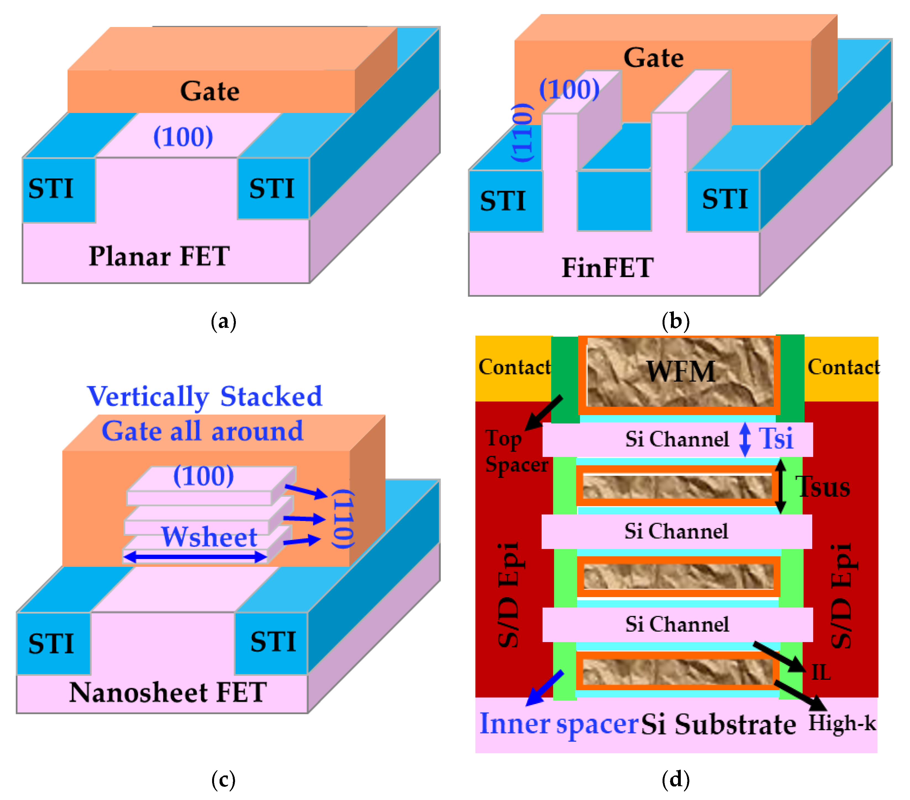
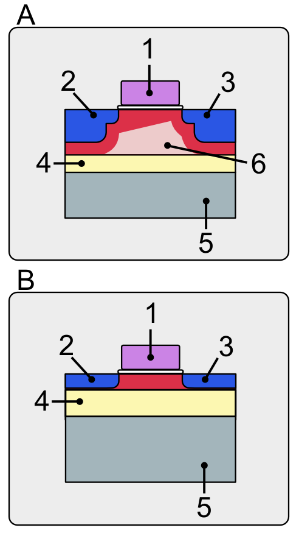
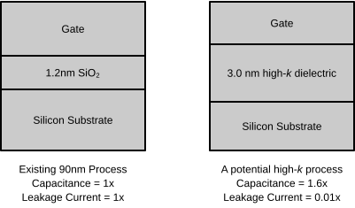
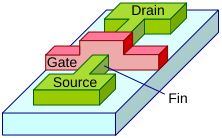

# 1.4. MOSFET: Architecture evolution

Metal-oxide-semiconductor field-effect transistor (MOSFET)의 구조 진화는 단순히 채널을 작게 만든 연대표가 아니다. 평면형 bulk MOSFET의 축소 과정에서 드레인의 채널 장벽 교란, 얇은 SiO$_2$의 터널링, 접합 기생 정전용량과 통계적 도핑 변동이 함께 커졌다. 이에 따라 **바디를 얇게 분리하는 방법**, **게이트 절연막과 전극을 바꾸는 방법**, **게이트가 채널을 더 많이 감싸는 방법**이 서로 다른 축에서 발전했다.[1–7]

이 글은 논리 소자용 nMOS를 기준으로 silicon-on-insulator (SOI), high-$k$/metal gate (HKMG), fin field-effect transistor (FinFET), gate-all-around (GAA) nanowire와 nanosheet를 다룬다. 전력 MOSFET, 메모리용 수직 채널과 complementary FET (CFET)은 범위에서 제외한다. 기본 바이어스와 전류 규약은 [MOSFET: Basic Operation](basic-operation.md), natural length와 drain-induced barrier lowering (DIBL) 등 정전기적 지표는 [MOSFET: Short-Channel Effects](short-channel-effects.md)를 따른다.

<figure markdown="span">
  
  <figcaption markdown="1">
    그림 1. 평면형 FET, FinFET과 수직 적층 GAA nanosheet FET의 구조 비교. (d)는 각 Si 채널을 계면층, high-$k$ 유전체와 work-function metal이 감싸고, inner spacer가 게이트와 소스·드레인 epitaxy를 분리하는 단면이다.
    출처: M. Wang, “A Review of Reliability in Gate-All-Around Nanosheet Devices,” <i>Micromachines</i> <b>15</b>, Figure 1 (2024),
    <a href="https://doi.org/10.3390/mi15020269">DOI</a>,
    <a href="https://creativecommons.org/licenses/by/4.0/">CC BY 4.0</a>, 수정 없음.[15]
  </figcaption>
</figure>

## 1. 구조 진화의 설계축

### (1) 바디·게이트 적층·채널 형상

SOI, HKMG, FinFET과 GAA를 서로 배타적인 네 세대로 이해하면 실제 소자를 잘못 분류하게 된다. 이들은 다음처럼 서로 다른 부분을 바꾼다.[1,3,7,12–15]

| 설계축 | 대표 기술 | 바꾸는 대상 | 주된 물리적 목표 | 함께 사용할 수 있는 예 |
| --- | --- | --- | --- | --- |
| 바디와 기판 | PD-SOI, FD-SOI, bulk isolation | 활성 Si 아래 경계조건 | 깊은 누설 경로, 접합 정전용량, back-gate 결합 조절 | SOI FinFET, bulk GAA |
| 게이트 적층 | SiO$_2$/poly-Si, HKMG | 절연막과 게이트 전극 | 작은 EOT와 낮은 게이트 터널링, $V_T$ 설정 | HKMG FinFET, HKMG GAA |
| 채널–게이트 형상 | planar, FinFET, GAA | 게이트가 채널을 감싸는 면 | 소스–드레인 결합보다 게이트–채널 결합을 강화 | bulk FinFET, SOI GAA |

따라서 “SOI 다음에 HKMG가 나오고, 그다음 FinFET이 SOI를 대체했다”는 식의 단일 계보는 정확하지 않다. 예를 들어 FinFET은 SOI 또는 bulk 기판에 만들 수 있고, 현대 FinFET과 GAA는 모두 HKMG를 사용할 수 있다. GAA nanosheet의 아래쪽 기생 채널을 막기 위해 bulk 기판 위에 별도의 유전체 분리를 넣기도 한다.[1,12–15]

### (2) 구조 진화의 물리적 동인

평면형 MOSFET에서 게이트 길이 $L_G$가 정전기적 특성 길이 $\lambda$에 가까워지면 드레인 전위가 소스 쪽 주입 장벽까지 침투한다. 이때 DIBL, threshold-voltage roll-off와 subthreshold swing (SS) 악화 같은 short-channel effects (SCE)가 나타난다. 게이트 절연막을 전기적으로 얇게 하고, 게이트에서 먼 바디 경로를 줄이며, 채널의 여러 면에 게이트 경계조건을 두면 $\lambda$를 줄일 수 있다.[1–3]

그러나 게이트 제어만 강하게 만들면 끝나는 문제가 아니다. 물리적으로 얇은 SiO$_2$는 direct tunneling을 증가시키고, 매우 좁은 fin 또는 sheet는 양자 구속, 직렬저항과 형상 변동에 민감해진다. 높은 구조는 단위 바닥면적당 채널 둘레를 늘리지만 식각과 열 방출을 어렵게 한다. 구조 진화는 결국 **정전기적 제어, 구동 전류, 기생 성분, 변동성, 신뢰성과 공정성**을 동시에 맞추는 과정이다.[1,5–7,11–17]

### (3) 대표적인 연구·양산 이정표

아래 표는 모든 발명을 망라한 우선권 연표가 아니라, 각 변화가 왜 산업적 구조로 이어졌는지를 보여 주는 대표 이정표이다.

| 시기 | 대표 이정표 | 의미 |
| --- | --- | --- |
| 2000 | self-aligned double-gate FinFET 보고 | 얇은 수직 fin과 자기정렬 게이트로 단채널 효과를 억제하는 제조 가능한 개념을 제시했다.[1,9] |
| 2003 | fully depleted tri-gate CMOS 실험 | complementary metal-oxide-semiconductor (CMOS)에서 fin의 윗면까지 게이트로 사용하고 $2H_\mathrm{fin}+W_\mathrm{fin}$으로 채널 둘레를 활용했다.[1,10] |
| 2007 | 45 nm HKMG 논리 공정 보고 | Hf 기반 high-$k$와 metal gate를 고집적 논리 공정에 통합했다.[7,8,19] |
| 2011–2012 | 22 nm tri-gate 양산 전환 | 평면형에서 3차원 multi-gate 구조로의 양산 전환을 대표한다.[10,18] |
| 2017 | 적층 GAA nanosheet 시연 | FinFET보다 큰 활성 영역당 유효 폭과 양호한 짧은 게이트 정전기 특성을 함께 보였다.[13,14] |
| 2022 | 3 nm급 GAA 양산 시작 발표 | 폭을 조절할 수 있는 적층 nanosheet가 상용 논리 공정에 들어간 사례이다.[14,15,20] |

!!! warning "[Interpretation Caveat]"
    `45 nm`, `22 nm`, `3 nm` 같은 공정 node 이름을 이 글의 $L_G$, $W_\mathrm{fin}$ 또는 $T_\mathrm{sheet}$와 동일시하지 않는다. 현대 node 명칭은 단일 물리 치수를 뜻하지 않으므로 구조 비교에는 실제 치수, contacted gate pitch, fin 또는 sheet pitch와 배선 규칙이 따로 필요하다.

## 2. SOI와 바디 경계조건

### (1) PD-SOI와 FD-SOI

Silicon-on-insulator (SOI)는 활성 Si 층 아래에 buried oxide (BOX)를 두어 채널과 bulk Si 기판을 유전체로 분리하는 구조이다. Partially depleted SOI (PD-SOI)는 채널 바디 일부가 중성 영역으로 남을 만큼 Si 막이 두껍고, fully depleted SOI (FD-SOI)는 동작 범위에서 바디 두께 전체가 공핍될 만큼 얇다. “SOI”는 기판 구조를, “fully depleted”는 바디의 전기적 상태를 나타내므로 둘을 같은 뜻으로 사용하지 않는다.[1,3,4]

<figure markdown="span">
  
  <figcaption markdown="1">
    그림 2. 부분 공핍 SOI(A)와 완전 공핍 SOI(B)의 개념적 단면. 1은 게이트, 2와 3은 소스·드레인, 4는 BOX, 5는 지지 기판, 6은 부분 공핍 구조에 남은 바디 영역을 뜻한다. 실제 공핍 경계는 바이어스와 도핑에 따라 달라진다.
    출처: Shigeru23, “MOS-FET gate with SOI (Partially Depleted v.s. Fully Depleted),” Wikimedia Commons,
    <a href="https://commons.wikimedia.org/wiki/File:MOS-FET_gate_with_SOI_(Partially_Depleted_v.s._Fully_Depleted).PNG">원본과 라이선스</a>,
    <a href="https://creativecommons.org/licenses/by-sa/3.0/">CC BY-SA 3.0</a>, 수정 없음.[21]
  </figcaption>
</figure>

얇은 FD-SOI 바디에서는 게이트에서 멀리 떨어진 깊은 Si 경로가 사라지고, 전면과 후면 전위가 결합한다. 이 때문에 무거운 채널 도핑에 덜 의존하면서 SS와 DIBL을 제어할 수 있다. 소스·드레인이 BOX까지 닿으면 bulk 접합의 바닥 정전용량도 크게 줄어든다. 얇은 BOX를 사용하는 ultra-thin body and buried oxide (UTBB) 구조에서는 기판 전압이 효과적인 back bias로 작용하여 $V_T$와 성능–누설 균형을 동적으로 조절할 수 있다.[1,3,4]

### (2) SOI의 적용 한계

PD-SOI의 전기적으로 떠 있는 바디에는 impact ionization으로 생성된 정공이 축적될 수 있어 출력 특성의 kink와 이력 의존성을 만들 수 있다. FD-SOI는 중성 바디 부피를 제거하여 이 문제를 크게 줄이지만, front–back interface coupling과 BOX 전하를 새 경계조건으로 포함해야 한다. 또한 BOX는 전기적 분리에는 유리하지만 열이 기판으로 빠지는 경로를 방해할 수 있으며, Si 막과 BOX 두께의 균일도와 SOI 웨이퍼 비용도 공정 선택에 들어간다.[1,3,4]

SOI의 핵심 설계 인자는 $t_\mathrm{Si}$와 $t_\mathrm{BOX}$이다. $t_\mathrm{Si}$를 줄이면 정전기적 제어가 강해지지만 양자 구속, 두께 변동에 따른 $V_T$ 변화와 소스·드레인 저항의 영향이 커질 수 있다. $t_\mathrm{BOX}$를 줄이면 back-gate 결합과 열 전달을 개선할 여지가 있지만 기판 잡음 결합과 back-gate 기생 효과도 함께 바뀐다.[2–4]

## 3. HKMG와 게이트 적층

### (1) EOT와 물리적 두께의 trade-off

평면 MOS capacitor의 단위면적당 절연막 정전용량은 $C_\mathrm{ox}=\varepsilon_0\kappa/t$이다. 같은 정전용량을 SiO$_2$ 두께로 환산한 equivalent oxide thickness (EOT)는 단일 high-$k$층에 대해

$$
\mathrm{EOT}
\approx
t_\mathrm{high-k}
\frac{\kappa_\mathrm{SiO_2}}{\kappa_\mathrm{high-k}},
\qquad
\kappa_\mathrm{SiO_2}\approx 3.9
$$

로 쓸 수 있다. 따라서 $\kappa_\mathrm{high-k}>\kappa_\mathrm{SiO_2}$이면 같은 EOT에서 실제 막을 더 두껍게 만들 수 있고, 터널 장벽의 물리적 폭을 늘려 direct gate tunneling을 줄일 수 있다.[5–8]

실제 HKMG에는 Si 표면의 interfacial layer (IL), high-$k$층과 여러 금속층이 직렬로 놓인다. 가장 단순한 정전용량 환산은

$$
\mathrm{EOT}
\approx
t_\mathrm{IL}
+
t_\mathrm{high-k}
\frac{\kappa_\mathrm{SiO_2}}{\kappa_\mathrm{high-k}}
$$

이다. 여기서는 IL을 SiO$_2$로 근사했다. 일반적인 IL이라면 첫째 항은 $t_\mathrm{IL}\kappa_\mathrm{SiO_2}/\kappa_\mathrm{IL}$로 바뀐다. 이 식은 면적이 같고 누설이 없는 이상적인 평행판 직렬 정전용량 근사이다. 실제 EOT에는 양자 정전용량, 전극의 유한 screening과 계면 응답이 포함될 수 있으며, 같은 EOT라도 밴드 오프셋과 결함 밀도가 다르면 게이트 누설과 신뢰성이 같지 않다.[5–8]

<figure markdown="span">
  
  <figcaption markdown="1">
    그림 3. 기존 SiO$_2$/poly-Si 적층과 high-$k$/metal gate 적층의 개념 비교. High-$k$층은 같은 전기적 두께에서 더 큰 물리적 두께를 확보한다. 도식의 두께 비는 개념적이며 실제 적층비가 아니다.
    출처: Anoopm; SVG tracing by Stannered, “High-k,” Wikimedia Commons,
    <a href="https://commons.wikimedia.org/wiki/File:High-k.svg">원본과 라이선스</a>,
    <a href="https://creativecommons.org/licenses/by-sa/3.0/">CC BY-SA 3.0</a>, 수정 없음.[22]
  </figcaption>
</figure>

### (2) Metal gate의 역할

도핑된 poly-Si 게이트는 반도체이므로 반전 상태에서 절연막 가까이에 공핍층이 생길 수 있다. 이 poly depletion은 게이트 적층에 직렬 정전용량을 더해 유효 EOT를 증가시킨다. Metal gate는 이 공핍 성분을 제거하고, nMOS와 pMOS에 필요한 유효 일함수를 별도의 work-function metal 조성으로 설정할 수 있게 한다. 이 때문에 high-$k$ 유전체와 metal gate는 독립적인 재료 변화이면서도 하나의 HKMG 적층으로 함께 통합되었다.[5,7,8]

HKMG가 SiO$_2$/poly-Si의 모든 장점을 자동으로 보존하는 것은 아니다. Hf 기반 유전체의 산소 공공과 전하 포획, IL/high-$k$ 계면 상태, remote phonon 및 Coulomb scattering, 열처리 중 반응과 유효 일함수 이동을 함께 제어해야 한다. Gate-first와 replacement metal gate 방식은 이 열 예산과 일함수 제어를 서로 다른 순서로 해결한다.[5,7,8]

## 4. FinFET과 수직 채널 둘레

### (1) Multi-gate fin 구조

FinFET은 얇고 높은 Si fin을 만들고 게이트가 두 옆면 또는 윗면까지 감싸도록 한 multi-gate MOSFET이다. Double-gate FinFET은 주로 두 옆면을, tri-gate FinFET은 두 옆면과 윗면을 채널로 사용한다. 얇은 fin의 중앙까지 게이트 전위가 도달하므로 평면형 bulk 소자의 깊은 누설 경로를 줄이고, 같은 $L_G$에서 DIBL과 SS를 낮출 수 있다.[1,2,9–11]

<figure markdown="span">
  
  <figcaption markdown="1">
    그림 4. Double-gate FinFET의 개념적 구조. 게이트가 수직 fin의 두 옆면을 가로질러 채널을 제어하며 소스와 드레인은 fin의 양 끝에 놓인다. 실제 bulk tri-gate 공정은 윗면 게이트, shallow trench isolation (STI), taper와 raised source/drain을 추가로 포함할 수 있다.
    출처: Irene Ringworm; vectorization by Д.Ильин, “Doublegate FinFET-en,” Wikimedia Commons,
    <a href="https://commons.wikimedia.org/wiki/File:Doublegate_FinFET-en.svg">public domain</a>, 수정 없음.[23]
  </figcaption>
</figure>

이 구조는 전기적 폭을 바닥면에서 수직 방향으로 접는다. 직사각형 tri-gate fin 하나의 1차 기하학적 채널 둘레는

$$
W_\mathrm{geo,fin}
\approx
2H_\mathrm{fin}+W_\mathrm{fin}
$$

이고, 같은 게이트가 제어하는 fin이 $N_\mathrm{fin}$개이면

$$
W_\mathrm{geo,total}
\approx
N_\mathrm{fin}
\left(2H_\mathrm{fin}+W_\mathrm{fin}\right)
$$

이다. $H_\mathrm{fin}$은 활성 fin 높이, $W_\mathrm{fin}$은 fin 폭이다. 윗면을 비활성화한 double-gate 구조에서는 $W_\mathrm{fin}$ 항을 제외한다.[1,10]

이 식은 **기하학적 둘레**이지 모든 면이 같은 이동도와 전하밀도를 갖는다는 뜻이 아니다. 윗면과 옆면의 결정 방향, 모서리 전기장, fin taper, STI 위의 유효 높이와 직렬저항에 따라 전기적 유효 폭은 달라진다. 논문이나 compact model의 $W_\mathrm{eff}$를 비교할 때에는 어떤 둘레를 포함했는지 먼저 확인해야 한다.[1,10,11]

### (2) Fin width 의존성

$W_\mathrm{fin}$을 줄이면 두 옆면 게이트 사이의 최대 거리가 감소한다. 게이트가 fin 중앙 전위를 더 강하게 고정하므로 소스–드레인 전위 침투가 줄고 DIBL과 SS가 개선되는 것이 기본 경향이다. 실제 sub-15 nm SOI FinFET 실험에서도 fin 폭 축소에 따라 DIBL과 SS가 함께 개선되었지만, 장채널 고전계 이동도는 감소했다.[1,9,11]

Fin width 축소에는 다음 대가가 있다.[1,9–11]

| $W_\mathrm{fin}$ 변화 | 기대되는 이점 | 함께 확인할 대가 |
| --- | --- | --- |
| 감소 | fin 중앙의 게이트 제어 강화, DIBL·SS와 $V_T$ roll-off 억제 | 양자 구속과 밴드 구조 변화, 표면·모서리 산란, fin 및 확장 영역 저항 |
| 감소 | 낮은 채널 도핑으로 fully depleted 동작을 유지하기 쉬움 | line-edge roughness와 폭 오차가 전체 폭에서 차지하는 비율 증가 |
| 증가 | 단일 fin의 단면적과 소스·드레인 전도 단면 증가 | 중앙 전위가 게이트에서 멀어져 단채널 제어 약화 가능 |

!!! warning "[Interpretation Caveat]"
    “fin이 좁을수록 항상 $I_\mathrm{ON}$이 감소한다” 또는 “항상 증가한다”는 보편 규칙은 없다. 좁은 fin은 이동도와 단면적을 낮출 수 있지만, 같은 $I_\mathrm{OFF}$에서 더 낮은 $V_T$ 또는 더 짧은 $L_G$를 허용하여 유효 전류를 높일 수도 있다. 비교할 때에는 $I_\mathrm{ON}$을 같은 $V_G-V_T$, 같은 $I_\mathrm{OFF}$ 또는 같은 공급전압 가운데 어떤 조건에서 평가했는지 명시한다.[1,11]

### (3) Fin height, fin count와 pitch

$H_\mathrm{fin}$을 높이면 같은 fin pitch와 바닥면적에서 $2H_\mathrm{fin}$만큼 구동 둘레가 늘어난다. 그러나 fin의 종횡비가 높아지면 폭과 taper를 균일하게 식각하기 어렵고, 게이트 적층의 conformal deposition도 까다로워진다. 기계적 안정성과 소스·드레인 epitaxy도 함께 고려해야 한다. 열이 좁은 fin과 접점을 통해 빠져야 하므로 self-heating과 기생 저항도 평가해야 한다.[1,10,15]

평면형 MOSFET에서는 배치 폭을 연속적으로 조절할 수 있지만, FinFET 회로의 구동력은 공정이 정한 fin 높이와 pitch 아래에서 주로 $N_\mathrm{fin}$의 정수 단위로 바뀐다. Fin 수를 늘리면 대체로 구동 전류뿐 아니라 게이트·접합 정전용량과 셀 폭도 증가한다. 이것이 FinFET의 width quantization이며, 단일 소자의 정전기 최적화가 표준 셀의 면적·배선 최적화와 직접 연결되는 이유이다.[1,10]

## 5. GAA와 닫힌 게이트 둘레

### (1) Nanowire와 nanosheet

Gate-all-around (GAA)는 게이트 적층이 채널의 닫힌 둘레 전체를 감싸는 구조이다. 원형 또는 좁은 사각 단면의 nanowire는 채널 중심에서 게이트까지의 최대 거리를 작게 만들어 강한 정전기적 제어를 제공한다. 그러나 wire 하나의 둘레가 작아 구동 전류가 제한되므로 여러 wire를 수직으로 적층해야 한다.[1,12–17]

Nanosheet는 얇은 $T_\mathrm{sheet}$를 유지하면서 $W_\mathrm{sheet}$를 넓힌 직사각형 GAA 채널이다. 얇은 방향에서는 강한 게이트 제어를 유지하고, 넓은 방향으로는 채널 둘레와 구동 전류를 조절한다. FinFET에서 공정이 정한 fin 높이와 정수 fin 수가 폭 선택을 강하게 제한한 것과 달리, nanosheet는 노광 공정으로 $W_\mathrm{sheet}$를 조절할 수 있어 소자별 구동력 선택 범위를 넓힌다.[12–17]

직사각형 sheet의 1차 기하학적 둘레는

$$
W_\mathrm{geo,sheet}
\approx
2\left(W_\mathrm{sheet}+T_\mathrm{sheet}\right)
$$

이고, $N_\mathrm{sheet}$개를 수직 적층하면

$$
W_\mathrm{geo,total}
\approx
2N_\mathrm{sheet}
\left(W_\mathrm{sheet}+T_\mathrm{sheet}\right)
$$

이다. 이 식도 둥근 모서리, 면별 이동도, 소스·드레인 접근 영역과 비균일 반전 전하를 무시한 기하학적 기준이다.[12,16,17]

### (2) Sheet thickness와 width

$T_\mathrm{sheet}$는 GAA nanosheet의 정전기적 제어를 좌우하는 핵심 치수이다. 얇아질수록 sheet 중심과 게이트 사이의 거리가 줄어 SS와 DIBL에 유리하지만, 양자 구속에 따른 $V_T$와 유효질량 변화, 표면 산란, 두께 변동과 저항 민감도가 커진다. 따라서 sheet를 무조건 얇게 만드는 것이 아니라 목표 $L_G$, EOT와 허용 변동성에 맞춰 정한다.[12,16,17]

$W_\mathrm{sheet}$를 넓히면 sheet당 기하학적 둘레와 전체 전류가 증가한다. 매우 얇은 sheet에서는 폭이 넓어져도 위·아래 게이트가 채널 전위를 잘 제어하여 SCE 변화가 작을 수 있다. 실제 6 nm 두께의 단일 GAA nanosheet 실험에서는 조사한 폭 범위에서 $V_T$, SS와 DIBL이 거의 같은 경향을 보였다. 반면 더 짧은 게이트와 다른 두께를 사용한 수치 연구에서는 넓은 sheet에서 SS와 DIBL이 악화되었다. 두 결과는 모순이라기보다 $T_\mathrm{sheet}$, $L_G$, EOT와 조사 폭이 다른 조건의 차이이다.[12,16]

!!! warning "[Interpretation Caveat]"
    Nanosheet 폭에 관한 결론은 $W_\mathrm{sheet}$ 하나로 일반화하지 않는다. 최소한 $T_\mathrm{sheet}$, $L_G$, EOT, sheet 수, 모서리 형상과 $I_\mathrm{ON}$ 정규화 기준을 함께 제시한다. 넓은 sheet의 총전류 증가와 둘레당 전류 변화도 구분한다.[12,16,17]

### (3) Sheet count, spacing와 inner spacer

$N_\mathrm{sheet}$를 늘리면 같은 활성 폭 위에 채널 둘레를 수직 적층할 수 있다. 이상적으로 총전류가 증가하지만 게이트 정전용량도 거의 함께 늘고, 위·아래 sheet의 소스·드레인 접근 영역과 전류 분배가 같지 않을 수 있다. 적층 수와 sheet 폭을 늘리면 열이 주변 HKMG와 좁은 접합을 통해 빠져나가야 하므로 self-heating이 강해질 수 있다.[13–17]

Sheet 사이 간격 $T_\mathrm{sus}$는 희생 SiGe를 선택적으로 제거한 뒤 high-$k$, work-function metal과 게이트 금속이 들어갈 공간이다. 간격이 너무 작으면 채널 분리, IL/high-$k$ 균일도, 금속 채움과 잔류 공극 제어가 어려워지고, 너무 크면 수직 채널 밀도가 낮아진다. Inner spacer의 길이와 형상은 게이트–소스·드레인 겹침 정전용량과 누설을 줄이지만, underlap과 접근 저항을 증가시킬 수 있다.[13–15]

GAA가 FinFET의 모든 병목을 제거하는 것은 아니다. 정전기적 병목이 완화되면 소스·드레인 epitaxy, 접촉저항, inner spacer, HKMG 채움, sheet 형상 변동과 열 저항이 전체 성능에서 더 큰 비중을 차지한다. 따라서 “게이트가 네 면을 감싼다”는 사실만으로 회로 지연이나 에너지 개선을 확정할 수 없다.[13–17]

## 6. 구조를 비교하는 설계 지표

### (1) 공통 평가 절차

아키텍처 비교에서는 둘레당 전류만 제시하면 바닥면적 이점을 숨기고, 소자당 총전류만 제시하면 큰 소자를 유리하게 만든다. 최소한 **기하학적 둘레, 활성 바닥면적과 셀 폭**을 함께 사용해야 한다. 같은 $L_G$, EOT, $V_T$, 바이어스와 온도를 맞추지 않은 비교는 구조 효과와 공정 세대 효과를 분리하지 못한다.[1,12–17]

!!! info "[Measurement]"
    각 구조에서 낮은·높은 $V_D$의 $I_D$–$V_G$와 $I_D$–$V_D$, 게이트 정전용량 $C_{gg}$를 측정한다. [MOSFET: Short-Channel Effects](short-channel-effects.md)의 동일한 정전류 기준으로

    $$
    \mathrm{DIBL}
    =
    \frac{V_T(V_{D,\mathrm{low}})-V_T(V_{D,\mathrm{high}})}
    {V_{D,\mathrm{high}}-V_{D,\mathrm{low}}},
    \qquad
    \mathrm{SS}
    =
    \left(
    \frac{d\log_{10}|I_D|}{dV_G}
    \right)^{-1}
    $$

    을 추출한다. $I_\mathrm{ON}$과 $I_\mathrm{OFF}$는 소자당 값, 정의한 $W_\mathrm{eff}$당 값과 활성 바닥면적당 값을 함께 제시한다. 동적 비교에는 같은 부하와 배선 조건에서 $C_{gg}V_{DD}/I_\mathrm{ON}$에 비례하는 지연 경향과 $C_\mathrm{sw}V_{DD}^2$에 비례하는 전환 에너지를 확인한다. 모든 결과에 $L_G$, EOT, $V_T$ 추출법, fin/sheet 치수·개수, pitch, 단자 바이어스와 온도를 기록한다.[1,10,12–17]

!!! warning "[Interpretation Caveat]"
    $W_\mathrm{eff}$는 구조마다 자명한 동일 물리량이 아니다. FinFET의 $N_\mathrm{fin}(2H_\mathrm{fin}+W_\mathrm{fin})$과 nanosheet의 $2N_\mathrm{sheet}(W_\mathrm{sheet}+T_\mathrm{sheet})$는 유용한 기하학적 기준이지만, 실제 compact model 폭에는 비활성 면, 모서리와 공정 보정이 들어갈 수 있다. 원시 총전류와 사용한 폭 정의를 함께 남긴다.

### (2) 핵심 설계 인자 요약

| 구조 | 핵심 설계 인자 | 주된 이점 | 대표적인 대가 |
| --- | --- | --- | --- |
| FD-SOI | $t_\mathrm{Si}$, $t_\mathrm{BOX}$, back bias | 얇은 바디와 후면 결합, 낮은 접합 정전용량 | 두께 변동, BOX 전하·열 저항, back-gate 결합 |
| HKMG | EOT, 물리적 high-$k$ 두께, IL, 일함수 | 게이트 제어와 낮은 direct tunneling의 양립 | 계면 트랩, 이동도·신뢰성, 열 예산과 금속 채움 |
| FinFET | $W_\mathrm{fin}$, $H_\mathrm{fin}$, $N_\mathrm{fin}$, fin pitch | multi-gate 정전기, 수직 구동 둘레 | 폭 양자화, access resistance, 고종횡비 식각·열 |
| GAA nanosheet | $T_\mathrm{sheet}$, $W_\mathrm{sheet}$, $N_\mathrm{sheet}$, $T_\mathrm{sus}$, inner spacer | 닫힌 둘레의 게이트 제어, 조절 가능한 폭, 수직 적층 | 채널 분리·HKMG 채움, 접촉저항, self-heating·변동성 |

구조 선택은 “가장 최신 구조”가 아니라 목표 제품의 전력–성능–면적–비용과 바디 바이어스, 아날로그 특성, 신뢰성 및 제조 성숙도를 함께 고려하는 문제이다. FD-SOI는 평면형 공정과 넓은 후면 바이어스 범위가 중요한 경우 여전히 독자적인 선택지이고, FinFET과 GAA는 높은 밀도에서 더 강한 multi-gate 제어를 제공한다. HKMG는 이 세 구조 가운데 하나를 고르는 대안이 아니라 각 구조 위에 통합되는 공통 게이트 적층 기술이다.[3,4,7,13–17]

## 7. 요약

- SOI는 바디 아래 경계조건, HKMG는 게이트 적층, FinFET과 GAA는 채널–게이트 형상을 바꾸므로 서로 배타적인 세대가 아니다.
- FD-SOI는 얇은 fully depleted 바디와 BOX로 깊은 누설 경로와 접합 정전용량을 줄이고 back bias를 제공하지만, 두께 변동·후면 결합과 열 문제를 함께 다뤄야 한다.
- HKMG는 같은 EOT에서 물리적으로 두꺼운 high-$k$ 절연막을 사용하고 poly depletion을 metal gate로 제거하지만, 계면 결함·일함수·신뢰성 제어가 필요하다.
- FinFET의 좁은 $W_\mathrm{fin}$은 게이트 제어를 강화하고 높은 $H_\mathrm{fin}$은 바닥면적당 구동 둘레를 늘리지만, 저항·변동성·고종횡비 공정과 fin 수에 따른 width quantization을 만든다.
- GAA nanosheet는 채널 전체를 감싸고 $W_\mathrm{sheet}$와 $N_\mathrm{sheet}$로 구동 폭을 조절하지만, $T_\mathrm{sheet}$, sheet 간격, inner spacer, HKMG 채움, 접촉저항과 self-heating을 함께 최적화해야 한다.
- 구조 비교에는 같은 바이어스·$L_G$·EOT·$V_T$ 조건에서 DIBL, SS, $I_\mathrm{ON}$, $I_\mathrm{OFF}$, $C_{gg}$를 측정하고 둘레·바닥면적·셀 수준 정규화를 함께 제시해야 한다.

## 8. 참고문헌

1. C. Hu, *Modern Semiconductor Devices for Integrated Circuits*, Chapter 7, Pearson (2010). [저자 제공 PDF](https://www.chu.berkeley.edu/wp-content/uploads/2020/01/Chenming-Hu_ch7.pdf).
2. Y. Taur and T. H. Ning, *Fundamentals of Modern VLSI Devices*, 2nd ed., Cambridge University Press (2009). [DOI: 10.1017/CBO9781139195065](https://doi.org/10.1017/CBO9781139195065).
3. J. G. Fossum and V. P. Trivedi, *Fundamentals of Ultra-Thin-Body MOSFETs and FinFETs*, Cambridge University Press (2013). [DOI: 10.1017/CBO9781139343466](https://doi.org/10.1017/CBO9781139343466).
4. S. Cristoloveanu, M. Bawedin, and I. Ionica, “A Review of Electrical Characterization Techniques for Ultrathin FDSOI Materials and Devices,” *Solid-State Electronics* **117**, 10–36 (2016). [DOI: 10.1016/j.sse.2015.11.007](https://doi.org/10.1016/j.sse.2015.11.007).
5. J. Robertson, “High Dielectric Constant Gate Oxides for Metal Oxide Si Transistors,” *Reports on Progress in Physics* **69**, 327–396 (2006). [DOI: 10.1088/0034-4885/69/2/R02](https://doi.org/10.1088/0034-4885/69/2/R02).
6. J. S. Suehle et al., “Challenges of High-$\kappa$ Gate Dielectrics for Future MOS Devices,” *2001 International Symposium on Plasma- and Process-Induced Damage* (2001). [NIST publication record](https://www.nist.gov/publications/challenges-high-kappa-gate-dielectrics-future-mos-devices).
7. J. Robertson and R. M. Wallace, “High-$K$ Materials and Metal Gates for CMOS Applications,” *Materials Science and Engineering: R: Reports* **88**, 1–41 (2015). [DOI: 10.1016/j.mser.2014.11.001](https://doi.org/10.1016/j.mser.2014.11.001).
8. K. Mistry et al., “A 45nm Logic Technology with High-k+Metal Gate Transistors, Strained Silicon, 9 Cu Interconnect Layers, 193nm Dry Patterning, and 100% Pb-Free Packaging,” *2007 IEEE International Electron Devices Meeting*, 247–250 (2007). [DOI: 10.1109/IEDM.2007.4418914](https://doi.org/10.1109/IEDM.2007.4418914).
9. D. Hisamoto et al., “FinFET—A Self-Aligned Double-Gate MOSFET Scalable to 20 nm,” *IEEE Transactions on Electron Devices* **47**, 2320–2325 (2000). [DOI: 10.1109/16.887014](https://doi.org/10.1109/16.887014).
10. B. S. Doyle et al., “High Performance Fully-Depleted Tri-Gate CMOS Transistors,” *IEEE Electron Device Letters* **24**, 263–265 (2003). [DOI: 10.1109/LED.2003.810888](https://doi.org/10.1109/LED.2003.810888).
11. A. Paul et al., “Fin Width Scaling for Improved Short Channel Control and Performance in Aggressively Scaled Channel Length SOI FinFETs,” *2013 IEEE SOI-3D-Subthreshold Microelectronics Technology Unified Conference* (2013). [IBM Research record](https://research.ibm.com/publications/fin-width-scaling-for-improved-short-channel-control-and-performance-in-aggressively-scaled-channel-length-soi-finfets).
12. Y. Lee et al., “Design Study of the Gate-All-Around Silicon Nanosheet MOSFETs,” *Semiconductor Science and Technology* **35**, 03LT01 (2020). [DOI: 10.1088/1361-6641/ab6bab](https://doi.org/10.1088/1361-6641/ab6bab).
13. N. Loubet et al., “Stacked Nanosheet Gate-All-Around Transistor to Enable Scaling beyond FinFET,” *2017 Symposium on VLSI Technology*, T230–T231 (2017). [DOI: 10.23919/VLSIT.2017.7998183](https://doi.org/10.23919/VLSIT.2017.7998183).
14. S. Mukesh and J. Zhang, “A Review of the Gate-All-Around Nanosheet FET Process Opportunities,” *Electronics* **11**, 3589 (2022). [DOI: 10.3390/electronics11213589](https://doi.org/10.3390/electronics11213589).
15. M. Wang, “A Review of Reliability in Gate-All-Around Nanosheet Devices,” *Micromachines* **15**, 269 (2024). [DOI: 10.3390/mi15020269](https://doi.org/10.3390/mi15020269).
16. E. Mohapatra et al., “Design Study of Gate-All-Around Vertically Stacked Nanosheet FETs for Sub-7nm Nodes,” *SN Applied Sciences* **3**, 540 (2021). [DOI: 10.1007/s42452-021-04539-y](https://doi.org/10.1007/s42452-021-04539-y).
17. H.-S. P. Wong and C.-W. Lee, “On the Vertically Stacked Gate-All-Around Nanosheet and Nanowire Transistor Scaling beyond the 5 nm Technology Node,” *Nanomaterials* **12**, 1739 (2022). [DOI: 10.3390/nano12101739](https://doi.org/10.3390/nano12101739).
18. Intel Corporation, “Intel Reinvents Transistors Using New 3-D Structure” (2011). [공식 발표](https://www.intc.com/news-events/press-releases/detail/655/intel-reinvents-transistors-using-new-3-d-structure).
19. Intel Corporation, “High-k and Metal Gate Transistor Research.” [공식 기술 자료](https://www.intel.com/pressroom/kits/advancedtech/doodle/ref_HiK-MG/high-k.htm).
20. Samsung Electronics, “Samsung Begins Chip Production Using 3nm Process Technology With GAA Architecture” (2022). [공식 발표](https://semiconductor.samsung.com/us/news-events/news/samsung-begins-chip-production-using-3nm-process-technology-with-gaa-architecture/).
21. Shigeru23, “MOS-FET Gate with SOI (Partially Depleted v.s. Fully Depleted),” Wikimedia Commons (2011), CC BY-SA 3.0. [파일 설명과 라이선스](https://commons.wikimedia.org/wiki/File:MOS-FET_gate_with_SOI_(Partially_Depleted_v.s._Fully_Depleted).PNG).
22. Anoopm and Stannered, “High-k,” Wikimedia Commons (2008), CC BY-SA 3.0. [파일 설명과 라이선스](https://commons.wikimedia.org/wiki/File:High-k.svg).
23. Irene Ringworm and Д.Ильин, “Doublegate FinFET-en,” Wikimedia Commons (2023), public domain. [파일 설명과 라이선스](https://commons.wikimedia.org/wiki/File:Doublegate_FinFET-en.svg).
