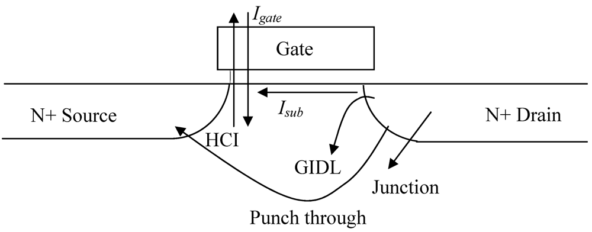
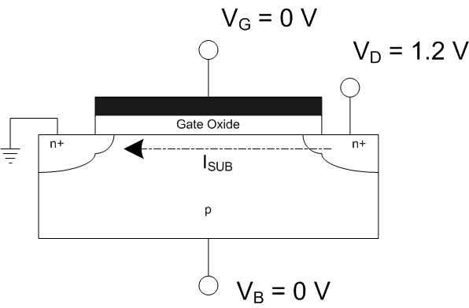

# 1.2. MOSFET: Leakage current

Metal-oxide-semiconductor field-effect transistor (MOSFET)의 꺼짐 전류는 여러 누설 메커니즘이 합쳐진 측정값이다. Thermionic subthreshold leakage, gate dielectric tunneling, reverse-biased junction leakage, gate-induced drain leakage (GIDL)와 punch-through가 같은 드레인 전류에 함께 나타날 수 있다.[1–3] 채널 장벽이 매우 짧거나 소자가 전기적 스트레스를 받은 경우에는 direct source-to-drain tunneling과 stress-induced leakage current (SILC)도 따로 고려해야 한다.[5,8,9,19–21]

따라서 누설 성분의 크기를 비교하려면 먼저 **어느 단자에서**, **어떤 바이어스와 온도에서**, **면적·폭·둘레 가운데 무엇을 기준으로 정규화하여** 측정했는지를 밝혀야 한다. 그다음 단자 전류 사이의 관계, 바이어스와 온도 의존성, 소자 형상에 따른 크기 변화를 함께 살펴 물리적 경로를 구분한다.[1,3,4]

별도 표기가 없으면 [MOSFET: Basic Operation](basic-operation.md)의 nMOS 바이어스, 전압·전류와 정규화 규약을 따른다.

<figure markdown="span">
  
  <figcaption markdown="1">
    그림 1. 평면형 n-channel MOSFET의 주요 누설 전류 성분도. Gate leakage, subthreshold leakage, hot-carrier injection, GIDL, junction leakage와 punch-through를 한 소자에 표시한다. GISL, gate-current partitioning, TAT/SILC와 direct source-to-drain tunneling은 본문의 확장 분류에서 별도로 다룬다.
    출처: E. Shauly, “CMOS Leakage and Power Reduction in Transistors and Circuits: Process and Layout Considerations,” <i>Journal of Low Power Electronics and Applications</i> <b>2</b>, Figure 2 (2012),
    <a href="https://doi.org/10.3390/jlpea2010001">DOI</a>,
    <a href="https://creativecommons.org/licenses/by/3.0/">CC BY 3.0</a>, 수정 없음.[2]
  </figcaption>
</figure>

## 1. 성분 분류와 단자 전류

### (1) 경로 분류

아래 표는 단채널 MOSFET에서 확인해야 할 누설 경로를 발생 위치에 따라 정리한 것이다. 먼저 이 표로 전체 구조를 파악한 뒤, 각 절에서 발생 원인과 측정법을 설명한다.[1,2,4]

| 물리적 영역 | 전류 성분 | 대표 경로 | 주요 제어 변수 | 주된 단자 신호 |
| --- | --- | --- | --- | --- |
| 표면 채널 | subthreshold leakage | 소스 → 반전·공핍 표면 → 드레인 | $V_G$, $V_D$, $T$, $L$ | $I_D\approx-I_S$ |
| 깊은 바디 | punch-through | 소스 → 채널 아래의 potential saddle point → 드레인 | $V_D$, $V_B$, $L$, 바디 도핑 | $I_D\approx-I_S$ |
| 채널 장벽 | direct source-to-drain tunneling | 소스 파동함수 → 채널 장벽 → 드레인 | 장벽 길이·높이, $V_G$, $V_D$ | 온도 의존성이 약한 채널 전류 |
| 채널 위 게이트 절연막 | gate-to-channel tunneling | 게이트 → 채널, 이후 소스와 드레인으로 분배 | 산화막 전기장, EOT, 게이트 면적 | $I_G$와 $I_S$·$I_D$의 대응 |
| 바디 위 게이트 절연막 | gate-to-body tunneling | 게이트 → 기판·바디 | 산화막 전기장, 축적·반전 | $I_G$와 $I_B$의 대응 |
| 소스·드레인 겹침부 | overlap direct tunneling | 게이트 → 소스·드레인 확장 영역 | 겹침부 전기장·길이 | $I_G$와 $I_S$·$I_D$의 대응 |
| 드레인 쪽 게이트 가장자리 | edge direct tunneling (EDT) | 게이트 가장자리 → 드레인 확장 영역 | $V_{GD}$, 산화막 두께, 가장자리 형상 | $I_G$와 $I_D$의 대응 |
| 게이트 절연막 결함 | trap-assisted tunneling (TAT) | 전극 → 산화막 트랩 → 전극 | 트랩 밀도, 전기장, $T$ | 초과 $I_G$ |
| 스트레스를 받은 게이트 절연막 | stress-induced leakage current (SILC) | 스트레스로 생성된 트랩 보조 경로 | 스트레스 이력, 주입 전하 | 스트레스 뒤 저전계 $I_G$ |
| 드레인–바디 접합 | diffusion·generation | 중성 영역·depletion region → 접합 | 역바이어스, $T$, 면적·둘레 | $I_D$와 $I_B$의 대응 |
| 드레인–바디 고전계 접합 | BTBT·TAT·avalanche | 가전자대·트랩 → 전도대 | 국소 접합 전기장, 트랩 | $I_D$와 $I_B$ |
| 게이트–드레인 겹침부 | gate-induced drain leakage (GIDL) | 드레인 가장자리 BTBT/TAT | 낮은 $V_G$, 높은 $V_D$, $V_B$ | $I_D$와 $I_B$의 대응 |
| 게이트–소스 겹침부 | gate-induced source leakage (GISL) | 소스 가장자리 BTBT/TAT | 낮은 $V_G$, 높은 $V_S$, $V_B$ | $I_S$와 $I_B$의 대응 |
| 드레인 쪽 고전계 영역 | hot-carrier injection (HCI) | 채널 운반자 → 산화막·게이트 또는 기판 | $V_G$, $V_D$, 수평 전기장 | $I_G$ 또는 $I_B$ |

Junction leakage와 gate leakage는 각각 하나의 메커니즘이 아니라 발생 위치나 측정 단자로 묶은 상위 범주이다. 예를 들어 reverse-biased junction current에는 neutral-region diffusion, depletion-region generation, junction band-to-band tunneling (BTBT), trap-assisted tunneling (TAT)과 소자 분리 가장자리 전류가 포함될 수 있다. Gate current도 바디, 채널, 겹침부와 게이트 가장자리에서 생긴 성분이 합쳐진 값이다.[1,3,4]

### (2) 단자 전류와 누설 메커니즘의 구분

정상 상태의 네 단자 측정에서는 Kirchhoff’s current law (KCL)에 따라

$$
I_G+I_D+I_S+I_B\approx 0
$$

이어야 한다. 그러나 이 식은 전류가 보존되는지만 확인하며, 누설 메커니즘을 자동으로 분리해 주지는 않는다. 예를 들어 드레인 전류계가 읽는 $I_D$에는 채널 전류, 드레인 쪽으로 빠져나온 게이트 터널링 전류, 드레인 접합 전류와 GIDL이 모두 포함될 수 있다.[1,4,7]

게이트 절연막을 통과한 전류도 주입 위치와 채널 전위에 따라 바디, 소스 또는 드레인 쪽으로 나뉜다. 따라서 $\lvert I_G\rvert$와 $\lvert I_D\rvert$ 같은 단자 전류의 크기를 단순히 더하면 같은 물리적 전류를 두 번 셀 수 있다. 일반적인 누설 분석에서는 compact model의 내부 성분 이름을 먼저 적용하기보다, 네 단자에서 실제로 측정한 부호 있는 전류와 바이어스 의존성을 출발점으로 삼는 편이 명확하다.[1,4,7]

!!! warning "[Interpretation Caveat]"
    누설 메커니즘, 물리적 경로와 측정된 단자 전류를 같은 이름으로 쓰지 않는다. “$I_D$가 증가했다”는 측정 결과이고, “GIDL의 BTBT 성분이 증가했다”는 추가 근거가 필요한 해석이다.[1,3]

## 2. 채널과 벌크 경로

### (1) Thermionic Subthreshold Leakage

Subthreshold leakage는 $V_G<V_T$에서 소스 운반자가 유한한 소스–채널 에너지 장벽을 넘어 드레인으로 이동해 생긴다. 약한 반전에서 표면 운반자 농도는 게이트 전압에 지수적으로 의존하며, 장채널 극한에서는 확산이 지배하는 수송으로 설명할 수 있다. 단채널 소자에서는 drain-induced barrier lowering (DIBL)이 소스 쪽 장벽을 낮춰 같은 $V_G$에서 전류를 증가시킨다.[1,3,5]

<figure markdown="span">
  
  <figcaption markdown="1">
    그림 2. $V_G=0$인 n-channel MOSFET의 대표적인 subthreshold leakage 경로.
    출처: Fadeaway919, “FET subthreshold leakage,” Wikimedia Commons,
    <a href="https://commons.wikimedia.org/wiki/File:FET_subthreshold_leakage.png">CC BY-SA 3.0</a>, 수정 없음.[22]
  </figcaption>
</figure>

약한 반전의 대표 근사식은

$$
I_\mathrm{sub}\approx
I_0\frac{W}{L}
\exp\left(\frac{V_{GS}-V_T+\eta_DV_{DS}}{nU_T}\right)
\left[1-\exp\left(-\frac{V_{DS}}{U_T}\right)\right]
$$

이다. $U_T=kT/q$는 열전압, $n$은 subthreshold slope factor, $\eta_D$는 드레인 결합 계수이다. 이 식은 모형에 의존하는 계수 $I_0$ 때문에 절대 전류에 대한 보편식이 아니라 $V_G$, $V_D$와 $T$에 대한 민감도를 보여주는 간결한 근사식으로 사용한다.[1,3]

Subthreshold swing (SS)은

$$
\mathrm{SS}
=\left(\frac{d\log_{10}|I_D|}{dV_G}\right)^{-1}
=\ln(10)\,n\frac{kT}{q}
$$

로 정의한다. $n=1$인 thermionic limit은 300 K에서 약 $59.6\ \mathrm{mV/dec}$이다. 실제 벌크 MOSFET에서는 depletion capacitance와 interface-trap capacitance 때문에 일반적으로 $n>1$이다.[1,3,5]

!!! info "[Measurement]"
    낮은 $V_D$와 실제 꺼짐 조건의 높은 $V_D$에서 반로그 $I_D$–$V_G$를 측정한다. 같은 주사에서 $I_G$와 $I_B$를 동시에 읽어 측정된 최저 전류가 게이트 또는 접합 누설에 의해 정해지는지 확인한다. 지정한 전류 구간에서

    $$
    \mathrm{SS}
    =
    \left(
    \frac{d\log_{10}(|I_D|/W)}{dV_G}
    \right)^{-1}
    $$

    를 회귀하고,

    $$
    \mathrm{DIBL}
    =
    \frac{V_T(V_{D,\mathrm{low}})-V_T(V_{D,\mathrm{high}})}
    {V_{D,\mathrm{high}}-V_{D,\mathrm{low}}}
    $$

    를 같은 $V_T$ 추출 규약으로 계산한다. $I_\mathrm{OFF}/W=\lvert I_D(V_{G,\mathrm{off}},V_{D,\mathrm{off}})\rvert/W$를 보고할 때에는 모든 단자 바이어스, $T$와 $L$을 함께 기록한다.[1,3–6]

### (2) Punch-Through와 표면 아래 누설

Punch-through는 채널이 짧거나 바디 도핑이 낮을 때 소스와 드레인의 공핍 영역이 바디 깊은 곳에서 강하게 결합하여, 채널 아래 potential saddle point의 장벽을 낮추는 현상이다. 게이트가 표면 채널을 꺼도 소스 운반자가 바디 내부를 지나 드레인에 도달할 수 있다. DIBL과 같은 단채널 정전기 문제와 관련되지만, 표면을 따라 흐르는 subthreshold leakage와 주된 경로가 다를 수 있다.[1,2,17,18]

!!! info "[Measurement]"
    $V_G$를 꺼짐 바이어스에 고정하고 여러 채널 길이에서 $I_D$–$V_D$를 측정한다. $V_B$와 $T$도 바꾸고 $I_G$, $I_B$를 동시에 읽어 GIDL과 접합 항복을 배제한다. 지정한 기준전류 $I_\mathrm{PT,ref}$에 대해

    $$
    V_\mathrm{PT}
    =
    V_D\ \text{at}\ |I_D|/W=I_\mathrm{PT,ref},
    \qquad
    g_{ds,\mathrm{off}}
    =
    \left.\frac{\partial |I_D|}{\partial V_D}\right|_{V_G=V_{G,\mathrm{off}}}
    $$

    를 추출한다. $I_\mathrm{PT,ref}$, $V_G$, $V_B$, $T$와 $L$을 함께 보고한다.[1,17,18]

### (3) Direct Source-to-Drain Tunneling

Direct source-to-drain tunneling (DSDT 또는 S/D tunneling)은 운반자가 채널 장벽을 열적으로 넘지 않고 양자역학적으로 관통하는 경로다. 기존 평면형 벌크 MOSFET의 일반적인 누설 바닥으로 가정해서는 안 되지만, 장벽이 매우 짧은 극미세 FDSOI, double-gate SOI, FinFET과 유사 구조에서는 thermionic subthreshold current와 별도로 고려해야 한다.[5,19–21]

!!! info "[Measurement]"
    여러 $L$과 온도에서 동일한 $(V_G,V_D,V_B)$의 subthreshold $\lvert I_D\rvert$를 측정하고, 접촉·직렬저항과 계측기의 측정 하한을 별도로 확인한다. 각 바이어스에서 Arrhenius 기울기로

    $$
    E_A(V_G,V_D,L)
    =
    -k
    \frac{\partial\ln |I_D|}{\partial(1/T)}
    $$

    를 추출한다. $E_A$가 작아지는 것은 온도 의존성이 약해졌음을 보여주는 지표일 뿐 DSDT를 단독으로 확정하는 기준은 아니다. $\lvert I_D\rvert$가 장벽 길이에 따라 변하는 양상과 양자수송 모사를 함께 제시한다.[5,19–21]

!!! warning "[Interpretation Caveat]"
    낮은 온도에서 subthreshold current의 온도 의존성이 약해졌다는 사실만으로 DSDT를 확정하지 않는다. 접촉, 직렬저항, trap-assisted path와 계측기의 측정 하한을 배제하고, barrier length에 따른 크기 변화 또는 quantum-transport simulation과 교차검증한다.[19–21]

## 3. 게이트 절연막 경로

### (1) Direct and Fowler–Nordheim Tunneling

게이트 절연막 누설은 운반자가 유한한 절연막 장벽을 통과해 생긴다. 얇은 절연막의 사다리꼴 장벽에서는 direct tunneling (DT)이, 충분히 높은 절연막 전기장에서 삼각형 장벽에 가까워지면 Fowler–Nordheim (FN) tunneling이 나타날 수 있다. high-$k$ 적층 구조에서는 equivalent oxide thickness (EOT)만 같아도 물리적 두께와 밴드 오프셋이 다르므로 단일 SiO$_2$층의 식을 그대로 적용할 수 없다.[1,3,4]

일차원 Wentzel–Kramers–Brillouin approximation (WKB)의 투과 확률은

$$
T(E)\approx
\exp\left[
-\frac{2}{\hbar}
\int_{x_1}^{x_2}
\sqrt{2m_\mathrm{ox}^{*}\left(U(x)-E\right)}\,dx
\right]
$$

이다. $m_\mathrm{ox}^{*}$는 절연막 유효질량, $U(x)$는 장벽 에너지 분포, $x_1$과 $x_2$는 고전적 전환점이다. 이 식은 두께와 장벽 형상에 대한 지수 민감도를 보여주지만, 정량 전류를 구하려면 전극의 density of states, 밴드 오프셋, 영상력에 의한 장벽 저하와 다층 적층 구조를 포함해야 한다.[3,4]

!!! info "[Measurement]"
    소스와 드레인을 같은 전위로 묶은 대칭 바이어스에서 $I_G$–$V_G$를 측정하고, 게이트 면적이 서로 다른 소자로 면적 성분을 확인한다. 기본 전류밀도는

    $$
    J_G=\frac{|I_G|}{A_G}
    $$

    로 계산한다. Fowler–Nordheim 해석을 사용할 때에는 절연막 모형으로 환산한 $F_\mathrm{ox}$에 대해 $\ln(J_G/F_\mathrm{ox}^2)$–$1/F_\mathrm{ox}$의 선형 구간과 기울기를 보고한다. 외부 $V_G/t_\mathrm{ox}$를 다층 high-$k$ 적층의 실제 전기장과 동일시하지 않는다.[3,4]

### (2) 게이트 전류의 분배와 Edge Direct Tunneling

게이트 절연막을 통과해 채널에 들어온 전류는 채널 전위에 따라 소스와 드레인 쪽으로 나뉜다. 바디 위 절연막과 소스·드레인 겹침부를 통과하는 전류는 서로 다른 공간 경로를 갖는다. 따라서 $I_G$–$V_G$ 곡선 하나만으로 전류가 절연막의 어느 위치를 통과했는지 알 수 없으며, 네 단자 전류와 면적·겹침 길이가 다른 소자를 함께 측정해야 한다.[1,4,7]

Edge direct tunneling (EDT)은 꺼짐 상태의 초박막 산화막 MOSFET에서 게이트 가장자리와 드레인 확장 영역 사이로 흐르는 게이트–드레인 터널링이다. 게이트–기판 면적 터널링, 접합 BTBT와 일반적인 GIDL이 공유하는 단자 전류에 섞일 수 있으며, 폭에 따른 크기 변화와 겹침부 형상 의존성으로 분리하는 것이 유용하다.[1,7]

!!! info "[Measurement]"
    소스와 드레인을 같은 전위로 묶어 수평 전기장을 줄인 $I_G$–$V_G$ 측정과 실제 꺼짐 상태의 비대칭 바이어스 측정을 비교한다. $I_S$, $I_D$, $I_B$를 동시에 읽고 게이트 면적과 겹침 길이가 서로 다른 소자를 사용한다. 면적 성분은 $J_G=\lvert I_G\rvert/A_G$로 계산하고, 겹침부·가장자리 성분은 폭에 따른 변화와 소스·드레인 바이어스를 서로 바꾼 결과로 구분한다. 절연막 적층 구조, 물리적 두께, equivalent oxide thickness (EOT), 전압 극성과 $T$를 함께 기록한다.[3,4,7]

### (3) Trap-Assisted Tunneling and Stress-Induced Leakage Current

Trap-assisted tunneling (TAT)은 운반자가 절연막의 결함 상태를 경유해 장벽을 통과하는 수송이다. stress-induced leakage current (SILC)는 고전계 전기 스트레스 뒤 저전계 게이트 누설이 증가하는 **열화 신호**이며, 새 소자의 고유 direct tunneling과 같은 항으로 취급하면 안 된다. 여러 SILC 모형은 스트레스로 생성된 트랩을 통한 한 단계 또는 다단계 비탄성 TAT로 이 증가분을 설명한다.[8,9]

SILC를 확인하려면 같은 소자의 스트레스 전후 $I_G$–$V_G$를 비교해야 한다. 스트레스 전압과 시간, 주입 전하 또는 fluence, 회복 시간과 판독 전기장을 기록하고, 스트레스를 가하지 않은 기준 소자의 공정 변동과 구분한다.[8,9]

!!! info "[Measurement]"
    같은 소자에서 초기 $I_G$–$V_G$, 지정한 전기장·시간의 스트레스, 일정한 회복 시간 뒤의 판독 $I_G$–$V_G$를 순서대로 반복한다. 판독 바이어스 $V_\mathrm{sense}$에서

    $$
    \Delta J_\mathrm{SILC}
    =
    \frac{|I_{G,\mathrm{after}}(V_\mathrm{sense})|
    -|I_{G,\mathrm{before}}(V_\mathrm{sense})|}{A_G},
    \qquad
    Q_\mathrm{inj}
    =
    \frac{1}{A_G}\int |I_G(t)|\,dt
    $$

    를 추출한다. $\Delta J_\mathrm{SILC}$는 판독 전기장, $Q_\mathrm{inj}$ 또는 스트레스 시간과 회복 시간을 함께 보고한다.[8,9]

!!! warning "[Interpretation Caveat]"
    TAT는 GIDL 영역의 계면·벌크 트랩, 역바이어스 접합의 공핍영역 트랩, 게이트 절연막 트랩에 모두 등장할 수 있다. “TAT”라는 수송 이름만으로 결함 위치가 정해지지 않는다.[4,8,12]

### (4) Hot-Carrier Injection

Hot-carrier injection (HCI)은 드레인 쪽 수평 전기장에서 에너지를 얻은 운반자가 게이트 절연막으로 주입되거나 impact ionization을 일으켜 게이트·바디 전류와 장기적인 매개변수 변화를 만드는 고전계 현상이다. 전통적인 누설 분류에는 포함되지만, $V_G=0$의 정상적인 꺼짐 상태에서 항상 존재하는 기준 성분으로 간주해서는 안 된다. 켜짐 상태, 전환 구간 또는 스트레스 바이어스에서 별도로 평가한다.[1,2,4]

!!! info "[Measurement]"
    스트레스 전 전달·출력 특성을 저장하고, 지정한 $(V_G,V_D,V_B,T)$에서 스트레스하는 동안 $I_B$와 $I_D$를 기록한다. 일정한 간격마다 낮은 판독 바이어스에서 특성을 다시 측정한다. 순간 고전계 신호는 $|I_B/I_D|$로, 열화는

    $$
    \Delta V_T=V_T(t)-V_T(0),
    \qquad
    \frac{\Delta g_m}{g_m(0)}
    =
    \frac{g_m(t)-g_m(0)}{g_m(0)}
    $$

    로 정량화하고, 수명에는 판정 기준과 외삽 모형을 함께 기록한다.[1,2,4]

## 4. 접합·겹침부·소자 분리 가장자리 경로

### (1) Reverse-Biased Junction Diffusion and Generation

꺼짐 상태의 드레인–바디와 소스–바디 pn 접합에는 역바이어스가 걸린다. 낮거나 중간 세기의 전기장에서는 중성 영역의 소수 운반자 확산과 공핍영역의 Shockley–Read–Hall generation이 기여한다. 소자 분리 가장자리와 게이트 가장자리는 벌크 바닥 영역과 결함 밀도·응력·전기장이 달라 별도의 둘레 성분을 가질 수 있다.[1,3,4,10,16]

면적과 둘레가 서로 다른 소자에 적용하는 일차 분해식은

$$
|I_\mathrm{junc}|
\approx
J_AA_\mathrm{bottom}
+J_\mathrm{iso}P_\mathrm{iso}
+J_\mathrm{gate}W_\mathrm{gate-edge}
$$

로 쓸 수 있다. $J_A$는 접합 바닥의 면적 전류밀도이고, $J_\mathrm{iso}$와 $J_\mathrm{gate}$는 각각 소자 분리 가장자리와 게이트 가장자리의 단위 길이당 전류이다. 이는 한 가지 누설 메커니즘의 지배 방정식이 아니라, 측정된 접합 전류를 발생 위치에 따라 분리하기 위한 회귀식이다.[4,10]

!!! info "[Measurement]"
    독립된 드레인–바디 다이오드 구조에서 낮거나 중간 크기의 역바이어스 $I$–$V$를 온도별로 측정한다. 바닥 면적, shallow trench isolation (STI) 둘레와 게이트 가장자리 길이가 독립적으로 변하는 구조를

    $$
    |I_\mathrm{junc}|
    =
    J_AA_\mathrm{bottom}
    +J_\mathrm{iso}P_\mathrm{iso}
    +J_\mathrm{gate}W_\mathrm{gate-edge}
    $$

    에 회귀하여 $J_A$, $J_\mathrm{iso}$와 $J_\mathrm{gate}$를 추출한다. 각 위치별 성분의 온도 의존성을 분리할 수 있으면 $E_A=-k\,\partial\ln J/\partial(1/T)$를 바이어스별로 구한다. 회귀에 사용한 형상 범위, 역바이어스와 온도를 함께 보고한다.[3,4,10]

### (2) Junction BTBT, TAT, and Avalanche

고농도로 도핑되었거나 고전계인 역바이어스 접합에서는 direct BTBT와 trap-assisted tunneling이 증가할 수 있다. 더 높은 바이어스에서 impact-ionization avalanche multiplication이 시작되면 항복 전 누설과 항복 영역을 분리해야 한다. BTBT, TAT와 avalanche는 모두 역전류를 키우지만 전기장·온도 의존성과 발생 위치가 같지 않다.[1,3,10,12]

!!! info "[Measurement]"
    독립된 드레인–바디 다이오드 구조에서 항복 전 영역부터 설정한 전류 제한(compliance)에 도달하기 전까지 역방향 $I$–$V$를 온도별로 측정한다. 선택한 정규화 기준과 기준 전류밀도 $J_\mathrm{HF,ref}$에 대해

    $$
    V_\mathrm{HF}
    =
    |V_\mathrm{rev}|\quad\text{at}\quad
    J_\mathrm{junc}=J_\mathrm{HF,ref},
    \qquad
    E_A(V_\mathrm{rev})
    =
    -k\frac{\partial\ln J_\mathrm{junc}}{\partial(1/T)}
    $$

    를 추출한다. $V_\mathrm{HF}$는 소자 사이의 비교를 위해 정한 기준값이며, 특정 메커니즘의 고유한 항복 전압은 아니다. 따라서 $J_\mathrm{HF,ref}$, 정규화에 사용한 면적·둘레, 온도와 compliance 설정을 함께 기록한다. $E_A$나 전류 증가율 하나만으로 BTBT, TAT 또는 avalanche를 확정하지 않고, 접합 전기장 모사와 전류가 생성되는 위치를 교차검증한다.[3,4,10,12]

### (3) GIDL and GISL

Gate-induced drain leakage (GIDL)는 nMOS의 낮거나 음의 게이트 전압과 높은 드레인 전압이 게이트–드레인 겹침부의 밴드 굽힘과 국소 전기장을 키울 때 나타난다. 고전계에서는 direct BTBT가 중요하고, 트랩이 있으면 더 낮은 전기장 영역에 TAT가 더해질 수 있다. gate-induced source leakage (GISL)는 소스 쪽 바이어스를 반전한 대응 성분이며, 비대칭 소스·드레인 구조에서는 두 전류가 같다고 가정할 수 없다.[1,4,11–13]

Direct BTBT의 전기장 의존성은 단순화하면

$$
J_\mathrm{BTBT}\propto F^2\exp\left(-\frac{B}{F}\right)
$$

로 나타낼 수 있다. $F$는 국소 전기장, $B$는 밴드갭과 유효질량 등에 의존하는 계수이다. 외부 단자전압을 $F$와 동일시하면 도핑 기울기, 겹침부 형상과 전기장 집중 효과를 잃으므로 정성적 경향 또는 보정된 전기장 모형에만 사용한다.[3,11,12]

!!! info "[Measurement]"
    GIDL은 $V_S=V_B=0$, $V_D>0$에서 $V_G$를 낮추며 측정하고, GISL은 드레인과 소스의 역할을 바꾼 대칭 바이어스로 측정한다. $I_B$와 $I_G$를 함께 읽어 생성된 정공 전류와 EDT·게이트 터널링을 구분한다. 선택한 배경 전류 $I_\mathrm{bg}$를 뺀 뒤

    $$
    J_\mathrm{GIDL}^{(W)}
    =
    \frac{|I_D-I_\mathrm{bg}|}{W},
    \qquad
    V_\mathrm{GIDL}
    =
    V_G\ \text{at}\ J_\mathrm{GIDL}^{(W)}=J_\mathrm{ref}
    $$

    를 추출하고, GISL에도 같은 규약을 적용한다. $J_\mathrm{ref}$, 배경 전류의 정의, $(V_G,V_D,V_S,V_B,T)$와 회귀 구간을 함께 보고한다.[4,11,13]

!!! warning "[Interpretation Caveat]"
    드레인 쪽의 낮은 $V_G$ 전류가 모두 GIDL은 아니다. $I_G$가 함께 증가하면 EDT 또는 겹침부 게이트 터널링, $I_B$만 역바이어스 접합의 형상에 따라 증가하면 접합 성분, 짧은 $L$에서만 $I_D\approx-I_S$로 증가하면 punch-through를 먼저 확인한다.[1,4,7]

## 5. 누설 저감 방법과 trade-off

누설 전류의 해결책은 하나의 “저누설 구조”로 묶기보다 줄이려는 경로에 대응시켜야 한다. 같은 공정 변화가 한 성분은 낮추면서 다른 성분이나 켜짐 성능을 악화할 수 있기 때문이다.[1–3]

### (1) 채널 누설과 Short-Channel Effects

Subthreshold leakage는 높은 $V_T$, 작은 SS와 약한 드레인 결합으로 줄일 수 있다. 그러나 $V_T$ 증가는 켜짐 전류와 속도를 낮추므로, noncritical path에 높은 $V_T$ 소자를 선택하거나 대기 상태에서만 body bias를 적용하는 방식이 전체 성능 저하를 제한한다. 얇은 전기적 게이트 절연막, 얕은 접합, retrograde well과 halo implant는 게이트의 장벽 제어를 강화하고 DIBL·punch-through를 억제한다.[1–3]

Halo implant는 채널 양 끝의 공핍 폭을 줄여 전하 공유와 DIBL을 억제하지만, 국소 고농도 접합의 전기장을 높여 BTBT와 GIDL을 증가시킬 수 있다. 따라서 $V_T$–$L$, DIBL과 $I_\mathrm{OFF}$만이 아니라 $I_B$와 GIDL도 함께 비교해야 한다.[1,3]

### (2) 게이트·접합·GIDL 경로

같은 EOT에서 high-$k$ 절연막은 SiO$_2$보다 큰 물리적 두께를 사용할 수 있어 direct gate tunneling을 낮춘다. 다만 계면층, 밴드 오프셋, 결함과 이동도까지 포함한 적층 구조로 검증해야 하며, EOT만으로 실제 $J_G$가 정해지지는 않는다.[2–4]

Lightly doped drain (LDD)은 고농도 드레인과 채널 사이에 낮은 농도의 확장 영역을 두어 드레인 쪽 전위 강하를 더 긴 거리로 분산한다. 이에 따라 국소 첨두 전기장, hot-carrier 생성과 일부 GIDL을 줄일 수 있다. 반면 낮은 농도의 확장 영역은 소스·드레인 직렬저항을 늘려 $I_\mathrm{ON}$과 $g_m$을 낮출 수 있고, spacer 길이·주입량·겹침은 GIDL, 기생 정전용량과 신뢰성을 동시에 바꾼다. 따라서 LDD는 모든 leakage와 SCE를 해결하는 일반 처방이 아니라 **drain engineering** 관점에서 평가해야 한다.[2,7,23]

| 목표 성분 | 대표 설계 변수 | 기대 효과 | 반드시 확인할 대가 |
| --- | --- | --- | --- |
| gate tunneling | high-$k$/metal gate, 물리적 절연막 두께 | 같은 EOT에서 터널 장벽 폭 증가 | 계면 결함, 이동도, 적층별 밴드 오프셋 |
| junction generation | 접합 면적·STI 둘레, 결함·열 공정 | 생성 중심과 누설이 발생하는 활성 부피 감소 | 접촉저항, 접합 정전용량 |
| GIDL·hot carrier | LDD·graded extension, 겹침과 spacer | 드레인 가장자리 전기장 완화 | 직렬저항, $I_\mathrm{ON}$, 기생 정전용량 |
| punch-through | 얕은 접합, halo·retrograde well | 소스–드레인 공핍영역 결합 약화 | BTBT·GIDL, 변동성, 이동도 |

### (3) 회로 수준의 대기 누설

회로에서는 high-$V_T$ 소자, transistor stacking, power gating, 대기 body bias와 공급전압 저하로 소자에 실제 걸리는 $V_{GS}$, $V_{DS}$와 $V_{BS}$를 바꿀 수 있다. Stacking은 직렬로 꺼진 소자의 중간 노드 전위를 올려 위쪽 nMOS의 $V_{GS}$와 $V_{DS}$를 낮추고 body effect를 키운다. Power gating은 비활성 블록의 전원 경로를 차단한다. 이 방법들은 대기 누설을 줄이는 대신 지연, 면적, wake-up energy와 상태 보존 조건을 추가하므로 소자 자체의 $J_G$나 접합 결함 개선과 구분해 평가한다.[1,2]

## 6. 성분 분리를 위한 측정 절차

### (1) 네 단자 구성과 데이터 품질

게이트, 드레인, 소스와 바디에 source-measure unit (SMU)를 각각 연결해 네 단자 전류를 동시에 읽는다. 저전류 측정에서는 가드가 적용된 삼축 케이블, 차광·차폐함, 청결한 고절연 지그, 충분한 안정화 시간과 개방 패드·배경 측정이 중요하다. 케이블·지그 누설과 병렬 정전용량은 측정 하한을 높이고 안정화 오차를 만들 수 있다.[14,15]

!!! info "[Measurement]"
    각 바이어스 지점에서 부호 있는 전류의 KCL 잔차 $\lvert I_G+I_D+I_S+I_B\rvert$를 기록한다. 잔차가 분석하려는 누설 성분보다 크면 물리 모형을 적용하기 전에 배선, compliance 설정, 안정화 시간, 자동 측정 범위와 배경 전류 보정을 점검한다.[4,14,15]

### (2) 바이어스 행렬

| 측정 | 바이어스 구성 | 민감한 성분 | 필수 교차점검 |
| --- | --- | --- | --- |
| 반로그 $I_D$–$V_G$ | 낮은·높은 $V_D$ | subthreshold leakage, DIBL, GIDL에 의한 최저 전류 | $I_G$, $I_B$ 동시 측정 |
| 꺼짐 상태 $I_D$–$V_D$ | 낮은 $V_G$ 고정, 여러 $L$과 $V_B$ | punch-through, GIDL, junction leakage | $I_S$, $I_B$, 채널 길이가 다른 소자 |
| 대칭 $I_G$–$V_G$ | $V_S=V_D$, 제어된 $V_B$ | 게이트 면적 터널링 | 소스·드레인 단자 전류 동시 측정 |
| 비대칭 겹침부 주사 | $V_{GD}$ 또는 $V_{GS}$ 변화 | 소스·드레인 겹침부 터널링, EDT | 겹침 길이·폭이 다른 소자 |
| 역방향 다이오드 $I$–$V$ | 독립된 S/B 또는 D/B 접합 | 확산, 생성, BTBT, TAT, avalanche | 면적·둘레가 다른 소자, 온도 주사 |
| 대칭 가장자리 주사 | 소스와 드레인 바이어스 교환 | GIDL과 GISL | 레이아웃·공정 대칭성 |
| 스트레스 전후 $I_G$–$V_G$ | 동일한 판독 주사 | SILC와 절연막 TAT | 스트레스를 가하지 않은 기준 소자, 회복 시간 |
| 극저온–고온 주사 | 동일한 바이어스 행렬 | 열전자 경로와 온도 의존성이 약한 경로 | 계측기의 측정 하한, 접촉 효과 |

### (3) 판별 순서

1. 낮은·높은 $V_D$의 $I_D$–$V_G$에서 SS, DIBL과 측정된 최저 전류를 확인한다.
2. 같은 주사의 $I_G$, $I_S$, $I_B$와 KCL 잔차로 단자별 분배와 측정 건전성을 확인한다.
3. 대칭 게이트 바이어스와 비대칭 겹침부 바이어스를 비교해 게이트 면적, 채널 분배와 가장자리 성분을 분리한다.
4. 독립된 접합 구조와 면적·소자 분리 둘레·게이트 가장자리 길이가 서로 다른 소자로 접합의 위치별 성분을 추출한다.
5. 소스·드레인 역할을 바꾼 주사로 GIDL과 GISL, 구조적 비대칭을 확인한다.
6. 채널 길이와 바디 바이어스가 서로 다른 소자로 punch-through를 확인하고, 극미세 소자에서만 DSDT 모형을 추가 검토한다.
7. 시간 변화 또는 이력 현상이 있으면 스트레스를 중단하고, 스트레스를 가하지 않은 기준 소자와 스트레스 전후 측정으로 SILC·포획 효과를 분리한다.[1,4,10,14,15]

!!! warning "[Interpretation Caveat]"
    곡선 모양 하나나 단일 활성화 에너지만으로 메커니즘을 확정하지 않는다. 단자 전류의 상관관계, 바이어스 의존성, 온도 의존성과 형상에 따른 크기 변화 가운데 서로 독립적인 두 종류 이상의 근거를 요구한다.[3,10,14]

## 7. 요약

- $I_\mathrm{OFF}$는 한 가지 메커니즘이 아니라 채널, 게이트 절연막, 접합, 겹침부 가장자리와 바디 내부 경로에서 생긴 전류가 단자에서 합쳐진 결과이다.
- 채널 관련 누설에서는 thermionic subthreshold leakage, DIBL로 증가한 전류, punch-through와 극미세 소자의 DSDT를 구분한다.
- Gate leakage는 채널, 바디, 소스·드레인 겹침부와 게이트 가장자리에서 생긴 성분을 구분하고 EDT, 절연막 TAT와 SILC를 별도로 확인한다.
- Junction leakage는 바닥 면적, 소자 분리 둘레와 게이트 가장자리 성분을 나누고 diffusion, generation, BTBT, TAT와 avalanche 영역을 구분한다.
- GIDL과 GISL은 소스·드레인 역할을 바꾼 바이어스, $I_B$·$I_G$의 상관관계와 가장자리 형상으로 분리한다.
- HCI와 SILC는 정상적인 꺼짐 상태의 기준 전류와 구분해 동작·스트레스 이력을 기록한다.
- 네 단자 전류, KCL 잔차, 온도 주사와 형상이 다른 소자를 함께 사용해야 누설 메커니즘을 판별할 수 있다.

## 8. 참고문헌

1. K. Roy, S. Mukhopadhyay, and H. Mahmoodi-Meimand, “Leakage Current Mechanisms and Leakage Reduction Techniques in Deep-Submicrometer CMOS Circuits,” *Proceedings of the IEEE* **91**, 305–327 (2003). [DOI: 10.1109/JPROC.2002.808156](https://doi.org/10.1109/JPROC.2002.808156).
2. E. Shauly, “CMOS Leakage and Power Reduction in Transistors and Circuits: Process and Layout Considerations,” *Journal of Low Power Electronics and Applications* **2**, 1–29 (2012). [DOI: 10.3390/jlpea2010001](https://doi.org/10.3390/jlpea2010001).
3. C. Hu, *Modern Semiconductor Devices for Integrated Circuits*, Chapter 7, Pearson (2010). [저자 제공 PDF](https://www.chu.berkeley.edu/wp-content/uploads/2020/01/Chenming-Hu_ch7.pdf).
4. BSIM Group, *BSIM-BULK MOSFET Model: Technical Manual*, Version 107.2.1, University of California, Berkeley (2025). [공식 release](https://bsim.berkeley.edu/models/bsimbulk/).
5. D. J. Frank et al., “Device Scaling Limits of Si MOSFETs and Their Application Dependencies,” *Proceedings of the IEEE* **89**, 259–288 (2001). [DOI: 10.1109/5.915374](https://doi.org/10.1109/5.915374).
6. A. Ortiz-Conde et al., “Revisiting MOSFET Threshold Voltage Extraction Methods,” *Microelectronics Reliability* **53**, 90–104 (2013). [DOI: 10.1016/j.microrel.2012.09.015](https://doi.org/10.1016/j.microrel.2012.09.015).
7. K. N. Yang et al., “Characterization and Modeling of Edge Direct Tunneling (EDT) Leakage in Ultrathin Gate Oxide MOSFETs,” *IEEE Transactions on Electron Devices* **48**, 1159–1164 (2001). [DOI: 10.1109/16.925242](https://doi.org/10.1109/16.925242).
8. L. Larcher, A. Paccagnella, and G. Ghidini, “A Model of the Stress Induced Leakage Current in Gate Oxides,” *IEEE Transactions on Electron Devices* **48**, 285–288 (2001). [DOI: 10.1109/16.902728](https://doi.org/10.1109/16.902728).
9. M. Ossaimee, K. Kirah, W. Fikry, A. Girgis, and O. A. Omar, “Simplified Quantitative Stress-Induced Leakage Current (SILC) Model for MOS Devices,” *Microelectronics Reliability* **46**, 287–292 (2006). [DOI: 10.1016/j.microrel.2005.07.007](https://doi.org/10.1016/j.microrel.2005.07.007).
10. D. K. Schroder, *Semiconductor Material and Device Characterization*, 3rd ed., Wiley (2006). [DOI: 10.1002/0471749095](https://doi.org/10.1002/0471749095).
11. L. Huang, P. T. Lai, J. P. Xu, and Y. C. Cheng, “Mechanism Analysis of Gate-Induced Drain Leakage in Off-State n-MOSFET,” *Microelectronics Reliability* **38**, 1425–1431 (1998). [DOI: 10.1016/S0026-2714(98)00044-4](https://doi.org/10.1016/S0026-2714(98)00044-4).
12. R. Inagaki, N. Sadachika, D. Navarro, M. Miura-Mattausch, and Y. Inoue, “A GIDL-Current Model for Advanced MOSFET Technologies without Binning,” *IPSJ Transactions on System LSI Design Methodology* **2**, 93–102 (2009). [DOI: 10.2197/ipsjtsldm.2.93](https://doi.org/10.2197/ipsjtsldm.2.93).
13. H.-F. Chen et al., “Investigation of the Characteristics of GIDL Current in 90 nm CMOS Technology,” *Chinese Physics* **15**, 645–648 (2006). [DOI: 10.1088/1009-1963/15/3/034](https://doi.org/10.1088/1009-1963/15/3/034).
14. Keysight Technologies, “DC MOSFET Characterization at the Wafer Level,” Application Note 5990-5547EN (2019). [공식 문서](https://www.keysight.com/my/en/assets/7018-02489/application-notes/5990-5547.pdf).
15. Tektronix/Keithley, *Low Level Measurements Handbook*, 7th ed. [공식 PDF](https://download.tek.com/document/LowLevelHandbook_7Ed.pdf).
16. S. M. Sze and K. K. Ng, *Physics of Semiconductor Devices*, 3rd ed., Wiley (2006). [DOI: 10.1002/0470068329](https://doi.org/10.1002/0470068329).
17. N. Kotani and S. Kawazu, “Computer Analysis of Punch-Through in MOSFETs,” *Solid-State Electronics* **22**, 63–70 (1979). [DOI: 10.1016/0038-1101(79)90172-2](https://doi.org/10.1016/0038-1101(79)90172-2).
18. J. J. Barnes, K. Shimohigashi, and R. W. Dutton, “Short-Channel MOSFET’s in the Punchthrough Current Mode,” *IEEE Transactions on Electron Devices* **26**, 446–453 (1979). [DOI: 10.1109/T-ED.1979.19447](https://doi.org/10.1109/T-ED.1979.19447).
19. H. Kawaura and T. Baba, “Direct Tunneling from Source to Drain in Nanometer-Scale Silicon Transistors,” *Japanese Journal of Applied Physics* **42**, 351–357 (2003). [DOI: 10.1143/JJAP.42.351](https://doi.org/10.1143/JJAP.42.351).
20. C. Medina-Bailon et al., “Multisubband Ensemble Monte Carlo Analysis of Tunneling Leakage Mechanisms in Ultrascaled FDSOI, DGSOI, and FinFET Devices,” *IEEE Transactions on Electron Devices* **66**, 1145–1152 (2019). [DOI: 10.1109/TED.2019.2890985](https://doi.org/10.1109/TED.2019.2890985).
21. C. Medina-Bailon et al., “Self-Consistent Enhanced S/D Tunneling Implementation in a 2D MS-EMC Nanodevice Simulator,” *Micromachines* **12**, 601 (2021). [DOI: 10.3390/mi12060601](https://doi.org/10.3390/mi12060601).
22. Fadeaway919, “FET Subthreshold Leakage,” Wikimedia Commons (2015), CC BY-SA 3.0. [파일 설명과 라이선스](https://commons.wikimedia.org/wiki/File:FET_subthreshold_leakage.png).
23. D. J. Mountain and D. Burnell, “An Evaluation of Conventional and LDD Devices for Submicron Geometries,” *Solid-State Electronics* **33**, 565–570 (1990). [DOI: 10.1016/0038-1101(90)90241-6](https://doi.org/10.1016/0038-1101(90)90241-6).
