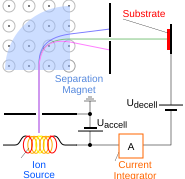

# 3.3. Semiconductor process: Doping and annealing

Doping은 반도체에 donor 또는 acceptor를 도입하여 자유 전하 운반자 농도와 전기적 특성을 조절하는 공정이다. 열확산은 표면 공급원에서 도펀트를 이동시키고, ion implantation은 질량·에너지가 선택된 ion beam으로 깊이와 dose를 제어한다. 그러나 주입 직후의 원자 위치가 곧바로 원하는 전기적 상태를 뜻하지는 않는다. 충돌로 생긴 결정 손상을 복구하고 도펀트를 전기적으로 활성화하기 위한 annealing이 뒤따르며, 이 과정에서 의도하지 않은 재확산도 일어난다.[1–3]

이 문서는 주로 crystalline Si에서의 diffusion, ion implantation, channeling, activation과 transient enhanced diffusion (TED)을 다룬다. 특정 장비의 recipe, 화합물 반도체와 SiC의 결함 화학은 재료마다 달라 보편적인 수치로 제시하지 않는다.

## 1. 열확산과 농도 분포

### (1) Fick 법칙과 확산 길이

한 방향 농도 $C(x,t)$의 확산은 Fick의 제2법칙으로

$$
\frac{\partial C}{\partial t}
=\frac{\partial}{\partial x}
\left(D\frac{\partial C}{\partial x}\right)
$$

와 같이 쓴다. 확산계수 $D$가 위치와 농도에 무관한 상수이면 $\partial C/\partial t=D\partial^2C/\partial x^2$로 단순화된다. 실제 $D$는 온도, 도펀트의 전하 상태, 점결함 농도와 고농도 효과에 의존하므로, 아래 해는 일정한 $D$를 가정한 기준 모형이다.[1,4]

표면 농도 $C_s$가 일정하고 초기 기판 농도를 무시할 수 있는 constant-source diffusion의 해는

$$
C(x,t)=C_s\operatorname{erfc}
\left(\frac{x}{2\sqrt{Dt}}\right)
$$

이다. 반면 총 면적 dose $Q$가 유한한 순간 공급원을 가정한 limited-source diffusion은

$$
C(x,t)=\frac{Q}{\sqrt{\pi Dt}}
\exp\left(-\frac{x^2}{4Dt}\right)
$$

의 Gaussian 형태를 갖는다. 두 해 모두 특징적인 확산 길이가 $\sqrt{Dt}$에 비례함을 보여 준다. 따라서 온도나 시간이 늘면 profile이 깊어지지만 peak 농도와 급격한 접합의 보존에는 불리하다.[1,4]

### (2) 확산계수와 접합 깊이

많은 희석 확산 조건에서 확산계수의 온도 의존성은

$$
D(T)=D_0\exp\left(-\frac{E_a}{k_\mathrm{B}T}\right)
$$

로 근사한다. $D_0$는 전지수 인자, $E_a$는 활성화 에너지, $k_\mathrm{B}$는 Boltzmann 상수이다. 이 Arrhenius 관계 때문에 공정 온도의 작은 변화도 확산 길이에 큰 차이를 만들 수 있다. 다만 implantation damage가 남은 초기 annealing이나 고농도 영역에서는 평형 $D(T)$만으로 profile 변화를 설명할 수 없다.[1,4,5]

기판의 반대형 배경 농도를 $C_B$라 하면 일차원 보상 근사에서 metallurgical junction depth $x_j$는

$$
C(x_j,t)=C_B
$$

로 정한다. 이 위치는 전기적 depletion edge와 동일한 개념이 아니며, 농도 의존 이동도·불완전 활성화와 측정 분해능도 실제 전기적 접합 해석에 영향을 준다.[1,6]

## 2. Ion implantation

### (1) Beam line과 dose–energy 제어

Ion implantation에서는 source가 dopant-containing gas나 고체 공급원에서 ion을 만들고, 분석 자석이 charge-to-mass ratio에 따라 원하는 종을 선택한다. 선택된 ion은 전기장으로 가속·집속되어 wafer를 주사한다. Beam current를 시간에 대해 적분하고 조사 면적으로 나눈 값이 dose이며 단위는 보통 $\mathrm{cm}^{-2}$이다. 가속 energy는 평균 도달 깊이를, dose는 주입된 원자의 면적 밀도를 주로 정한다.[1,2]

<figure markdown="span">
  
  <figcaption>
    그림 1. Ion implanter의 기본 beam line. Ion source에서 생성된 beam은 분리 자석으로 질량 선택된 뒤 가속 전극을 지나 substrate에 입사하며, current integrator가 dose 제어에 사용된다.
    출처: Kjerish, “Ion implanter schematic,” Wikimedia Commons (2024),
    <a href="https://commons.wikimedia.org/wiki/File:Ion_implanter_schematic.svg">CC BY-SA 4.0</a>, 수정 없음.[9]
  </figcaption>
</figure>

Wafer에 입사한 ion은 원자핵과의 nuclear stopping 및 전자계와의 electronic stopping으로 에너지를 잃는다. 총 stopping power는

$$
-\frac{dE}{dx}=N\left[S_n(E)+S_e(E)\right]
$$

로 나타낼 수 있다. $N$은 target 원자 밀도, $S_n$과 $S_e$는 각각 nuclear·electronic stopping cross section이다. 저에너지의 무거운 ion에서는 nuclear collision의 영향이 커질 수 있지만, 그 상대 기여는 ion–target 조합과 energy에 따라 달라진다.[1,2]

### (2) Projected range와 straggle

비정질 target에서 단일 implantation profile은 일차 근사로

$$
C(x)=C_p\exp\left[-\frac{(x-R_p)^2}{2\Delta R_p^2}\right]
$$

와 같이 쓸 수 있다. $R_p$는 beam 방향으로 투영한 평균 도달 깊이인 projected range, $\Delta R_p$는 충돌의 통계적 변동을 나타내는 projected straggle이다. 이 근사에서 dose $Q$와 peak 농도 $C_p$의 관계는

$$
Q=\sqrt{2\pi}\,\Delta R_p C_p
$$

이다.[1,2]

실제 profile은 표면막의 stopping, energy spread, sputtering, channeling과 비대칭 collision cascade 때문에 Gaussian이 아닐 수 있다. 여러 energy와 dose의 implantation을 중첩하면 box-like 또는 retrograde profile을 설계할 수 있지만, 최종 profile은 각 주입의 단순 합뿐 아니라 뒤따르는 annealing과 dose-dependent damage를 포함해 계산해야 한다.[1–3]

## 3. Channeling과 implantation damage

### (1) 결정 통로를 따른 깊은 tail

Channeling은 ion beam이 단결정의 저지수 축 또는 면과 정렬될 때 원자열과의 큰 각도 충돌을 피하면서 예상보다 깊이 진행하는 현상이다. 그 결과 농도 profile에 깊은 tail이 생기고 얕은 접합의 깊이 제어가 어려워질 수 있다. Axial channeling과 planar channeling은 각각 결정축과 결정면 정렬에 대응한다.[2,3]

Wafer를 주요 결정축에서 tilt하고 azimuthal twist를 조정하면 channeling probability를 낮출 수 있다. 표면 screen oxide와 pre-amorphization implant도 입사 방향 또는 표면 결정 질서를 흐트러뜨려 channeling을 억제한다. 그러나 pre-amorphization은 별도의 결함과 end-of-range damage를 만들 수 있으므로 얕은 profile만 보고 항상 유리하다고 판단할 수 없다.[2,3]

### (2) Collision cascade와 amorphization

Nuclear collision은 Si 원자를 격자 자리에서 밀어내 vacancy와 self-interstitial을 만들고, dose가 커지면 defect cluster 또는 amorphous layer로 이어질 수 있다. 주입 직후 도펀트의 상당 부분은 substitutional site에 있지 않거나 결함 cluster에 묶여 전기적으로 비활성일 수 있다. 따라서 chemical dose와 active carrier concentration은 일반적으로 같지 않다.[2,4,5]

!!! warning "[Interpretation Caveat]"
    Implantation-induced amorphization은 channeling을 줄이고 재결정 과정에서 급격한 profile을 얻는 데 이용될 수 있지만, regrowth interface 부근의 잔류 결함과 TED를 동시에 관리해야 한다. “손상이 적을수록 항상 좋은 공정” 또는 “비정질화하면 channeling 문제가 끝난다”는 식의 단일 판단은 적절하지 않다.[3–5]

## 4. Annealing과 전기적 activation

### (1) 손상 복구와 substitutional incorporation

Annealing은 implantation damage를 복구하고 dopant를 전기적으로 유효한 격자 자리로 이동시킨다. Si에서 donor·acceptor가 substitutional site에 들어가더라도 고농도에서는 cluster, precipitate 또는 inactive complex가 생길 수 있어 활성 농도가 화학 농도와 일치하지 않는다. 또한 활성화를 높이려는 열처리는 dopant diffusion과 junction broadening도 촉진한다.[2,4]

Furnace annealing은 비교적 긴 시간에 걸쳐 wafer 전체를 가열하고, rapid thermal annealing (RTA)과 spike annealing은 높은 온도에서의 체류 시간을 줄여 thermal budget을 제한한다. Laser 또는 flash 계열의 millisecond annealing은 표면 근처를 매우 짧게 가열할 수 있지만, 흡수 깊이·온도 균일도·결함 재성장과 장비 조건을 함께 고려해야 한다. 방식의 이름만으로 activation과 diffusion의 우열이 보편적으로 정해지는 것은 아니다.[2,4]

### (2) Thermal budget의 상충관계

Thermal budget은 단순한 $T\times t$가 아니라 각 확산·반응 과정의 Arrhenius rate를 시간에 따라 적분한 효과로 이해해야 한다. 같은 peak temperature라도 ramp-up, dwell과 cool-down이 다르면 활성화, defect evolution과 확산 결과가 달라진다. 또한 dopant와 결함 반응마다 활성화 에너지가 다르므로 하나의 thermal budget 숫자로 모든 현상을 동시에 환산할 수 없다.[1,4,5]

| Annealing 목표 | 충분하지 않을 때 | 지나치거나 부적절할 때 |
| --- | --- | --- |
| 결정 손상 복구 | 이동도 저하, 누설 증가, 잔류 결함 | 결함의 성장·재배열 또는 원치 않는 계면 반응 |
| Dopant activation | 높은 면저항, 목표보다 낮은 carrier density | clustering·solid-solubility 제한으로 포화 가능 |
| Profile 보존 | 비활성 dopant와 손상이 남음 | junction broadening, lateral diffusion |
| 계면·막 안정화 | contact·dielectric 특성이 불안정 | dopant segregation, film reaction, stress 변화 |

## 5. Transient enhanced diffusion

### (1) 점결함 supersaturation

TED는 implantation 뒤 초기 annealing 동안 dopant diffusion이 평형 확산계수로 예상한 값보다 일시적으로 커지는 현상이다. Collision cascade가 만든 self-interstitial과 vacancy의 supersaturation, defect cluster의 생성·용해와 dopant–defect pair가 그 원인이다. Boron처럼 interstitial-mediated diffusion의 영향이 큰 dopant는 과잉 interstitial에 민감하다.[4,5]

Annealing 초기에 mobile point defect가 재결합하거나 표면·계면으로 소멸하고, 또는 $\{311\}$ defect 같은 cluster에 포획되었다가 방출된다. 시간이 지나 defect population이 평형에 가까워지면 enhancement도 감소한다. 따라서 TED는 고정된 추가 확산계수가 아니라 시간, depth, implant damage와 annealing history에 의존하는 transient 현상이다.[4,5]

### (2) 억제 전략과 부작용

TED를 줄이려면 implantation damage와 interstitial 공급을 줄이고, 짧은 annealing으로 고온 체류 시간을 제한하거나, defect sink와 trapping을 이용할 수 있다. Carbon co-implantation은 interstitial을 포획해 boron TED를 억제할 수 있지만 carbon-related defect와 activation 변화도 검토해야 한다. Pre-amorphization도 channeling과 profile 제어에 도움이 되지만 end-of-range defect가 새로운 interstitial source가 될 수 있다.[3–5]

!!! warning "[Interpretation Caveat]"
    Annealing 전후 SIMS profile의 차이를 모두 평형 diffusion으로 fitting하면 TED를 과도한 $D$로 흡수하게 된다. Implant condition, ramp history와 defect evolution을 포함하지 않은 Arrhenius 외삽은 다른 annealing 조건에 그대로 적용하기 어렵다.[4,5]

## 6. 농도와 활성화의 계측

### (1) Chemical profile과 active profile

Secondary ion mass spectrometry (SIMS)는 primary ion으로 표면을 sputter하면서 방출된 secondary ion을 질량 분석해 원소·동위원소 농도의 depth profile을 얻는다. 표준 시료의 relative sensitivity factor와 crater depth를 이용해 intensity와 sputter time을 농도와 깊이로 보정한다. SIMS는 총 원소 농도를 측정하므로 substitutional activation 여부를 직접 구분하지 않는다.[6]

Spreading resistance profiling (SRP)은 bevelled sample의 국부 저항을 측정해 보정 관계로 carrier concentration profile을 추정한다. Four-point probe의 면저항, Hall measurement와 electrochemical capacitance–voltage profiling도 전기적으로 활성인 carrier에 민감하다. 다만 이동도 모형, contact, 다층 병렬 전도와 compensation이 변환 정확도에 영향을 준다.[7,8]

!!! info "[Measurement]"
    1. Implant 전 beam current integration과 wafer scan으로 nominal dose와 균일도를 기록한다.
    2. As-implanted SIMS에서 $R_p$, $\Delta R_p$, peak와 channeling tail을 확인한다.
    3. Annealing 뒤 같은 기준의 SIMS를 측정해 profile broadening, dopant loss와 segregation을 비교한다.
    4. SRP, sheet resistance 또는 Hall measurement로 active carrier response를 측정한다.
    5. Cross-sectional transmission electron microscopy (TEM) 또는 defect-sensitive method로 amorphous layer, end-of-range defect와 재결정 상태를 확인한다.
    6. 전기적 test structure에서 junction leakage, contact resistance와 목표 소자 지표를 확인한다.[2,4,6–8]

!!! info "[Metric]"
    Dose, energy, ion species, tilt·twist, wafer orientation, screen layer와 annealing temperature–time history를 함께 보고한다. Profile은 peak 농도, $R_p$, $\Delta R_p$, junction depth와 tail criterion을 명시한다. Activation은 `active/chemical`처럼 비교한 두 양과 각각의 측정법을 밝혀야 하며, Hall carrier density나 SRP 결과를 SIMS 농도와 동일시하지 않는다.[2,6–8]

## 7. 공정 통합과 적용 범위

Implant mask는 dopant가 들어갈 lateral 영역을 정하고, energy·stopping layer는 depth를 정하며, annealing은 damage·activation·redistribution을 동시에 바꾼다. 그러므로 최종 접합은 implantation step 하나가 아니라 **mask stack–implant condition–annealing history–후속 thermal cycle**의 누적 결과이다. Source/drain extension처럼 얕고 급격한 profile에서는 channeling과 TED가 중요하고, well처럼 깊은 profile에서는 여러 energy의 중첩과 긴 후속 thermal cycle이 중요해질 수 있다.[1–5]

Si 이외의 재료에도 dose 보존과 stopping이라는 분석 틀은 적용할 수 있지만, 이 문서에서 설명한 Si의 결함 반응과 annealing 결과를 그대로 옮길 수는 없다. 재료별 stopping, diffusion, defect evolution과 electrical activation을 독립적으로 검증해야 한다.[2,3]

## 8. 요약

- 열확산의 기준 profile은 Fick 법칙에서 나오며, 특징적 깊이는 $\sqrt{Dt}$에 비례한다.
- Ion implantation에서는 energy가 주로 $R_p$를, dose가 면적당 도펀트 수를 정하지만 channeling과 stopping layer가 실제 profile을 바꾼다.
- Gaussian profile은 비정질 target의 일차 근사이며, 결정 channeling tail과 collision cascade의 비대칭을 항상 표현하지는 못한다.
- Implantation은 vacancy, interstitial, defect cluster와 amorphization을 만들 수 있으므로 annealing으로 손상 복구와 activation이 필요하다.
- Activation을 높이는 열처리는 동시에 dopant redistribution을 일으키며, thermal budget은 전체 온도–시간 이력을 반영한다.
- TED는 implantation-induced point defect가 평형보다 많은 초기 annealing 동안 나타나는 일시적 확산 증강이다.
- SIMS의 chemical profile과 SRP·Hall·면저항의 electrical response를 함께 측정해야 총 농도와 활성 농도를 구분할 수 있다.

## 9. 참고문헌

1. J. Hoyt, “Diffusion and Ion Implantation,” MIT OpenCourseWare 3.155J/6.152J, *Micro/Nano Processing Technology* (2005). [강의 자료](https://ocw.mit.edu/courses/6-152j-micro-nano-processing-technology-fall-2005/fa6170fba10bd1341251791563a18fc2_lecture6.pdf).
2. Y. Teranishi, N. Fuse, and K. Sugitani, “A Review of Ion Implantation Technology for Image Sensors,” *Sensors* **18**, 2358 (2018). [DOI: 10.3390/s18072358](https://doi.org/10.3390/s18072358).
3. L. Pelaz et al., “Atomistic Modeling of Dopant Implantation and Annealing in Si: Damage Evolution, Dopant Diffusion and Activation,” *Computational Materials Science* **33**, 92–105 (2005). [DOI: 10.1016/j.commatsci.2004.12.043](https://doi.org/10.1016/j.commatsci.2004.12.043).
4. H. Puchner, *Advanced Process Modeling for VLSI Technology*, Section 3.4 “Transient Enhanced Diffusion,” TU Wien (1996). [공식 대학 자료](https://www.iue.tuwien.ac.at/phd/puchner/node32_app.html).
5. P. A. Stolk et al., “Understanding and Controlling Transient Enhanced Dopant Diffusion in Silicon,” *Materials Research Society Symposium Proceedings* **354**, 307–318 (1995). [DOI: 10.1557/PROC-354-307](https://doi.org/10.1557/PROC-354-307).
6. National Institute of Standards and Technology, “Magnetic Sector Secondary Ion Mass Spectrometry.” [공식 계측 자료](https://www.nist.gov/programs-projects/magnetic-sector-secondary-ion-mass-spectrometry).
7. T. Clarysse et al., “Characterization of Electrically Active Dopant Profiles with the Spreading Resistance Probe,” *Materials Science and Engineering: R: Reports* **47**, 123–206 (2004). [DOI: 10.1016/j.mser.2004.12.002](https://doi.org/10.1016/j.mser.2004.12.002).
8. D. K. Schroder, *Semiconductor Material and Device Characterization*, 3rd ed., Wiley (2006). [DOI: 10.1002/0471749095](https://doi.org/10.1002/0471749095).
9. Kjerish, “Ion Implanter Schematic,” Wikimedia Commons (2024). [CC BY-SA 4.0](https://commons.wikimedia.org/wiki/File:Ion_implanter_schematic.svg).
