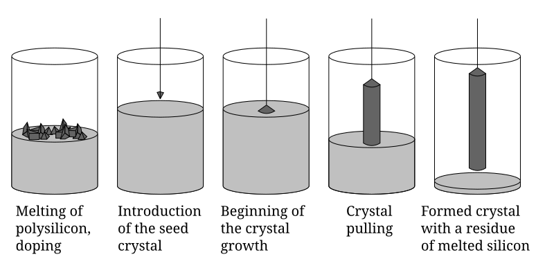

# 3.1. Semiconductor process: Eight major processes

반도체 제조 공정은 설계된 회로를 단결정 기판 위의 삼차원 재료 구조로 구현하고, 이를 외부 회로와 연결할 수 있는 칩으로 완성하는 과정이다. 흔히 말하는 **8대 공정**은 웨이퍼 제조, 산화, photolithography, 식각, 이온 주입, 증착, 금속 배선과 패키징을 뜻한다. 그러나 이 여덟 항목은 하나의 웨이퍼가 정확히 한 번씩 통과하는 고정 순서가 아니다. 실제 fabrication에서는 세정, 열처리, 증착, photolithography, 식각과 계측이 층마다 반복되고, 제품과 회사에 따라 공정을 묶는 방식도 달라진다.[1–4]

이 문서는 8대 공정을 처음 배우는 독자가 각 공정의 **입력–변환–출력**, 지배 원리, 대표 장비, 핵심 정량 지표와 다음 공정과의 연결을 이해하도록 구성한다. 개별 소자의 전기적 동작은 [MOSFET: Overview](../mosfet/basic-operation.md), 메모리 셀과 칩 계층은 [Memory device: Overview](../memory-device/basics.md)를 함께 참고한다.

## 1. 8대 공정이라는 지도를 읽는 법

### (1) 회사마다 다른 분류

삼성전자와 SK hynix가 공개 자료에서 사용하는 “8대 공정”은 문서의 목적에 따라 달라진다. SK hynix의 대중 교육 자료는 웨이퍼 제조–산화–photolithography–식각–증착–금속 배선–검사–패키징으로 구분하며, 이 분류가 절대적이지 않다고 명시한다. 삼성전자의 제조 소개도 웨이퍼 제조에서 검사·패키징까지를 하나의 큰 흐름으로 설명한다.[1,2]

반면 삼성전자 채용 자료의 반도체 공정기술 직무는 fab 내부의 단위 공정을 `Etch`, `Metal`, `Clean`, `Imp`, `Diff`, `Photo`, `CVD`, `CMP`로 나눈다. 이는 웨이퍼 공급과 패키징 대신 세정, 확산과 chemical mechanical polishing (CMP)을 독립 공정으로 강조한 분류이다.[3] SK hynix에도 `CLEAN & CMP Technology` 조직과 관련 공정이 있으므로 “SK hynix의 8대 공정에는 CMP가 없다”라고 해석해서는 안 된다.[4]

| 분류 목적 | 여덟 항목의 대표 구성 | 읽을 때의 주의점 |
| --- | --- | --- |
| 공개 제조 흐름 | 웨이퍼, 산화, photolithography, 식각, 증착, 금속 배선, 검사, 패키징 | 공급망에서 완제품까지의 큰 흐름을 보여준다. |
| fab 단위 공정 직무 | Etch, Metal, Clean, Imp, Diff, Photo, CVD, CMP | 공장 내부의 전문 조직과 장비군을 중심으로 나눈다. |
| 이 문서의 학습 분류 | 웨이퍼, 산화, photolithography, 식각, 이온 주입, 증착, 금속 배선, 패키징 | 소자 형성의 물리적 인과관계를 배우기 위한 분류이다. 검사, 세정, CMP와 열처리는 횡단 공정으로 별도 설명한다. |

!!! warning "[Interpretation Caveat]"
    “8대”라는 숫자는 산업 표준에서 강제한 유일한 taxonomy가 아니다. 같은 실제 공정도 교육 자료에서는 증착에, 조직도에서는 `CVD`나 `Metal`에, 통합 공정표에서는 front-end-of-line (FEOL) 또는 back-end-of-line (BEOL)에 배치될 수 있다. 공정 이름보다 **어떤 재료를 어떤 물리 작용으로 바꾸는가**를 먼저 확인한다.[1–4]

### (2) FEOL에서 패키징까지

공정 통합 관점에서는 보통 트랜지스터를 만드는 front-end-of-line (FEOL), 소자와 첫 배선을 접속하는 middle-of-line (MOL), 여러 층의 배선을 만드는 back-end-of-line (BEOL), 그리고 조립·검사 단계로 나눈다. 경계는 회사와 기술 세대에 따라 조금씩 다르지만, 열 예산과 재료 호환성을 이해하는 데 유용하다.[1,3]

| 구간 | 주된 산출물 | 반복되는 대표 공정 |
| --- | --- | --- |
| 웨이퍼 공급 | 평탄하고 결정 방향·도전형·저항률이 규격화된 기판 | 단결정 성장, 절단, 연마, 세정, 검사 |
| FEOL | well, isolation, gate, source/drain을 포함한 트랜지스터 | 산화·증착, photolithography, 식각, 이온 주입, 열처리, 세정 |
| MOL | silicide, contact와 첫 local interconnect | 세정, 증착, 식각, 금속 충전, CMP |
| BEOL | 절연막 속의 다층 금속선과 via | 저유전율 막 증착, photolithography, 식각, barrier/seed, 금속 충전, CMP |
| 조립·검사 | 보호되고 외부 단자와 연결된 known-good package | wafer test, dicing, die attach, bonding, encapsulation, final test |

한 층을 만드는 가장 일반적인 순환은 **막 형성 → 감광액 도포 → 노광·현상 → 식각 또는 이온 주입 → 감광액 제거 → 세정 → 계측**이다. 필요한 층 수만큼 이 순환을 반복하며, 평탄도가 부족하면 다음 photolithography 전에 CMP를 추가한다.[1,4]

## 2. 웨이퍼 제조

### (1) 단결정 인곳 성장과 웨이퍼 성형

상용 실리콘 웨이퍼의 대표 제조법인 Czochralski method (CZ method)는 고순도 폴리실리콘을 석영 도가니에서 녹이고, 원하는 결정 방향의 seed crystal을 용융액에 접촉시킨 뒤 회전시키며 천천히 끌어올린다. 용융 실리콘은 seed의 결정 배열을 이어받아 단결정 인곳으로 응고한다. 붕소(B)나 인(P) 같은 도펀트를 용융액에 미량 넣어 도전형과 저항률을 조절할 수 있다.[2,5,31]

여기서 단결정은 결정립계 없이 하나의 결정 방향이 이어진다는 뜻이지, 모든 점결함과 불순물이 사라진다는 뜻은 아니다. 실제 제조에서는 온도와 용융액 유동, seed·도가니 회전과 인상 속도를 제어해 결정 품질과 직경을 맞춘다. 산소 농도를 더 낮춰야 하는 용도에는 석영 도가니를 쓰지 않는 float-zone (FZ) method도 사용한다.[5,31]

<figure markdown="span">
  
  <figcaption>
    그림 1. Czochralski method의 단결정 성장 순서. 폴리실리콘 용융과 도핑, seed 삽입, 결정 성장 시작, 회전 인상과 완성된 인곳을 나타낸다.
    출처: Twisp, “Czochralski Process,” Wikimedia Commons (2008),
    <a href="https://commons.wikimedia.org/wiki/File:Czochralski_Process.svg">public domain</a>, 수정 없음.[6]
  </figcaption>
</figure>

성장한 인곳은 외경을 맞춘 뒤 성장축에 거의 수직으로 wire saw로 절단한다. 절단 직후 표면에는 톱 자국과 손상층이 있으므로 lapping, 화학 식각, 가장자리 가공, chemical mechanical polishing과 세정을 거쳐 평탄한 거울면을 만든다. 150, 200, 300 mm 웨이퍼가 쓰이며, 300 mm는 첨단 대량 생산에서 대표적인 규격이다. 다만 전력·센서·연구용 공정까지 모든 생산이 300 mm인 것은 아니다.[2,5]

### (2) 도핑, 저항률과 결정 방향

도핑하지 않은 고순도 실리콘이 이론에만 존재하는 것은 아니다. 다만 생산용 웨이퍼는 목표 소자에 맞춰 도펀트 종류, 도전형, 저항률, 결정 방향, 산소·탄소 농도, 두께, 휨, 평탄도와 표면 결함을 함께 지정하는 것이 일반적이다. p-type 기판은 보통 acceptor, n-type 기판은 donor를 사용하며, `p-`, `p+` 같은 표기는 상대적인 농도 범주일 뿐 공급 규격의 완전한 수치가 아니다.[2,5,31]

균일한 벌크 재료의 저항률 $\rho$는

$$
\rho=\frac{1}{q\left(\mu_n n+\mu_p p\right)}
$$

로 쓸 수 있다. $q$는 기본 전하량, $n$과 $p$는 전자와 정공 농도, $\mu_n$과 $\mu_p$는 각각의 이동도이다. 공급 웨이퍼의 벌크 사양은 보통 $\Omega\cdot\mathrm{cm}$ 단위의 **저항률**로 표시한다. 두께 $t$가 정해진 균일한 막의 면저항 $R_s$는

$$
R_s=\frac{\rho}{t}
$$

이며 단위는 $\Omega/\square$이다. 따라서 웨이퍼 기판 도핑이 처음부터 면저항으로만 공급된다는 설명은 저항률과 박막 면저항을 혼동한 것이다.[5,7]

결정 방향은 표면 원자 배열과 결합 밀도를 바꾸므로 산화 속도, 식각 거동과 Si/SiO$_2$ 계면 특성에 영향을 준다. 반전층 이동도도 표면 방향과 전류 방향에 의존한다. 그러나 결정 방향 하나만으로 문턱전압 $V_T$가 정해지는 것은 아니다. $V_T$는 gate stack, work function, 도핑, 고정전하와 계면 트랩을 함께 반영하므로 방향 효과는 해당 공정 조건과 함께 해석해야 한다.[7,8]

!!! info "[Measurement]"
    입고 웨이퍼에서는 four-point probe 또는 비접촉 방식으로 저항률 지도를 얻고, X-ray diffraction이나 orientation mark로 결정 방향을 확인한다. 표면 입자, haze, scratch, 두께, total thickness variation (TTV), bow와 warp도 함께 검사한다. 저항률 평균만 맞아도 웨이퍼 내 분포나 결정 결함이 나쁘면 후속 공정의 균일도가 무너질 수 있다.[2,5]

## 3. 산화 공정

### (1) SiO₂ 성장과 열 예산

열 산화는 산소 또는 수증기 분위기에서 실리콘을 소비하여 silicon dioxide (SiO$_2$)를 성장시키는 공정이다. 건식 산화는 성장 속도가 느리지만 치밀하고 정밀한 얇은 막에 유리하고, 습식 산화는 더 빠르므로 두꺼운 field oxide 등에 적합하다. 산화막은 gate dielectric, 표면 passivation, 이온 주입 차폐막과 공정 마스크 등으로 사용되어 왔다.[9,10]

고온 공정이 웨이퍼에 가한 시간–온도 이력을 **열 예산**이라고 한다. 온도가 높을수록 산화는 빨라지지만 이미 주입된 도펀트가 확산하고 접합 깊이와 농도 기울기가 달라질 수 있다. 금속과 low-$k$ 절연막이 형성된 뒤에는 상호확산, 화학 반응, 응력과 막 열화를 피해야 하므로 높은 열 예산의 산화·확산 공정은 대체로 FEOL 앞부분에 둔다. 단순히 “금속선이 녹기 때문”만은 아니다.[9,10]

### (2) Deal–Grove 성장 속도론

Deal–Grove model은 산화제가 기체에서 산화막 표면으로 이동하고, 기존 SiO$_2$를 확산해 Si/SiO$_2$ 계면에 도달한 뒤 반응한다는 직렬 과정으로 열 산화를 설명한다. 산화막 두께를 $x_\mathrm{ox}$라 하면

$$
x_\mathrm{ox}^2+A x_\mathrm{ox}=B(t+\tau)
$$

이다. $B/A$는 선형 속도 상수, $B$는 포물선 속도 상수, $\tau$는 초기 산화막을 반영한 시간 보정값이다.[9,10]

얇은 막의 $x_\mathrm{ox}\ll A$ 극한에서는

$$
x_\mathrm{ox}\approx\frac{B}{A}(t+\tau)
$$

이므로 계면 반응이 전체 속도를 주로 제한한다. 두꺼운 막의 $x_\mathrm{ox}\gg A$ 극한에서는

$$
x_\mathrm{ox}\approx\sqrt{B(t+\tau)}
$$

가 되어 산화제가 기존 막을 통과하는 확산이 병목이 된다. 따라서 성장률은 시간이 지날수록 느려진다. 다만 고전적인 Deal–Grove model은 수십 nm보다 얇은 초기 산화에서 실제 성장률을 정확히 나타내지 못할 수 있다.[9,10]

!!! info "[Measurement]"
    Ellipsometry 또는 reflectometry로 산화 전후 두께 지도를 측정하고, 막 두께의 평균과 wafer 내 nonuniformity를 보고한다. 전기적 gate oxide라면 capacitor 구조에서 capacitance–voltage, 누설 전류와 breakdown 특성을 함께 확인한다. 같은 두께라도 계면 트랩, 고정전하와 pinhole 밀도가 다르면 소자 특성이 달라진다.[9,10]

## 4. Photolithography

### (1) 패턴 전사 순서

Photolithography는 mask 또는 reticle의 설계 정보를 감광액인 photoresist (PR)에 전사하는 공정이다. 웨이퍼 세정과 표면 처리 뒤 PR을 spin coating하고 soft bake한다. 정렬, 초점 조절과 노광을 거친 뒤 post-exposure bake와 현상으로 PR의 용해도 차이를 실제 패턴으로 만든다. Positive PR은 노광된 부분이 더 잘 녹고, negative PR은 노광된 부분이 가교되어 남는다.[11–13]

PR 패턴은 최종 회로가 아니라 다음 식각 또는 이온 주입의 임시 마스크이다. 따라서 PR 두께, 노광량, 초점, 현상 조건뿐 아니라 아래 막과 식각 선택비까지 함께 설계해야 한다. 층 사이 위치 오차인 overlay도 선폭과 같은 수준으로 중요한 지표이다.[11–13]

### (2) 해상도와 초점 심도

투영 노광의 해상도는 critical dimension (CD), 초점이 허용되는 범위는 depth of focus (DOF)로 나타내며 Rayleigh 식으로 근사한다.

$$
\mathrm{CD}=k_1\frac{\lambda}{\mathrm{NA}},
\qquad
\mathrm{DOF}=k_2\frac{\lambda}{\mathrm{NA}^2}
$$

$\mathrm{CD}$는 critical dimension, $\lambda$는 노광 파장, $\mathrm{NA}$는 numerical aperture, $k_1$과 $k_2$는 광학계, mask, resist와 공정 보정에 의존하는 계수이다. 짧은 파장과 큰 NA는 작은 CD에 유리하지만, NA를 키우면 depth of focus (DOF)가 빠르게 줄어 웨이퍼 평탄도와 초점 제어가 더 어려워진다.[11,12]

Optical proximity correction (OPC)는 회절과 공정 근접 효과를 보상하도록 mask 형상을 계산적으로 미리 변형한다. Multiple patterning은 한 층의 조밀한 패턴을 둘 이상의 노광·식각 단계로 분해하며, extreme ultraviolet (EUV) lithography는 13.5 nm 파장을 사용해 필요한 분할 횟수를 줄일 수 있다. 어느 방법도 해상도만 개선하는 무료 해법은 아니다. OPC는 계산과 mask 복잡도, multiple patterning은 overlay와 공정 수, EUV는 광원·mask·resist stochastic defect 제어 부담을 더한다.[11–13]

!!! info "[Measurement]"
    Focus–exposure matrix (FEM)에서 노광량과 초점을 바꾸며 CD를 측정하고, 규격을 만족하는 공정 창을 구한다. Critical-dimension scanning electron microscopy (CD-SEM)로 선폭과 line-edge roughness를, overlay metrology로 층간 위치 오차를 측정한다. 평균 CD만 보고하지 말고 wafer 내 분포, 초점 위치, 노광량과 패턴 밀도를 함께 기록한다.[11–13]

## 5. 식각 공정

### (1) 제거 방식과 방향성

식각은 PR 또는 hard mask가 열어 둔 영역의 막을 선택적으로 제거해 패턴을 아래 재료에 옮기는 공정이다. 습식 식각은 액상 화학 반응과 용해를 이용하며 높은 처리량과 선택비를 얻기 쉽다. 건식 식각은 저압 플라즈마에서 생성된 반응종과 이온을 사용해 미세 구조의 방향성을 제어한다.[13–15]

등방성 식각은 모든 방향의 속도가 비슷해 mask 아래의 lateral undercut이 생긴다. 비등방성 식각은 수직과 수평 식각률이 달라 수직 측벽을 만들 수 있다. 그러나 **습식=등방성, 건식=비등방성**은 절대 규칙이 아니다. KOH의 Si 식각처럼 결정면에 따라 속도가 다른 습식 공정이 있고, 플라즈마의 중성 radical 반응이 우세하면 건식 공정도 등방성에 가까워질 수 있다.[14,15]

### (2) RIE의 ion–radical 결합

Reactive ion etching (RIE)에서는 플라즈마가 중성 radical과 하전된 ion을 만든다. Radical은 표면과 반응해 휘발성 생성물을 만들고, sheath 전기장에서 가속된 양이온은 웨이퍼에 거의 수직으로 충돌해 결합을 끊고 반응층을 제거한다. 측벽 passivation은 수평 방향 반응을 억제한다. 이 화학 반응, 이온 충격과 passivation의 균형이 식각 속도, 선택비와 profile을 결정한다.[14,15]

Ar$^+$는 물리적 sputtering을 강화할 때 사용할 수 있지만 모든 RIE의 필수 이온은 아니다. 실제 이온종은 CF$_4$, Cl$_2$, HBr 등 feed gas와 plasma chemistry에 따라 달라진다. 이온 에너지를 과도하게 높이면 수직성은 좋아져도 표면 손상, charging과 mask 소모가 증가할 수 있다.[14,15]

!!! info "[Measurement]"
    식각 전후 막 두께 $t$와 시간 $\Delta t$에서 식각률은

    $$
    R_\mathrm{etch}=\frac{t_\mathrm{before}-t_\mathrm{after}}{\Delta t}
    $$

    로 구한다. 아래층 식각률에 대한 목표막 식각률의 비로 선택비를 정의하고, 단면 SEM으로 sidewall angle, undercut, bowing, footing과 microtrenching을 확인한다. Wafer 내 균일도, pattern-density loading, endpoint, 잔류물과 plasma damage도 함께 평가한다.[13–15]

## 6. 이온 주입 공정

### (1) dose, energy와 깊이 분포

Ion implantation은 원하는 도펀트를 이온화하고 질량 분석한 뒤 전기장으로 가속해 실리콘에 주입하는 공정이다. 주입 에너지는 평균 침투 깊이인 projected range $R_p$를 주로 정하고, dose $Q$는 단위 면적에 들어간 총 이온 수를 정한다.[16,17]

깊이에 따른 도펀트 농도를 $N(x)$라 하면

$$
Q=\int_0^\infty N(x)\,dx
$$

이며 단위는 $\mathrm{cm^{-2}}$이다. 실제 분포는 이온–고체 충돌의 통계성 때문에 straggle을 갖는다. Dose와 energy를 독립적으로 정밀 제어할 수 있다는 점은 well, threshold-adjust, extension과 source/drain 도핑에 유리하다.[16,17]

주입 직후에는 도펀트가 치환 격자 자리에 모두 있지 않고 충돌로 결정 손상도 생긴다. Rapid thermal annealing (RTA) 등 후속 열처리가 손상을 회복하고 도펀트를 전기적으로 활성화한다. 그러므로 주입량과 활성 운반자 농도는 같은 값이 아니다.[16,17]

### (2) 얕은 접합의 두 난제

소자가 작아질수록 source/drain extension의 접합 깊이를 얕게 유지하면서 낮은 저항을 얻어야 한다. 그러나 활성화 온도를 올리면 도펀트 확산과 transient enhanced diffusion이 커져 접합이 깊어질 수 있다. 열 예산을 과도하게 낮추면 활성화율과 손상 회복이 부족해진다.[16,17]

Channeling은 이온 빔이 결정축이나 결정면 사이의 열린 통로와 정렬되어 예상보다 깊게 이동하는 현상이다. Wafer를 빔에 대해 tilt·twist하거나, 얇은 screen oxide를 통과시키거나, preamorphization implant로 표면 결정을 비정질화해 tail을 줄일 수 있다. 각 방법은 손상, 오염, dose loss와 활성화 조건을 바꾸므로 얕은 접합 깊이만으로 최적화하지 않는다.[16,17]

!!! info "[Measurement]"
    Secondary ion mass spectrometry (SIMS)는 총 도펀트의 깊이 분포를 측정하고, spreading resistance profiling이나 sheet-resistance 측정은 전기적으로 활성화된 결과를 반영한다. 접합 깊이, peak 농도, profile tail, $R_s$와 wafer 내 균일도를 함께 보고한다. SIMS 농도와 전기적 농도의 차이는 활성화율과 보상 도핑을 점검하는 단서이다.[16,17]

## 7. 증착 공정

### (1) 막을 쌓는 방법과 평가 축

증착은 절연막, 반도체막, barrier, 금속과 passivation 막을 웨이퍼 위에 형성한다. Physical vapor deposition (PVD)은 고체 target의 원자를 sputtering 또는 증발로 옮기고, chemical vapor deposition (CVD)은 기체 전구체의 표면 반응으로 고체막을 만든다. Atomic layer deposition (ALD)은 서로 반응하는 전구체를 시간적으로 분리해 순차 공급한다.[13,18]

Wafer 전체에서 두께가 일정한 **균일도**는 중요하지만 유일한 지표는 아니다. 수평면과 구조 측벽·바닥을 얼마나 같은 두께로 덮는지는 conformality 또는 step coverage로 구분한다. 막 조성, 밀도, 굴절률, 응력, 결함, 계면 품질과 전기적 저항도 용도에 따라 함께 평가한다.[13,18]

### (2) LPCVD, PECVD와 ALD

| 방식 | 에너지원과 반응 | 강점 | 주요 한계 |
| --- | --- | --- | --- |
| low-pressure CVD (LPCVD) | 저압과 비교적 높은 기판 온도에서 열 반응 | 고순도·고밀도 막, 좋은 wafer 간 재현성과 batch 처리 | 높은 열 예산, 온도에 민감한 하부 구조에 제한 |
| plasma-enhanced CVD (PECVD) | 플라즈마가 전구체를 활성화 | 더 낮은 기판 온도에서 증착 가능 | 수소 함량, plasma damage, 응력과 공간별 plasma 균일도 관리 |
| ALD | 전구체 pulse와 purge를 교대로 반복하는 self-limiting 표면 반응 | 원자층 수준 두께 제어와 높은 conformality | 낮은 성장률, 긴 purge 시간, 전구체·표면 화학의 제한 |

LPCVD가 저압에서 기체 대류와 기상 반응을 줄이는 것은 균일도와 막 품질에 유리하다. PECVD는 플라즈마 덕분에 낮은 온도를 쓸 수 있지만, “PECVD는 항상 LPCVD보다 불균일하다”는 일반화는 옳지 않다. 균일도는 showerhead, 전극 구조, plasma density, 가스 유량과 온도 분포에 따라 달라진다. ALD도 모든 재료가 한 cycle에 정확히 한 원자층씩 자라는 것은 아니며, 포화 반응과 충분한 purge가 성립하는 공정 창에서 cycle당 성장량이 재현된다.[13,18]

!!! info "[Measurement]"
    여러 지점의 두께로 wafer 내 nonuniformity를 계산하고, 단면 TEM 또는 SEM에서 top, sidewall과 bottom 두께를 측정해 step coverage를 구한다. Ellipsometry, X-ray reflectivity, X-ray photoelectron spectroscopy, wafer curvature와 four-point probe를 조합해 두께·밀도·조성·응력·저항을 확인한다. 같은 평균 두께를 가진 막도 pinhole과 계면 결함이 다르면 수율이 달라질 수 있다.[13,18]

## 8. 금속 배선 공정

### (1) contact에서 global interconnect까지

금속 배선은 트랜지스터의 source, drain과 gate를 회로망으로 연결한다. 실리콘과 첫 금속 사이에는 낮은 접촉저항을 위한 silicide, contact barrier와 plug가 놓이고, 그 위에 수평 metal line과 층간 via가 반복된다. 배선층 사이에는 interlayer dielectric이 전기적 절연을 제공한다.[19–21]

금속–실리콘 접촉은 금속 종류, 반도체 도핑과 계면 상태에 따라 Schottky 또는 낮은 저항의 ohmic contact처럼 동작할 수 있다. 고농도 도핑은 공핍층을 얇게 해 터널링을 쉽게 하고, silicide는 계면과 sheet/contact resistance를 낮춘다. 증착 직전 native oxide와 오염을 제거하지 않으면 높은 접촉저항과 불균일한 반응이 생길 수 있다.[19,20]

### (2) Al, Cu와 W의 역할

| 재료 | 대표 역할 | 장점 | 통합상의 핵심 문제 |
| --- | --- | --- | --- |
| Al과 Al 합금 | 전통적 배선, 일부 상부 배선·pad | 증착과 패턴 식각이 비교적 단순함 | electromigration, hillock와 높은 선저항 |
| Cu | 첨단 BEOL의 저저항 배선 | Al보다 낮은 벌크 저항률, 개선된 배선 성능 | 직접 건식 식각, dielectric 확산, barrier/liner 부피와 electromigration |
| W | contact·via plug, 일부 local interconnect | CVD의 좋은 conformality와 충전성 | Cu보다 높은 저항률, nucleation·fluorine·seam/void 관리 |

Electromigration (EM)은 높은 전류밀도에서 전자의 운동량 전달로 금속 원자가 이동해 void나 hillock을 만들고 단선·단락을 일으키는 신뢰성 현상이다. Cu는 Al보다 낮은 저항률과 우수한 EM 수명을 보인 역사적 이유로 첨단 배선의 주재료가 되었지만, Cu 배선에도 계면·grain boundary를 통한 EM이 존재한다. Al 역시 pad와 특정 공정에서 계속 사용되므로 “Al은 Cu로 완전히 대체되었다”라고 쓰지 않는다.[21,22]

Cu는 반응 부산물의 휘발성이 낮아 Al처럼 blanket metal을 plasma etch로 패턴화하기 어렵다. 따라서 절연막에 trench와 via를 먼저 식각하고 barrier/liner와 seed를 형성한 뒤 Cu를 electroplating으로 채우고, 표면의 과잉 Cu를 CMP로 제거하는 damascene 공정을 사용한다.[4,21,23]

W는 conformal CVD로 작은 contact hole을 채울 수 있어 대표적인 plug 재료가 되었다. 그러나 “CVD 가능한 유일한 금속”은 아니다. Co와 Ru 등 다른 금속도 CVD·ALD 연구와 양산 통합에 사용된다. PVD가 깊고 좁은 구멍의 입구를 먼저 막아 void를 만들 수 있다는 설명은 방향성이 강한 입사와 낮은 step coverage에 관한 것이며, 구조와 증착법에 따라 달라진다.[20,24]

!!! info "[Measurement]"
    Kelvin 또는 cross-bridge 구조에서 contact resistance를, line·via chain에서 배선저항과 open/short를 측정한다. Sheet resistance, line-width-dependent resistance, via resistance, RC delay와 current-density 조건을 함께 보고한다. EM 시험은 일정 온도와 전류밀도에서 저항 변화 또는 고장 시간을 추적하며, Black 식의 계수는 재료·선폭·계면에 의존하므로 다른 공정의 값을 그대로 옮기지 않는다.[19,21,22]

## 9. 패키징 공정

### (1) 보호, 전기 연결과 검사

웨이퍼 공정이 끝나면 wafer probe로 die를 선별하고 dicing으로 분리한다. Die attach 뒤 wire bonding 또는 flip-chip bump로 die와 package substrate를 연결하고, molding compound나 lid로 기계적·화학적 손상에서 보호한다. 마지막으로 전기적 기능, 속도, 전력과 신뢰성을 검사하고 규격에 따라 분류한다.[25,26]

패키지는 단순한 보호 껍질이 아니다. 칩의 미세 단자를 board가 다룰 수 있는 pitch로 재배열하고, 전원·신호 경로와 방열 경로를 제공한다. 따라서 package parasitic resistance, inductance와 capacitance, warpage, moisture와 열팽창계수 불일치가 칩 성능과 수명을 제한할 수 있다.[25,26]

### (2) HBM 적층과 열 문제

High bandwidth memory (HBM)는 여러 DRAM die를 수직 적층하고 넓은 병렬 interface로 logic die 또는 processor와 연결한다. Through-silicon via (TSV), microbump와 silicon interposer가 널리 쓰이며, 미세 pitch에서는 hybrid bonding이 접속 밀도와 전기적 경로를 개선하는 방향으로 개발된다.[27,28]

적층 수가 늘면 단위 면적당 전력이 증가하고, adhesive·underfill·bonding interface가 열저항을 더한다. 내부 die에서 발생한 열은 여러 계면을 지나 heat spreader까지 이동해야 하므로 hotspot과 온도 기울기가 커질 수 있다. 정상 상태의 단순 열회로에서는

$$
\Delta T=P R_\mathrm{th}
$$

로 볼 수 있다. $\Delta T$는 접합부와 기준점의 온도 차, $P$는 소모 전력, $R_\mathrm{th}$는 열저항이다. 실제 HBM은 삼차원 열 확산과 die별 전력 분포가 있으므로 단일 $R_\mathrm{th}$는 비교용 등가값이다.[27,28]

TSV의 금속은 열전도 경로가 될 수 있지만 TSV 밀도, keep-out zone, 응력, 전기 기생성분과 공정 수율이 함께 변한다. 따라서 “TSV를 늘리면 열 문제가 해결된다”라고 단정할 수 없다. Die thinning, 열전도성 접착재, thermal via, heat spreader, 냉각 조건과 workload 분배를 함께 최적화한다.[27,28]

!!! info "[Measurement]"
    Wafer probe와 final test에서 open/short, 기능, timing과 전력을 확인한다. 패키지에서는 X-ray와 scanning acoustic microscopy로 void·delamination을, thermal test vehicle과 infrared thermography로 die별 온도와 열저항을 측정한다. HBM의 열 성능은 stack 높이, 냉각 경계조건, 측정 위치와 실제 workload를 함께 보고해야 비교할 수 있다.[25–28]

## 10. 여덟 목록 밖의 필수 횡단 공정

### (1) 세정과 오염 제어

세정은 입자, 유기물, 금속 오염, polymer residue와 필요하지 않은 native oxide를 제거한다. 이 오염은 photolithography 결함, 접촉저항, 막 접착 불량과 gate dielectric 파괴의 원인이 될 수 있다. 세정은 시작과 끝에 한 번 하는 공정이 아니라 산화, 증착, 식각, 이온 주입과 금속 접촉 사이에서 목적에 맞는 화학 조합으로 반복된다.[4,29]

알칼리성·산성 습식 세정, dilute HF, ozonated water와 plasma ashing은 제거 대상이 서로 다르다. 세정 자체도 표면 거칠기, 재산화, 재료 손실과 금속 부식을 만들 수 있으므로 particle count와 표면 화학을 동시에 관리한다.[4,29]

### (2) CMP와 평탄화

CMP는 slurry의 화학 반응과 pad의 기계적 마찰을 결합해 돌출된 막을 선택적으로 제거한다. 다층 구조의 전역 평탄도를 회복해 photolithography의 제한된 DOF 안에 표면을 넣고, STI와 Cu damascene에서는 남는 절연막이나 금속을 제거해 구조를 완성한다.[4,23,30]

CMP의 핵심 지표는 제거율, wafer 내 nonuniformity, 평탄도, 선택비와 결함이다. 넓은 금속선이 과도하게 파이는 dishing, 조밀한 배선과 절연막이 함께 낮아지는 erosion, scratch와 slurry residue를 pattern density별로 확인한다. CMP 뒤 세정은 남은 입자와 금속 오염을 제거하는 공정의 일부이다.[4,30]

### (3) 열처리, 계측과 검사

열처리는 이온 주입 손상 회복과 도펀트 활성화뿐 아니라 silicide 형성, 막 densification과 계면 반응에도 사용된다. 각 열 단계의 누적 열 예산이 앞서 만든 농도 분포와 재료를 바꾸므로 개별 recipe가 아니라 전체 공정 흐름에서 관리한다.[9,16,17]

계측과 검사는 공정이 끝난 뒤의 판정만이 아니다. 막 두께, CD, overlay, 식각 profile, 결함과 전기적 test structure를 공정 중간에 측정해 다음 lot의 dose, focus, 식각 시간과 증착 조건에 feedback한다. 통계적 공정 관리에서는 평균값뿐 아니라 wafer 내·wafer 간·lot 간 변동과 장비 matching을 추적한다.[11–13]

## 11. 공정들을 하나의 소자로 연결하기

한 개의 planar MOSFET을 예로 들면, 산화·증착으로 절연막과 gate 재료를 만들고 photolithography와 식각으로 gate를 정의한다. Gate를 자체 정렬 마스크로 사용해 이온 주입으로 source/drain extension을 만들고, spacer 증착·식각 뒤 고농도 주입과 활성화 열처리를 한다. Silicide와 contact를 형성한 후 절연막, via와 금속선을 여러 층 반복하고, passivation과 wafer test를 거쳐 패키징한다.[1,3]

이 예에서 각 공정은 독립적으로 최적화되지 않는다.

| 앞 공정의 선택 | 다음 공정에 미치는 영향 | 대표 상충관계 |
| --- | --- | --- |
| 산화·증착 막 두께와 응력 | photolithography focus, 식각 시간, 계면 품질 | 절연성과 응력·단차 |
| PR CD와 overlay | 최종 식각 CD, 접합 위치, 배선 단락 | 작은 선폭과 공정 창 |
| RIE ion energy | 수직 profile, 표면 손상과 mask 소모 | 방향성과 손상 |
| 주입 dose·energy와 anneal | $V_T$, 접합 깊이, sheet/contact resistance | 얕은 접합과 활성화 |
| 증착 conformality | contact·via의 seam과 void | 충전성, 처리량과 열 예산 |
| Cu barrier/liner 두께 | 확산 방지와 유효 Cu 단면적 | 신뢰성과 배선저항 |
| CMP overpolish | 잔류 금속 제거와 dishing·erosion | short 제거와 단면 보존 |
| 패키지 적층 밀도 | 대역폭, 전력밀도와 열저항 | 집적도와 온도 |

따라서 공정 문제를 분석할 때에는 “어느 장비가 나빴는가?”보다 **어느 입력 사양이 어떤 물리적 변환을 거쳐 어느 출력 지표를 벗어났는가**를 묻는다. 그 출력이 다음 단계의 공정 창을 어떻게 줄였는지 추적해야 근본 원인을 찾을 수 있다.

## 12. 요약

- 8대 공정은 반도체 제조를 배우기 위한 대표 분류이며, 회사·자료·조직에 따라 검사, 세정, 확산, 이온 주입과 CMP의 포함 방식이 달라진다.
- 웨이퍼 제조는 CZ 단결정 성장, 절단, 연마와 세정으로 기판을 만들고 도전형, 저항률, 결정 방향과 평탄도를 규격화한다. 벌크 저항률의 단위는 $\Omega\cdot\mathrm{cm}$이고, 면저항 $\Omega/\square$와 구분한다.
- 산화는 Si를 소비해 SiO$_2$를 성장시키며, 얇은 막에서는 계면 반응, 두꺼운 막에서는 산화막 내부 확산이 성장 속도를 제한한다.
- Photolithography는 PR에 설계 패턴을 전사한다. CD 개선과 DOF, overlay, stochastic defect 및 공정 복잡도 사이의 상충관계를 관리한다.
- 식각은 패턴을 아래 막으로 옮긴다. 습식·건식과 등방성·비등방성은 같은 분류가 아니며, RIE는 radical chemistry와 ion directionality의 결합을 사용한다.
- 이온 주입에서는 energy가 깊이, dose가 총량을 주로 정한다. 활성화 열처리, 확산, 결정 손상과 channeling이 얕은 접합의 한계를 만든다.
- 증착은 균일도뿐 아니라 conformality, 조성, 응력과 계면을 관리한다. LPCVD, PECVD, ALD와 PVD는 열 예산·처리량·막 품질의 장단점이 다르다.
- 금속 배선은 contact, via와 다층 line을 연결한다. Cu damascene, W plug, silicide와 barrier/liner는 재료의 식각성, 확산, 저항과 EM을 함께 해결한다.
- 패키징은 보호, 전기 연결과 방열을 담당한다. HBM의 삼차원 적층은 대역폭을 높이지만 계면 열저항, hotspot, 응력과 수율 문제를 키운다.
- 세정, CMP, 열처리, 계측과 검사는 여덟 목록에 보이지 않더라도 모든 단계의 수율과 재현성을 지탱하는 필수 횡단 공정이다.

## 13. 참고문헌

1. SK hynix Newsroom, “Semiconductor Front-End Process Episode 2: The Eight Essential Semiconductor Processes” (2023). [공식 자료](https://news.skhynix.com/en/semiconductor-front-end-process-episode-2/).
2. Samsung Semiconductor, “Eight Essential Semiconductor Fabrication Processes Part 1: What Is a Wafer?” [공식 자료](https://semiconductor.samsung.com/support/tools-resources/fabrication-process/eight-essential-semiconductor-fabrication-processes-part-1-what-is-a-wafer/).
3. Samsung Electronics, “Job fields: 반도체 공정기술” (2026년 확인). [공식 채용 자료](https://org-sec-b2c.samsung.com/sec/about-us/careers/job-fields/kr/).
4. SK hynix Newsroom, “Creating Defectless Wafers: A Look at CLEAN & CMP Technology” (2022). [공식 자료](https://news.skhynix.com/en/creating-defectless-wafers-a-look-at-clean-cmp-technology/).
5. SUMCO Corporation, “Production Processes.” [공식 자료](https://www.sumcosi.com/english/products/process/).
6. Twisp, “Czochralski Process,” Wikimedia Commons (2008), public domain. [파일 설명과 라이선스](https://commons.wikimedia.org/wiki/File:Czochralski_Process.svg).
7. J. R. Ehrstein and M. C. Croarkin, *Standard Reference Materials: The Certification of 100 mm Diameter Silicon Resistivity SRMs 2541 Through 2547 Using Dual-Configuration Four-Point Probe Measurements*, NIST Special Publication 260-131 (1999). [NIST PDF](https://nvlpubs.nist.gov/nistpubs/Legacy/SP/nistspecialpublication260-131e2.pdf).
8. E. Ungersboeck, *Advanced Modelling Aspects of Modern Strained CMOS Technology*, Section 3.1, TU Wien (2007). [공식 대학 자료](https://www.iue.tuwien.ac.at/phd/ungersboeck/node19.html).
9. M. Radi, “The Deal & Grove Model,” TU Wien dissertation, Section 2.2.1 (1998). [공식 대학 자료](https://www.iue.tuwien.ac.at/diss/radi/node22.html).
10. M. A. Schmidt, “Thermal Oxidation,” MIT OpenCourseWare 6.774, *Physics of Microfabrication: Front-End Processing* (2004). [강의 자료](https://ocw.mit.edu/courses/6-774-physics-of-microfabrication-front-end-processing-fall-2004/resources/mit6_774f04_lec06_mp4/).
11. ASML, “Rayleigh criterion.” [공식 기술 자료](https://www.asml.com/en/technology/lithography-principles/rayleigh-criterion).
12. T. Kirchauer, *Photolithography Simulation*, Section 2.1, TU Wien (1998). [공식 대학 자료](https://www.iue.tuwien.ac.at/phd/kirchauer/node16.html).
13. Harvard University Center for Nanoscale Systems, “Nanofabrication.” [공식 시설·공정 자료](https://cns1.rc.fas.harvard.edu/nanofabrication/).
14. Lam Research, “Etch.” [공식 공정 자료](https://www.lamresearch.com/products/our-processes/etch/).
15. University of Tübingen, “Reactive Ion Etching.” [공식 시설 자료](https://uni-tuebingen.de/en/96639).
16. M. Radi, “Ion Implantation,” TU Wien dissertation, Section 1.1.3 (1998). [공식 대학 자료](https://www.iue.tuwien.ac.at/phd/radi/node10.html).
17. D. A. Antoniadis, “Ion Implantation and Diffusion,” MIT OpenCourseWare 6.152J, *Micro/Nano Processing Technology* (2005). [강의 자료](https://ocw.mit.edu/courses/6-152j-micro-nano-processing-technology-fall-2005/resources/lecture6/).
18. Lurie Nanofabrication Facility, University of Michigan, “Technologies.” [공식 시설·공정 자료](https://lnf.engin.umich.edu/technologies/).
19. L. J. Chen, “Metal Silicides: An Integral Part of Microelectronics,” *JOM* **57**, 24–30 (2005). [공개 전문](https://www.tms.org/pubs/journals/JOM/0509/Chen-0509.html).
20. L. Van den Hove et al., “A Review of the Tungsten Chemical Vapor Deposition Process and Its Application in VLSI,” *Thin Solid Films* **143**, 19–30 (1986). [DOI: 10.1016/0040-6090(86)90530-3](https://doi.org/10.1016/0040-6090(86)90530-3).
21. H. Cai and X. Xie, “Copper Electroplating and Chemical Mechanical Polishing,” MIT OpenCourseWare 6.780, *Semiconductor Manufacturing* (2003). [공개 논문](https://ocw.mit.edu/courses/6-780-semiconductor-manufacturing-spring-2003/c1030d348cb22173d315956d16c0fa9d_cai_xie_rep.pdf).
22. C.-K. Hu and J. M. E. Harper, “Copper Interconnections and Reliability,” *Materials Chemistry and Physics* **52**, 5–16 (1998). [IBM Research record](https://research.ibm.com/publications/copper-interconnections-and-reliability).
23. M. Lyons and H. Noh, “In-Situ Optical Endpoint Detection for Copper Chemical Mechanical Polishing,” MIT OpenCourseWare 6.780, *Semiconductor Manufacturing* (2003). [공개 논문](https://ocw.mit.edu/courses/6-780-semiconductor-manufacturing-spring-2003/01962e9a0397bce85da79472401e8c0e_lyons_noh_rep.pdf).
24. J. Kelly et al., “Electromigration and Resistivity in On-Chip Cu, Co and Ru Damascene Nanowires,” *2017 IEEE International Interconnect Technology Conference* (2017). [IBM Research record](https://research.ibm.com/publications/electromigration-and-resistivity-in-on-chip-cu-co-and-ru-damascene-nanowires).
25. Samsung Newsroom, “Eight Major Steps to Semiconductor Fabrication Part 9: Packaging and Package Testing” (2015). [공식 자료](https://news.samsung.com/global/eight-major-steps-to-semiconductor-fabrication-part-9-packaging-and-package-testing).
26. Intel Newsroom, “How a Silicon Die Becomes a Chip Package” (2024). [공식 자료](https://newsroom.intel.com/tech101/how-silicon-die-become-chip-packages).
27. J. Kim et al., “Thermal Challenges and Management Strategies in 2.5D and 3D Heterogeneous Integration,” *Communications Engineering* **5** (2026). [Nature](https://www.nature.com/articles/s44172-026-00590-y).
28. A. A. Bajwa et al., “Thermal Issues Related to Hybrid Bonding of 3D-Stacked High Bandwidth Memory: A Comprehensive Review,” *Electronics* **14**, 2682 (2025). [DOI: 10.3390/electronics14132682](https://doi.org/10.3390/electronics14132682).
29. Samsung Semiconductor, “Zero Residue, Zero Contaminants: Semiconductor Cleaning.” [공식 자료](https://semiconductor.samsung.com/support/tools-resources/dictionary/zero-residue-zero-contaminants-semiconductor-cleaning/).
30. M. Lyons and H. Noh, “Chemical Mechanical Polishing: Manufacturing Controls and Environmental Issues,” MIT OpenCourseWare 6.780, *Semiconductor Manufacturing* (2003). [강의 자료](https://ocw.mit.edu/courses/6-780-semiconductor-manufacturing-spring-2003/ee3c4a2b24ad1ca536b6f04697b4fd7a_lyons_noh_talk.pdf).
31. Siltronic AG, “Silicon Wafers: How to Make a Silicon Wafer.” [공식 제조 자료](https://www.siltronic.com/en/products.html).
