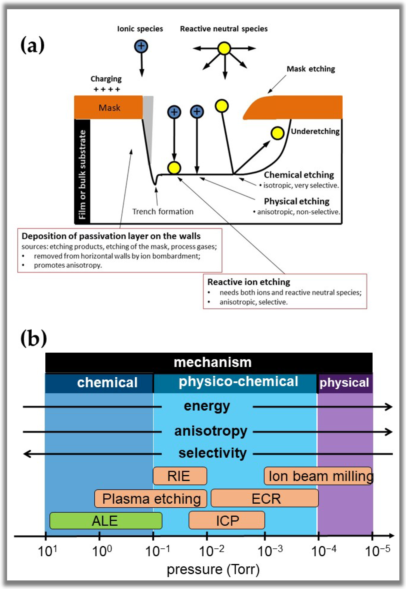

# 3.2. Semiconductor process: Etching

Etching은 mask가 열어 둔 영역의 재료를 제거하여 [photolithography가 정의한 패턴](eight-major-processes.md#4-photolithography)을 아래 막이나 기판에 옮기는 공정이다. 목표는 단순히 재료를 빨리 없애는 것이 아니라, 목표 막은 충분히 제거하면서 mask와 정지막은 보존하고 원하는 삼차원 profile을 재현하는 것이다. 따라서 식각률, 선택비, 방향성, 균일도, endpoint와 손상을 함께 관리해야 한다.[1,2]

이 문서는 wet/dry etching, plasma, anisotropy, selectivity와 endpoint detection에 집중한다. 개별 장비의 recipe나 특정 gas 조합은 장비 구조와 재료 stack에 강하게 의존하므로 보편적인 최적값으로 제시하지 않는다.

## 1. 제거 과정과 공통 지표

### (1) 식각을 이루는 연속 단계

화학 식각은 반응종이 표면까지 이동하고, 흡착·표면 반응을 거쳐 휘발성 또는 용해 가능한 생성물을 만든 뒤, 생성물이 표면에서 이탈하는 과정으로 볼 수 있다. 이 가운데 가장 느린 단계가 관측 식각률을 제한한다. Wet etching에서는 액상 확산과 반응 생성물의 용해가, plasma etching에서는 radical·ion 생성과 수송, 표면 반응, 생성물 desorption이 서로 결합한다.[1–3]

막 두께를 $t_0$에서 $t_1$까지 시간 $\Delta t$ 동안 제거했다면 평균 식각률은

$$
R_\mathrm{etch}=\frac{t_0-t_1}{\Delta t}
$$

이다. 이 값은 blanket wafer에서 얻은 평균일 수 있으므로 patterned wafer의 국부 식각률과 같다고 가정해서는 안 된다. Pattern density, aspect ratio와 wafer 위치가 달라지면 반응종 공급과 생성물 배출도 달라진다.[1,2]

### (2) 선택비와 overetch

목표막 $A$와 보호해야 할 재료 $B$ 사이의 선택비는

$$
S_{A/B}=\frac{R_A}{R_B}
$$

로 정의한다. $B$는 아래층, mask 또는 sidewall 보호막일 수 있으므로 어떤 두 재료의 비인지 반드시 표시한다. 실제 선택비는 시간, 표면 상태와 feature aspect ratio에 따라 달라질 수 있어 하나의 blanket 값만으로 overetch 동안의 손실을 예측하기 어렵다.[1,2]

막 두께와 식각률이 wafer 전체에서 완전히 균일하지 않기 때문에, 최초로 목표막이 사라지는 clear time $t_\mathrm{clear}$ 뒤에도 식각을 지속한다. 시간 기준 overetch 비율을

$$
\mathrm{OE}=\frac{t_\mathrm{total}-t_\mathrm{clear}}{t_\mathrm{clear}}\times100\%
$$

로 정의할 수 있다. Overetch는 남은 막을 제거하지만, 동시에 아래층·mask 손실과 profile 변형을 늘린다. 따라서 필요한 overetch는 막 두께 분포, 식각률 분포와 허용 가능한 아래층 손실로 산정한다.[1,2]

## 2. Wet etching

### (1) 등방성 제거와 undercut

Wet etching은 wafer를 액상 etchant에 노출해 표면을 화학적으로 분해하고 반응 생성물을 용액으로 내보낸다. 화학종이 모든 방향에서 접근하고 결정 방향에 따른 반응률 차이가 작으면 수직·수평 제거 속도가 비슷해진다. 이 경우 mask 아래로 lateral undercut이 생겨 최종 폭이 mask opening과 달라진다.[2,3]

Wet process의 장점은 재료 chemistry를 이용한 높은 선택비, 단순한 batch 처리와 낮은 ion damage이다. 반면 bath 조성, 온도, 교반, 용존 생성물과 wafer loading이 식각률과 균일도를 바꿀 수 있다. 작은 구조에서는 meniscus, bubble과 rinse·dry 과정도 국부 불량 원인이 될 수 있다.[2,3]

### (2) 결정학적 비등방성

“wet etching은 등방성”이라는 문장은 일반 규칙이 아니다. 예를 들어 KOH에 의한 단결정 Si 식각에서는 결정면별 표면 결합과 반응 속도가 달라 느리게 식각되는 $\{111\}$ facet이 남을 수 있다. 반대로 hydrofluoric–nitric–acetic acid (HNA) 계열은 Si를 비교적 등방성으로 제거할 수 있다.[2,3]

결정학적 wet etching의 최종 형상은 mask 모양만이 아니라 wafer orientation과 면별 식각률 함수에 의해 결정된다. 온도, 농도, 교반과 첨가제가 절대 식각률뿐 아니라 면간 식각률 비도 바꾸므로, KOH라는 이름만으로 sidewall angle이나 undercut을 확정할 수 없다.[3]

!!! warning "[Interpretation Caveat]"
    `wet/dry`는 반응 매질의 분류이고 `isotropic/anisotropic`은 방향별 식각률의 분류이다. 서로 다른 두 축이므로 wet etching도 결정학적으로 비등방성일 수 있고, radical 반응이 지배적인 dry etching도 등방성에 가까울 수 있다.[2,3]

## 3. Plasma etching과 RIE

### (1) 물리적·화학적 제거의 결합

Plasma는 feed gas에서 electron, positive ion, radical과 excited species를 만든다. 중성 radical은 표면과 반응해 휘발성 생성물을 만들고, sheath 전위에서 가속된 positive ion은 wafer 표면에 주로 수직으로 입사한다. Pure sputtering은 방향성이 좋지만 재료를 물리적으로 튕겨 내므로 선택비가 낮고 손상이 크다. Pure chemical plasma etching은 선택비와 식각률을 얻기 쉽지만 중성종의 확산 때문에 lateral etching이 커질 수 있다.[1,2]

Reactive ion etching (RIE)은 ion bombardment와 neutral chemistry를 결합한다. Coburn과 Winters의 실험은 ion 또는 electron irradiation이 gas–surface 반응과 휘발성 생성물 형성을 크게 증강할 수 있음을 보였다. 즉, 전체 제거량을 ion sputtering과 neutral 반응의 단순 합으로만 취급할 수 없고 ion–neutral synergy가 핵심이다.[1,4]

<figure markdown="span">
  
  <figcaption>
    그림 1. Plasma etching에서 수직 ion bombardment, 중성 반응종, 측벽 passivation과 mask erosion이 profile을 함께 결정하는 과정. 아래 도표는 chemical, physicochemical, physical mechanism의 상대적 경향을 정성적으로 나타낸다.
    출처: W. Chiappim et al., “Plasma-Assisted Nanofabrication: The Potential and Challenges in Atomic Layer Deposition and Etching,” Figure 14, <i>Nanomaterials</i> <b>12</b>, 3497 (2022),
    <a href="https://doi.org/10.3390/nano12193497">CC BY 4.0</a>, 수정 없음.[6]
  </figcaption>
</figure>

### (2) Sheath, passivation과 profile

Wafer 앞의 sheath에서는 전자가 밀려나고 positive ion이 전기장에 의해 가속된다. 충돌이 적은 sheath에서 ion energy는 대략 전하량과 sheath potential의 곱에 비례하지만, 실제 energy distribution은 pressure, bias waveform, 충돌과 reactor coupling에 따라 넓어진다. 따라서 RF power를 곧바로 단일 ion energy로 환산해서는 안 된다.[1,2]

Fluorocarbon 계열처럼 표면에 inhibitor 또는 polymer가 형성되는 공정에서는 중성종이 측벽에도 도달하지만, 수직 ion이 바닥의 보호층을 더 잘 제거한다. 측벽 passivation은 lateral reaction을 억제하고 바닥에서는 ion-assisted reaction이 지속되어 수직 profile을 만든다. Passivation이 부족하면 undercut과 bowing이, 지나치면 residue와 etch stop이 생길 수 있다.[1,2]

## 4. 방향성, pattern effect와 결함

### (1) Anisotropy의 정량화

수직 식각률 $R_\mathrm{vert}$와 한쪽 방향의 lateral 식각률 $R_\mathrm{lat}$을 사용하면 anisotropy factor를

$$
A_f=1-\frac{R_\mathrm{lat}}{R_\mathrm{vert}}
$$

로 정의할 수 있다. 이 정의에서 $A_f=0$은 두 속도가 같은 이상적 등방성, $A_f=1$은 lateral etching이 없는 이상적 비등방성이다. 실제 profile은 sidewall angle, top·bottom CD와 undercut을 함께 측정해야 하며, 하나의 $A_f$가 bowing이나 notching까지 모두 표현하지는 못한다.[2]

### (2) Loading과 ARDE

Exposed area가 커질수록 반응종이 더 많이 소모되어 평균 식각률이 낮아지는 현상을 global loading이라 한다. 같은 die 안에서도 pattern density에 따라 국부 반응종 농도와 부산물 농도가 달라지는 microloading이 생긴다. 이 때문에 dense pattern과 isolated feature의 깊이 또는 CD bias가 달라질 수 있다.[1,2]

Aspect-ratio-dependent etching (ARDE) 또는 RIE lag는 trench나 hole이 깊어질수록 식각률이 낮아지는 현상이다. 입구의 angular shadowing, neutral·ion 수송 제한, 부산물 배출, charging과 passivation 축적이 원인이 될 수 있다. 따라서 blanket 식각률이 같아도 서로 다른 폭의 contact가 같은 시간에 clear되지 않을 수 있다.[1]

| 관측 profile 또는 결함 | 주된 물리적 원인 후보 | 확인해야 할 지표 |
| --- | --- | --- |
| Undercut | lateral chemical reaction, 부족한 측벽 passivation | top/bottom CD, lateral loss |
| Bowing | 상부 측벽의 passivation 손실, ion·neutral angular distribution | 최대 폭의 깊이, sidewall curvature |
| Microtrenching | sidewall에서 반사된 ion의 바닥 모서리 집중 | 중심과 모서리의 etch depth |
| Notching·footing | 절연층 부근 charging과 ion trajectory 굴절 | stop layer 인접 CD, bias·overetch 의존성 |
| Etch stop·residue | 과도한 polymer, 반응종 고갈, 부산물 수송 제한 | bottom residue, OES·pressure trace, aspect ratio |
| Mask faceting·erosion | 낮은 mask selectivity, energetic ion bombardment | mask loss, 최종 CD bias |

!!! warning "[Interpretation Caveat]"
    단면 형상 하나만으로 원인을 확정할 수 없다. 예를 들어 좁은 hole의 미식각은 neutral 부족, charging 또는 polymer 축적이 모두 만들 수 있다. Bias, pressure, gas ratio와 pattern density를 독립적으로 바꾼 실험과 표면 분석을 함께 사용한다.[1]

## 5. Endpoint detection과 계측

### (1) Endpoint signal

Endpoint detection은 목표막이 충분히 제거된 시점을 in situ 신호로 찾는 방법이다. Optical emission spectroscopy (OES)는 plasma emission에서 etch product 또는 reactant와 연결된 파장을 추적한다. 목표막이 사라지고 아래 재료가 노출되면 gas-phase 조성이 변해 해당 emission intensity가 변할 수 있다. OES는 구현이 비교적 단순하지만, exposed area가 매우 작거나 window에 polymer가 쌓이면 신호 대 잡음비가 낮아진다.[1,5]

Laser interferometry는 막의 위·아래 계면에서 반사된 빛의 간섭 주기를 이용해 optical thickness 변화를 추적한다. Reflectometry·ellipsometry는 두께 변화에 민감하지만 material optical constants와 viewport 상태가 필요하다. Plasma voltage, current 또는 impedance 변화도 endpoint 신호가 될 수 있다. SiO$_2$/Si 식각 연구에서는 endpoint의 electrical signal이 표면 electron yield보다 etch product·reactant 변화에 따른 plasma 상태 변화로 설명되었다.[1,5]

### (2) Clear time과 overetch 분리

!!! info "[Measurement]"
    1. Blanket 또는 open-area test wafer에서 식각 전후 두께와 시간을 측정해 기본 식각률과 선택비를 구한다.
    2. Production-like pattern에서 OES, interferometry 또는 electrical trace의 endpoint 후보를 정하고 $t_\mathrm{clear}$로 기록한다.
    3. 서로 다른 overetch 조건에서 단면 scanning electron microscopy (SEM)로 잔막, sidewall angle, top·bottom CD와 아래층 손실을 측정한다.
    4. Wafer map으로 etch depth·CD·잔막을 확인하고, dense/isolated pattern을 분리해 loading과 ARDE를 평가한다.
    5. Post-etch residue, surface composition과 plasma damage가 중요한 경우 X-ray photoelectron spectroscopy (XPS), electrical test structure 또는 defect inspection을 추가한다.[1,2,5]

!!! info "[Metric]"
    Endpoint 검출 시점, main etch 시간과 overetch 시간을 분리해 보고한다. 선택비는 `target/stop`, `target/mask`처럼 재료 쌍을 명시하고, 균일도는 사용한 정의와 sampling 위치를 함께 기록한다. Profile 결과에는 mask CD, top CD, bottom CD, 깊이와 sidewall angle을 같은 단면에서 제시한다.[1,2]

## 6. 공정 창과 손상

Bias를 높이면 바닥의 inhibitor 제거와 방향성이 좋아질 수 있지만 mask erosion, lattice damage와 dielectric charging도 증가한다. Pressure를 낮추면 ion의 angular spread가 줄 수 있으나 radical density와 residence time도 달라진다. Polymer-forming gas를 늘리면 선택비와 sidewall 보호가 좋아질 수 있지만 etch rate 저하, residue와 ARDE 악화를 부를 수 있다.[1,2]

따라서 식각 조건은 최대 식각률이 아니라 **완전한 clear, CD·profile 보존, 충분한 선택비와 허용 가능한 손상**이 동시에 성립하는 영역으로 정한다. 같은 chemistry도 source power, bias power, pressure, chamber wall condition, wafer temperature와 pattern layout에 따라 다른 결과를 내므로 장비 간 recipe 숫자를 그대로 옮기지 않는다.[1,2]

## 7. 요약

- Etching은 목표 재료 제거뿐 아니라 mask·stop layer 보존과 삼차원 profile 전사를 동시에 만족해야 한다.
- Wet/dry와 isotropic/anisotropic은 서로 다른 분류이다. Wet etching도 결정면 의존성을 가질 수 있고 radical 중심 plasma etching은 lateral removal을 만들 수 있다.
- RIE의 방향성과 선택비는 수직 ion bombardment, neutral surface chemistry와 측벽 passivation의 결합에서 나온다.
- 선택비는 목표막과 보호막의 식각률 비이며, 시간·표면 상태·aspect ratio에 따라 변할 수 있다.
- Loading과 ARDE 때문에 blanket 식각률만으로 patterned feature의 clear time을 예측할 수 없다.
- Endpoint detection은 OES, interferometry와 electrical signal을 사용할 수 있으며, 검출 뒤의 overetch는 잔막 제거와 아래층 손실 사이에서 정한다.
- 최종 판정에는 식각률뿐 아니라 CD, sidewall angle, 잔막, mask·stop loss, residue와 plasma damage가 필요하다.

## 8. 참고문헌

1. V. M. Donnelly and A. Kornblit, “Plasma Etching: Yesterday, Today, and Tomorrow,” *Journal of Vacuum Science & Technology A* **31**, 050825 (2013). [DOI: 10.1116/1.4819316](https://doi.org/10.1116/1.4819316).
2. J. Hoyt, “Etching,” MIT OpenCourseWare 6.774, *Physics of Microfabrication: Front-End Processing* (2004). [강의 transcript](https://ocw.mit.edu/courses/6-774-physics-of-microfabrication-front-end-processing-fall-2004/1qv-RkuGGz7mFmOaR3Kq1JxAKb6ThWhhd_transcript.pdf).
3. C. Toifl, *Modeling and Simulation of Anisotropic Processes for Semiconductor Technology*, Section 3.1, TU Wien (2020). [공식 대학 자료](https://www.iue.tuwien.ac.at/phd/toifl/Anisotropic-Wet-Etching.html).
4. J. W. Coburn and H. F. Winters, “Ion- and Electron-Assisted Gas–Surface Chemistry—An Important Effect in Plasma Etching,” *Journal of Applied Physics* **50**, 3189–3196 (1979). [DOI: 10.1063/1.326355](https://doi.org/10.1063/1.326355).
5. M. A. Sobolewski, “Origin of Electrical Signals for Plasma Etching Endpoint Detection,” *Applied Physics Letters* **99**, 201502 (2011). [NIST publication record](https://www.nist.gov/publications/origin-electrical-signals-plasma-etching-endpoint-detection).
6. W. Chiappim et al., “Plasma-Assisted Nanofabrication: The Potential and Challenges in Atomic Layer Deposition and Etching,” *Nanomaterials* **12**, 3497 (2022). [DOI: 10.3390/nano12193497](https://doi.org/10.3390/nano12193497).
