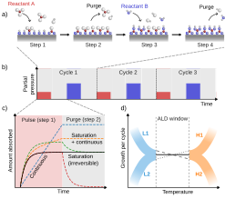

# Semiconductor process: Thin-film deposition

Thin-film deposition은 wafer 표면에 conductor, semiconductor 또는 dielectric layer를 형성하는 공정이다. 막은 gate stack, spacer, contact barrier, interconnect와 passivation처럼 서로 다른 기능을 맡으며, 요구 특성도 두께만이 아니라 조성, 밀도, 결정성, 계면, 응력, 거칠기와 삼차원 구조의 피복성까지 포함한다. 대표 방법인 physical vapor deposition (PVD), chemical vapor deposition (CVD), atomic layer deposition (ALD)과 epitaxy는 공급종을 표면까지 옮기고 부착·반응시킨다는 공통 골격을 갖지만, 성장률을 제한하는 단계와 형상 피복 능력이 다르다.[1–4]

이 문서는 각 방법의 물리적 차이와 막 두께·균일도·conformality의 해석에 집중한다. 특정 precursor, reactor 또는 생산 recipe의 최적 온도·압력은 재료와 장비에 의존하므로 보편값으로 제시하지 않는다.

## 1. 박막 성장의 공통 단계와 지표

### (1) 공급, 흡착, 핵생성과 성장

Deposition은 대체로 source에서 원자·분자·radical을 만들고, 이를 기판으로 수송한 뒤, 표면에서 흡착·확산·반응시켜 안정한 nucleus와 film을 만드는 단계로 나눌 수 있다. 입사종 일부는 반사되거나 desorption하고, 일부는 표면을 이동해 기존 island에 붙는다. 따라서 source flux가 같아도 substrate temperature, surface termination과 sticking probability가 다르면 핵생성 밀도와 미세구조가 달라진다.[1,5]

초기 nucleus가 서로 합쳐지기 전에는 막이 불연속일 수 있다. 표면과 막의 계면·표면 에너지 및 kinetic condition에 따라 대표적인 성장 형태는 layer-by-layer인 Frank–van der Merwe, island를 만드는 Volmer–Weber, 초기 layer 뒤 island가 생기는 Stranski–Krastanov mode로 구분한다. 이 분류는 morphology를 이해하는 기준이며, 실제 growth mode는 strain, temperature와 deposition rate에 따라 성장 중 바뀔 수 있다.[1,5]

### (2) 두께, 균일도와 conformality

평균 deposition rate는 시간 $\Delta \tau$ 동안 늘어난 막 두께 $t_1-t_0$로

$$
R_\mathrm{dep}=\frac{t_1-t_0}{\Delta \tau}
$$

와 같이 정의한다. Wafer-scale uniformity는 서로 다른 위치의 두께 분포를 나타낸다. 예를 들어 이 문서에서는 peak-to-peak non-uniformity를

$$
U_{\mathrm{p-p}}=
\frac{t_\mathrm{max}-t_\mathrm{min}}
{2t_\mathrm{avg}}\times100\%
$$

로 정의한다. 산업 자료에서는 분모에 $t_\mathrm{avg}$만 쓰거나 표준편차를 쓰기도 하므로, `uniformity ±x%`만 적지 말고 식, 제외한 edge 영역과 측정 지점을 함께 밝혀야 한다.[2,4]

Conformality는 trench·hole의 top, sidewall과 bottom에 막이 얼마나 비슷하게 형성되는지를 뜻한다. 구체적인 step coverage는

$$
SC_\mathrm{side}=\frac{t_\mathrm{side}}{t_\mathrm{top}},
\qquad
SC_\mathrm{bottom}=\frac{t_\mathrm{bottom}}{t_\mathrm{top}}
$$

처럼 위치 쌍의 두께 비로 나타낼 수 있다. Wafer uniformity가 좋아도 고종횡비 feature의 bottom coverage는 나쁠 수 있으며, 그 반대도 가능하다. 두 지표는 길이 척도와 원인이 다르다.[2–4]

## 2. Physical vapor deposition

### (1) Evaporation과 sputtering

PVD는 고체 source에서 물리적으로 방출된 원자 또는 cluster를 저압 기상으로 수송하여 기판에 응축한다. Thermal 또는 electron-beam evaporation에서는 source를 가열해 vapor pressure를 높이고, sputtering에서는 plasma ion이 target에 momentum을 전달하여 target atom을 방출시킨다. Reactive sputtering은 방출된 종과 reactive gas를 결합해 nitride·oxide 같은 compound film을 만들 수 있다.[1,2]

Evaporation flux는 source temperature의 vapor pressure에 민감하고, source–substrate geometry가 wafer 두께 분포를 좌우한다. Sputtering은 융점이 높은 재료와 alloy에도 적용하기 쉽고 wafer-scale flux를 설계할 수 있지만, energetic neutral·ion, resputtering과 plasma exposure가 substrate damage와 film stress를 만들 수 있다. 어느 방식이 더 “좋다”기보다 재료 조성, thermal budget, damage와 coverage 요구에 따라 선택한다.[1,2]

### (2) Line-of-sight와 shadowing

저압에서 평균 자유 행로가 chamber 길이에 비해 길면 PVD species는 충돌이 적은 line-of-sight trajectory로 이동한다. 입구 가장자리가 oblique flux를 가리면 sidewall과 bottom에 도달하는 양이 줄어 shadowing, overhang과 seam·void가 생길 수 있다. Substrate rotation, pressure에 따른 scattering, collimation, ionized PVD와 bias는 angular distribution을 바꾸지만 각 방법은 deposition rate와 damage 같은 상충관계를 갖는다.[1,2]

!!! warning "[Interpretation Caveat]"
    `PVD는 conformal하지 않다`는 표현은 일반적인 경향이지 절대 법칙이 아니다. 실제 coverage는 source angular distribution, pressure, feature aspect ratio, re-emission과 surface diffusion에 의존한다. 동일한 sputtering 조건도 trench 폭과 깊이가 바뀌면 bottom coverage가 달라질 수 있다.[1,2]

## 3. Chemical vapor deposition

### (1) 기상 수송과 표면 반응

CVD에서는 gaseous precursor가 substrate 부근으로 대류·확산하고, 경계층을 통과한 뒤 표면에 흡착·반응하여 solid film을 남긴다. 반응 부산물은 desorption하여 경계층 밖으로 제거된다. Gas-phase nucleation이 과도하면 particle이나 조성 변화가 생길 수 있으므로 표면 반응과 homogeneous reaction을 구분해야 한다.[2,6]

Bulk gas의 농도를 $C_g$, 표면 바로 위 농도를 $C_s$, mass-transfer coefficient를 $h_g$, surface-reaction rate constant를 $k_s$라 하자. 일차 반응 근사에서 표면으로 들어오는 flux와 소비 flux는

$$
F_1=h_g(C_g-C_s),
\qquad
F_2=k_sC_s
$$

이다. 정상 상태에서 $F_1=F_2=F$이므로

$$
F=\frac{h_gk_s}{h_g+k_s}C_g
=k_\mathrm{eff}C_g,
\qquad
\frac{1}{k_\mathrm{eff}}=\frac{1}{h_g}+\frac{1}{k_s}
$$

를 얻는다. 두 저항이 직렬로 작용하므로 더 작은 계수가 전체 성장률을 제한한다.[2,6]

### (2) Surface-reaction-limited와 mass-transfer-limited regime

$k_s\ll h_g$이면 surface reaction이 rate-limiting이다. 반응률의 Arrhenius temperature dependence가 크게 나타나며, 충분히 확산된 precursor가 표면 여러 위치에 도달하므로 균일도와 step coverage에 유리할 수 있다. 반대로 $h_g\ll k_s$이면 도착한 precursor가 빠르게 소비되어 reactor entrance와 feature top에서 depletion이 커지고, gas flow와 boundary layer가 성장률을 지배한다.[2,6]

Low-pressure CVD (LPCVD)는 gas-phase collision과 mass-transfer condition을 조절하고 여러 wafer를 batch로 처리할 수 있다. Plasma-enhanced CVD (PECVD)는 plasma에서 reactive species를 만들어 낮은 substrate temperature에서도 반응을 진행시킬 수 있으나 ion damage, hydrogen incorporation과 plasma non-uniformity를 관리해야 한다. `낮은 온도`와 `높은 막 품질`은 같은 의미가 아니며, 막 밀도·조성·응력과 후속 열 안정성을 따로 검증한다.[2,6]

## 4. Atomic layer deposition

### (1) Self-limiting surface reaction

ALD는 서로 반응하는 precursor를 동시에 흘리지 않고 시간적으로 분리한다. 한 cycle은 보통 precursor A pulse → purge → reactant B pulse → purge의 네 단계로 구성된다. 각 half-reaction이 사용 가능한 surface site를 소모한 뒤 포화되면 충분한 dose 이상에서 추가 공급이 성장량을 거의 늘리지 않는 self-limiting behavior가 나타난다.[3,4]

<figure markdown="span">
  
  <figcaption>
    그림 1. ALD cycle의 순차적인 precursor pulse·purge, 이상적 포화 반응과 비이상적 흡착, growth per cycle 및 ALD window의 개념.
    출처: P. M. Piechulla et al., “ALD Basics Illustration,” Wikimedia Commons (2025),
    <a href="https://commons.wikimedia.org/wiki/File:ALD_basics_illustration.svg">CC BY 4.0</a>, 수정 없음.[11]
  </figcaption>
</figure>

$N_\mathrm{cycle}$회 뒤 두께 변화가 $\Delta t$이면 growth per cycle (GPC)은

$$
\mathrm{GPC}=\frac{\Delta t}{N_\mathrm{cycle}}
$$

로 정의한다. 이상적인 steady growth에서는 cycle 수로 두께를 정밀하게 제어할 수 있다. 그러나 초기 surface nucleation delay, island coalescence, precursor decomposition, ligand residue와 surface-site density 변화 때문에 GPC가 항상 일정하거나 한 monolayer와 같지는 않다.[3,4]

### (2) ALD window와 고종횡비 구조

ALD window는 GPC가 온도에 비교적 둔감하고 self-limiting reaction이 유지되는 온도 범위를 뜻한다. 낮은 온도에서는 condensation 또는 불완전 reaction이, 높은 온도에서는 precursor decomposition이나 desorption이 나타날 수 있다. 실제 GPC가 window 안에서 완전히 평평하지 않을 수 있으므로, saturation curve와 조성·불순물을 함께 확인한다.[3,4]

ALD는 반응종이 feature 전체에 도달하고 각 half-cycle이 포화되면 높은 conformality를 얻을 수 있다. 그러나 aspect ratio가 커지면 Knudsen transport, surface sticking과 반응종 소모 때문에 bottom까지 필요한 exposure가 증가한다. Pulse가 짧으면 penetration depth가 부족하고, purge가 짧으면 precursor mixing에 의한 CVD-like reaction과 particle이 생길 수 있다. 따라서 self-limiting chemistry는 충분한 dose와 purge가 갖춰질 때만 삼차원 conformality로 이어진다.[3,4]

!!! info "[Measurement]"
    Precursor A와 B의 pulse를 각각 늘리면서 GPC가 plateau에 도달하는지 확인하고, purge 시간을 늘렸을 때 GPC와 불순물 농도가 안정되는지 측정한다. 그 뒤 planar coupon의 GPC뿐 아니라 목표 aspect ratio를 가진 test structure의 top·middle·bottom thickness와 composition을 단면 transmission electron microscopy (TEM) 또는 scanning electron microscopy (SEM)–spectroscopy로 비교한다.[3,4]

## 5. Epitaxy

### (1) 결정 정렬과 성장 방법

Epitaxy는 film의 결정 방향이 crystalline substrate의 결정 구조와 일정한 관계를 갖도록 성장시키는 방법이다. Film과 substrate가 같은 재료이면 homoepitaxy, 다른 재료이면 heteroepitaxy라 한다. Vapor-phase epitaxy, metal-organic CVD (MOCVD)와 molecular beam epitaxy (MBE)처럼 공급 방식은 달라도, 깨끗하고 질서 있는 substrate surface에서 adatom이 적절한 lattice site를 선택할 수 있어야 한다.[5,7]

MBE는 ultrahigh vacuum에서 원자·분자 beam을 공급해 flux와 interface를 정밀 제어할 수 있고, CVD 계열 epitaxy는 precursor chemistry와 gas transport를 이용해 높은 처리량과 선택적 성장을 구현할 수 있다. 성장법 자체만으로 결정 품질이 정해지는 것은 아니며 substrate preparation, supersaturation, temperature, V/III ratio 같은 chemical potential condition과 contamination을 함께 관리한다.[5,7]

### (2) Lattice mismatch와 strain relaxation

Film과 substrate의 relaxed lattice constant를 각각 $a_f$, $a_s$라 할 때 이 문서에서는 lattice mismatch를

$$
f=\frac{a_f-a_s}{a_s}
$$

로 정의한다. 문헌에 따라 분모나 부호가 다를 수 있으므로 convention을 표시해야 한다. 얇은 heteroepitaxial film은 substrate와 in-plane lattice를 맞추며 coherent strain을 저장할 수 있지만, 두께가 증가하면 strain energy와 misfit dislocation 형성의 경쟁에 따라 relaxation이 시작된다.[7,8]

Critical thickness는 단일 재료 상수가 아니라 mismatch, elastic property, dislocation energetics, growth kinetics와 기존 defect에 의존한다. III–V/Si처럼 lattice·thermal expansion·polarity가 함께 다른 계에서는 misfit·threading dislocation뿐 아니라 anti-phase boundary와 thermal crack도 고려해야 한다.[7,8]

!!! warning "[Interpretation Caveat]"
    X-ray diffraction peak가 substrate와 정렬되어 보이거나 표면이 매끄럽다는 사실만으로 defect-free epitaxy를 뜻하지 않는다. Reciprocal-space map, rocking curve, cross-sectional TEM과 etch-pit 또는 defect-selective measurement를 결합해 strain relaxation과 threading defect를 구분한다.[7,8]

## 6. 막 품질과 계측

### (1) 두께와 형상

Spectroscopic ellipsometry와 optical reflectometry는 optical model을 사용해 thickness와 optical constant를 추정한다. X-ray reflectometry (XRR)는 평탄한 박막·다층막의 thickness, density와 interface roughness를 함께 평가할 수 있다. Step이 있는 coupon에는 stylus profilometry나 atomic force microscopy (AFM)를 쓸 수 있고, patterned feature의 conformality에는 단면 SEM/TEM이 필요하다. 각 방법은 model, lateral sampling area와 destructive preparation이 다르므로 목적에 맞춰 교차 검증한다.[9,10]

### (2) 조성, 결정성, 응력과 전기 특성

X-ray photoelectron spectroscopy (XPS), Rutherford backscattering spectrometry (RBS)와 SIMS는 조성·불순물·depth distribution을, X-ray diffraction (XRD)과 TEM은 phase·orientation·defect를 평가한다. AFM은 표면 거칠기를, wafer curvature는 film stress를, four-point probe는 conductive film의 sheet resistance를 측정한다. 서로 다른 물성을 한 개의 “film quality” 숫자로 합치기보다 용도별 acceptance criterion을 정한다.[1,3,9]

| 요구 특성 | 대표 지표 | 대표 계측 | 해석 시 주의점 |
| --- | --- | --- | --- |
| 평균 두께·wafer 균일도 | $t_\mathrm{avg}$, $U_\mathrm{p-p}$, wafer map | Ellipsometry, reflectometry, XRR | Optical model과 edge exclusion을 기록한다. |
| Feature conformality | $SC_\mathrm{side}$, $SC_\mathrm{bottom}$ | 단면 SEM/TEM | 측정한 위치와 aspect ratio를 명시한다. |
| 조성·불순물 | atomic fraction, depth profile | XPS, RBS, SIMS | Surface sensitivity와 matrix effect가 다르다. |
| 결정성·결함 | phase, orientation, rocking-curve width, defect density | XRD, TEM | 평균 신호와 국부 결함을 구분한다. |
| 표면·계면 | RMS roughness, interface width | AFM, XRR, TEM | Lateral length scale과 fitting model을 밝힌다. |
| 기계·전기 특성 | stress, sheet resistance | Wafer curvature, four-point probe | 두께 오차와 다층 병렬 전도를 반영한다. |

!!! info "[Metric]"
    Deposition 결과에는 material stack, substrate, preclean, method, temperature·pressure, gas 또는 source flux, deposition time·cycle을 기록한다. 두께는 평균만이 아니라 wafer map과 sampling rule을, conformality는 feature geometry와 위치별 두께를 보고한다. 조성·density·stress·roughness·resistivity 가운데 실제 소자 기능을 제한하는 항목을 별도 acceptance criterion으로 둔다.[2–4,9]

## 7. 방법 선택과 공정 통합

PVD는 metal과 alloy를 높은 throughput으로 형성하기 좋지만 line-of-sight shadowing과 energetic-particle damage를 관리해야 한다. CVD는 surface chemistry와 gas transport를 이용해 넓은 재료 선택과 좋은 coverage를 얻을 수 있으나 gas-phase reaction, precursor depletion과 thermal budget이 제약이다. ALD는 cycle-level thickness control과 높은 conformality에 유리하지만 낮은 growth rate, 긴 purge와 precursor·surface chemistry의 제한이 있다. Epitaxy는 결정 정렬과 abrupt interface가 필요한 semiconductor layer에 쓰이지만 substrate quality와 lattice·thermal mismatch가 품질을 제한한다.[1–8]

실제 선택은 한 가지 장점을 최대화하는 문제가 아니다. 예를 들어 barrier film은 bottom coverage뿐 아니라 resistivity와 impurity가 중요하고, gate dielectric은 equivalent thickness뿐 아니라 interface trap과 leakage가 중요하다. 또한 deposition 뒤 [etching](etching.md), annealing과 chemical mechanical polishing이 막의 조성·응력·profile을 바꿀 수 있으므로 최종 stack 기준으로 검증한다.[1–4]

## 8. 요약

- 박막 성장은 공급종 생성·수송, 흡착, surface reaction, nucleation과 coalescence의 연속 과정이다.
- Wafer uniformity와 feature conformality는 서로 다른 길이 척도의 지표이며, step coverage는 측정 위치를 명시한 두께 비로 보고한다.
- PVD는 evaporation 또는 sputtering으로 물질을 물리적으로 공급하며, angular distribution과 shadowing이 coverage를 좌우한다.
- CVD 성장률은 mass transfer와 surface reaction의 직렬 저항으로 이해할 수 있고, 어느 단계가 느린지에 따라 온도·유동 의존성이 달라진다.
- ALD는 분리된 self-limiting half-reaction으로 두께를 제어하지만, 충분한 precursor dose와 purge가 없으면 이상적 saturation과 conformality를 얻을 수 없다.
- Epitaxy에서는 결정 정렬뿐 아니라 lattice mismatch, coherent strain, relaxation과 threading defect를 함께 평가해야 한다.
- 막의 acceptance에는 두께 외에도 조성, 밀도, 결정성, 계면, 응력, 거칠기와 전기적 특성이 필요하다.

## 9. 참고문헌

1. A. G. Andreou, “Film Deposition,” Johns Hopkins University 520/580.495, lecture notes adapted from R. B. Darling (2000). [강의 자료](https://pages.jh.edu/aandreo1/495/Archives/2002/LectureNotes/FilmDeposition.pdf).
2. J. Hoyt, “Chemical Vapor Deposition,” MIT OpenCourseWare 6.774, *Physics of Microfabrication: Front-End Processing* (2004). [강의 transcript](https://ocw.mit.edu/courses/6-774-physics-of-microfabrication-front-end-processing-fall-2004/1sSADV3Iiuifbp51EEBEB0v15lnIZkjBA_transcript.pdf).
3. J. Li, G. Chai, and X. Wang, “Atomic Layer Deposition of Thin Films: From a Chemistry Perspective,” *International Journal of Extreme Manufacturing* **5**, 032003 (2023). [DOI: 10.1088/2631-7990/acd88e](https://doi.org/10.1088/2631-7990/acd88e).
4. V. Cremers, R. L. Puurunen, and J. Dendooven, “Conformality in Atomic Layer Deposition: Current Status Overview of Analysis and Modelling,” *Applied Physics Reviews* **6**, 021302 (2019). [DOI: 10.1063/1.5060967](https://doi.org/10.1063/1.5060967).
5. R. W. Vook, “Thin Film Growth,” *Materials Research Society Symposium Proceedings* **103**, 3–14 (1987). [DOI: 10.1557/PROC-103-3](https://doi.org/10.1557/PROC-103-3).
6. M. Sabzi et al., “A Review on Sustainable Manufacturing of Ceramic-Based Thin Films by Chemical Vapor Deposition (CVD): Reactions Kinetics and the Deposition Mechanisms,” *Coatings* **13**, 188 (2023). [DOI: 10.3390/coatings13010188](https://doi.org/10.3390/coatings13010188).
7. C. G. Fonstad, “Epitaxial Growth,” MIT OpenCourseWare 6.772, *Compound Semiconductor Devices* (2003). [강의 자료](https://ocw.mit.edu/courses/6-772-compound-semiconductor-devices-spring-2003/48fbc45331e7a934ba2f804423d990fc_lect8_part1.pdf).
8. Y. Du et al., “Review of Highly Mismatched III–V Heteroepitaxy Growth on (001) Silicon,” *Nanomaterials* **12**, 741 (2022). [DOI: 10.3390/nano12050741](https://doi.org/10.3390/nano12050741).
9. D. Windover et al., “Thickness and Composition Reference Standards for Semiconductor Metrology,” SEMATECH Technology Transfer 11035149A-TR (2011). [NIST publication record](https://www.nist.gov/publications/thickness-and-composition-reference-standards-semiconductor-metrology).
10. International Organization for Standardization, *ISO 16413:2020—Evaluation of Thickness, Density and Interface Width of Thin Films by X-Ray Reflectometry* (2020). [공식 표준 페이지](https://www.iso.org/standard/76403.html).
11. P. M. Piechulla, R. L. Puurunen, M. Chen, A. Goulas, and J. R. van Ommen, “ALD Basics Illustration,” Wikimedia Commons (2025). [CC BY 4.0](https://commons.wikimedia.org/wiki/File:ALD_basics_illustration.svg).
