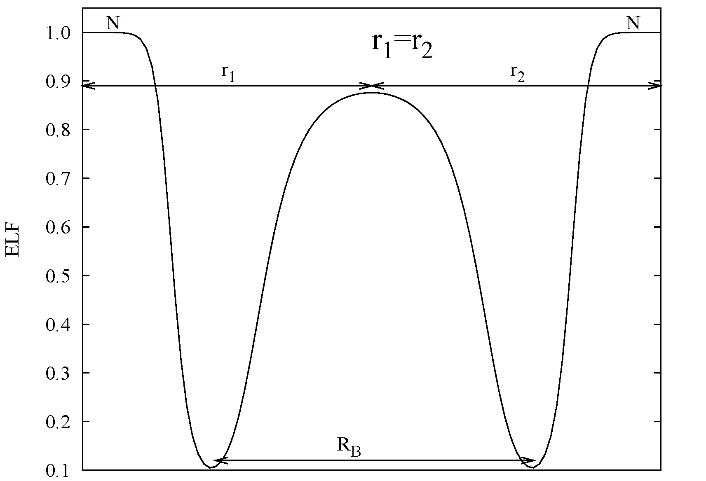

# 1.1. Electronic structure: Electron localization function

Electron localization function (ELF)은 한 점에 전자가 있을 때 그 가까이에 **같은 스핀** 전자를 다시 발견하기 어려운 정도를, 같은 국소 밀도의 homogeneous electron gas (HEG)와 비교해 $0$과 $1$ 사이로 나타낸 무차원 함수이다. Becke와 Edgecombe는 Hartree–Fock 단일 Slater determinant의 평행 스핀 쌍확률에서 이 양을 도입했다. 이후 Kohn–Sham density functional theory (KS-DFT)와 주기적 고체에 적용되면서 원자 껍질, 공유 결합 영역, lone pair와 금속적 전자 분포를 실공간에서 분석하는 도구로 확장되었다.[1–4]

ELF는 전자 밀도 자체도, “이 점에 전자쌍이 존재할 확률”도 아니다. 핵심은 Pauli exclusion principle 때문에 생기는 같은 스핀 전자 사이의 짧은 거리 회피가 기준계보다 얼마나 강한지를 비교하는 데 있다. 이 글은 3차원, collinear spin, 단일 determinant를 기본으로 원래 정의를 유도한 뒤, closed-shell 표기와 KS-DFT 계산, ELF topology 및 해석 한계를 연결한다.[1,4,8]

원자 단위계 $\hbar=m_e=e=4\pi\epsilon_0=1$을 사용한다. 먼저 실수 궤도함수를 가정하고, 복소 궤도함수에서 필요한 보정은 뒤에서 별도로 다룬다.

## 1. 같은 스핀 전자의 국소 회피

### (1) Pair density와 conditional probability

스핀 $\sigma$의 점유 궤도함수를 $\varphi_{i\sigma}(\mathbf r)$라 하면 spin density와 one-particle density matrix는

$$
\rho_\sigma(\mathbf r)
=
\sum_i^{\mathrm{occ}}
\left|\varphi_{i\sigma}(\mathbf r)\right|^2,
$$

$$
\gamma_\sigma(\mathbf r,\mathbf r')
=
\sum_i^{\mathrm{occ}}
\varphi_{i\sigma}^{*}(\mathbf r)
\varphi_{i\sigma}(\mathbf r')
$$

로 정의된다. 단일 Slater determinant에서 같은 스핀 pair density는

$$
\rho_2^{\sigma\sigma}(\mathbf r,\mathbf r')
=
\rho_\sigma(\mathbf r)\rho_\sigma(\mathbf r')
-
\left|\gamma_\sigma(\mathbf r,\mathbf r')\right|^2
$$

이다. 두 번째 항은 antisymmetry가 만드는 exchange hole이다. 첫 번째 전자가 $\mathbf r$에 있다는 조건에서 두 번째 같은 스핀 전자를 $\mathbf r'$에서 찾을 조건부 밀도는

$$
P_{\mathrm{cond}}^\sigma(\mathbf r,\mathbf r')
=
\frac{
\rho_2^{\sigma\sigma}(\mathbf r,\mathbf r')
}{
\rho_\sigma(\mathbf r)
}
$$

로 쓸 수 있다.[1,2,4]

$\mathbf r'=\mathbf r$이면 $\gamma_\sigma(\mathbf r,\mathbf r)=\rho_\sigma(\mathbf r)$이므로

$$
P_{\mathrm{cond}}^\sigma(\mathbf r,\mathbf r)=0
$$

이다. 이는 같은 스핀 두 전자가 같은 위치에 있을 수 없다는 Pauli exclusion principle의 직접적인 결과이다. 따라서 ELF는 조건부 밀도의 값 자체가 아니라, 두 점을 조금 벌렸을 때 이 값이 얼마나 빠르게 증가하는지를 이용한다.[1,2,4]

### (2) 짧은 거리 전개

두 번째 위치를

$$
\mathbf r'=\mathbf r+s\hat{\mathbf u},
\qquad |\hat{\mathbf u}|=1
$$

로 놓는다. $s$는 두 점 사이 거리이고 $\hat{\mathbf u}$는 방향이다. 궤도함수를 $\mathbf r$ 주변에서 전개하면

$$
\varphi_{i\sigma}(\mathbf r+s\hat{\mathbf u})
=
\varphi_{i\sigma}(\mathbf r)
+
s\,\hat{\mathbf u}\cdot\nabla\varphi_{i\sigma}(\mathbf r)
+
\frac{s^2}{2}
(\hat{\mathbf u}\cdot\nabla)^2
\varphi_{i\sigma}(\mathbf r)
+
\cdots
$$

이다. 이 식을 pair density에 대입하면 $s^0$ 항은 Pauli exclusion principle 때문에 정확히 상쇄된다. 방향 평균에서는

$$
\left\langle u_\alpha\right\rangle_\Omega=0,
\qquad
\left\langle u_\alpha u_\beta\right\rangle_\Omega
=
\frac{\delta_{\alpha\beta}}{3}
$$

이므로 $s^1$ 항은 사라지고, 등방 평균의 첫 번째 비영 항은 $s^2$에 비례한다. 그 결과

$$
\overline{P}_{\mathrm{cond}}^\sigma(\mathbf r,s)
\equiv
\frac{1}{4\pi}
\int
P_{\mathrm{cond}}^\sigma
(\mathbf r,\mathbf r+s\hat{\mathbf u})
\,d\Omega_{\hat{\mathbf u}}
=
\frac{s^2}{3}D_\sigma(\mathbf r)
+
O(s^3)
$$

를 얻는다. 여기서 3차원의 국소 curvature는

$$
\boxed{
D_\sigma(\mathbf r)
=
\tau_\sigma(\mathbf r)
-
\frac{1}{4}
\frac{
\left|\nabla\rho_\sigma(\mathbf r)\right|^2
}{
\rho_\sigma(\mathbf r)
}
}
$$

이고, 이 글의 positive kinetic-energy density 관례는

$$
\tau_\sigma(\mathbf r)
=
\sum_i^{\mathrm{occ}}
\left|\nabla\varphi_{i\sigma}(\mathbf r)\right|^2
$$

이다.[1,2,4]

$1/3$은 3차원 방향 평균에서 나온다. 예를 들어 2차원에서는 같은 절차의 계수가 $1/2$이므로, 차원이 다른 ELF 식을 그대로 옮기면 안 된다.[2,4]

### (3) $D_\sigma$의 물리적 의미

$D_\sigma$가 작으면 기준점에서 멀어질 때 같은 스핀 조건부 밀도가 천천히 증가한다. 즉 주어진 위치 주변에서 같은 스핀 전자가 강하게 배제되며, ELF 언어에서는 전자가 더 국소화된 영역으로 해석한다. 반대로 $D_\sigma$가 크면 같은 거리에서 허용되는 평행 스핀 쌍밀도가 더 빠르게 증가한다.[1,2,4]

두 번째 항

$$
\tau_\sigma^{\mathrm W}
=
\frac{1}{4}
\frac{|\nabla\rho_\sigma|^2}{\rho_\sigma}
$$

은 이 글의 $\tau_\sigma$ 관례에서 단일 궤도가 같은 밀도를 만들 때 필요한 von Weizsäcker 형태이다. 따라서

$$
D_\sigma=\tau_\sigma-\tau_\sigma^{\mathrm W}
$$

는 밀도 구배만으로 설명되지 않는 Pauli excess kinetic-energy density로도 읽을 수 있다. 이 해석은 ELF를 고체의 KS 궤도함수에 적용하는 연결고리가 되지만, $D_\sigma$ 자체가 독립적인 관측 가능량이라는 뜻은 아니다.[3–5,8]

## 2. Homogeneous electron gas 정규화

### (1) 기준 curvature

$D_\sigma$는 차원을 가지며 밀도 크기에 따라 자연스럽게 변하므로, 서로 다른 위치를 직접 비교하기 어렵다. Becke–Edgecombe ELF는 같은 $\rho_\sigma$를 갖는 3차원 HEG의 값

$$
\boxed{
D_\sigma^0(\mathbf r)
=
\frac{3}{5}
(6\pi^2)^{2/3}
\rho_\sigma(\mathbf r)^{5/3}
}
$$

을 국소 기준으로 사용한다. 무차원 비와 ELF는

$$
\chi_\sigma(\mathbf r)
=
\frac{D_\sigma(\mathbf r)}{D_\sigma^0(\mathbf r)},
$$

$$
\boxed{
\mathrm{ELF}_\sigma(\mathbf r)
=
\frac{1}{
1+\chi_\sigma(\mathbf r)^2
}
}
$$

로 정의된다.[1–4,7]

제곱을 포함한 Lorentzian mapping은 $D_\sigma/D_\sigma^0\in[0,\infty)$를 ELF $\in(0,1]$로 단조롭게 옮긴다. 따라서 순서는 보존되지만 수치 차이는 비선형적으로 압축된다.

| 조건 | $\chi_\sigma$ | ELF | 올바른 해석 |
| --- | ---: | ---: | --- |
| $D_\sigma\rightarrow 0$ | $0$ | $1$ | 같은 스핀 조건부 밀도의 짧은 거리 증가가 억제됨 |
| $D_\sigma=D_\sigma^0$ | $1$ | $0.5$ | 같은 국소 밀도의 HEG와 같은 기준값 |
| $D_\sigma\gg D_\sigma^0$ | $\gg 1$ | $0$에 접근 | 기준계보다 같은 스핀 조건부 밀도가 빠르게 증가함 |

ELF $=0.5$는 HEG 기준일 뿐, 결합과 비결합 영역을 나누는 보편적 문턱값이 아니다. 특정 isovalue 하나만으로 결합의 존재나 종류를 판정하면 시각화 설정을 물리적 기준으로 오인하게 된다.[3,7,8]

### (2) Closed-shell 식과 계수의 차이

문헌과 프로그램마다 kinetic-energy density 앞의 $1/2$을 정의에 포함하는 방식이 달라 ELF 식의 계수가 다르게 보인다. Closed-shell 계에서

$$
\rho_\uparrow=\rho_\downarrow=\frac{\rho}{2}
$$

이고, 전체 spin orbital에 대해

$$
t(\mathbf r)
=
\frac{1}{2}
\sum_{i\sigma}^{\mathrm{occ}}
\left|\nabla\varphi_{i\sigma}(\mathbf r)\right|^2
$$

로 정의하면 흔히 사용하는 total-density 형식은

$$
\boxed{
D(\mathbf r)
=
t(\mathbf r)
-
\frac{1}{8}
\frac{|\nabla\rho(\mathbf r)|^2}{\rho(\mathbf r)}
}
$$

과

$$
\boxed{
D^0(\mathbf r)
=
\frac{3}{10}
(3\pi^2)^{2/3}
\rho(\mathbf r)^{5/3}
}
$$

이다. 이때도

$$
\mathrm{ELF}(\mathbf r)
=
\frac{1}{1+[D(\mathbf r)/D^0(\mathbf r)]^2}
$$

이다.[2,3,7,9]

| 표기 | kinetic-energy density 정의 | 밀도 구배 항 | HEG 기준 |
| --- | --- | --- | --- |
| Spin-resolved | $\tau_\sigma=\sum_i\lvert\nabla\varphi_{i\sigma}\rvert^2$ | $\frac14\lvert\nabla\rho_\sigma\rvert^2/\rho_\sigma$ | $\frac35(6\pi^2)^{2/3}\rho_\sigma^{5/3}$ |
| Closed-shell total density | $t=\frac12\sum_{i\sigma}\lvert\nabla\varphi_{i\sigma}\rvert^2$ | $\frac18\lvert\nabla\rho\rvert^2/\rho$ | $\frac3{10}(3\pi^2)^{2/3}\rho^{5/3}$ |

두 행은 서로 다른 ELF가 아니라 같은 closed-shell 물리를 서로 다른 정규화로 쓴 것이다. 계산 결과를 비교할 때는 $\tau$, $D$와 $D^0$의 정의를 한 세트로 사용했는지 먼저 확인해야 한다.[3,7,9]

## 3. KS-DFT에서의 ELF

### (1) 원래 pair probability와 KS descriptor의 차이

원래 유도에서

$$
\rho_2^{\sigma\sigma}
=
\rho_\sigma\rho_\sigma'
-
|\gamma_\sigma|^2
$$

는 단일 Slater determinant의 정확한 관계이다. 실제 고체 계산에서는 보통 self-consistent KS 궤도함수로 $\rho_\sigma$, $\nabla\rho_\sigma$와 $\tau_\sigma$를 구성한다. 이 KS-ELF는 보조 비상호작용계의 Pauli kinetic-energy density를 실공간에서 나타내는 descriptor이며, 상호작용하는 실제 계의 정확한 pair density를 복원한 양은 아니다.[3,4,8]

그럼에도 KS-ELF가 유용한 이유는 occupied subspace 안에서 궤도함수를 unitary transformation해도 $\rho_\sigma$와 $\tau_\sigma$의 합이 변하지 않기 때문이다. 실제로

$$
\widetilde{\varphi}_{a\sigma}
=
\sum_i U_{ai}\varphi_{i\sigma},
\qquad
U^\dagger U=I
$$

이면

$$
\sum_a
\left|\nabla\widetilde{\varphi}_{a\sigma}\right|^2
=
\sum_{ij}
(U^\dagger U)_{ij}
\nabla\varphi_{i\sigma}^{*}\cdot
\nabla\varphi_{j\sigma}
=
\sum_i
\left|\nabla\varphi_{i\sigma}\right|^2
$$

이고 $\rho_\sigma$에도 같은 상쇄가 일어난다. 따라서 개별 localized orbital의 임의적인 선택보다 덜 의존적인 실공간 지표를 제공한다. 다만 exchange–correlation functional, basis, pseudopotential와 수치 격자에 대한 계산 의존성까지 사라지는 것은 아니다.[1,3,7,8]

### (2) 복소 궤도함수와 전류 항

자기장, time-dependent 상태 또는 복소 Bloch orbital처럼 paramagnetic current density가 0이 아닐 수 있는 경우에는 실수 궤도함수 식만 사용하면 gauge-dependent한 항이 남는다. Collinear spin에서

$$
\mathbf j_{p,\sigma}(\mathbf r)
=
\operatorname{Im}
\sum_i^{\mathrm{occ}}
\varphi_{i\sigma}^{*}(\mathbf r)
\nabla\varphi_{i\sigma}(\mathbf r)
$$

로 두면 curvature는

$$
\boxed{
D_\sigma
=
\tau_\sigma
-
\frac14
\frac{|\nabla\rho_\sigma|^2}{\rho_\sigma}
-
\frac{|\mathbf j_{p,\sigma}|^2}{\rho_\sigma}
}
$$

로 일반화된다. 실수 궤도함수에서는 $\mathbf j_{p,\sigma}=0$이므로 앞의 식으로 돌아간다.[4,10] 이 글의 식은 collinear spin 가정 아래 유도되었으므로 noncollinear spinor에 그대로 적용되는 식으로 해석하지 않는다.

## 4. ELF attractor와 basin

### (1) Attractor와 basin

한 점의 ELF 값만 보는 것보다 ELF scalar field의 topology를 분석하면 공간을 겹치지 않는 영역으로 나눌 수 있다. Gradient field

$$
\frac{d\mathbf r(l)}{dl}
=
\nabla\mathrm{ELF}[\mathbf r(l)]
$$

을 따라 올라가는 trajectory가 도달하는 국소 최댓값을 attractor라 한다. 같은 attractor로 수렴하는 모든 점의 집합이 basin $\Omega$이며, 인접 basin의 경계에서는

$$
\nabla\mathrm{ELF}(\mathbf r)\cdot\mathbf n(\mathbf r)=0
$$

인 zero-flux 조건이 성립한다.[5–7]

<figure markdown="span">
  
  <figcaption markdown="1">
    그림 1. $N_2$의 결합축을 따른 ELF 단면. 중앙 최대점은 결합 영역의 attractor이고, 양쪽 최소점은 표시된 결합 영역 $R_B$의 경계를 정한다. 대칭 분자이므로 $r_1=r_2$이다. 출처: J. Contreras-García, M. Marqués, J. M. Menéndez, J. M. Recio, “From ELF to Compressibility in Solids,” Figure 2 왼쪽 패널, [DOI: 10.3390/ijms16048151](https://doi.org/10.3390/ijms16048151), [CC BY 4.0](https://creativecommons.org/licenses/by/4.0/). 원본의 왼쪽 패널만 잘라 수정하여 재현했으며 곡선과 표시는 변경하지 않았다.[7]
  </figcaption>
</figure>

ELF topology에서는 보통 핵 주변 basin을 core basin $C(A)$, 한 원자 중심과 연결된 valence basin을 monosynaptic basin $V(A)$, 두 원자 중심 사이의 valence basin을 disynaptic basin $V(A,B)$으로 분류한다. 더 많은 중심과 연결된 polysynaptic basin도 가능하다. 이 분류는 공간적 연결성을 나타내며, basin이 존재한다는 사실만으로 결합 차수나 결합 에너지가 정해지는 것은 아니다.[5–8]

### (2) Basin population

ELF는 basin의 경계를 정하지만 전자 수는 density를 적분해 얻는다.

$$
\overline N(\Omega)
=
\int_\Omega
\rho(\mathbf r)\,d\mathbf r
$$

Spin-polarized 계라면

$$
\overline N_\sigma(\Omega)
=
\int_\Omega
\rho_\sigma(\mathbf r)\,d\mathbf r
$$

를 따로 계산할 수 있다. $\overline N(\Omega)$는 일반적으로 정수가 아니며, valence basin population이 반드시 $2$가 되어야 하는 것도 아니다. ELF 최대값, basin의 부피와 basin population은 서로 다른 양이므로 함께 보고하되 혼용하지 않아야 한다.[5–7]

## 5. 실제 계산과 해석

### (1) 계산 절차

주기적 고체에서 ELF를 계산하는 기본 절차는 다음과 같다.

1. 구조, spin 상태, basis와 pseudopotential를 정하고 전자구조를 충분히 수렴시킨다.
2. 수렴한 occupied orbital에서 $\rho_\sigma$, $\nabla\rho_\sigma$와 $\tau_\sigma$를 같은 실공간 격자에 구성한다.
3. 사용하는 프로그램의 kinetic-energy density 관례를 확인하고 $D_\sigma$, $D_\sigma^0$와 ELF를 일관되게 계산한다.
4. 결정학적으로 의미 있는 단면과 3차원 isosurface를 함께 확인한다.
5. 정량 비교가 필요하면 attractor와 zero-flux basin을 찾고 $\rho$를 basin 안에서 적분한다.
6. 격자 간격, basis cutoff, $k$-point, spin 설정과 pseudopotential를 변화시켜 ELF topology와 basin population의 수렴을 확인한다.[3,7–9]

!!! note "[Measurement]"
    ELF 비교에서는 구조와 전자구조를 먼저 각각 수렴시킨 뒤, 동일한 spin 처리·core/valence 범위·실공간 격자·ELF 정의를 사용한다. 보고할 값은 선택한 단면 또는 isovalue뿐 아니라 attractor 위치, basin 경계, basin population과 수렴 조건을 포함하는 것이 좋다.[3,7,8]

    $$
    \overline N(\Omega)
    =
    \int_\Omega \rho(\mathbf r)\,d\mathbf r
    $$

    서로 다른 물질에서 같은 isovalue 그림만 비교하는 것은 정량적 측정이 아니다.

### (2) 고체에서의 ELF 해석

Diamond 구조의 C, Si, Ge와 Sn에 대한 초기 고체 ELF 연구는 원자 사이 valence attractor와 그 연결성이 공유 결합에서 더 금속적인 분포로 변하는 과정을 실공간에서 비교했다. 이 예시는 ELF가 단순히 “높은 밀도”를 표시하는 것이 아니라, 같은 밀도에서 Pauli excess kinetic energy가 기준계와 어떻게 다른지를 보여준다는 점을 강조한다.[3,5,7]

결정에서 ELF를 해석할 때는 다음 순서가 안전하다.

- 먼저 핵·core 영역과 valence 영역을 구분한다.
- valence attractor가 원자 하나, 원자쌍 또는 여러 중심 중 어디와 연결되는지 확인한다.
- 동일한 계산 조건에서 basin population과 topology의 변화를 비교한다.
- 결합에 관한 결론은 전자 밀도, band structure 또는 다른 독립적인 전자구조 분석과 함께 검토한다.[3,5,7,8]

### (3) ELF 값의 물리적 대응

ELF 값은 그 점의 **국소화 강도**를 나타내지만, 국소화된 전자가 공유 결합인지 lone pair인지는 값만으로 구분할 수 없다. 같은 높은 ELF라도 두 핵 사이에서 두 원자와 연결된 basin을 만들면 공유 결합에 대응하고, 한 원자 바깥쪽에서 그 원자에만 연결된 basin을 만들면 lone pair에 대응한다. 따라서 ELF 값, attractor의 위치, basin의 synaptic order와 basin population을 함께 읽어야 한다.[5–8]

| 물리적 상황 | 국소 ELF 경향 | 공간·topology의 전형적 특징 | 해석 예시와 확인 사항 |
| --- | --- | --- | --- |
| 공유 결합 | 결합 영역에서 HEG보다 높음; 흔히 ELF $>0.5$ | 두 핵 사이에 valence attractor와 disynaptic basin $V(A,B)$이 형성됨 | $N_2$와 diamond의 결합 영역이 대표적이다. 최대 ELF가 높다는 사실보다 $V(A,B)$의 위치와 전자 수를 확인한다.[3,5–7] |
| Polar 또는 ionic interaction | 전기음성도가 큰 원자나 음이온 쪽에서 높고 핵 사이에서는 낮아질 수 있음 | Polar bond에서는 attractor가 한쪽으로 이동한다. 강한 ionic limit에서는 공유하는 $V(A,B)$ 없이 원자 중심의 closed-shell basin이 우세함 | BN 같은 polar solid에서는 결합 attractor의 비대칭 이동을, alkali halide에서는 결합 basin의 부재와 이온별 basin을 확인한다.[6–8,11] |
| Lone pair | 원자 바깥의 특정 방향에서 높음 | 하나의 원자에 연결된 monosynaptic basin $V(A)$이 형성됨 | O, N 또는 Zintl phase 원자 주변의 비결합 전자 영역이 예이다. 높은 ELF만 보고 core basin이나 한 전자 영역과 혼동하지 않는다.[5–7] |
| Metallic 또는 delocalized valence state | 넓은 원자가 영역에서 ELF $\approx0.5$인 HEG형 분포가 흔함 | 방향성 있는 두 중심 basin이 약해지고 여러 원자 사이에 완만하거나 multicenter인 분포가 나타남 | Diamond 구조의 C에서 Sn으로 갈수록 결합 국소화가 약해지는 변화가 예이다. 실제 금속에는 국소적인 interstitial attractor도 생길 수 있으므로 ELF $\approx0.5$ 하나만으로 금속성을 판정하지 않는다.[3,6,8] |
| 약한 noncovalent interaction | 상호작용 사이의 낮은 밀도 영역에서 보편적인 ELF 범위가 없음 | 새로운 고-ELF disynaptic basin보다 기존 donor bond와 acceptor lone-pair basin의 변형, 경계 saddle 또는 population 변화로 나타나는 경우가 많음 | Hydrogen bond에서는 donor·acceptor basin의 경계와 population 변화를 비교할 수 있다. Dispersion처럼 전자 국소화가 약한 상호작용은 ELF에 뚜렷이 나타나지 않을 수 있으므로 electron density, noncovalent interaction (NCI) 분석 또는 에너지 분해를 함께 사용한다.[8,11,12] |

이 표의 수치는 분류 문턱값이 아니라 **경향**이다. 예를 들어 ELF $>0.5$는 같은 밀도의 HEG보다 국소화가 강하다는 뜻일 뿐, 공유 결합을 단독으로 증명하지 않는다. 반대로 ELF $\approx0.5$도 그 위치가 넓은 원자가 영역인지, basin 경계의 한 점인지에 따라 의미가 다르다. 특히 약한 상호작용과 진공처럼 전자 밀도가 낮은 영역에서는 ELF 색상만 읽지 말고 $\rho(\mathbf r)$를 함께 확인해야 한다.[6,8,11]

실제 계산에서는 먼저 핵 위치와 전자 밀도를 겹쳐 core와 valence 영역을 나눈다. 그다음 valence attractor가 한 원자, 두 원자 또는 여러 원자와 연결되는지 분류하고, 필요한 경우 해당 basin에서 $\rho$를 적분한다. 마지막으로 공유 결합·금속성·약한 상호작용에 관한 결론을 band structure, density topology, NCI 또는 에너지 분석 가운데 적절한 독립 지표와 대조한다.[5–8,11,12]

## 6. 해석상의 한계

### (1) ELF와 전자쌍의 구분

ELF가 1에 가깝다는 것은 $D_\sigma/D_\sigma^0$가 작다는 뜻이다. 한 전자만 차지하는 공간에서도 같은 스핀 전자를 가까이 찾을 수 없으므로 $D_\sigma$가 0에 접근할 수 있다. 따라서 높은 ELF를 언제나 “두 전자가 이루는 결합쌍”으로 번역해서는 안 된다. Opposite-spin correlation은 원래 같은 스핀의 짧은 거리 유도에 직접 포함되지 않는다.[1,4,8]

### (2) KS-ELF와 실제 상관 쌍밀도

KS-ELF는 KS determinant의 orbital kinetic-energy density를 사용한다. 강한 정적 상관이나 다중 determinant 성격이 중요한 계에서는 실제 pair density와 KS-ELF의 그림이 다를 수 있다. ELF의 매끄러운 등가면이 many-body wavefunction의 상관을 모두 포착한다는 해석은 정당화되지 않는다.[4,8]

### (3) Pseudopotential와 저밀도 영역

Pseudopotential 계산은 명시적으로 포함하지 않은 core orbital의 localization을 재현하지 않는다. All-electron 결과와 비교할 때는 valence-only ELF인지, projector reconstruction 등으로 core 영역을 복원했는지 구분해야 한다. 또한 진공처럼 $\rho_\sigma$가 매우 작은 영역에서는 $|\nabla\rho_\sigma|^2/\rho_\sigma$와 $\rho_\sigma^{5/3}$의 나눗셈이 수치적으로 불안정해질 수 있으므로 density cutoff와 마스킹 방법을 함께 기록해야 한다.[2,3,8,9]

### (4) 그림의 isovalue와 결합 판정

Isosurface의 연결 여부는 선택한 ELF 값에 따라 달라진다. 한 값의 등가면이 연결되거나 끊어졌다는 사실만으로 보편적인 결합 판정을 내릴 수 없다. 가능하면 여러 단면, attractor와 basin topology, basin population의 수렴을 함께 확인해야 한다. ELF는 유용한 descriptor이지만 결합 차수, 결합 에너지, 산화수의 직접 정의가 아니다.[5–8]

!!! warning "[Interpretation Caveat]"
    ELF $=0.5$를 보편적인 결합 경계로 사용하거나, ELF $\approx1$을 자동으로 두 전자 결합쌍으로 해석하지 않는다. Spin 상태, current correction, core/valence 범위와 수치 격자를 맞춘 뒤 topology와 density 적분을 함께 비교해야 한다.[4,7–10]

## 7. 요약

- ELF는 같은 스핀 조건부 pair density가 전자 coalescence에서 얼마나 빠르게 증가하는지를 HEG와 비교한 무차원 함수이다.
- 3차원 실수 궤도함수에서 핵심 curvature는 $D_\sigma=\tau_\sigma-\frac14|\nabla\rho_\sigma|^2/\rho_\sigma$이며, $s^2D_\sigma/3$이 짧은 거리 조건부 밀도의 선도항이다.
- ELF $=0.5$는 같은 밀도의 HEG 기준이고, 보편적인 결합 문턱값이 아니다.
- Closed-shell 문헌의 $1/8$과 $3/10$ 계수는 kinetic-energy density의 $1/2$ 관례에서 오므로 정의를 섞어 쓰면 안 된다.
- 공유 결합, lone pair, 금속적 분포와 약한 상호작용은 ELF 값 하나가 아니라 attractor 위치, basin 연결성과 전자 수를 함께 사용해 구분한다.
- ELF topology는 attractor와 basin을 정의하고, basin 전자 수는 ELF가 아니라 $\rho$를 적분해 구한다.
- KS-ELF, pseudopotential, 저밀도 격자, 복소 궤도함수와 isovalue 선택의 한계를 확인한 뒤 다른 전자구조 지표와 함께 해석해야 한다.

## 8. 참고문헌

1. A. D. Becke and K. E. Edgecombe, “A simple measure of electron localization in atomic and molecular systems,” *The Journal of Chemical Physics* **92**, 5397–5403 (1990). [DOI: 10.1063/1.458517](https://doi.org/10.1063/1.458517)
2. A. Savin, A. D. Becke, J. Flad, R. Nesper, H. Preuss, and H. G. von Schnering, “A New Look at Electron Localization,” *Angewandte Chemie International Edition in English* **30**, 409–412 (1991). [DOI: 10.1002/anie.199104091](https://doi.org/10.1002/anie.199104091)
3. A. Savin, O. Jepsen, J. Flad, O. K. Andersen, H. Preuss, and H. G. von Schnering, “Electron Localization in Solid-State Structures of the Elements: the Diamond Structure,” *Angewandte Chemie International Edition in English* **31**, 187–188 (1992). [DOI: 10.1002/anie.199201871](https://doi.org/10.1002/anie.199201871)
4. E. Räsänen, A. Castro, and E. K. U. Gross, “Electron localization function for two-dimensional systems,” *Physical Review B* **77**, 115108 (2008). [DOI: 10.1103/PhysRevB.77.115108](https://doi.org/10.1103/PhysRevB.77.115108)
5. B. Silvi and A. Savin, “Classification of Chemical Bonds Based on Topological Analysis of Electron Localization Functions,” *Nature* **371**, 683–686 (1994). [DOI: 10.1038/371683a0](https://doi.org/10.1038/371683a0)
6. A. Savin, R. Nesper, S. Wengert, and T. F. Fässler, “ELF: The Electron Localization Function,” *Angewandte Chemie International Edition in English* **36**, 1808–1832 (1997). [DOI: 10.1002/anie.199718081](https://doi.org/10.1002/anie.199718081)
7. J. Contreras-García, M. Marqués, J. M. Menéndez, and J. M. Recio, “From ELF to Compressibility in Solids,” *International Journal of Molecular Sciences* **16**, 8151–8167 (2015). [DOI: 10.3390/ijms16048151](https://doi.org/10.3390/ijms16048151)
8. A. Savin, “The electron localization function (ELF) and its relatives: interpretations and difficulties,” *Journal of Molecular Structure: THEOCHEM* **727**, 127–131 (2005). [DOI: 10.1016/j.theochem.2005.02.034](https://doi.org/10.1016/j.theochem.2005.02.034)
9. J.-M. Beuken, M. Torrent, and X. Gonze, “Implementation and testing of ELF in the ABINIT code,” ABINIT technical report (2005). [ABINIT document](https://docs.abinit.org/theory/ELF/wf_elecden_kinden_elf.pdf)
10. J. W. Furness, U. Ekström, T. Helgaker, and A. M. Teale, “Electron localisation function in current-density-functional theory,” *Molecular Physics* **114**, 1415–1422 (2016). [DOI: 10.1080/00268976.2015.1133859](https://doi.org/10.1080/00268976.2015.1133859)
11. J. Contreras-García, M. Calatayud, J.-P. Piquemal, and J. M. Recio, “Ionic interactions: Comparative topological approach,” *Computational and Theoretical Chemistry* **998**, 193–201 (2012). [DOI: 10.1016/j.comptc.2012.07.043](https://doi.org/10.1016/j.comptc.2012.07.043)
12. K. Raczyński, A. Pihut, J. J. Panek, and A. Jezierska, “Competition of Intra- and Intermolecular Forces in Anthraquinone and Its Selected Derivatives,” *Molecules* **26**, 3448 (2021). [DOI: 10.3390/molecules26113448](https://doi.org/10.3390/molecules26113448)
