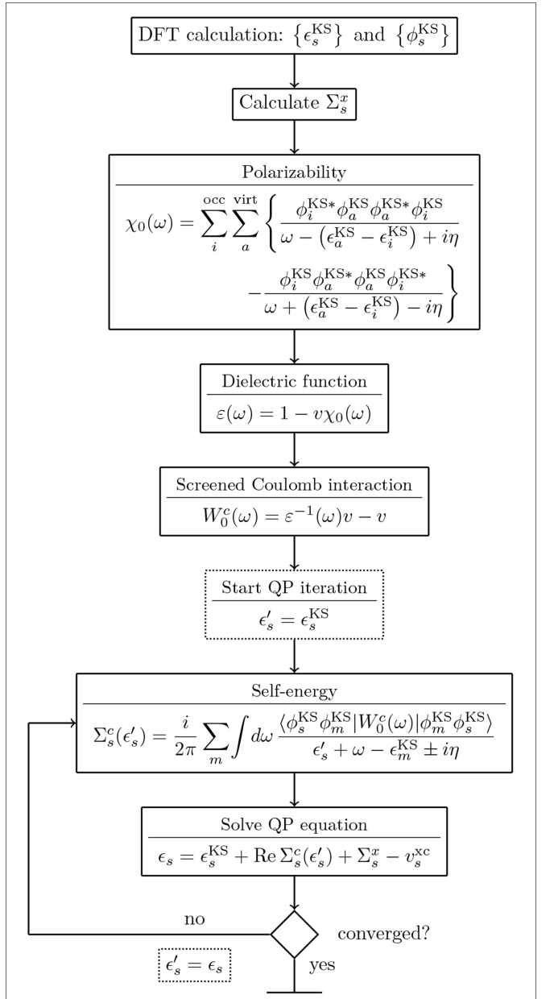

# 2.1. Many-body perturbation theory: GW approximation

GW approximation은 one-particle Green's function $G$와 동적으로 차폐된 Coulomb 상호작용 $W$의 곱으로 전자 self-energy를 근사하는 many-body perturbation theory (MBPT) 방법이다. 주된 대상은 전자를 하나 추가하거나 제거할 때의 하전 들뜸(charged excitation), 즉 quasiparticle 에너지와 spectral function이다. 따라서 바닥상태 밀도를 기본 변수로 하는 density functional theory (DFT)의 Kohn–Sham (KS) 고윳값을 그대로 관측 가능한 들뜸 에너지로 해석하는 문제와 구분해야 한다.[1,2,6]

이 글의 Green's function은 영온, 평형, time-ordered 규약을 기본으로 한다. [Quantum Transport: RGF and NEGF Scheme](../quantum-transport/rgf-negf-scheme.md)의 retarded·lesser Green's function과 수학적 구조를 공유하지만, 여기서는 열린 경계 수송보다 평형 전자 추가·제거 스펙트럼을 중심으로 다룬다. 원자 단위계 $\hbar=e=m_e=4\pi\epsilon_0=1$을 사용하며 spin 첨자는 필요한 경우를 제외하고 생략한다.

## 1. Quasiparticle과 계산 대상

### (1) 전자 추가·제거 에너지

$N$전자 바닥상태의 총에너지를 $E_0^N$라 하고, 전자를 제거하거나 추가한 상태의 에너지를 각각 $E_s^{N-1}$, $E_s^{N+1}$라 하면 one-particle Green's function의 pole은

$$
\epsilon_s^{\mathrm{rem}}=E_0^N-E_s^{N-1},
\qquad
\epsilon_s^{\mathrm{add}}=E_s^{N+1}-E_0^N
$$

에 나타난다. 이 pole들은 direct photoemission과 inverse photoemission에서 접근하는 전자 제거·추가 에너지에 대응한다. 전자–전자 상호작용 때문에 하나의 독립입자 상태가 여러 many-body 들뜸으로 분산될 수 있지만, spectral function에 뚜렷한 주 peak이 남으면 이를 quasiparticle로 식별한다.[1,2,4,6]

Retarded Green's function의 spectral function은

$$
A(\omega)
=-\frac{1}{\pi}\operatorname{Im}G^R(\omega)
$$

로 정의한다. Quasiparticle peak의 위치는 들뜸 에너지, 폭은 유한 수명, 면적은 quasiparticle 가중치와 연결된다. satellite peak이 강하거나 주 peak의 가중치가 작으면 단일 quasiparticle 해석이 약해진다.[2,5,6]

Fundamental gap은 전자 제거와 추가 energy의 차이로

$$
E_g^{\mathrm{fund}}
=E_0^{N+1}+E_0^{N-1}-2E_0^N
$$

로 정의된다. 이는 전자와 정공을 동시에 만드는 중성 optical excitation 에너지와 일반적으로 같지 않다. 광학 스펙트럼과 exciton을 계산하려면 GW quasiparticle 에너지 위에서 전자–정공 상호작용(electron–hole interaction)을 다루는 Bethe–Salpeter equation (BSE)과 같은 두 입자 접근이 필요하다.[4,6]

!!! warning "[Interpretation Caveat]"
    KS band gap, GW fundamental gap과 optical gap을 같은 양으로 비교하지 않는다. 측정값이 photoemission·inverse photoemission의 전자 추가·제거 스펙트럼인지, 흡수·발광의 중성 들뜸인지 먼저 구분해야 한다.[4,6]

### (2) Kohn–Sham 기준과 quasiparticle equation

KS Hamiltonian을 $\hat h_\mathrm{KS}$, exchange-correlation potential을 $v_\mathrm{xc}$라 하면 quasiparticle equation은

$$
\left[
\hat h_\mathrm{KS}-v_\mathrm{xc}
\right]\psi_{n\mathbf k}(\mathbf r)
+
\int d\mathbf r'\,
\Sigma(\mathbf r,\mathbf r';E_{n\mathbf k}^{\mathrm{QP}})
\psi_{n\mathbf k}(\mathbf r')
=
E_{n\mathbf k}^{\mathrm{QP}}\psi_{n\mathbf k}(\mathbf r)
$$

이다. Self-energy $\Sigma(\mathbf r,\mathbf r';\omega)$는 일반적으로 비국소적이고 에너지에 의존하는 비Hermitian 연산자이다. $v_\mathrm{xc}$를 빼는 이유는 KS 기준 계산에 이미 들어간 교환-상관(exchange-correlation) 효과를 self-energy로 대체하기 위해서이다.[2,3,6]

KS orbital이 quasiparticle wavefunction의 좋은 근사이고 off-diagonal self-energy를 무시할 수 있으면

$$
E_{n\mathbf k}^{\mathrm{QP}}
=
\epsilon_{n\mathbf k}^{\mathrm{KS}}
+
\left\langle
\phi_{n\mathbf k}^{\mathrm{KS}}
\left|
\operatorname{Re}\Sigma(E_{n\mathbf k}^{\mathrm{QP}})
-v_\mathrm{xc}
\right|
\phi_{n\mathbf k}^{\mathrm{KS}}
\right\rangle
$$

로 줄어든다. 이 식은 에너지 양변에 $E_{n\mathbf k}^{\mathrm{QP}}$가 나타나는 비선형 방정식이며, 단순한 상수 scissor shift가 아니다.[2,3,6]

## 2. Hedin 방정식과 GW approximation

### (1) 정확한 방정식의 핵심 연결 관계

복합 좌표 $1=(\mathbf r_1,t_1,\sigma_1)$를 사용하고 반복 좌표의 적분을 생략해 쓰면 Hedin 방정식의 핵심 관계는

$$
G=G_0+G_0\Sigma G,
$$

$$
\Sigma(1,2)
=i\int d(3,4)\,
G(1,3)W(1^+,4)\Gamma(3,2;4),
$$

$$
P(1,2)
=-i\int d(3,4)\,
G(1,3)G(4,1)\Gamma(3,4;2),
$$

$$
W=v+vPW
$$

로 나타낼 수 있다. $G_0$는 기준 Green's function, $v$는 bare Coulomb interaction, $P$는 irreducible polarizability, $\Gamma$는 vertex function이다. 첫 식은 Dyson equation이고, 마지막 식은 polarization이 bare interaction을 반복적으로 screening하여 $W$를 만드는 Dyson 형태의 식이다.[1,2,5,6]

정확한 vertex는 self-energy의 functional derivative를 포함하며 세 개의 시공간 변수에 의존하므로 직접 계산하기 어렵다. GW approximation은

$$
\Gamma(1,2;3)
\approx
\delta(1,2)\delta(1,3)
$$

로 두어

$$
\Sigma^{GW}(1,2)
=iG(1,2)W(1^+,2),
\qquad
P^{GW}(1,2)
=-iG(1,2)G(2,1)
$$

을 얻는다. 즉, 이름의 $G$와 $W$는 self-energy에 남는 두 함수에서 유래한다.[1,2,5,6]

!!! note "부호와 시간 규약"
    위 식은 time-ordered Green's function과 원자 단위계를 사용한 축약 표기이다. Matsubara, retarded 또는 다른 Fourier-transform 규약에서는 $i$, 부호와 infinitesimal의 위치가 달라질 수 있다. 서로 다른 문헌의 식을 결합할 때에는 $G$, $P$, $\Sigma$와 $W$의 규약을 한꺼번에 맞춰야 한다.[1,2,5]

### (2) Dynamical screening의 물리적 의미

Bare charge가 들어오면 주변 전자 밀도가 재배열되어 polarization cloud를 만들고, 다른 전자가 느끼는 유효 Coulomb 상호작용을 바꾼다. 이 반응은 즉시 일어나지 않으므로 $W(\omega)$는 주파수에 의존한다. 유전 연산자를 $\epsilon=1-vP$로 정의하면

$$
W(\omega)
=\epsilon^{-1}(\omega)v
$$

이다. Hartree–Fock exchange가 bare $v$를 사용하는 데 비해 GW self-energy는 dynamical $W$를 사용하므로, exchange와 correlation을 screening의 에너지 의존성과 함께 다룬다.[2,3,5,6]

## 3. One-Shot $G_0W_0$ 계산

### (1) 기준 상태에서 $W_0$ 구성

가장 널리 쓰이는 one-shot $G_0W_0$는 KS-DFT 또는 Hartree–Fock 기준의 orbital과 eigenvalue로 $G_0$와 $P_0$를 만들고, 한 번 구성한 $W_0$와 $\Sigma_0=iG_0W_0$로 quasiparticle energy를 구한다. Hedin 방정식의 완전한 self-consistent solution이 아니라 선택한 mean-field Green's function에서 시작하는 첫 번째 반복에 해당한다.[2,3,6]

<figure markdown="span">
  
  <figcaption markdown="1">
    그림 1. KS-DFT eigenvalue와 orbital에서 $\chi_0$, $\epsilon$, $W_0$, self-energy와 quasiparticle equation으로 이어지는 대표적인 $G_0W_0$ 계산 흐름.
    출처: D. Golze, M. Dvorak, and P. Rinke, “The GW Compendium: A Practical Guide to Theoretical Photoemission Spectroscopy,” Figure 10,
    <a href="https://doi.org/10.3389/fchem.2019.00377">DOI</a>,
    <a href="https://creativecommons.org/licenses/by/4.0/">CC BY 4.0</a>. 원문 11쪽의 Figure 10을 잘라내어 재현했으며 내용은 수정하지 않음.[6]
  </figcaption>
</figure>

독립입자 polarizability의 구조는 기저 첨자를 생략하면

$$
P_0(\omega)
\sim
\sum_i^{\mathrm{occ}}
\sum_a^{\mathrm{unocc}}
\left[
\frac{M_{ia}M_{ia}^{*}}
{\omega-(\epsilon_a-\epsilon_i)+i\eta}
-
\frac{M_{ia}^{*}M_{ia}}
{\omega+(\epsilon_a-\epsilon_i)-i\eta}
\right]
$$

로 쓸 수 있다. $i$와 $a$는 occupied·unoccupied 상태이고, $M_{ia}$는 선택한 real-space, plane-wave 또는 product basis에서의 transition matrix element이다. 이 식 때문에 유전 반응과 self-energy의 수렴에는 occupied 상태뿐 아니라 충분한 unoccupied Hilbert space가 필요하다.[2,6,7]

$P_0$에서

$$
\epsilon_0(\omega)=1-vP_0(\omega),
\qquad
W_0(\omega)=\epsilon_0^{-1}(\omega)v
$$

를 구하고, 이를 $G_0$와 convolution하여 $\Sigma_0$를 계산한다. 실제 구현에서는 행렬의 기저, Brillouin-zone sampling, Coulomb singularity와 core 처리가 모두 이 단계의 수치 결과에 영향을 준다.[2,6,7]

### (2) Quasiparticle correction과 $Z$ factor

Self-energy를 KS 에너지 주변에서 1차로 전개하면

$$
Z_{n\mathbf k}
=
\left[
1-
\left.
\frac{\partial
\operatorname{Re}\Sigma_{n\mathbf k}(\omega)}
{\partial\omega}
\right|_{\omega=\epsilon_{n\mathbf k}^{\mathrm{KS}}}
\right]^{-1}
$$

이고,

$$
E_{n\mathbf k}^{\mathrm{QP}}
\approx
\epsilon_{n\mathbf k}^{\mathrm{KS}}
+
Z_{n\mathbf k}
\left[
\operatorname{Re}\Sigma_{n\mathbf k}
(\epsilon_{n\mathbf k}^{\mathrm{KS}})
-
v_{\mathrm{xc},n\mathbf k}
\right]
$$

이다. $Z_{n\mathbf k}$는 해당 quasiparticle peak이 갖는 spectral weight와 연결되며, 선형화가 유효하려면 KS 에너지와 quasiparticle 해 사이에서 self-energy가 충분히 매끄러워야 한다.[2,6]

Retarded self-energy 규약에서 quasiparticle linewidth를

$$
\gamma_{n\mathbf k}
=
-Z_{n\mathbf k}
\operatorname{Im}\Sigma^R_{n\mathbf k}
(E_{n\mathbf k}^{\mathrm{QP}})
$$

로 두면 $\tau_{n\mathbf k}^{-1}=2\gamma_{n\mathbf k}/\hbar$이다. 에너지의 실수부만 구하는 diagonal $G_0W_0$ band 계산은 peak 위치를 줄 수 있지만, satellite 구조와 수명을 완전하게 재현하지는 않는다.[2,5,6]

### (3) 주파수 처리

Correlation self-energy는

$$
\Sigma^c(\omega)
=\frac{i}{2\pi}
\int d\omega'\,
G_0(\omega+\omega')W_0^c(\omega')
$$

의 주파수 convolution을 포함한다. $G_0$와 $W_0$의 pole이 실수축 가까이에 있으므로, 단순 실수축 적분은 수치적으로 불안정할 수 있다. 대표적인 처리는 하나 또는 여러 pole로 $W_0(\omega)$를 근사하는 plasmon-pole model, contour deformation, imaginary-axis 적분과 analytic continuation, 직접적인 full-frequency 방법이다.[2,3,6]

Plasmon-pole model은 계산량을 줄이지만 실제 유전 반응이 선택한 pole 구조로 잘 표현되는지 확인해야 한다. Full-frequency라는 이름만으로 수렴이 보장되는 것도 아니며, 주파수 격자, contour와 analytic continuation의 안정성을 별도로 검사해야 한다.[2,6]

## 4. Self-Consistency 방법

GW 계산의 이름은 어떤 양을 다시 갱신하는지에 따라 달라진다. 아래 방법들은 계산량과 시작점 의존성을 서로 다르게 바꾸지만, self-consistency를 더 많이 적용했다고 모든 spectrum이 자동으로 개선되는 순서 관계는 없다.[2,6,8]

| 방법 | 갱신하는 양 | 고정하는 양 | 주요 특징 |
| --- | --- | --- | --- |
| $G_0W_0$ | 없음 | 기준 orbital·eigenvalue로 만든 $G_0$, $W_0$ | 가장 저렴하지만 시작점 의존성이 남는다. |
| ev$GW_0$ | $G$의 quasiparticle 고윳값 | $W_0$, orbital | Screening을 고정한 채 에너지 pole을 갱신한다. |
| ev$GW$ | $G$와 $W$에 들어가는 eigenvalue | orbital | Energy에 대해서만 self-consistent하다. |
| sc$GW_0$ | Dyson equation의 $G$ | $W_0$ | Green's function은 갱신하지만 screening은 고정한다. |
| sc$GW$ | $G$, $P$, $W$, $\Sigma$ | vertex $\Gamma=1$ | 시작점 의존성은 제거되지만 계산량이 크고 missing vertex와의 불균형이 남는다. |
| QS$GW$ | static Hermitian effective Hamiltonian의 eigenvalue·orbital | 명시적 dynamical spectral function | quasiparticle band에 최적인 독립입자 기준을 반복 구성한다. |

Quasiparticle self-consistent GW (QS$GW$)는 dynamical self-energy를 static Hermitian potential로 사상해 새 $G_0$를 만든다. 따라서 Dyson equation의 full spectral function을 직접 self-consistent하게 구하는 sc$GW$와 같은 방법이 아니다. QS$GW$는 satellite와 incoherent spectral weight를 명시적으로 보존하지 않으므로 band energy와 full spectrum의 목적을 구분해야 한다.[6,8]

## 5. 수렴과 재현 가능한 계산

### (1) 결합된 수렴 변수

Plane-wave $G_0W_0$에서 orbital cutoff, response-function cutoff와 포함한 band 수는 독립적으로 마음대로 줄일 수 있는 세 숫자가 아니다. 유한 plane-wave 기저가 표현할 수 있는 Hilbert space가 band 수를 정하고, 고에너지 unoccupied 상태는 short-range correlation과 screening에 계속 기여한다. 한 cutoff만 늘리거나 band 수를 고정하면 겉보기 수렴점이 잘못될 수 있다.[6,7]

Projector augmented-wave (PAW) 또는 pseudopotential 계산에서는 고에너지 상태와 occupied 상태의 overlap을 정확히 표현하는지도 확인해야 한다. 특히 국소화된 $d$·$f$ 상태가 있으면 partial-wave completeness, semicore 포함 여부와 norm conservation이 quasiparticle 에너지에 영향을 줄 수 있다.[6,7]

Brillouin-zone $k$-point 수렴은 band edge 위치, screening과 Coulomb singularity 처리에 함께 적용해야 한다.[2,6]

### (2) 수렴 판정과 보고 항목

!!! info "[Measurement]"
    먼저 같은 구조, pseudopotential·PAW 데이터셋, exchange-correlation functional, spin·spin–orbit coupling 설정에서 기준 DFT를 수렴시킨다. 그 다음 $k$-mesh, orbital basis cutoff, response cutoff, unoccupied Hilbert space와 주파수 격자를 한 번에 하나씩만 바꾸지 말고 서로 결합된 변수군으로 단계적으로 증가시킨다. 관심 상태 집합 $\mathcal S$에 대해

    $$
    \Delta_\mathrm{QP}^{(j)}
    =
    \max_{n\mathbf k\in\mathcal S}
    \left|
    E_{n\mathbf k}^{\mathrm{QP},(j)}
    -
    E_{n\mathbf k}^{\mathrm{QP},(j-1)}
    \right|
    $$

    와

    $$
    \Delta_g^{(j)}
    =
    \left|
    E_g^{(j)}-E_g^{(j-1)}
    \right|
    $$

    를 계산한다. 두 값이 연구 목적에 맞게 미리 정한 허용 오차보다 작아지는지 확인한다. 보편적인 허용 오차를 가정하지 말고, 목표 스펙트럼·에너지 범위, 모든 cutoff와 band 수, $k$-mesh, 주파수 처리, Coulomb singularity·truncation, core·semicore 처리, 시작점과 GW 방법을 함께 보고한다.[6,7]

Basis extrapolation을 사용했다면 마지막 두 계산의 차이만 보고하지 않는다. 사용한 asymptotic form, fitting에 포함한 점, extrapolated value와 잔차를 함께 제시해야 한다. 선택한 quasiparticle 상태만 수렴하고 dielectric matrix가 수렴하지 않은 경우도 있으므로 band gap 하나만으로 전체 스펙트럼의 수렴을 주장할 수 없다.[6,7]

### (3) 물리적·수치적 교차점검

다음 검사는 서로 다른 오류를 찾는다.

- **시작점 검사:** $G_0W_0@\mathrm{PBE}$처럼 기준 functional을 명시하고, 결론이 시작점 선택에 민감한지 확인한다.
- **Dyson 또는 quasiparticle equation 검사:** 선형화한 해와 직접 반복한 해가 관심 에너지 범위에서 일치하는지 확인한다.
- **Spectral 검사:** $Z$, $\operatorname{Im}\Sigma$와 여러 quasiparticle root를 확인하여 약한 주 peak를 잘못 선택하지 않는다.
- **Screening 검사:** dielectric matrix의 cutoff, $k$-mesh와 주파수 처리에 대해 $W_0$와 목표 에너지가 함께 수렴하는지 확인한다.
- **구현 검사:** 가능하면 동일한 구조와 근사에서 다른 코드·기저 또는 published benchmark와 비교한다.[2,6,7]

## 6. 적용 범위와 해석상의 한계

### (1) 시작점과 vertex

$G_0W_0$는 $G_0$와 $W_0$를 만드는 mean-field eigenvalue와 orbital에 의존한다. 작은 기준 gap은 independent-particle polarizability를 키워 overscreening을, 큰 기준 gap은 underscreening을 만들 수 있다. 따라서 서로 다른 시작점의 결과가 우연히 실험과 가까운지를 GW 자체의 정확도로 해석하면 안 된다.[2,6]

GW는 정확한 vertex를 $\Gamma=1$로 근사한다. Self-consistency는 $G$와 $W$를 갱신하지만 생략한 vertex diagram을 자동으로 복원하지 않는다. 일부 물질과 관측량에서 self-consistency가 screening을 약화하고 gap 또는 bandwidth를 과도하게 바꿀 수 있으므로, $G_0W_0$, 부분 self-consistency와 sc$GW$ 사이의 차이를 “계산 수준이 높을수록 참값에 가깝다”는 단일 축으로 정렬하지 않는다.[2,5,6]

### (2) Strong correlation, satellite와 중성 들뜸

Standard GW는 weak-to-moderate correlation에서 quasiparticle band와 screening을 다루는 데 강점이 있지만, 국소 상호작용이 지배하는 Mott–Hubbard transition이나 Hubbard sideband를 일반적으로 완전하게 기술하지 못한다. 이런 경우 GW+DMFT, explicit vertex correction 또는 다른 many-body solver가 필요할 수 있다.[2,5,6]

Satellite가 강한 스펙트럼에서는 $\Sigma=iGW$만으로 peak 위치와 가중치를 충분히 기술하지 못할 수 있다. Cumulant expansion과 vertex-corrected 방법은 이러한 구조를 보완하지만, 어떤 correction이 필요한지는 물질과 spectroscopy에 따라 달라진다.[2,5,6]

마지막으로 GW quasiparticle gap과 BSE optical gap은 서로 다른 물리량이다. 그러므로 광학 측정값 하나에 맞는 scissor correction만으로 GW quasiparticle 계산 전체를 검증하지 않는다.[4,6]

## 7. 요약

1. GW approximation은 전자 추가·제거 spectrum의 quasiparticle을 기술하며, self-energy를 $\Sigma=iGW$로 근사한다.
2. $W=\epsilon^{-1}v$는 주파수 의존 electronic screening을 담고, $\Gamma=1$ 근사는 정확한 vertex correction을 생략한다.
3. $G_0W_0$는 KS-DFT 또는 Hartree–Fock 시작점에서 $P_0$, $W_0$와 $\Sigma_0$를 한 번 구성하는 one-shot 계산이다.
4. Quasiparticle equation은 에너지에 의존하는 비선형 방정식이며, $Z$ factor를 사용한 선형화에는 self-energy가 매끄럽다는 조건이 필요하다.
5. ev$GW_0$, ev$GW$, sc$GW_0$, sc$GW$와 QS$GW$는 갱신하는 양이 다르며 보편적인 정확도 순서를 이루지 않는다.
6. Basis, unoccupied Hilbert space, $k$-mesh, 주파수 처리, core와 Coulomb 경계를 함께 수렴시키고 계산 방법과 시작점을 명시해야 한다.
7. Optical exciton, 강한 satellite와 Mott physics는 standard GW 밖의 두 입자 또는 vertex·local-correlation 방법을 요구할 수 있다.

## 8. 참고문헌

1. L. Hedin, “New Method for Calculating the One-Particle Green's Function with Application to the Electron-Gas Problem,” *Physical Review* **139**, A796–A823 (1965). [DOI](https://doi.org/10.1103/PhysRev.139.A796).
2. F. Aryasetiawan and O. Gunnarsson, “The GW Method,” *Reports on Progress in Physics* **61**, 237–312 (1998). [DOI](https://doi.org/10.1088/0034-4885/61/3/002).
3. M. S. Hybertsen and S. G. Louie, “Electron Correlation in Semiconductors and Insulators: Band Gaps and Quasiparticle Energies,” *Physical Review B* **34**, 5390–5413 (1986). [DOI](https://doi.org/10.1103/PhysRevB.34.5390).
4. G. Onida, L. Reining, and A. Rubio, “Electronic Excitations: Density-Functional versus Many-Body Green's-Function Approaches,” *Reviews of Modern Physics* **74**, 601–659 (2002). [DOI](https://doi.org/10.1103/RevModPhys.74.601).
5. K. Held, C. Taranto, G. Rohringer, and A. Toschi, “Hedin Equations, GW, GW+DMFT, and All That,” in *The LDA+DMFT Approach to Strongly Correlated Materials* (2011). [arXiv:1109.3972](https://arxiv.org/abs/1109.3972).
6. D. Golze, M. Dvorak, and P. Rinke, “The GW Compendium: A Practical Guide to Theoretical Photoemission Spectroscopy,” *Frontiers in Chemistry* **7**, 377 (2019). [DOI](https://doi.org/10.3389/fchem.2019.00377).
7. J. Klimeš, M. Kaltak, and G. Kresse, “Predictive GW Calculations Using Plane Waves and Pseudopotentials,” *Physical Review B* **90**, 075125 (2014). [DOI](https://doi.org/10.1103/PhysRevB.90.075125).
8. T. Kotani, M. van Schilfgaarde, and S. V. Faleev, “Quasiparticle Self-Consistent GW Method: A Basis for the Independent-Particle Approximation,” *Physical Review B* **76**, 165106 (2007). [DOI](https://doi.org/10.1103/PhysRevB.76.165106).
